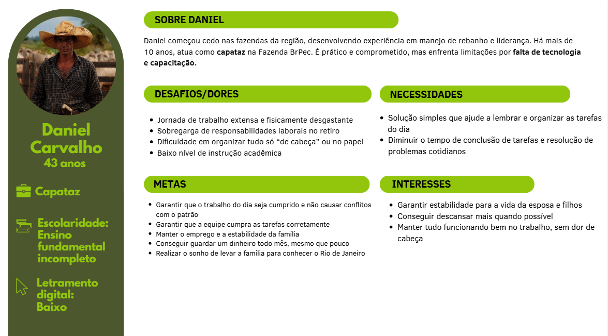
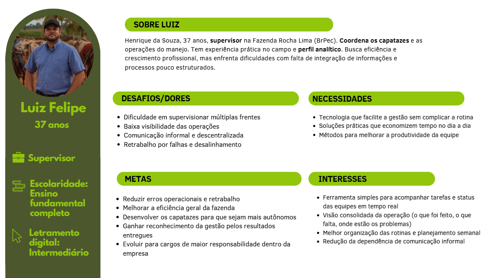
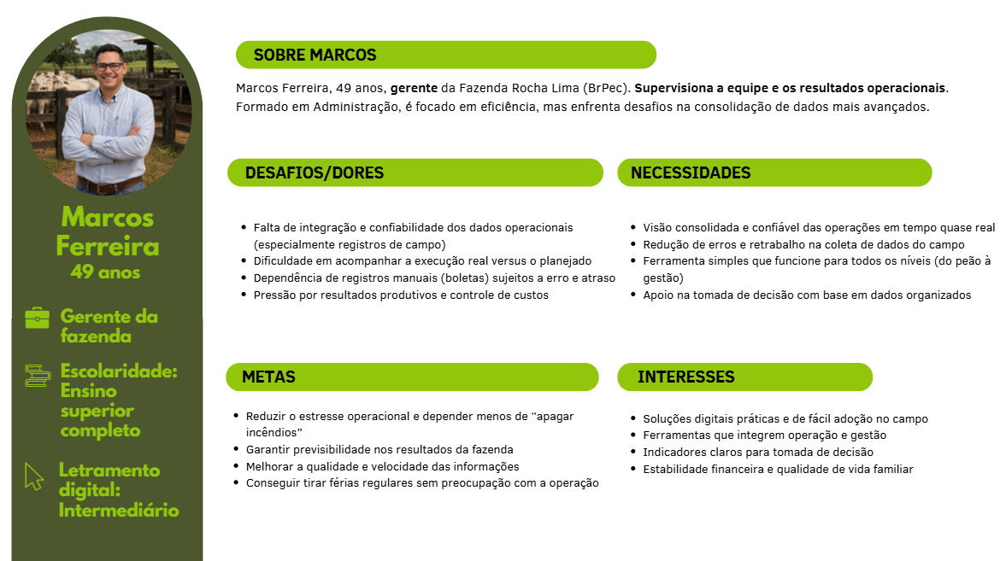

# WAD - Web Application Document - Módulo 2 - Inteli

**_Os trechos em itálico servem apenas como guia para o preenchimento da seção. Por esse motivo, não devem fazer parte da documentação final_**

## Nome do Grupo

#### Nomes dos integrantes do grupo

## Sumário

[1. Introdução](#c1)

[2. Visão Geral da Aplicação Web](#c2)

[3. Projeto Técnico da Aplicação Web](#c3)

[4. Desenvolvimento da Aplicação Web](#c4)

[5. Testes da Aplicação Web](#c5)

[6. Estudo de Mercado e Plano de Marketing](#c6)

[7. Conclusões e trabalhos futuros](#c7)

[8. Referências](c#8)

[Anexos](#c9)

 

# 1. Introdução (sprints 1 a 5)

No início do projeto, a **BrPec Agro-Pecuária S.A.** apresentou sua necessidade em aprimorar a forma de registro de cada animal em seu rebanho bovino. Atualmente, o fluxo de informações entre o campo e o escritório é prejudicado por **processos manuais** baseados em **"boletas" de papel**, o que acarreta lentidão na consolidação de dados e riscos de erros durante a **redigitação em planilhas**. Essa desconexão entre as áreas operacional e administrativa dificulta o acompanhamento estratégico em **tempo real** e a precisão do inventário pecuário.

Para solucionar essa problemática, uma **aplicação web centralizada** foi projetada para integrar a **gestão de cronogramas operacionais** e o **controle de movimentação bovina**. A solução permite a digitalização de **eventos zootécnicos** essenciais, como nascimentos, óbitos, compras, vendas e transferências entre retiros. O valor fundamental do produto reside na arquitetura preparada para **operação offline**, garantindo a integridade dos registros em áreas remotas e a **sincronização automática** de dados assim que a conexão for restabelecida.

A interface foi estruturada para atender a diferentes **níveis hierárquicos**: tarefas calendarizadas são atribuídas por **gerentes**, enquanto a execução é reportada por capatazes mediante o envio de **evidências digitais**, como fotos e áudios. Por fim, as informações são validadas por **coordenadores**, sendo os dados consolidados **exportados em formatos Excel ou CSV** para suporte à tomada de decisão. Com essa implementação, os processos manuais são eliminados, as falhas de comunicação são reduzidas e uma **integração efetiva** entre as frentes agrícola e pecuária é estabelecida.

# 2. Visão Geral da Aplicação Web (sprint 1)

## 2.1. Escopo do Projeto (sprints 1 e 4)

### 2.1.1. Modelo de 5 Forças de Porter (sprint 1)

*Preencha com até 400 palavras*

*Posicione aqui o modelo de 5 Forças de Porter para sustentar o contexto da indústria.*

### 2.1.2. Análise SWOT da Instituição Parceira (sprint 1)

*Preencha com até 100 palavras – sem necessidade de fonte*

*Apresente uma visão geral da situação do parceiro com base na matriz SWOT (forças, fraquezas, oportunidades e ameaças). Foque na relação com os concorrentes e o posicionamento da instituição.*

---

## 1. Ameaça de Novos Entrantes

O risco de novos entrantes é muito baixo. A pecuária de grande escala no Pantanal e Cerrado exige investimentos elevados em terras, rebanho e infraestrutura, com horizonte de retorno de longo prazo, o que restringe a entrada a poucos agentes com elevada capacidade financeira e técnica. A BrPec, com 132.660 hectares em Miranda e Corumbá, ilustra essa escala.

Além disso, a operação no Pantanal depende de licenciamentos ambientais rigorosos e domínio de técnicas de manejo adaptadas ao bioma. Novos operadores tendem a adquirir propriedades existentes em vez de criar novas unidades, o que não altera substancialmente a estrutura do setor. O vínculo da BrPec com o BTG Pactual reforça essa barreira ao conferir acesso privilegiado a capital e gestão.

---

## 2. Ameaça de Produtos Substitutos

O risco de substituição é moderado. Frango e carne suína competem por preço, especialmente em segmentos de menor renda, e o crescimento das proteínas vegetais representa uma tendência a ser monitorada, embora ainda restrita a nichos urbanos no Brasil.

Por outro lado, a carne bovina mantém posição cultural privilegiada no consumo doméstico, e a demanda global crescente, sobretudo nos mercados asiáticos, sustenta sua relevância comercial. A pressão ambiental pode influenciar hábitos no longo prazo, mas no horizonte atual ainda não se traduz em substituição significativa.

---

## 3. Poder de Barganha dos Fornecedores

O poder de barganha dos fornecedores é moderado, com variações por segmento. A genética bovina de alta qualidade está concentrada em poucos grupos especializados, o que aumenta a dependência tecnológica e eleva os custos de substituição ao longo do ciclo produtivo.

Em contrapartida, insumos veterinários, suplementos e maquinário contam com diversos fornecedores, e a escala da BrPec confere poder de negociação em compras de volume. Contudo, a mão de obra especializada em manejo pantaneiro é escassa e de difícil substituição, elevando o poder de barganha nesse segmento. O modelo "flex" da empresa funciona como mecanismo de mitigação ao ajustar a demanda por insumos conforme o cenário econômico.

---

## 4. Poder de Barganha dos Compradores

O poder de barganha dos compradores é elevado e constitui uma das forças mais relevantes para a BrPec. O mercado de abate é altamente concentrado em poucos grandes frigoríficos JBS, Marfrig e Minerva Foods, que possuem instrumentos diretos para influenciar preços e condições de compra. O produtor é tomador de preço, seguindo referências definidas pela B3 e pelo Cepea/Esalq.

Essa dinâmica se intensifica no modelo de cria adotado pela BrPec, no qual os bezerros são vendidos a recriadores e confinadores que também pressionam por preços competitivos. A volatilidade cambial agrava o cenário ao influenciar a atratividade das exportações. Assim, a principal relação de poder se estabelece entre produtor e indústria frigorífica, não entre empresa e consumidor final.

---

## 5. Rivalidade entre Concorrentes Existentes

A rivalidade entre concorrentes é elevada. O Brasil possui o maior rebanho comercial do mundo, distribuído entre milhares de produtores, e a escolha do comprador é condicionada primariamente ao preço e à logística, não à empresa responsável pela produção. Isso reduz a diferenciação e intensifica a competição por eficiência operacional.

A rivalidade se acentua com a entrada de operadores corporativos ligados ao mercado financeiro as chamadas "fazendas Faria Lima", que acessam capital a custo mais baixo e utilizam ferramentas financeiras sofisticadas. Os custos fixos elevados forçam operação contínua mesmo em margens negativas, mantendo a pressão sobre preços. O modelo "flex" da BrPec representa resposta estratégica direta a essa intensidade competitiva, ao capturar margem no elo da cadeia mais favorável em cada ciclo.

### 2.1.2. Análise SWOT da Instituição Parceira (sprint 1)

A análise SWOT (ou FOFA) é uma ferramenta de planejamento estratégico utilizada para avaliar fatores internos e externos que impactam o desempenho organizacional, sendo estruturada em forças, fraquezas, oportunidades e ameaças (PORTER, 1980). Com base nisso, realizou-se a análise SWOT da BRPec Agropecuária S.A., considerando seu contexto operacional, financeiro e de mercado.

Figura 1 - Análise de SWOT

Fonte: Próprios autores (2026).

**FORÇAS**

A BRPec apresenta vantagens competitivas relevantes, destacando-se pela integração entre agricultura e pecuária, que permite redução de custos e maior eficiência operacional (ECONODATA, 2026). Sua grande escala produtiva contribui para ganhos de produtividade e diluição de riscos, enquanto o suporte financeiro do BTG Pactual amplia o acesso a crédito e instrumentos financeiros. Além disso, sua localização estratégica, com acesso a diferentes modais logísticos, favorece o escoamento da produção e a inserção em mercados relevantes (BRPEC, 2026).

**FRAQUEZAS:** 

Por outro lado, a dependência das decisões estratégicas do BTG Pactual, empresa controladora da BRPEC, pode limitar a autonomia da organização. A complexidade operacional, característica de operações de grande escala, exige elevado nível de gestão e controle, além de envolver forte dependência de mão de obra operacional, devido ao grande número de trabalhadores, aos custos associados e às dificuldades de gestão em áreas remotas. Soma-se a isso a exposição a riscos ambientais e regulatórios, que podem gerar impactos reputacionais e financeiros, especialmente diante das exigências do Código Florestal (BRASIL, 2012). 

**OPORTUNIDADES:**

No ambiente externo, observa-se um cenário favorável à expansão, impulsionado pela crescente demanda global por proteína animal e pela valorização de práticas sustentáveis. Nesse contexto, iniciativas ligadas a ESG e créditos de carbono surgem como potenciais fontes de geração de valor (DE OLHO NOS RURALISTAS, 2025). Além disso, o avanço da fronteira agrícola e o crescimento projetado da produção de soja no Mato Grosso do Sul ampliam as possibilidades de expansão das áreas produtivas, aumento da oferta de insumos para alimentação animal e maior integração entre agricultura e pecuária, fortalecendo a eficiência e a escala das operações da empresa (APROSOJA MS, 2024).

**AMEAÇAS:**

Em contrapartida, a BRPec está inserida em um ambiente de crescente rigor regulatório, especialmente no que se refere às questões ambientais (BRASIL, 2012). A volatilidade climática, particularmente em regiões como o Pantanal, pode impactar diretamente a produtividade. Adicionalmente, a oscilação nos preços de commodities e o aumento dos custos operacionais representam riscos à rentabilidade, exigindo estratégias robustas de gestão de risco e eficiência operacional para garantir sustentabilidade no longo prazo (PORTER, 1980).

### 2.1.3. Solução

*1. Problema a ser resolvido*

Ao sair do retiro e seguir para os campos da fazenda, os capatazes precisam registrar todas as informações em papel, devido à ausência de uma ferramenta que funcione offline. Isso gera excesso de trabalho na transcrição posterior para a planilha digital e aumenta o risco de perda ou inconsistência de dados. Além disso, como não há um formato fixo, certas informações podem deixar de ser anotadas, como a causa da morte de um boi.

*2. Dados disponíveis*

Não se aplica.

*3. Solução proposta*

 Propusemos desenvolver uma aplicação web com funcionamento offline que, ao restabelecer a conexão com a internet quando o capataz chegar ao retiro, envia automaticamente as informações registradas para a planilha que será utilizada para armazenar dados sobre nascimento, morte, transferência etc., eliminando a dependência de anotações em papel e da transcrição manual.

*4. Forma de utilização da solução*

A aplicação será utilizada pelos capatazes em campo, fora do retiro. As informações serão inseridas e armazenadas localmente no celular enquanto o dispositivo estiver offline e, ao se conectar à internet, serão sincronizadas automaticamente com a base central de dados, otimizando o trabalho dos capatazes ao eliminar a necessidade de transcrição manual para a planilha.

*5. Benefícios esperados*

Os benefícios visados incluem a agilização da coleta e do processamento de dados, com a redução do trabalho manual de anotação em papel e da posterior transcrição em planilhas no retiro. Além disso, a solução facilita a conciliação de informações entre diferentes retiros, otimizando a comunicação e a integração entre eles, o que torna as operações mais coordenadas e reduz os riscos de erros ou perda de dados.

*6. Critério de sucesso e como será avaliado*

Será considerado sucesso se a interface for simples e compreensível por qualquer público, sem complicações no uso, garantindo agilidade e redução significativa do tempo atualmente gasto para inserir as informações na base central de dados. É necessário que o público sem repertório digital também seja capaz de usar a aplicação web sem dificuldades, pois se trata de maior parte de nosso público alvo.

### 2.1.4. Value Proposition Canvas (sprint 1): 
*Sem limite de palavras – usar template do curso*

*Elaborar o Value Proposition Canvas com base na proposta de solução definida.*

### 2.1.5. Matriz de Riscos do Projeto (sprint 1)

*Sem limite de palavras – usar template do curso*

*Registre na matriz os riscos identificados no projeto.*

## 2.2. Personas (sprint 1)

&ensp; &ensp; Foram desenvolvidas três personas para representar o perfil de partes interessadas usuarias da solução proposta neste documento. Cada persona representa um cargo presente em todas as fazendas da BrPec, respectivamente capataz, supervisor e gerente.

&ensp; &ensp;Daniel Carvalho tem 43 anos, é casado e pai de 3 filhos. Atualmente, trabalha como capataz na Fazenda BrPec, sendo responsável pela gestão do retiro e pela coordenação de uma equipe de 12 vaqueiros. Iniciou sua carreira ainda jovem como vaqueiro em fazendas da região, função na qual desenvolveu experiência em manejo de rebanho e liderança de equipe no campo. Por seu desempenho e domínio da rotina da pecuária, foi contratado pela BrPec para assumir a função de capataz, na qual atua há mais de 10 anos. 

&ensp; &ensp;Daniel é um profissional comprometido e prático, focado em garantir que o retiro funcione com eficiência. Entretanto, a falta de ferramentas tecnológicas e de capacitação estruturada dificulta seu trabalho no dia a dia. Seu maior sonho é levar a esposa e os três filhos para conhecer o Rio de Janeiro, viagem que planeja há anos e para a qual guarda dinheiro mensalmente.

&ensp; &ensp;Luiz tem 37 anos, é solteiro, mas mantém um relacionamento estável. Atualmente, atua como supervisor dos capatazes da Fazenda Rocha Lima (pertencente à BrPec), sendo responsável por coordenar múltiplas frentes operacionais do manejo pecuário e garantir que os capatazes executem corretamente as diretrizes estabelecidas pela gestão da fazenda.

&ensp; &ensp;Sua trajetória começou como peão ainda jovem, passando por diferentes funções no campo até se tornar capataz. Ao longo dos anos, destacou-se pela organização, capacidade de resolver problemas e visão prática da operação, o que o levou à promoção para supervisor — cargo que ocupa há cerca de 5 anos.

&ensp; &ensp;Luiz é um profissional analítico e exigente, com forte senso de responsabilidade sobre os resultados da fazenda. Ele busca garantir eficiência, padronização e produtividade, mas enfrenta dificuldades devido à falta de integração entre informações, excesso de demandas simultâneas e dependência de processos pouco estruturados. Seu objetivo pessoal é crescer profissionalmente dentro da empresa e conquistar estabilidade financeira suficiente para investir em uma casa própria.

&ensp; &ensp;Marcos Ferreira tem 49 anos, é casado e pai de dois filhos. Atua como gerente da Fazenda Rocha Lima (pertencente à BrPec), sendo responsável por garantir o desempenho geral da operação, conectando a estratégia da empresa com a execução no campo. Supervisiona diretamente os capatazes e o supervisor, acompanhando resultados produtivos, financeiros e operacionais da fazenda.

&ensp; &ensp;Formado em Administração, com experiência em gestão agropecuária, Marcos possui perfil estruturado e orientado a resultados. Divide sua rotina entre atividades administrativas e presença no campo, buscando garantir que o planejamento seja executado corretamente. Apesar de já utilizar alguns sistemas, ainda enfrenta limitações na consolidação e confiabilidade das informações operacionais. Seu principal objetivo é aumentar a eficiência da fazenda com maior controle e previsibilidade dos resultados.

## 2.3. User Stories (sprints 1 a 5)

Quadro Y: User Story 01 

| Identificação | US01 |
| - | - |
| Persona | Daniel Carvalho |
| User Story | Como capataz, posso registrar movimentações do rebanho, para substituir o uso de boletas em papel. |
| Critério de aceite 1 | CR1: Dado que o usuário acessa o formulário, quando preenche os campos obrigatórios, então o sistema permite o registro. |
| Critério de aceite 2 | CR2: Dado que há campos obrigatórios vazios, quando tenta salvar, então o sistema impede o envio. |
| Critério de aceite 3 | CR3: Dado que não há conexão, quando registra, então o dado é salvo localmente. |
| Critérios INVEST | 
Independente: A funcionalidade pode ser desenvolvida de forma isolada, sem depender de outros módulos.
 
Negociável: Os campos do formulário podem ser ajustados conforme necessidade.
 
Valorosa: Elimina o uso de boletas em papel, reduzindo erros e retrabalho.
 
Estimável: Possui escopo claro, envolvendo formulário e validação.
 
Pequena: Restrita ao registro de movimentações.
 
Testável: Pode ser validada pelo preenchimento e salvamento correto dos dados.
 |

Fonte: Próprios autores (2026).

Quadro Y - User Story 02.

| Identificação | US02 |
| - | - |
| Persona | Daniel Carvalho |
| User Story | Como capataz, posso usar o sistema offline, para registrar dados sem internet. |
| Critério de aceite 1 | CR1: Dado que não há conexão, quando acessa o sistema, então as funcionalidades principais permanecem disponíveis. |
| Critério de aceite 2 | CR2: Dado que registra dados offline, quando salva, então o sistema armazena localmente. |
| Critério de aceite 3 | CR3: Dado que a conexão retorna, quando o sistema detecta internet, então os dados são sincronizados automaticamente. |
| Critérios INVEST | 
Independente: Pode ser implementada sem depender de outros módulos além do armazenamento local.
 
Negociável: A estratégia de sincronização pode ser ajustada conforme decisão técnica.
 
Valorosa: Permite o uso do sistema em campo sem acesso à internet.
 
Estimável: O fluxo offline e sincronização está claramente definido.
 
Pequena: Pode ser implementada inicialmente para funções essenciais.
 
Testável: Pode ser validada simulando ausência e retorno de conexão.
 |

Fonte: Próprios autores (2026).

Quadro Y - User Story 03.

| Identificação | US03 |
| - | - |
| Persona | Daniel Carvalho |
| User Story | Como capataz, posso anexar fotos como evidência, para comprovar ações realizadas. |
| Critério de aceite 1 | CR1: Dado que o usuário registra uma ação, quando anexa foto, então o sistema salva a imagem. |
| Critério de aceite 2 | CR2: Dado que a imagem é enviada, quando salva, então fica vinculada ao registro. |
| Critério de aceite 3 | CR3: Dado que acessa o registro, quando visualiza, então a imagem deve estar disponível. |
| Critérios INVEST | 
Independente: Pode ser desenvolvida como complemento aos registros existentes.
 
Negociável: O tipo de evidência pode ser ampliado para vídeo ou áudio.
 
Valorosa: Aumenta a confiabilidade das informações registradas.
 
Estimável: Escopo claro envolvendo upload e armazenamento.
 
Pequena: Restrita ao envio e visualização de imagens.
 
Testável: Pode ser validada pelo upload correto e exibição da imagem.
 |

Fonte: Próprios autores (2026).

Quadro Y - User Story 04.

| Identificação | US04 |
| - | - |
| Persona | Daniel Carvalho |
| User Story | Como capataz, posso abrir chamados de infraestrutura, para reportar problemas. |
| Critério de aceite 1 | CR1: Dado que cria um chamado, quando preenche os dados, então o sistema permite envio. |
| Critério de aceite 2 | CR2: Dado que envia o chamado, quando salvo, então fica registrado no sistema. |
| Critério de aceite 3 | CR3: Dado que acessa histórico, quando consulta, então visualiza seus chamados. |
| Critérios INVEST | 
Independente: Pode ser desenvolvida separadamente dos demais módulos.
 
Negociável: Campos como prioridade e categoria podem ser ajustados.
 
Valorosa: Permite comunicação estruturada de problemas no retiro.
 
Estimável: Escopo claro envolvendo criação e consulta.
 
Pequena: Restrita à abertura e visualização de chamados.
 
Testável: Pode ser validada pela criação e listagem dos chamados.
 |

Fonte: Próprios autores (2026).

Quadro Y - User Story 05.

| Identificação | US05 |
| - | - |
| Persona | Luiz Felipe |
| User Story | Como supervisor, posso validar registros enviados, para garantir a confiabilidade dos dados. |
| Critério de aceite 1 | CR1: Dado que existem registros pendentes, quando acessa a tela, então visualiza a lista. |
| Critério de aceite 2 | CR2: Dado que analisa um registro, quando aprova ou rejeita, então o status é atualizado. |
| Critério de aceite 3 | CR3: Dado que rejeita um registro, quando confirma, então informa o motivo. |
| Critérios INVEST | 
Independente: Pode ser executada após o registro dos dados.
 
Negociável: As regras de validação podem ser ajustadas.
 
Valorosa: Garante maior qualidade das informações.
 
Estimável: Fluxo simples de aprovação ou rejeição.
 
Pequena: Restrita à validação de registros.
 
Testável: Pode ser validada pela alteração de status.
 |

Fonte: Próprios autores (2026).

Quadro Y - User Story 06.

| Identificação | US06 |
| - | - |
| Persona | Luiz Felipe |
| User Story | Como supervisor, posso criar tarefas para os capatazes, para organizar a operação. |
| Critério de aceite 1 | CR1: Dado que cria uma tarefa, quando preenche os dados, então o sistema permite salvar. |
| Critério de aceite 2 | CR2: Dado que salva a tarefa, quando concluído, então ela fica visível ao capataz. |
| Critério de aceite 3 | CR3: Dado que há erro no preenchimento, quando tenta salvar, então o sistema impede a ação. |
| Critérios INVEST | 
Independente: Pode ser desenvolvida sem depender da execução das tarefas.
 
Negociável: Campos e categorias podem ser ajustados.
 
Valorosa: Organiza a distribuição das atividades.
 
Estimável: Escopo claro de criação de tarefas.
 
Pequena: Funcionalidade simples de cadastro.
 
Testável: Pode ser validada pela criação correta da tarefa.
 |

Fonte: Próprios autores (2026).

Quadro Y - User Story 07.

| Identificação        | US07 |
| -------------------- | - |
| Persona              | Luiz Felipe   |
| User Story           | Como supervisor, posso visualizar chamados de infraestrutura, para gerenciar problemas. |
| Critério de aceite 1 | CR1: Dado que existem chamados, quando acessa a tela, então o sistema exibe a lista.  |
| Critério de aceite 2 | CR2: Dado que seleciona um chamado, quando abre, então visualiza os detalhes. |
| Critério de aceite 3 | CR3: Dado que altera o status, quando salva, então o sistema atualiza o chamado. |
| Critérios INVEST     | 
Independente: Pode ser desenvolvido como módulo separado.
 
Negociável: Os status podem ser ajustados.
 
Valorosa: Permite gestão estruturada de problemas.
 
Estimável: Escopo simples de listagem e atualização.
 
Pequena: Restrta à visualização e alteração de status.
 
Testável: Validada pela atualização do chamado.
 |

Fonte: Próprios autores (2026).

Quadro Y - User Story 08.

| Identificação        | US08 |
| ---- | --  |
| Persona              | Luiz Felipe  |
| User Story           | Como supervisor, posso receber alertas de problemas, para agir rapidamente. |
| Critério de aceite 1 | CR1: Dado que ocorre um problema, quando identificado, então o sistema gera um alerta.  |
| Critério de aceite 2 | CR2: Dado que há alerta, quando acessa o painel, então o supervisor visualiza a notificação. |
| Critério de aceite 3 | CR3: Dado que clica no alerta, quando acessa, então é redirecionado ao detalhe correspondente.   |
| Critérios INVEST     | 
Independente: Depende apenas da geração de eventos no sistema.
 
Negociável: Tipos de alerta podem ser ajustados.
 
Valorosa: Permite resposta rápida a problemas.
 
Estimável: Escopo claro de notificação.
 
Pequena: Restrita à exibição de alertas.
 
Testável: Validada pela geração e visualização de alertas.
 |

Fonte: Próprios autores (2026).

Quadro Y - User Story 09.

| Identificação        | US09 |
| -------- | ---- |
| Persona              | Marcos Ferreira   |
| User Story           | Como gerente, posso visualizar um dashboard com indicadores da fazenda, para acompanhar a operação.   |
| Critério de aceite 1 | CR1: Dado que existem dados, quando o gerente acessa o sistema, então o dashboard exibe indicadores principais.  |
| Critério de aceite 2 | CR2: Dado que novos dados são sincronizados, quando atualizados, então o dashboard reflete as mudanças. |
| Critério de aceite 3 | CR3: Dado que o dashboard é exibido, quando acessado, então mostra a data da última atualização. |
| Critérios INVEST     | 
Independente: Depende apenas dos dados existentes.
 
Negociável: Indicadores podem ser ajustados.
 
Valorosa: Fornece visão estratégica da operação.
 
Estimável: Escopo claro de visualização.
 
Pequena: Restrita ao dashboard.
 
Testável: Validada pela atualização dos indicadores.
 |

Fonte: Próprios autores (2026).

Quadro Y - User Story 10.

| Identificação        | US10                                                                        |
| -------------------- | --- |
| Persona              | Marcos Ferreira  |
| User Story           | Como gerente, posso gerar relatórios mensais, para analisar resultados da fazenda.   |
| Critério de aceite 1 | CR1: Dado que existem dados, quando solicita relatório, então o sistema gera o arquivo.  |
| Critério de aceite 2 | CR2: Dado que o relatório é gerado, quando aberto, então contém dados consolidados.  |
| Critério de aceite 3 | CR3: Dado que não há dados, quando gera relatório, então o sistema informa ausência. |
| Critérios INVEST     | 
Independente: Depende apenas dos dados registrados.
 
Negociável: O formato pode ser ajustado.
 
Valorosa: Apoia a tomada de decisão.
 
Estimável: Escopo claro de exportação.
 
Pequena: Restrita à geração de relatório.
 
Testável: Validada pela geração do arquivo.
 |

Fonte: Próprios autores (2026).

Quadro Y - User Story 11.

| Identificação        | US11 |
| ---- | -- |
| Persona              | Marcos Ferreira    |
| User Story           | Como gerente, posso visualizar histórico de chamados, para acompanhar problemas recorrentes. |
| Critério de aceite 1 | CR1: Dado que existem chamados, quando acessa o sistema, então visualiza a lista completa. |
| Critério de aceite 2 | CR2: Dado que aplica filtros, quando seleciona critérios, então a lista é atualizada.  |
| Critério de aceite 3 | CR3: Dado que acessa um chamado, quando abre, então visualiza os detalhes.  |
| Critérios INVEST     | 
Independente: Depende do módulo de chamados.
 
Negociável: Os filtros podem ser ajustados.
 
Valorosa: Permite análise de problemas recorrentes.
 
Estimável: Escopo claro de consulta.
 
Pequena: Restrita à visualização e filtragem.
 
Testável: Validada pela listagem correta dos chamados.
 |

Fonte: Próprios autores (2026).

Quadro Y - User Story 12.

| Identificação        | US12 |
| -------------------- | --- |
| Persona              | Marcos Ferreira                                               |
| User Story           | Como gerente, posso filtrar dados por retiro, para analisar o desempenho de cada unidade da fazenda.  |
| Critério de aceite 1 | CR1: Dado que existem dados registrados, quando o gerente aplica filtro por retiro, então o sistema exibe apenas os dados correspondentes.   |
| Critério de aceite 2 | CR2: Dado que o gerente combina filtros, quando seleciona um período, então os dados são refinados conforme os critérios definidos.                                            |
| Critério de aceite 3 | CR3: Dado que o gerente altera o filtro, quando seleciona outro retiro, então os resultados são atualizados automaticamente.  |
| Critérios INVEST     | 
Independente: Pode ser desenvolvida de forma isolada, desde que os dados já estejam disponíveis no sistema.
 
Negociável: Os tipos de filtros podem ser ajustados conforme necessidade.
 
Valorosa: Permite análise detalhada do desempenho por unidade, apoiando a tomada de decisão.
 
Estimável: O escopo é claro, envolvendo aplicação de filtros sobre dados existentes.
 
Pequena: Restrita à funcionalidade de filtragem e atualização de dados.
 
Testável: Pode ser validada verificando se os dados exibidos correspondem aos filtros aplicados.
 |

Fonte: Próprios autores (2026).

## 2.4. Conclusão 

# Conclusões

**5 Forças de Porter**
A BRPec atua em um setor com altas barreiras de entrada e baixa ameaça de substitutos, mas enfrenta forte pressão dos grandes frigoríficos e rivalidade intensa entre produtores, o que a coloca como tomadora de preço. O modelo "flex" surge como resposta estratégica para capturar margem no elo mais favorável da cadeia em cada ciclo.

**Análise SWOT**
A empresa combina forças relevantes, como escala, integração agricultura-pecuária e respaldo do BTG Pactual, com fraquezas ligadas à complexidade operacional e dependência de mão de obra em áreas remotas. No ambiente externo, oportunidades como ESG e expansão agrícola contrabalançam ameaças regulatórias, climáticas e de mercado, exigindo gestão de risco robusta.

**Solução**
O registro manual em papel pelos capatazes gera retrabalho e risco de inconsistências, e a aplicação web offline com sincronização automática responde diretamente a essa dor. A solução prioriza simplicidade de uso para um público com baixo repertório digital, garantindo agilidade e confiabilidade na coleta de dados em campo.

**Value Proposition Canvas**
O canvas evidencia o alinhamento entre a solução proposta e as reais necessidades do cliente, ao eliminar boletas em papel, reduzir retrabalho e aumentar a rastreabilidade das operações. Os criadores de ganho e aliviadores de dor mostram que a aplicação entrega valor tangível tanto para o capataz em campo quanto para o gerente na tomada de decisão.

**Matriz de Riscos**
A matriz demonstra planejamento maduro ao mapear ameaças e oportunidades com planos de ação específicos. Destaca-se o alto engajamento do parceiro como oportunidade de impacto muito alto, fator que viabiliza validações frequentes e sustenta a evolução iterativa do projeto.

# 3. Projeto da Aplicação Web (sprints 1 a 5)

## 3.1. Requisitos do Sistema (sprints 1 a 5)

Os requisitos do sistema representam o ponto de partida para tudo que será construído, estabelecendo um entendimento comum entre nossa equipe e o parceiro sobre o que a aplicação precisa ser, como deve se comportar e sob quais critérios será testada e aprovada.

Eles estão organizados em duas categorias complementares, os requisitos funcionais, que descrevem o que o sistema deve fazer, como o registro de movimentações, o controle de acesso por perfil e a operação offline e os requisitos não funcionais, que definem a qualidade com que essas funcionalidades devem ser entregues, abrangendo desempenho, segurança, confiabilidade e usabilidade.

Para garantir objetividade na avaliação dessa qualidade, os requisitos não funcionais foram estruturados com base na norma ISO/IEC 25010. Todo o conteúdo desta seção foi levantado junto ao parceiro BrPec Agropecuária, considerando a realidade operacional dos retiros e o perfil dos usuários finais.

### 3.1.1. Requisitos Funcionais (sprint 1, refinar até sprint 5)

| ID    | Descrição | Prioridade | Status       |
|-------|-----------|------------|--------------|
| RF001 | O sistema deve permitir o registro de movimentações do rebanho (nascimento, morte, transferência, compra e venda), com campos obrigatórios de origem, destino, quantidade, estágio da vida e causa do óbito.  | Alta       | Planejado |
| RF002 | O sistema deve permitir a criação e atribuição de tarefas a usuários específicos, com data, horário, prioridade e categoria.  | Alta      | Planejado    |
| RF003 | O sistema deve funcionar de forma off-line e on-line, armazenando os dados localmente e sincronizando automaticamente com o servidor ao restabelecer conexão com a internet.  | Alta  | Planejado |
| RF004 | O sistema deve permitir o anexo de evidências às tarefas e movimentações, incluindo foto georreferenciada, áudios e mensagens escritas. | Alta  | Planejado |
| RF005 | O sistema deve identificar o usuário por meio de um processo simples, intuitivo e de fácil compreensão. | Alta  | Planejado |
| RF006 | O sistema deve permitir que o Supervisor visualize e valide tarefas e movimentações registradas pelos Capatazes.  | Média | Planejado |
| RF007 | O sistema deve gerar relatórios semanais e mensais de movimentação do rebanho e de tarefas, com exportação em formato de planilha.  | Média | Planejado |
| RF008 | O sistema deve disponibilizar um ticket de chamados de infraestrutura, permitindo que Capatazes abram chamados para a equipe de infraestrutura e que Supervisores atribuam chamados aos Capatazes.  | Média | Planejado |

### 3.1.2. Regras de Negócio (sprint 1, refinar até sprint 5)

*Numere e redija as RN de forma implementável e testável. Toda RN deve ter pelo menos um teste automatizado associado a partir da sprint 3.*

| ID   | Descrição | RF associado |
|------|-----------|--------------|
| RN01 | ...       | RF001        |
| RN02 | ...       | RF001        |

### 3.1.3. Requisitos Não Funcionais — 8 Eixos ISO/IEC 25010 (sprints 1 a 5)

*Preencha os 8 eixos. Cada eixo deve ter ao menos um RNF verificável (com métrica, limite ou critério concreto) ou justificativa explícita de ausência. Evolua do conceitual (sprint 1) ao técnico mensurável (sprint 5).*

| Eixo                     | Requisito | Métrica / Critério | Como atendido |
|--------------------------|-----------|--------------------|---------------|
| USAB — Usabilidade       | A interface deve ser operável por usuários com baixa alfabetização, sem necessidade de treinamento extenso | Usuário conclui tarefa básica (ex: registrar movimentação) em até 3 minutos sem auxílio | Uso de ícones grandes, botões visuais, textos curtos e fluxos simplificados |
| CONF — Confiabilidade    | O sistema deve garantir que nenhum dado registrado offline seja perdido durante a sincronização | 0% de perda de registros em ciclos de sincronização testados | Armazenamento local persistente, com fila de sincronização e confirmação de envio ao servidor |
| DES — Desempenho         | As telas principais devem carregar de forma responsiva mesmo em conexões instáveis | p95 < 3000 ms em conexão Starlink; operações offline sem latência perceptível | Assets leves, dados carregados localmente no modo offline, requisições otimizadas |
| SUP — Suportabilidade    | O sistema deve operar sem suporte técnico presencial nos retiros, sendo mantido remotamente pela sede | 100% das atualizações e correções realizadas sem deslocamento a campo | Arquitetura web centralizada, atualizações via deploy remoto, logs de erro acessíveis pela sede |
| SEG — Segurança          | O acesso às funcionalidades deve ser restrito por perfil, impedindo que um Capataz acesse dados de outro retiro | 0 ocorrências de acesso indevido entre retiros em testes de perfil | Controle de acesso baseado em perfil (RBAC), com isolamento de dados por retiro no nível do banco de dados |
| CAP — Capacidade         | O sistema deve suportar os 20–25 usuários simultâneos previstos e os 14 retiros ativos sem degradação | p95 < 3000 ms com 25 usuários simultâneos em carga simulada | Infraestrutura escalável em nuvem, banco de dados particionado por retiro |
| REST — Restrições Design | A identidade visual deve seguir a logo e paleta de cores da BrPec Agropecuária; a aplicação deve ser exclusivamente web | 100% das telas aprovadas pelo parceiro em revisão de UI | Aplicação de design system com tokens de cor e tipografia baseados na identidade visual da BrPec Agropecuária, validado em revisão de UI com o parceiro |
| ORG — Organizacionais    | O sistema deve exportar relatórios no formato de planilha compatível com o modelo já utilizado pelo parceiro | 99,9% dos campos do modelo atual do parceiro presentes na exportação | Geração de arquivo .xlsx/.csv mapeado conforme template fornecido pelo parceiro |

### 3.1.4. Matriz RF → RN → Endpoint (sprints 3 a 5)

*Matriz de cobertura mostrando quais RN e endpoints implementam cada RF.*

| RF    | RN associadas | Endpoint    | Método |
|:-------:|:---------------:|:-------------:|:--------:|
| RF001 | RN01    | `/usuarios` | POST   |
| RF002 | RN02    | `/usuarios` | POST   |
| RF003 | RN03    | `/usuarios` | POST   |
| RF004 | RN04    | `/usuarios` | POST   |
| RF005 | RN05    | `/usuarios` | POST   |
| RF006 | RN06    | `/usuarios` | POST   |
| RF007 | RN07    | `/usuarios` | POST   |
| RF008 | RN08    | `/usuarios` | POST   |

## 3.2. Arquitetura (sprints 1 a 5)

### 3.2.1. Diagrama de Arquitetura (sprints 3 e 4)

*Posicione aqui o diagrama de arquitetura da solução, indicando as camadas principais (Controller, Service, Repository, Model) e suas responsabilidades. Atualize sempre que necessário.*

### 3.2.2. Diagrama de Casos de Uso (sprint 1)

*Apresente o diagrama de casos de uso com atores (boneco), casos (elipse) e as relações `<<include>>` / `<<extend>>` com semântica correta. Consulte a notação de referência em `in02/suporte/use-case_3.0_v1.0.pdf`.*

### 3.2.3. Diagrama de Classes do Domínio (sprint 2)

*Diagrama UML de classes com entidades, atributos, relacionamentos e responsabilidades. Diferencie **associação**, **agregação** (losango vazio), **composição** (losango cheio) e **herança** (triângulo vazio). Multiplicidade explícita em toda associação.*

### 3.2.4. Diagrama de Sequência UML (sprint 3)

*Ao menos um fluxo prioritário, mostrando a interação entre as camadas Controller → Service → Repository → Banco. Linhas de vida verticais, ativação correta, mensagens síncronas e assíncronas diferenciadas, retornos tracejados.*

### 3.2.5. Diagrama de Atividades ou Estados (sprint 3)

*Ao menos um fluxo relevante em UML ou BPMN. Use a notação da ferramenta escolhida de forma consistente (sem misturar convenções).*

### 3.2.6. Diagrama de Implantação (sprints 4 e 5)

*Diagrama UML de deployment mostrando nós físicos, artefatos e canais de comunicação. Representa a visão Engineering + Technology do RM-ODP.*

### 3.2.7. Padrões de Projeto Aplicados (sprints 3 a 5)

*Documente os design patterns utilizados (Repository, Strategy, Factory, DTO etc.) e quais princípios SOLID se aplicam. Justifique a adoção de cada padrão com base em uma necessidade real do projeto.*

## 3.3. Wireframes (sprint 2)

*Posicione aqui as imagens do wireframe construído para sua solução e, opcionalmente, o link para acesso (mantenha o link sempre público para visualização)*

## 3.4. Guia de estilos (sprint 3)

*Descreva aqui orientações gerais para o leitor sobre como utilizar os componentes do guia de estilos de sua solução*

### 3.4.1 Cores

*Apresente aqui a paleta de cores, com seus códigos de aplicação e suas respectivas funções*

### 3.4.2 Tipografia

*Apresente aqui a tipografia da solução, com famílias de fontes e suas respectivas funções*

### 3.4.3 Iconografia e imagens 

*(esta subseção é opcional, caso não existam ícones e imagens, apague esta subseção)*

*posicione aqui imagens e textos contendo exemplos padronizados de ícones e imagens, com seus respectivos atributos de aplicação, utilizadas na solução*

## 3.5 Protótipo de alta fidelidade (sprint 3)

*posicione aqui algumas imagens demonstrativas de seu protótipo de alta fidelidade e o link para acesso ao protótipo completo (mantenha o link sempre público para visualização)*

## 3.6. Modelagem do banco de dados (sprints 2 e 4)

### 3.6.1. Modelo Entidade-Relacionamento (ER) (sprint 2)

*Apresente o modelo ER conceitual com entidades, atributos e relacionamentos. Use notação consistente (Chen ou Crow's Foot — não misture).*

### 3.6.2. Diagrama Entidade-Relacionamento (DER) (sprint 2)

*Posicione aqui o DER com cardinalidades explícitas em ambos os lados de cada relação e identificação de PK/FK. O DER deve ser coerente com o diagrama de classes (3.2.3).*

### 3.6.3. Modelo Relacional e Modelo Físico (sprints 2 e 4)

*Posicione aqui os diagramas de modelos relacionais do banco de dados, apresentando todos os esquemas de tabelas e suas relações. Inclua as migrations DDL numeradas e reproduzíveis (`CREATE TABLE`, `CREATE INDEX`, constraints `NOT NULL`, `UNIQUE`, `FOREIGN KEY`, `CHECK`). Utilize texto para complementar suas explicações quando necessário.*

### 3.6.4. Consultas SQL e lógica proposicional (sprint 2)

*posicione aqui uma lista de consultas SQL compostas, realizadas pelo back-end da aplicação web, com sua respectiva lógica proposicional, descrita conforme template abaixo. Lembre-se que para usar LaTeX em markdown, basta você colocar as expressões entre $ ou $$*

*Template de SQL + lógica proposicional*
#1 | ---
--- | ---
**Expressão SQL** | SELECT * FROM suppliers WHERE (state = 'California' AND supplier_id <> 900) OR (supplier_id = 100); 
**Proposições lógicas** | $A$: O estado é 'California' (state = 'California')   $B$: O ID do fornecedor não é 900 (supplier_id ≠ 900)   $C$: O ID do fornecedor é 100 (supplier_id = 100)
**Expressão lógica proposicional** | $(A \land B) \lor C$
**Tabela Verdade** | <table> <thead> <tr> <th>$A$</th> <th>$B$</th> <th>$C$</th> <th>$(A \land B)$</th> <th>$(A \land B) \lor C$</th> </tr> </thead> <tbody> <tr> <td>F</td> <td>F</td> <td>F</td> <td>F</td> <td>F</td> </tr> <tr> <td>F</td> <td>F</td> <td>V</td> <td>F</td> <td>V</td> </tr> <tr> <td>F</td> <td>V</td> <td>F</td> <td>F</td> <td>F</td> </tr> <tr> <td>F</td> <td>V</td> <td>V</td> <td>F</td> <td>V</td> </tr> <tr> <td>V</td> <td>F</td> <td>F</td> <td>F</td> <td>F</td> </tr> <tr> <td>V</td> <td>F</td> <td>V</td> <td>F</td> <td>V</td> </tr> <tr> <td>V</td> <td>V</td> <td>F</td> <td>V</td> <td>V</td> </tr> <tr> <td>V</td> <td>V</td> <td>V</td> <td>V</td> <td>V</td> </tr> </tbody> </table>

*Dica: edite a tabela verdade fora do markdown, para ter melhor controle*

## 3.7. WebAPI e endpoints (sprints 3 e 4)

*Utilize um link para outra página de documentação contendo a descrição completa de cada endpoint. Ou descreva aqui cada endpoint criado para seu sistema.* 

*Cada endpoint deve conter endereço, método (GET, POST, PUT, PATCH, DELETE), header, body, formatos de response e os status codes possíveis (200, 201, 204, 400, 401, 403, 404, 409, 422, 500).*

## 3.8. Autenticação, Autorização e Resiliência (sprint 5)

### 3.8.1. Autenticação

*Descreva o fluxo de autenticação implementado: persistência de senha com hash bcrypt/argon2 (parâmetros de custo explícitos e justificados), validação de credenciais e criação de sessão. Senhas em texto plano no banco não são aceitas.*

### 3.8.2. Controle de sessão

*Descreva o controle de sessão baseado em `session id` persistido em tabela própria, com expiração. Se optar por JWT, justifique a escolha explicando os trade-offs (stateless, não revogável, payload exposto).*

### 3.8.3. Autorização

*Descreva as regras de autorização por rota e por operação, baseadas no perfil do usuário autenticado. A verificação deve ocorrer no backend — o frontend nunca é fonte de verdade para autorização.*

### 3.8.4. Estratégias de Resiliência

*Descreva as estratégias aplicadas no tratamento de falhas de rede: timeout, retry com backoff exponencial, circuit breaker e idempotência em operações críticas (`PUT`, `DELETE`, operações de pagamento etc.).*

## 3.9. Matriz de Rastreabilidade (RTM) (sprints 3 a 5)

*A RTM consolida a rastreabilidade completa do sistema. Um elo quebrado invalida toda a cadeia — mantenha-a atualizada a cada sprint. A partir da sprint 3 não deve haver lacunas nos fluxos centrais.*

| Persona | RF    | RN   | Endpoint    | Tela     | Teste | Evidência        |
|---------|-------|------|-------------|----------|-------|------------------|
| ...     | RF001 | RN01 | `/usuarios` | Cadastro | CT02  | print, log, relatório de cobertura |

# 4. Desenvolvimento da Aplicação Web

## 4.1. Primeira versão da aplicação web (sprint 3)

*Descreva e ilustre aqui o desenvolvimento da primeira versão do sistema web. Utilize prints de tela para ilustrar. Indique obrigatoriamente: (a) o que foi implementado, (b) o que não foi concluído, (c) dificuldades técnicas enfrentadas e próximos passos.*

## 4.2. Segunda versão da aplicação web (sprint 4)

*Descreva e ilustre aqui o desenvolvimento da segunda versão do sistema web, com foco no que foi consolidado entre a primeira versão funcional e o sistema operacional integrado. Utilize prints de tela para ilustrar. Indique obrigatoriamente: (a) o que foi implementado, (b) o que não foi concluído, (c) dificuldades técnicas enfrentadas e próximos passos.*

## 4.3. Versão final da aplicação web (sprint 5)

*Descreva e ilustre aqui o desenvolvimento da versão final do sistema web, com foco em refatorações, correções finais e na camada de autenticação/autorização entregue. Utilize prints de tela para ilustrar. Indique obrigatoriamente: (a) o que foi refinado ou adicionado desde a sprint 4, (b) pendências remanescentes, (c) dificuldades técnicas enfrentadas.*

# 5. Testes

## 5.1. Relatório de testes de integração de endpoints automatizados (sprint 4)

*Liste e descreva os testes automatizados dos endpoints criados e planejados para sua solução, implementados com **Jest**. Cubra as duas abordagens:*

- ***White-box*** *— testes unitários de Service que exercitam ramos internos, exceções e regras de negócio (conhecimento da implementação).*
- ***Black-box*** *— testes de integração dos endpoints via Jest + Supertest, verificando apenas o contrato HTTP (status, body, efeito observável), sem depender da implementação interna.*

*Posicione aqui também o relatório de cobertura de testes Jest se houver (através de link ou transcrito para estrutura markdown).*

## 5.2. Testes de usabilidade (sprint 5)

### 5.2.1. Relatório de testes de guerrilha

*Posicione aqui as tabelas com enunciados de tarefas, etapas e resultados de testes de usabilidade. Ou utilize um link para seu relatório de testes (mantenha o link sempre público para visualização).*

### 5.2.2. Relatório de testes SUS (System Usability Scale)

*Posicione aqui o relatório dos testes SUS realizados.*

# 6. Estudo de Mercado e Plano de Marketing (sprint 4)

## 6.1 Resumo Executivo

*Preencher com até 300 palavras, sem necessidade de fonte*

*Apresente de forma clara e objetiva os principais destaques do projeto: oportunidades de mercado, diferenciais competitivos da aplicação web e os objetivos estratégicos pretendidos.*

## 6.2 Análise de Mercado

*a) Visão Geral do Setor (até 250 palavras)*
*Contextualize o setor no qual a aplicação está inserida, considerando aspectos econômicos, tecnológicos e regulatórios. Utilize fontes confiáveis.*

*b) Tamanho e Crescimento do Mercado (até 250 palavras)*
*Apresente dados quantitativos sobre o tamanho atual e projeções de crescimento do mercado. Utilize fontes confiáveis.*

*c) Tendências de Mercado (até 300 palavras)*
*Identifique e analise tendências relevantes (tecnológicas, comportamentais e mercadológicas) que influenciam o setor. Utilize fontes confiáveis.*

## 6.3 Análise da Concorrência

*a) Principais Concorrentes (até 250 palavras)*
*Liste os concorrentes diretos e indiretos, destacando suas principais características e posicionamento no mercado.*

*b) Vantagens Competitivas da Aplicação Web (até 250 palavras)*
*Descreva os diferenciais da sua aplicação em relação aos concorrentes, sem necessidade de citação de fontes.*

## 6.4 Público-Alvo

*a) Segmentação de Mercado (até 250 palavras)*
Descreva os principais segmentos de mercado a serem atendidos pela aplicação. Utilize bases de dados e fontes confiáveis.*

*b) Perfil do Público-Alvo (até 250 palavras)*
*Caracterize o público-alvo com dados demográficos, psicográficos e comportamentais, incluindo necessidades específicas. Utilize fontes obrigatórias.*

## 6.5 Posicionamento

*a) Proposta de Valor Única (até 250 palavras)*
*Defina de maneira clara o que torna a sua aplicação única e valiosa para o mercado.*

*b) Estratégia de Diferenciação (até 250 palavras)*
*Explique como sua aplicação se destacará da concorrência, evidenciando a lógica por trás do posicionamento.*

## 6.6 Estratégia de Marketing 

*a) Produto/Serviço (até 200 palavras)*
*Descreva as funcionalidades, benefícios e diferenciais da aplicação*

*b) Preço (até 200 palavras)*
*Explique o modelo de precificação adotado e justifique com base nas análises anteriores.*

*c) Praça (Distribuição) (até 200 palavras)*
*Apresente os canais digitais utilizados para distribuir e entregar a aplicação ao público.*

*d) Promoção (até 200 palavras)*
*Descreva as estratégias digitais planejadas, como SEO, redes sociais, marketing de conteúdo e campanhas pagas.*

# 7. Conclusões e trabalhos futuros (sprint 5)

*Escreva de que formas a solução da aplicação web atingiu os objetivos descritos na seção 2 deste documento. Indique pontos fortes e pontos a melhorar de maneira geral.*

*Relacione os pontos de melhorias evidenciados nos testes com planos de ações para serem implementadas. O grupo não precisa implementá-las, pode deixar registrado aqui o plano para ações futuras*

*Relacione também quaisquer outras ideias que o grupo tenha para melhorias futuras*

# 8. Referências (sprints 1 a 5)

_Incluir as principais referências de seu projeto, para que seu parceiro possa consultar caso ele se interessar em aprofundar. Um exemplo de referência de livro e de site:_ 

LUCK, Heloisa. Liderança em gestão escolar. 4. ed. Petrópolis: Vozes, 2010.  
SOBRENOME, Nome. Título do livro: subtítulo do livro. Edição. Cidade de publicação: Nome da editora, Ano de publicação.  

INTELI. Adalove. Disponível em: https://adalove.inteli.edu.br/feed. Acesso em: 1 out. 2023  
SOBRENOME, Nome. Título do site. Disponível em: link do site. Acesso em: Dia Mês Ano

# Anexos

*Inclua aqui quaisquer complementos para seu projeto, como diagramas, imagens, tabelas etc. Organize em sub-tópicos utilizando headings menores (use ## ou ### para isso)*
