# WAD - Web Application Document - Módulo 2 - Inteli

## AgroFlow

#### Integrantes do grupo:

<div align="center">
  <table>
    <tr>
      <td align="center"><a href="https://www.linkedin.com/in/ana-clara-silvestre-328706326/"><br><sub><b>Ana Clara da Silva Silvestre</b></sub></a></td>
      <td align="center"><a href="https://www.linkedin.com/in/andr%C3%A9-fischer-de-carvalho-5588443b0/"><br><sub><b>André Fischer de Carvalho</b></sub></a></td>
      <td align="center"><a href="https://www.linkedin.com/in/enzo-braga-heins-b706603b9/"><br><sub><b>Enzo Braga Heins</b></sub></a></td>
      <td align="center"><a href="https://www.linkedin.com/in/fabiana-dias-souza/"><br><sub><b>Fabiana Dias de Souza</b></sub></a></td>
       <td align="center"><a href="https://www.linkedin.com/in/jo%C3%A3o-glauco-fernandes-2292513a9//"><br><sub><b>João Glauco Fernandes Araújo de Freitas</b></sub></a></td>
      <td align="center"><a href="https://www.linkedin.com/in/levi-correia-silveira-4900a4312/"><br><sub><b>Levi Correia Silveira</b></sub></a></td>
      <td align="center"><a href="https://www.linkedin.com/in/matheus-augusto-corr%C3%AAa-santos-0bab03373/?locale=en"><br><sub><b>Matheus Augusto Corrêa Santos</b></sub></a></td>
      <td align="center"><a href="https://www.linkedin.com/in/theo-moreda"><br><sub><b>Théo Pires Morêda</b></sub></a></td>

  </table>
</div>

## Sumário

[1. Introdução](#c1)

<br>

[2. Visão Geral da Aplicação Web](#c2)

<details>
  <summary>Subtópicos</summary>

  - [2.1. Escopo do Projeto](#c2.1)

    - [2.1.1. Modelo de 5 Forças de Porter](#c2.1.1)

    - [2.1.2. Análise SWOT da Instituição Parceira](#c2.1.2)

    - [2.1.3. Solução](#c2.1.3)

    - [2.1.4. Value Proposition Canvas](#c2.1.4)

    - [2.1.5. Matriz de Riscos do Projeto](#c2.1.5)

  - [2.2. Personas](#c2.2)

  - [2.3. User Stories](#c2.3)

</details>

<br>

[3. Projeto da Aplicação Web](#c3)

<details>
  <summary>Subtópicos</summary>

  - [3.1. Requisitos do Sistema](#c3.1)

    - [3.1.1. Requisitos Funcionais](#c3.1.1)

    - [3.1.2. Regras de Negócio](#c3.1.2)

    - [3.1.3. Requisitos Não Funcionais — 8 Eixos ISO/IEC 25010](#c3.1.3)

    - [3.1.4. Matriz RF → RN → Endpoint](#c3.1.4)

  - [3.2. Arquitetura](#c3.2)

    - [3.2.1. Diagrama de Arquitetura](#c3.2.1)

    - [3.2.2. Diagrama de Casos de Uso](#c3.2.2)

    - [3.2.3. Diagrama de Classes do Domínio](#c3.2.3)

    - [3.2.4. Diagrama de Sequência UML](#c3.2.4)

    - [3.2.5. Diagrama de Atividades ou Estados](#c3.2.5)

    - [3.2.6. Diagrama de Implantação](#c3.2.6)

    - [3.2.7. Padrões de Projeto Aplicados](#c3.2.7)

  - [3.3. Wireframes](#c3.3)

  - [3.4. Guia de estilos](#c3.4)

    - [3.4.1. Cores](#c3.4.1)

    - [3.4.2. Tipografia](#c3.4.2)

    - [3.4.3. Iconografia e imagens](#c3.4.3)

  - [3.5. Protótipo de alta fidelidade](#c3.5)

  - [3.6. Modelagem do banco de dados](#c3.6)

    - [3.6.1. Modelo Entidade-Relacionamento (ER)](#c3.6.1)

    - [3.6.2. Diagrama Entidade-Relacionamento (DER)](#c3.6.2)

    - [3.6.3. Modelo Relacional e Modelo Físico](#c3.6.3)

    - [3.6.4. Consultas SQL e lógica proposicional](#c3.6.4)

  - [3.7. WebAPI e endpoints](#c3.7)

  - [3.8. Autenticação, Autorização e Resiliência](#c3.8)

    - [3.8.1. Autenticação](#c3.8.1)

    - [3.8.2. Controle de sessão](#c3.8.2)

    - [3.8.3. Autorização](#c3.8.3)

    - [3.8.4. Estratégias de Resiliência](#c3.8.4)

  - [3.9. Matriz de Rastreabilidade (RTM)](#c3.9)

</details>

<br>

[4. Desenvolvimento da Aplicação Web](#c4)

<details>
  <summary>Subtópicos</summary>

  - [4.1. Primeira versão da aplicação web](#c4.1)

  - [4.2. Segunda versão da aplicação web](#c4.2)

  - [4.3. Versão final da aplicação web](#c4.3)

</details>

<br>

[5. Testes](#c5)

<details>
  <summary>Subtópicos</summary>

  - [5.1. Relatório de testes de integração de endpoints automatizados](#c5.1)

  - [5.2. Testes de usabilidade](#c5.2)

    - [5.2.1. Relatório de testes de guerrilha](#c5.2.1)

    - [5.2.2. Relatório de testes SUS (System Usability Scale)](#c5.2.2)

</details>

<br>

[6. Estudo de Mercado e Plano de Marketing](#c6)

<details>
  <summary>Subtópicos</summary>

  - [6.1. Resumo Executivo](#c6.1)

  - [6.2. Análise de Mercado](#c6.2)

  - [6.3. Análise da Concorrência](#c6.3)

  - [6.4. Público-Alvo](#c6.4)

  - [6.5. Posicionamento](#c6.5)

  - [6.6. Estratégia de Marketing](#c6.6)

</details>

<br>

[7. Conclusões e trabalhos futuros](#c7)

<br>

[8. Referências](#c8)

[Anexos](#c9)

<br>


# <a name="c1"></a>1. Introdução (sprints 1 a 5)

&nbsp;&nbsp;&nbsp;&nbsp;No início do projeto, a **BrPec Agro-Pecuária S.A.** apresentou sua necessidade em aprimorar a forma de registro de cada animal em seu rebanho bovino. Atualmente, o fluxo de informações entre o campo e o escritório é prejudicado por **processos manuais** baseados em **"boletas" de papel**, o que acarreta lentidão na consolidação de dados e riscos de erros durante a **redigitação em planilhas**. Essa desconexão entre as áreas operacional e administrativa dificulta o acompanhamento estratégico em **tempo real** e a precisão do inventário pecuário.

&nbsp;&nbsp;&nbsp;&nbsp;Para solucionar essa problemática, uma **aplicação web centralizada** foi projetada para integrar a **gestão de cronogramas operacionais** e o **controle de movimentação bovina**. A solução permite a digitalização de **eventos zootécnicos** essenciais, como nascimentos, óbitos, compras, vendas e transferências entre retiros. O valor fundamental do produto reside na arquitetura preparada para **operação offline**, garantindo a integridade dos registros em áreas remotas e a **sincronização automática** de dados assim que a conexão for restabelecida.

&nbsp;&nbsp;&nbsp;&nbsp;A interface foi estruturada para atender a diferentes **níveis hierárquicos**: tarefas calendarizadas são atribuídas por **gerentes**, enquanto a execução é reportada por capatazes mediante o envio de **evidências digitais**, como fotos e áudios. Por fim, as informações são validadas por **coordenadores**, sendo os dados consolidados **exportados em formatos Excel ou CSV** para suporte à tomada de decisão. Com essa implementação, os processos manuais são eliminados, as falhas de comunicação são reduzidas e uma **integração efetiva** entre as frentes agrícola e pecuária é estabelecida.

# <a name="c2"></a>2. Visão Geral da Aplicação Web (sprint 1)

## <a name="c2.1"></a>2.1. Escopo do Projeto (sprints 1 e 4)

### <a name="c2.1.1"></a>2.1.1. Modelo de 5 Forças de Porter 

#### Análise das 5 Forças de Porter - BrPec Agropecuária

&nbsp;&nbsp;&nbsp;&nbsp; A análise das Cinco Forças de Porter permite compreender a estrutura competitiva do setor em que a BRPec está inserida, avaliando fatores que impactam diretamente sua rentabilidade e posicionamento estratégico. No contexto do agronegócio, especialmente na pecuária de larga escala no Pantanal e Cerrado, essa análise se torna essencial devido à alta dependência de capital, fatores ambientais, logística e dinâmica de mercado. A partir desse modelo, é possível identificar como barreiras à entrada, produtos substitutos, relações com fornecedores e compradores, além da intensidade da concorrência, influenciam as decisões da empresa, contribuindo para uma visão mais clara dos desafios e oportunidades do negócio (PORTER, 2008).


<div align="center">
  <p>Figura 1 - 5 Forças de Porter</p>
  <p>
    <a href="https://www.inteli.edu.br/"></a>
  </p>
  <p>Fonte: Próprios autores (2026).</p>
</div>

**1. Ameaça de Novos Entrantes:**

&nbsp;&nbsp;&nbsp;&nbsp;O risco de novos entrantes é muito baixo. A pecuária de grande escala no Pantanal e Cerrado exige investimentos elevados em terras, rebanho e infraestrutura, com horizonte de retorno de longo prazo, o que restringe a entrada a poucos agentes com elevada capacidade financeira e técnica. A BrPec, com 132.660 hectares em Miranda e Corumbá, ilustra essa escala.

&nbsp;&nbsp;&nbsp;&nbsp;Além disso, a operação no Pantanal depende de licenciamentos ambientais rigorosos e domínio de técnicas de manejo adaptadas ao bioma. Novos operadores tendem a adquirir propriedades existentes em vez de criar novas unidades, o que não altera substancialmente a estrutura do setor. O vínculo da BrPec com o BTG Pactual reforça essa barreira ao conferir acesso privilegiado a capital e gestão.

**2. Ameaça de Produtos Substitutos:**

&nbsp;&nbsp;&nbsp;&nbsp;O risco de substituição é moderado. Frango e carne suína competem por preço, especialmente em segmentos de menor renda, e o crescimento das proteínas vegetais representa uma tendência a ser monitorada, embora ainda restrita a nichos urbanos no Brasil.

&nbsp;&nbsp;&nbsp;&nbsp;Por outro lado, a carne bovina mantém posição cultural privilegiada no consumo doméstico, e a demanda global crescente, sobretudo nos mercados asiáticos, sustenta sua relevância comercial. A pressão ambiental pode influenciar hábitos no longo prazo, mas no horizonte atual ainda não se traduz em substituição significativa.

**3. Poder de Barganha dos Fornecedores:**

&nbsp;&nbsp;&nbsp;&nbsp;O poder de barganha dos fornecedores é moderado, com variações por segmento. A genética bovina de alta qualidade está concentrada em poucos grupos especializados, o que aumenta a dependência tecnológica e eleva os custos de substituição ao longo do ciclo produtivo.

&nbsp;&nbsp;&nbsp;&nbsp;Em contrapartida, insumos veterinários, suplementos e maquinário contam com diversos fornecedores, e a escala da BrPec confere poder de negociação em compras de volume. Contudo, a mão de obra especializada em manejo pantaneiro é escassa e de difícil substituição, elevando o poder de barganha nesse segmento. O modelo "flex" da empresa funciona como mecanismo de mitigação ao ajustar a demanda por insumos conforme o cenário econômico.

**4. Poder de Barganha dos Compradores:**

&nbsp;&nbsp;&nbsp;&nbsp;O poder de barganha dos compradores é elevado e constitui uma das forças mais relevantes para a BrPec. O mercado de abate é altamente concentrado em poucos grandes frigoríficos JBS, Marfrig e Minerva Foods, que possuem instrumentos diretos para influenciar preços e condições de compra. O produtor é tomador de preço, seguindo referências definidas pela B3 e pelo Cepea/Esalq.

&nbsp;&nbsp;&nbsp;&nbsp;Essa dinâmica se intensifica no modelo de cria adotado pela BrPec, no qual os bezerros são vendidos a recriadores e confinadores que também pressionam por preços competitivos. A volatilidade cambial agrava o cenário ao influenciar a atratividade das exportações. Assim, a principal relação de poder se estabelece entre produtor e indústria frigorífica, não entre empresa e consumidor final.

**5. Rivalidade entre Concorrentes Existentes:**

&nbsp;&nbsp;&nbsp;&nbsp;A rivalidade entre concorrentes é elevada. O Brasil possui o maior rebanho comercial do mundo, distribuído entre milhares de produtores, e a escolha do comprador é condicionada primariamente ao preço e à logística, não à empresa responsável pela produção. Isso reduz a diferenciação e intensifica a competição por eficiência operacional.

&nbsp;&nbsp;&nbsp;&nbsp;A rivalidade se acentua com a entrada de operadores corporativos ligados ao mercado financeiro as chamadas "fazendas Faria Lima", que acessam capital a custo mais baixo e utilizam ferramentas financeiras sofisticadas. Os custos fixos elevados forçam operação contínua mesmo em margens negativas, mantendo a pressão sobre preços. O modelo "flex" da BrPec representa resposta estratégica direta a essa intensidade competitiva, ao capturar margem no elo da cadeia mais favorável em cada ciclo.

### <a name="c2.1.2"></a>2.1.2. Análise SWOT da Instituição Parceira (sprint 1)

&nbsp;&nbsp;&nbsp;&nbsp;A análise SWOT (ou FOFA) é uma ferramenta de planejamento estratégico utilizada para avaliar fatores internos e externos que impactam o desempenho organizacional, sendo estruturada em forças, fraquezas, oportunidades e ameaças (PORTER, 1980). Com base nisso, realizou-se a análise SWOT da BRPec Agropecuária S.A., considerando seu contexto operacional, financeiro e de mercado, como demonstra a figura 2.

<div align="center">
<p>Figura 2 - Análise de SWOT</p>
<p align="center">
<a href="https://www.inteli.edu.br/">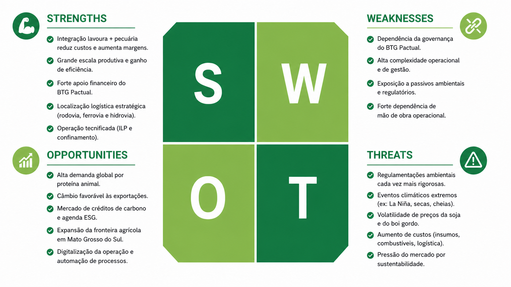</a>
</p>

<p align="center">Fonte: Próprios autores (2026).</p>
</div>

**- Forças:**

&nbsp;&nbsp;&nbsp;&nbsp;A BRPec apresenta vantagens competitivas relevantes, destacando-se pela integração entre agricultura e pecuária, que permite redução de custos e maior eficiência operacional (ECONODATA, 2026). Sua grande escala produtiva contribui para ganhos de produtividade e diluição de riscos, enquanto o suporte financeiro do BTG Pactual amplia o acesso a crédito e instrumentos financeiros. Além disso, sua localização estratégica, com acesso a diferentes modais logísticos, favorece o escoamento da produção e a inserção em mercados relevantes (BRPEC, 2026).

**- Fraquezas:** 

&nbsp;&nbsp;&nbsp;&nbsp;Por outro lado, a dependência das decisões estratégicas do BTG Pactual, empresa controladora da BRPEC, pode limitar a autonomia da organização. A complexidade operacional, característica de operações de grande escala, exige elevado nível de gestão e controle, além de envolver forte dependência de mão de obra operacional, devido ao grande número de trabalhadores, aos custos associados e às dificuldades de gestão em áreas remotas. Soma-se a isso a exposição a riscos ambientais e regulatórios, que podem gerar impactos reputacionais e financeiros, especialmente diante das exigências do Código Florestal (BRASIL, 2012). 

**- Oportunidades:**

&nbsp;&nbsp;&nbsp;&nbsp;No ambiente externo, observa-se um cenário favorável à expansão, impulsionado pela crescente demanda global por proteína animal e pela valorização de práticas sustentáveis. Nesse contexto, iniciativas ligadas a ESG e créditos de carbono surgem como potenciais fontes de geração de valor (DE OLHO NOS RURALISTAS, 2025). Além disso, o avanço da fronteira agrícola e o crescimento projetado da produção de soja no Mato Grosso do Sul ampliam as possibilidades de expansão das áreas produtivas, aumento da oferta de insumos para alimentação animal e maior integração entre agricultura e pecuária, fortalecendo a eficiência e a escala das operações da empresa (APROSOJA MS, 2024).

**- Ameaças:**

&nbsp;&nbsp;&nbsp;&nbsp;Em contrapartida, a BRPec está inserida em um ambiente de crescente rigor regulatório, especialmente no que se refere às questões ambientais (BRASIL, 2012). A volatilidade climática, particularmente em regiões como o Pantanal, pode impactar diretamente a produtividade. Adicionalmente, a oscilação nos preços de commodities e o aumento dos custos operacionais representam riscos à rentabilidade, exigindo estratégias robustas de gestão de risco e eficiência operacional para garantir sustentabilidade no longo prazo (PORTER, 1980).


### <a name="c2.1.3"></a>2.1.3. Solução

**1. Problema a ser resolvido**

&nbsp;&nbsp;&nbsp;&nbsp;Ao sair do retiro e seguir para os campos da fazenda, os capatazes precisam registrar todas as informações em papel, devido à ausência de uma ferramenta que funcione offline. Isso gera excesso de trabalho na transcrição posterior para a planilha digital e aumenta o risco de perda ou inconsistência de dados. Além disso, como não há um formato fixo, certas informações podem deixar de ser anotadas, como a causa da morte de um boi.

**2. Dados disponíveis**

Não se aplica.

**3. Solução proposta**

 &nbsp;&nbsp;&nbsp;&nbsp;Propusemos desenvolver uma aplicação web com funcionamento offline que, ao restabelecer a conexão com a internet quando o capataz chegar ao retiro, envia automaticamente as informações registradas para a planilha que será utilizada para armazenar dados sobre nascimento, morte, transferência etc., eliminando a dependência de anotações em papel e da transcrição manual.

**4. Forma de utilização da solução**

&nbsp;&nbsp;&nbsp;&nbsp;A aplicação será utilizada pelos capatazes em campo, fora do retiro. As informações serão inseridas e armazenadas localmente no celular enquanto o dispositivo estiver offline e, ao se conectar à internet, serão sincronizadas automaticamente com a base central de dados, otimizando o trabalho dos capatazes ao eliminar a necessidade de transcrição manual para a planilha.

**5. Benefícios esperados**

&nbsp;&nbsp;&nbsp;&nbsp;Os benefícios visados incluem a agilização da coleta e do processamento de dados, com a redução do trabalho manual de anotação em papel e da posterior transcrição em planilhas no retiro. Além disso, a solução facilita a conciliação de informações entre diferentes retiros, otimizando a comunicação e a integração entre eles, o que torna as operações mais coordenadas e reduz os riscos de erros ou perda de dados.

**6. Critério de sucesso e como será avaliado**

&nbsp;&nbsp;&nbsp;&nbsp;Será considerado sucesso se a interface for simples e compreensível por qualquer público, sem complicações no uso, garantindo agilidade e redução significativa do tempo atualmente gasto para inserir as informações na base central de dados. É necessário que o público sem repertório digital também seja capaz de usar a aplicação web sem dificuldades, pois se trata de maior parte de nosso público alvo.

### 2.1.4. Value Proposition Canvas (sprint 1): 
&nbsp;&nbsp;&nbsp;&nbsp;Segundo Osterwalder (2011), a ferramenta Canvas de Proposta de Valor (CPV) é utilizada estrategicamente para mapear e validar se a proposta de valor de um produto ou serviço se adequa às necessidades, dores e expectativas dos clientes. Essa ferramenta permite compreender a relação entre o que a empresa oferece e o que o cliente busca, facilitando a criação de soluções eficazes e relevantes. Assim, esse recurso foi utilizado no presente projeto a fim de apresentar a construção da proposta de valor e o diagnóstico dos problemas identificados a partir das demandas da BRPec Agropecuária S.A (Conforme a figura 3).

<div align="center">
<p>Figura 3 - Canvas Proposta de Valor</p>
<p align="center">

<a href="https://www.inteli.edu.br/">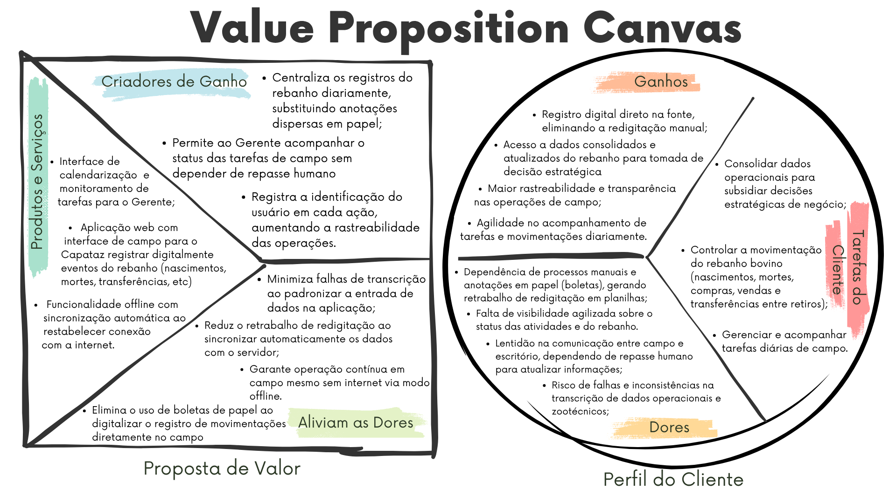</a>
</p>

<p align="center">Fonte: Próprios autores (2026).</p>
</div>


### Perfil do Cliente

**- Tarefas do Cliente:**

&nbsp;&nbsp;&nbsp;&nbsp;Nas tarefas do cliente, são delimitadas as tarefas que um cliente está tentando fazer, especialmente antes de utilizar uma nova solução proposta por uma determinada organização (G4 EDUCAÇÃO, 2025). Com isso, a equipe identificou as seguintes tarefas do cliente:

- Controlar a movimentação do rebanho bovino (nascimentos, mortes, compras, vendas e transferências entre retiros);
- Consolidar dados operacionais para subsidiar decisões estratégicas de negócio;
- Gerenciar e acompanhar tarefas diárias de campo.

**- Dores:**

&nbsp;&nbsp;&nbsp;&nbsp;Na seção de dores do Canvas Proposta de Valor, são adicionadas as frustrações que o cliente sofre ao tentar realizar determinada tarefa (G4 EDUCAÇÃO, 2025). Desse modo, foram elencadas as seguintes dores do cliente:

- Dependência de processos manuais e anotações em papel (boletas), gerando retrabalho de redigitação em planilhas;
- Lentidão na comunicação entre campo e escritório, dependendo de repasse humano para atualizar informações;
- Risco de falhas e inconsistências na transcrição de dados operacionais e zootécnicos;
- Falta de visibilidade agilizada sobre o status das atividades e do rebanho.

**- Ganhos:**

&nbsp;&nbsp;&nbsp;&nbsp;Na seção de ganhos do Canvas Proposta de Valor, são colocados os resultados que o cliente aspira ter quando realiza uma tarefa (G4 EDUCAÇÃO, 2025). Assim, foram identificados os seguintes ganhos do cliente:

- Registro digital direto na fonte, eliminando a redigitação manual;
- Acesso a dados consolidados e atualizados do rebanho para tomada de decisão estratégica;
- Maior rastreabilidade e transparência nas operações de campo;
- Agilidade no acompanhamento de tarefas e movimentações diariamente.

### Proposta de Valor

**- Produtos e Serviços:**

&nbsp;&nbsp;&nbsp;&nbsp;A seção de produtos e serviços de um Canvas Proposta de Valor se refere aos recursos oferecidos por uma determinada organização (G4 EDUCAÇÃO, 2025). Dessa forma, é possível mencionar os seguintes no que se refere à solução proposta pela equipe:

- Aplicação web com interface de campo para o Capataz registrar digitalmente eventos do rebanho (nascimentos, mortes, compras, vendas e transferências);
- Interface de calendarização e monitoramento de tarefas para o Gerente;
- Funcionalidade offline com sincronização automática ao restabelecer conexão com a internet.

**- Criadores de Ganho:**

&nbsp;&nbsp;&nbsp;&nbsp;A seção de criadores de ganhos de um Canvas Proposta de Valor diz respeito a como os produtos e serviços de uma determinada organização acarretam os resultados que o cliente espera (G4 EDUCAÇÃO, 2025). A partir disso, foram elencados os seguintes criadores de ganho:

- Centraliza os registros do rebanho diariamente, substituindo anotações dispersas em papel;
- Permite ao Gerente acompanhar o status das tarefas de campo sem depender de repasse humano;
- Registra a identificação do usuário em cada ação, aumentando a rastreabilidade das operações.

**- Aliviadores das dores:**

&nbsp;&nbsp;&nbsp;&nbsp;A seção de aliviadores de dor de um Canvas Proposta de Valor mostra de qual maneira os produtos e serviços propostos por uma organização tratam as dores do cliente (G4 EDUCAÇÃO, 2025). Por conseguinte, foram elaborados os seguintes aliviadores de dor:

- Elimina o uso de boletas de papel ao digitalizar o registro de movimentações diretamente no campo;
- Reduz o retrabalho de redigitação ao sincronizar automaticamente os dados com o servidor;
- Minimiza falhas de transcrição ao padronizar a entrada de dados na aplicação;
- Garante operação contínua em campo mesmo sem internet via modo offline.

### 2.1.5. Matriz de Riscos do Projeto (sprint 1)

&nbsp;&nbsp;&nbsp;&nbsp;A matriz de risco é uma ferramenta utilizada para identificar, analisar e classificar os riscos de um projeto, permitindo compreender tanto as ameaças (riscos negativos) quanto às oportunidades (riscos positivos) que devem ser priorizadas ao longo do seu desenvolvimento (PMI, 2021). Dessa forma, foi elaborada a matriz de risco do projeto BRPEC, conforme apresentado na Figura 4.

<div align="center">
  <p>Figura 4 – Matriz De Risco</p>
  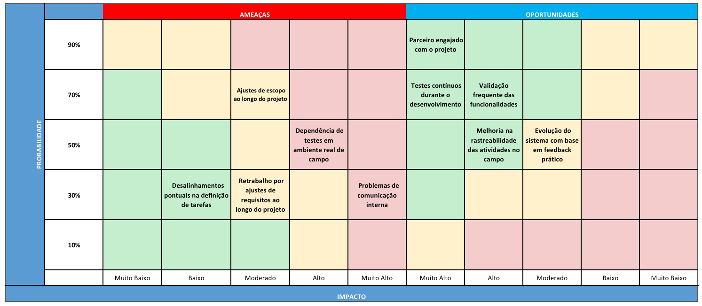
  <p>Fonte: Próprios autores (2026).</p>
</div>

**Planos de ação, impacto e probabilidade**

&nbsp;&nbsp;&nbsp;&nbsp;Em linhas gerais, um plano de ação consiste em um conjunto de medidas definidas para lidar com os riscos identificados, estando diretamente relacionado à matriz de riscos, com o objetivo de potencializar oportunidades e mitigar ameaças ao longo do projeto (PMI, 2021). Dessa forma, foram elaborados planos de ação referentes aos riscos apresentados na matriz de risco do projeto BRPEC, de acordo com os quadros 1 e 2. Além disso, foram considerados os impactos e as probabilidades de cada risco, uma vez que são fundamentais para sua análise e acompanhamento durante o desenvolvimento do projeto. 

<p align="center">Quadro 1 – Plano de ação para as ameaças.</p> 

| Ameaça                                                   | Plano de ação                                                                    | Probabilidade | Impacto    |
| -------------------------------------------------------- | -------------------------------------------------------------------------------- | ------------- | ---------- |
| Ajustes de escopo ao longo do projeto                    | Validar os requisitos no início de cada sprint e registrar alterações no backlog | 70%           | Moderado   |
| Dependência de testes em ambiente real de campo          | Criar cenários simulados para testes antes da validação em campo                 | 50%           | Alto       |
| Retrabalho por ajustes de requisitos ao longo do projeto | Realizar alinhamentos frequentes com o parceiro antes da implementação           | 30%           | Moderado   |
| Problemas de comunicação interna                         | Manter reuniões periódicas e alinhamentos constantes durante as sprints          | 30%           | Muito alto |
| Desalinhamentos pontuais na definição de tarefas         | Definir responsáveis e critérios de aceite no início de cada sprint              | 30%           | Baixo      |


<p align="center">Fonte: Próprios autores (2026).</p> 

---

<p align="center">Quadro 2 – Plano de ação para as oportunidades.</p> 

| Oportunidade                                        | Plano de ação                                                                    | Probabilidade | Impacto    |
| --------------------------------------------------- | -------------------------------------------------------------------------------- | ------------- | ---------- |
| Parceiro engajado com o projeto                     | Manter contato frequente e apresentar entregas parciais para validação           | 90%           | Muito alto |
| Testes contínuos durante o desenvolvimento          | Realizar testes a cada funcionalidade desenvolvida                               | 70%           | Muito alto |
| Validação frequente das funcionalidades             | Validar as funcionalidades ao final de cada sprint com o parceiro                | 70%           | Alto       |
| Melhoria na rastreabilidade das atividades no campo | Estruturar os registros no sistema e garantir o preenchimento adequado dos dados | 50%           | Alto       |
| Evolução do sistema com base em feedback prático    | Coletar feedback após cada entrega e priorizar melhorias no backlog              | 50%           | Moderado   |

<p align="center">Fonte: Próprios autores (2026).</p> 

# Conclusões

&nbsp;&nbsp;&nbsp;&nbsp;A aplicação integrada das análises SWOT, Cinco Forças de Porter e Business Model Canvas foi fundamental para entender melhor o problema enfrentado pela BRPec e direcionar a solução proposta. A análise SWOT ajudou a organizar os principais pontos internos e externos do negócio, evidenciando tanto a força da operação quanto limitações como a dependência de processos manuais. Já o modelo de Porter mostrou como o setor é altamente competitivo, com forte pressão de compradores e baixa diferenciação, exigindo maior eficiência operacional. Por fim, o Canvas permitiu enxergar o negócio de forma mais completa, conectando a proposta de valor com as necessidades reais da operação. No conjunto, essas análises deixaram claro que o principal desafio está na organização e confiabilidade das informações do campo, e que a digitalização dos processos é essencial para reduzir retrabalho, organizar os dados e aumentar o controle da operação.

## 2.2. Personas (sprint 1)

&nbsp;&nbsp;&nbsp;&nbsp;Personas são definidas como representações fictícias, porém realistas, de usuários, utilizadas para sintetizar comportamentos, motivações, necessidades e objetivos de um determinado grupo. Embora não correspondam a indivíduos reais, são construídas com base em dados e padrões observáveis, permitindo-se uma compreensão mais aprofundada do público-alvo e apoiando o desenvolvimento de soluções orientadas ao usuário (HARLEY, 2015).

&nbsp;&nbsp;&nbsp;&nbsp;No contexto deste projeto, foram desenvolvidas três personas, como demonstra as figuras 5, 6 e 7, com o objetivo de representar os principais perfis de partes interessadas usuárias da solução proposta. Cada persona foi associada a um cargo presente na estrutura das fazendas da BrPec (capataz, supervisor e gerente), possibilitando-se a análise de diferentes perspectivas, responsabilidades e necessidades no contexto do sistema proposto.

### Persona 1 - Daniel Carvalho

<div align="center">
<p>Figura 5 - Persona 1 (Daniel Carvalho)</p>
<p align="center">
<a href="https://www.inteli.edu.br/">  <alt="Persona 1" border="0"></a>
</p>
<p align="center">Fonte: Próprios autores (2026).</p>
</div>

#### Informações

<p>Quadro 3 - Informações do Daniel .</p>  

| Campo               | Descrição                      |
|---------------------|--------------------------------|
| **Idade**           | 43 anos                        |
| **Localização**     | Miranda – MS                   |
| **Cargo**           | Capataz                        |
| **Escolaridade**    | Ensino fundamental incompleto  |
| **Letramento digital** | Baixo                       |

<p>Fonte: Próprios Autores (2026) .</p>

**- Biografia:**

&nbsp;&nbsp;&nbsp;&nbsp;Daniel Carvalho iniciou sua trajetória ainda jovem em fazendas da região, desenvolvendo experiência prática no manejo de rebanho e na coordenação de equipes. Atualmente, atua há mais de 10 anos como capataz na Fazenda BrPec, sendo responsável pela execução das atividades operacionais no retiro.

&nbsp;&nbsp;&nbsp;&nbsp;Apesar de ser um profissional experiente, prático e comprometido, enfrenta limitações relacionadas à baixa digitalização dos processos, à escassez de ferramentas adequadas e à falta de capacitação para utilização de tecnologias. Essas condições impactam diretamente a organização das tarefas e a eficiência no dia a dia.

**- Metas:**

- Cumprir as atividades diárias com eficiência;
- Garantir que a equipe execute corretamente as tarefas;
- Manter a estabilidade profissional e o sustento familiar;
- Conseguir economizar mensalmente, ainda que de forma modesta;
- Proporcionar uma viagem em família.

**- Necessidades:**

- Soluções simples e intuitivas para organização das tarefas;
- Ferramentas que auxiliem no acompanhamento das atividades;
- Redução do tempo gasto na execução e resolução de problemas.

**- Desafios e Dores:**

- Jornada de trabalho extensa e fisicamente desgastante;
- Sobrecarga de responsabilidades no retiro;
- Dificuldade em organizar informações mentalmente ou em papel;
- Baixo nível de familiaridade com tecnologias digitais.

**- Interesses:**

- Estabilidade financeira e qualidade de vida familiar;
- Momentos de descanso quando possível;
- Manter o trabalho organizado e sem imprevistos.

### Persona 2 - Luiz Felipe

<div align="center">
<p>Figura 6 - Persona 2 (Luiz Felipe)</p>
<p align="center">
<a href="https://www.inteli.edu.br/">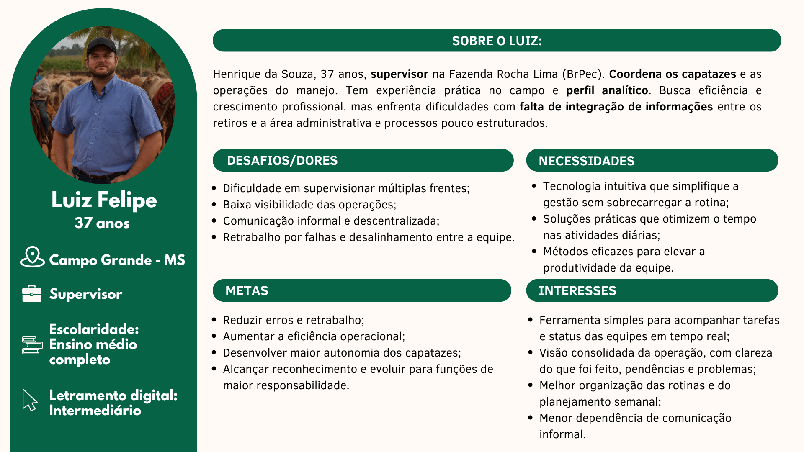  <alt="Persona 2" border="0"></a>
</p>
<p align="center">Fonte: Próprios autores (2026).</p>
</div>

**- Informações:**

<p>Quadro 4 - Informações do Luiz.</p> 

| Campo               | Descrição               |
|---------------------|-------------------------|
| **Idade**           | 37 anos                 |
| **Localização**     | Campo Grande – MS       |
| **Cargo**           | Supervisor              |
| **Escolaridade**    | Ensino médio completo   |
| **Letramento digital** | Intermediário        |

<p>Fonte: Próprios Autores (2026) .</p>

**- Biografia:**

&nbsp;&nbsp;&nbsp;&nbsp;Luiz Felipe atua como supervisor na Fazenda Rocha Lima (BrPec), sendo responsável pela coordenação dos capatazes e pelo acompanhamento das operações de manejo. Possui experiência prática no campo e apresenta um perfil analítico, com foco na eficiência operacional e no desenvolvimento profissional.

&nbsp;&nbsp;&nbsp;&nbsp;No entanto, enfrenta dificuldades relacionadas à falta de integração de informações entre os retiros e a área administrativa, além de lidar com processos pouco estruturados, o que compromete a visibilidade e o controle das operações.

**- Metas:**

- Reduzir erros e retrabalho;
- Aumentar a eficiência operacional;
- Desenvolver maior autonomia dos capatazes;
- Evoluir para funções de maior responsabilidade.

**- Necessidades:**

- Tecnologias intuitivas que simplifiquem a gestão;
- Ferramentas que otimizem o tempo das atividades;
- Métodos que aumentem a produtividade da equipe.

**- Desafios e Dores:**

- Dificuldade em supervisionar múltiplas frentes;
- Baixa visibilidade das operações;
- Comunicação informal e descentralizada;
- Retrabalho decorrente de falhas e desalinhamentos.

**- Interesses:**

- Ferramentas simples para acompanhamento em tempo real;
- Visão consolidada das operações;
- Melhor organização das rotinas;
- Redução da dependência de comunicação informal.

### Persona 3 - Marcos Ferreira
<div align="center">
<p>Figura 7 - Persona 3 (Marcos Ferreira)</p>
<p align="center">
<a href="https://www.inteli.edu.br/">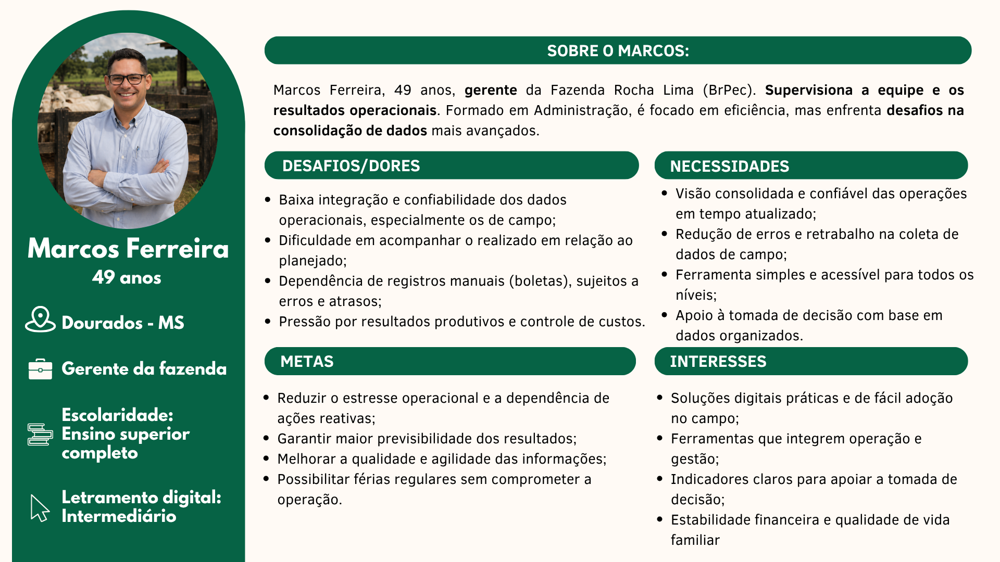  <alt="Persona 3" border="0"></a>
</p>
<p align="center">Fonte: Próprios autores (2026).</p>
</div>

**- Informações:**

<p>Quadro 5 - Informações do Marcos.</p> 

| Campo               | Descrição                    |
|---------------------|------------------------------|
| **Idade**           | 49 anos                      |
| **Localização**     | Dourados – MS                |
| **Cargo**           | Gerente da fazenda           |
| **Escolaridade**    | Ensino superior completo     |
| **Letramento digital** | Intermediário             |

<p>Fontes: Próprios Autores (2026).</p>  

**- Biografia:**

&nbsp;&nbsp;&nbsp;&nbsp;Marcos Ferreira atua como gerente da Fazenda Rocha Lima (BrPec), sendo responsável pela supervisão da equipe e pelos resultados operacionais. Formado em Administração, possui uma visão estratégica voltada para eficiência, controle e tomada de decisão baseada em dados.

&nbsp;&nbsp;&nbsp;&nbsp;Apesar disso, enfrenta desafios relacionados à baixa integração e confiabilidade dos dados operacionais, especialmente os provenientes do campo, além da dependência de registros manuais, o que impacta a qualidade das informações e a agilidade na gestão.

**- Metas:**

- Reduzir o estresse operacional e a dependência de ações reativas;
- Garantir maior previsibilidade dos resultados;
- Melhorar a qualidade e agilidade das informações;
- Possibilitar melhor equilíbrio entre vida profissional e pessoal.

**- Necessidades:**

- Visão consolidada e confiável das operações;
- Redução de erros na coleta de dados;
- Ferramentas acessíveis para todos os níveis da operação;
- Apoio à tomada de decisão com base em dados organizados.

**- Desafios e Dores:**

- Baixa integração e confiabilidade dos dados;
- Dificuldade de acompanhamento do realizado vs. planejado;
- Dependência de registros manuais sujeitos a erros;
- Pressão por resultados e controle de custos.

**- Interesses:**

- Soluções digitais práticas e de fácil adoção;
- Integração entre operação e gestão;
- Indicadores claros para tomada de decisão;
- Estabilidade financeira e qualidade de vida.


## 2.3. User Stories (sprints 1 a 5)

&nbsp;&nbsp;&nbsp;&nbsp;As user stories (ou histórias de usuário) consistem em descrições simples e objetivas das funcionalidades de um sistema, elaboradas a partir da perspectiva do usuário final, com foco no valor entregue e sem o uso de linguagem técnica excessiva (COHN, 2004; PATTON, 2014). Nesse contexto, elas são centradas nas necessidades e experiências dos usuários, contribuindo para um desenvolvimento mais alinhado à realidade de uso e aos objetivos do negócio (PRESSMAN; MAXIM, 2020). No presente projeto da BRPec, as user stories foram definidas com base nos fluxos operacionais da fazenda, como gestão de tarefas, registro de movimentações do rebanho e comunicação entre campo e escritório, estruturando os requisitos da aplicação web proposta, de acordo com os quadros 6, 7, 8, 9, 10, 11, 12, 13, 14, 15, 16 e 17.

<p align="center">Quadro 6 - User Story 01.</p> 

| Identificação | [US01](graduacao/2026-1b/t26/g02#36) |
| - | - |
| Persona | Daniel Carvalho |
| User Story | Como capataz, posso usar o sistema offline, para registrar dados sem internet. |
| Critério de aceite 1 | Dado que não há conexão, quando acessa o sistema, então as funcionalidades principais permanecem disponíveis. |
| Critério de aceite 2 | Dado que registra dados offline, quando salva, então o sistema armazena localmente. |
| Critério de aceite 3 | Dado que a conexão retorna, quando o sistema detecta internet, então os dados são sincronizados automaticamente. |
| Critérios INVEST | <p>Independente: Pode ser implementada sem depender de outros módulos além do armazenamento local.</p> <p>Negociável: A estratégia de sincronização pode ser ajustada conforme decisão técnica.</p> <p>Valorosa: Permite o uso do sistema em campo sem acesso à internet.</p> <p>Estimável: O fluxo offline e sincronização está claramente definido.</p> <p>Pequena: Pode ser implementada inicialmente para funções essenciais.</p> <p>Testável: Pode ser validada simulando ausência e retorno de conexão.</p> |

<p align="center">Fonte: Próprios autores (2026).</p>
</div>

---

<p align="center">Quadro 7 - User Story 02.</p>

| Identificação | [US02](graduacao/2026-1b/t26/g02#35) |
| - | - |
| Persona | Daniel Carvalho |
| User Story | Como capataz, posso registrar movimentações do rebanho, para substituir o uso de boletas em papel. |
| Critério de aceite 1 | Dado que o usuário acessa o formulário, quando preenche os campos obrigatórios, então o sistema permite o registro. |
| Critério de aceite 2 | Dado que há campos obrigatórios vazios, quando tenta salvar, então o sistema impede o envio. |
| Critério de aceite 3 | Dado que não há conexão, quando registra, então o dado é salvo localmente. |
| Critérios INVEST | <p>Independente: A funcionalidade pode ser desenvolvida de forma isolada, sem depender de outros módulos.</p> <p>Negociável: Os campos do formulário podem ser ajustados conforme necessidade.</p> <p>Valorosa: Elimina o uso de boletas em papel, reduzindo erros e retrabalho.</p> <p>Estimável: Possui escopo claro, envolvendo formulário e validação.</p> <p>Pequena: Restrita ao registro de movimentações.</p> <p>Testável: Pode ser validada pelo preenchimento e salvamento correto dos dados.</p> |

<p align="center">Fonte: Próprios autores (2026).</p>
</div>

---

<p align="center">Quadro 8 - User Story 03.</p>

| Identificação | [US03](graduacao/2026-1b/t26/g02#41) |
| - | - |
| Persona | Luiz Felipe |
| User Story | Como supervisor, posso criar tarefas para os capatazes, para organizar a operação. |
| Critério de aceite 1 | Dado que cria uma tarefa, quando preenche os dados, então o sistema permite salvar. |
| Critério de aceite 2 | Dado que salva a tarefa, quando concluído, então ela fica visível ao capataz. |
| Critério de aceite 3 | Dado que há erro no preenchimento, quando tenta salvar, então o sistema impede a ação. |
| Critérios INVEST | <p>Independente: Pode ser desenvolvida sem depender da execução das tarefas.</p> <p>Negociável: Campos e categorias podem ser ajustados.</p> <p>Valorosa: Organiza a distribuição das atividades.</p> <p>Estimável: Escopo claro de criação de tarefas.</p> <p>Pequena: Funcionalidade simples de cadastro.</p> <p>Testável: Pode ser validada pela criação correta da tarefa.</p> |

<p align="center">Fonte: Próprios autores (2026).</p>
</div>

---

<p align="center">Quadro 9 - User Story 04.</p>

| Identificação | [US04](graduacao/2026-1b/t26/g02#39) |
| - | - |
| Persona | Luiz Felipe |
| User Story | Como supervisor, posso validar registros enviados, para garantir a confiabilidade dos dados. |
| Critério de aceite 1 | Dado que existem registros pendentes, quando acessa a tela, então visualiza a lista. |
| Critério de aceite 2 | Dado que analisa um registro, quando aprova ou rejeita, então o status é atualizado. |
| Critério de aceite 3 | Dado que rejeita um registro, quando confirma, então informa o motivo. |
| Critérios INVEST | <p>Independente: Pode ser executada após o registro dos dados.</p> <p>Negociável: As regras de validação podem ser ajustadas.</p> <p>Valorosa: Garante maior qualidade das informações.</p> <p>Estimável: Fluxo simples de aprovação ou rejeição.</p> <p>Pequena: Restrita à validação de registros.</p> <p>Testável: Pode ser validada pela alteração de status.</p> |

<p align="center">Fonte: Próprios autores (2026).</p>
</div>

---

<p align="center">Quadro 10 - User Story 05.</p>

| Identificação | [US05](graduacao/2026-1b/t26/g02#42) |
| - | - |
| Persona | Luiz Felipe |
| User Story | Como supervisor, posso receber alertas de problemas, para agir rapidamente. |
| Critério de aceite 1 | Dado que ocorre um problema, quando identificado, então o sistema gera um alerta. |
| Critério de aceite 2 | Dado que há alerta, quando acessa o painel, então o supervisor visualiza a notificação. |
| Critério de aceite 3 | Dado que clica no alerta, quando acessa, então é redirecionado ao detalhe correspondente. |
| Critérios INVEST | <p>Independente: Depende apenas da geração de eventos no sistema.</p> <p>Negociável: Tipos de alerta podem ser ajustados.</p> <p>Valorosa: Permite resposta rápida a problemas.</p> <p>Estimável: Escopo claro de notificação.</p> <p>Pequena: Restrita à exibição de alertas.</p> <p>Testável: Validada pela geração e visualização de alertas.</p> |

<p align="center">Fonte: Próprios autores (2026).</p>
</div>

---

<p align="center">Quadro 11 - User Story 06.</p>

| Identificação        | [US06](graduacao/2026-1b/t26/g02#40) |
| -------------------- | - |
| Persona              | Luiz Felipe   |
| User Story           | Como supervisor, posso visualizar chamados de infraestrutura, para gerenciar problemas. |
| Critério de aceite 1 | Dado que existem chamados, quando acessa a tela, então o sistema exibe a lista.  |
| Critério de aceite 2 | Dado que seleciona um chamado, quando abre, então visualiza os detalhes. |
| Critério de aceite 3 | Dado que altera o status, quando salva, então o sistema atualiza o chamado. |
| Critérios INVEST     | <p>Independente: Pode ser desenvolvido como módulo separado.</p> <p>Negociável: Os status podem ser ajustados.</p> <p>Valorosa: Permite gestão estruturada de problemas.</p> <p>Estimável: Escopo simples de listagem e atualização.</p> <p>Pequena: Restrita à visualização e alteração de status.</p> <p>Testável: Validada pela atualização do chamado.</p> |

<p align="center">Fonte: Próprios autores (2026).</p>
</div>

---

<p align="center">Quadro 12 - User Story 07.</p>
</div>

| Identificação | [US07](graduacao/2026-1b/t26/g02#38) |
| - | - |
| Persona | Daniel Carvalho |
| User Story | Como capataz, posso abrir chamados de infraestrutura, para reportar problemas. |
| Critério de aceite 1 | Dado que cria um chamado, quando preenche os dados, então o sistema permite envio. |
| Critério de aceite 2 | Dado que envia o chamado, quando salvo, então fica registrado no sistema. |
| Critério de aceite 3 | Dado que acessa histórico, quando consulta, então visualiza seus chamados. |
| Critérios INVEST | <p>Independente: Pode ser desenvolvida separadamente dos demais módulos.</p> <p>Negociável: Campos como prioridade e categoria podem ser ajustados.</p> <p>Valorosa: Permite comunicação estruturada de problemas no retiro.</p> <p>Estimável: Escopo claro envolvendo criação e consulta.</p> <p>Pequena: Restrita à abertura e visualização de chamados.</p> <p>Testável: Pode ser validada pela criação e listagem dos chamados.</p> |

<p align="center">Fonte: Próprios autores (2026).</p>
</div>

---

<p align="center">Quadro 13 - User Story 08.</p>
</div>

| Identificação        | [US08](graduacao/2026-1b/t26/g02#44) |
| -------- | ---- |
| Persona              | Marcos Ferreira   |
| User Story           | Como gerente, posso visualizar um dashboard com indicadores da fazenda, para acompanhar a operação.   |
| Critério de aceite 1 | Dado que existem dados, quando o gerente acessa o sistema, então o dashboard exibe indicadores principais.  |
| Critério de aceite 2 | Dado que novos dados são sincronizados, quando atualizados, então o dashboard reflete as mudanças. |
| Critério de aceite 3 | Dado que o dashboard é exibido, quando acessado, então mostra a data da última atualização. |
| Critérios INVEST     | <p>Independente: Depende apenas dos dados existentes.</p> <p>Negociável: Indicadores podem ser ajustados.</p> <p>Valorosa: Fornece visão estratégica da operação.</p> <p>Estimável: Escopo claro de visualização.</p> <p>Pequena: Restrita ao dashboard.</p> <p>Testável: Validada pela atualização dos indicadores.</p> |

<p align="center">Fonte: Próprios autores (2026).</p>
</div>

---

<p align="center">Quadro 14 - User Story 9.</p>
</div>

| Identificação        | [US09](graduacao/2026-1b/t26/g02#43)   |
| -------------------- | -- |
| Persona              | Luiz Felipe   |
| User Story           | Como supervisor, posso gerar relatórios semanais, para acompanhar a operação. |
| Critério de aceite 1 | Dado que existem dados, quando o supervisor solicita relatório, então o sistema gera o arquivo.   |
| Critério de aceite 2 | Dado que o relatório é gerado, quando aberto, então contém dados consolidados.  |
| Critério de aceite 3 | Dado que não há dados, quando gera relatório, então o sistema informa ausência de registros.|
| Critérios INVEST     | <p>Independente: Depende apenas dos dados já registrados.</p> <p>Negociável: O formato do relatório pode ser ajustado.</p> <p>Valorosa: Permite acompanhamento da operação.</p> <p>Estimável: Escopo claro de geração de relatório.</p> <p>Pequena: Restrita à exportação de dados.</p> <p>Testável: Validada pela geração e abertura do arquivo.</p> |

<p align="center">Fonte: Próprios autores (2026).</p>
</div>

---

<p align="center">Quadro 15 - User Story 10.</p>
</div>

| Identificação        | [US10](graduacao/2026-1b/t26/g02#46) |
| ---- | -- |
| Persona              | Marcos Ferreira    |
| User Story           | Como gerente, posso visualizar histórico de chamados, para acompanhar problemas recorrentes. |
| Critério de aceite 1 | Dado que existem chamados, quando acessa o sistema, então visualiza a lista completa. |
| Critério de aceite 2 | Dado que aplica filtros, quando seleciona critérios, então a lista é atualizada.  |
| Critério de aceite 3 | Dado que acessa um chamado, quando abre, então visualiza os detalhes.  |
| Critérios INVEST     | <p>Independente: Depende do módulo de chamados.</p> <p>Negociável: Os filtros podem ser ajustados.</p> <p>Valorosa: Permite análise de problemas recorrentes.</p> <p>Estimável: Escopo claro de consulta.</p> <p>Pequena: Restrita à visualização e filtragem.</p> <p>Testável: Validada pela listagem correta dos chamados.</p> |

<p align="center">Fonte: Próprios autores (2026).</p>
</div>

---

<p align="center">Quadro 16 - User Story 11.</p>
</div>

| Identificação        | [US11](graduacao/2026-1b/t26/g02#47) |
| -------------------- | --- |
| Persona              | Marcos Ferreira                                               |
| User Story           | Como gerente, posso filtrar dados por retiro, para analisar o desempenho de cada unidade da fazenda.  |
| Critério de aceite 1 | Dado que existem dados registrados, quando o gerente aplica filtro por retiro, então o sistema exibe apenas os dados correspondentes.   |
| Critério de aceite 2 | Dado que o gerente combina filtros, quando seleciona um período, então os dados são refinados conforme os critérios definidos.                                            |
| Critério de aceite 3 | Dado que o gerente altera o filtro, quando seleciona outro retiro, então os resultados são atualizados automaticamente.  |
| Critérios INVEST     | <p>Independente: Pode ser desenvolvida de forma isolada, desde que os dados já estejam disponíveis no sistema.</p> <p>Negociável: Os tipos de filtros podem ser ajustados conforme necessidade.</p> <p>Valorosa: Permite análise detalhada do desempenho por unidade, apoiando a tomada de decisão.</p> <p>Estimável: O escopo é claro, envolvendo aplicação de filtros sobre dados existentes.</p> <p>Pequena: Restrita à funcionalidade de filtragem e atualização de dados.</p> <p>Testável: Pode ser validada verificando se os dados exibidos correspondem aos filtros aplicados.</p> |

<p align="center">Fonte: Próprios autores (2026).</p>
</div>

---

<p align="center">Quadro 17 - User Story 12.</p>
</div>

| Identificação | [US12](graduacao/2026-1b/t26/g02#37) |
| - | - |
| Persona | Daniel Carvalho |
| User Story | Como capataz, posso anexar fotos como evidência, para comprovar ações realizadas. |
| Critério de aceite 1 | Dado que o usuário registra uma ação, quando anexa foto, então o sistema salva a imagem. |
| Critério de aceite 2 | Dado que a imagem é enviada, quando salva, então fica vinculada ao registro. |
| Critério de aceite 3 | Dado que acessa o registro, quando visualiza, então a imagem deve estar disponível. |
| Critérios INVEST | <p>Independente: Pode ser desenvolvida como complemento aos registros existentes.</p> <p>Negociável: O tipo de evidência pode ser ampliado para vídeo ou áudio.</p> <p>Valorosa: Aumenta a confiabilidade das informações registradas.</p> <p>Estimável: Escopo claro envolvendo upload e armazenamento.</p> <p>Pequena: Restrita ao envio e visualização de imagens.</p> <p>Testável: Pode ser validada pelo upload correto e exibição da imagem.</p> |

<p align="center">Fonte: Próprios autores (2026).</p>
</div>


# <a name="c3"></a>3. Projeto da Aplicação Web (sprints 1 a 5)

## <a name="c3.1"></a>3.1. Requisitos do Sistema (sprints 1 a 5)

&nbsp;&nbsp;&nbsp;&nbsp;Os requisitos do sistema representam o ponto de partida para tudo que será construído, estabelecendo um entendimento comum entre nossa equipe e o parceiro sobre o que a aplicação precisa ser, como deve se comportar e sob quais critérios será testada e aprovada.

&nbsp;&nbsp;&nbsp;&nbsp;Eles estão organizados em duas categorias complementares, os requisitos funcionais, que descrevem o que o sistema deve fazer, como o registro de movimentações, o controle de acesso por perfil e a operação offline e os requisitos não funcionais, que definem a qualidade com que essas funcionalidades devem ser entregues, abrangendo desempenho, segurança, confiabilidade e usabilidade.

&nbsp;&nbsp;&nbsp;&nbsp;Para garantir objetividade na avaliação dessa qualidade, os requisitos não funcionais foram estruturados com base na norma ISO/IEC 25010. Todo o conteúdo desta seção foi levantado junto ao parceiro BrPec Agropecuária, considerando a realidade operacional dos retiros e o perfil dos usuários finais.

**Minimundo**

&nbsp;&nbsp;&nbsp;&nbsp;O sistema BrPec Agropecuária atende às demandas operacionais de gestão pecuária em 14 retiros distribuídos entre o Pantanal e Cerrado sul mato-grossenses. A estrutura organizacional é composta por três perfis hierárquicos: Capataz, Supervisor e Gerente, cada qual com responsabilidades e níveis de acesso distintos.

&nbsp;&nbsp;&nbsp;&nbsp;Os Capatazes atuam no campo e registram movimentações do rebanho (nascimentos, mortes, transferências, compras e vendas) com informações obrigatórias de origem, destino, quantidade, estágio da vida e evidências (fotos georreferenciadas, áudios ou mensagens). Também abrem tickets de infraestrutura para reportar problemas como cercas danificadas, falta de água ou equipamentos avariados, devendo anexar ao menos uma evidência descritiva.

&nbsp;&nbsp;&nbsp;&nbsp;Os Supervisores coordenam os Capatazes, criando e atribuindo tarefas com data, horário, prioridade e categoria. Validam os registros submetidos, podendo aprová-los (enviando para o Gerente) ou rejeitá-los com justificativa para correção. Recebem notificações de tickets abertos e podem atribuí-los conforme necessário.

&nbsp;&nbsp;&nbsp;&nbsp;O Gerente acessa o painel de consolidação, visualizando todas as movimentações, tarefas e tickets aprovados pelo Supervisor, com rastreabilidade completa de quem registrou, quem aprovou e quando. Gera relatórios semanais e mensais em formato de planilha (.xlsx ou .csv), contendo exclusivamente dados sincronizados e aprovados.

&nbsp;&nbsp;&nbsp;&nbsp;Cada retiro possui usuários vinculados, garantindo isolamento de dados por perfil (RBAC). O sistema opera em modo offline, armazenando registros localmente e sincronizando automaticamente quando a conexão é restabelecida. Apenas dados sincronizados são visíveis ao Supervisor para validação e entram nos relatórios gerenciais.

&nbsp;&nbsp;&nbsp;&nbsp;O fluxo operacional completo segue a cadeia: Capataz registra → sistema sincroniza → Supervisor valida → dados aprovados sobem para o Gerente consolidar e gerar relatórios. Esse ciclo elimina boletas de papel, reduz erros de transcrição e centraliza digitalmente as informações operacionais da fazenda.

**Entidades principais:**

Usuário (perfis: Capataz, Supervisor, Gerente) vinculado a Retiro
Movimentação (registrada por Capataz, validada por Supervisor) associada a Evidências
Tarefa (criada por Supervisor, atribuída a Capataz) associada a Evidências
Ticket (aberto por Capataz, gerenciado por Supervisor) associada a Evidências
Evidência (foto georreferenciada, áudio ou mensagem) vinculada a Movimentações, Tarefas ou Tickets
Relatório (gerado por Gerente) consolidando dados aprovados

### <a name="c3.1.1"></a>3.1.1. Requisitos Funcionais (sprint 1, refinar até sprint 5)

<p align="center">Quadro 18 - Requisitos Funcionais </p>
</div> 

| ID    | Descrição | Prioridade | Status       |
|-------|-----------|------------|--------------|
| RF001 | O sistema deve permitir o registro de movimentações do rebanho (nascimento, morte, transferência, compra e venda), com campos obrigatórios de origem, destino, quantidade, estágio da vida e causa do óbito.  | Alta       | Planejado |
| RF002 | O sistema deve permitir a criação e atribuição de tarefas a usuários específicos, com data, horário, prioridade e categoria.  | Alta      | Planejado    |
| RF003 | O sistema deve funcionar de forma off-line e on-line, armazenando os dados localmente e sincronizando automaticamente com o servidor ao restabelecer conexão com a internet.  | Alta  | Planejado |
| RF004 | O sistema deve permitir o anexo de evidências às tarefas e movimentações, incluindo foto georreferenciada, áudios e mensagens escritas. | Alta  | Planejado |
| RF005 | O sistema deve identificar o usuário por meio de um processo simples, intuitivo e de fácil compreensão. | Alta  | Planejado |
| RF006 | O sistema deve permitir que o Supervisor visualize e valide tarefas e movimentações registradas pelos Capatazes.  | Média | Planejado |
| RF007 | O sistema deve gerar relatórios semanais e mensais de movimentação do rebanho e de tarefas, com exportação em formato de planilha.  | Média | Planejado |
| RF008 | O sistema deve disponibilizar um ticket de chamados de infraestrutura, permitindo que Capatazes abram chamados para a equipe de infraestrutura e que Supervisores atribuam chamados aos Capatazes.  | Média | Planejado |

 <p align="center">Fonte: Próprios autores (2026).</p>
</div> 

### <a name="c3.1.2"></a>3.1.2. Regras de Negócio (sprint 1, refinar até sprint 5)

<p align="center">Quadro 19 - Regras de Negócios </p>
</div>

| ID   | Descrição | RF associado |
|------|-----------|--------------|
| RN01 | O sistema deve bloquear o envio de qualquer movimentação de rebanho caso os campos obrigatórios (origem, destino, quantidade e estágio da vida) estejam em branco. Se a movimentação for do tipo "morte", o campo "causa do óbito" também passa a ser estritamente obrigatório. | RF001 |
| RN02 | A criação de uma nova tarefa no sistema deve falhar e retornar um erro de validação caso não contenha o preenchimento simultâneo de: usuário atribuído, data, horário, prioridade e categoria. | RF002 |
| RN03 | Durante a operação em modo off-line, os dados devem ser salvos no armazenamento local do dispositivo. A sincronização (envio dos dados para o servidor) só deve ser disparada automaticamente quando o sistema detectar um status HTTP válido de conexão restabelecida. | RF003 |
| RN04 | Para a anexação de fotos como evidência, o sistema deve validar se o arquivo de imagem possui metadados de georreferenciamento (latitude e longitude válidas). Caso não possua, a foto deve ser rejeitada pelo sistema. | RF004 |
| RN05 | A identificação do usuário deverá ocorrer com o menor número possível de etapas, utilizando linguagem clara, instruções objetivas e elementos visuais que facilitem o uso por pessoas com baixo letramento digital. | RF005 |
| RN06 | A ação de alterar o status de uma tarefa ou movimentação para "Validada" deve ser restrita e estar visível/habilitada apenas para usuários que acessarem o sistema com o perfil/identificação de "Supervisor". | RF006 |
| RN07 | A geração e exportação de relatórios semanais e mensais em formato de planilha só poderá ser processada utilizando dados que já foram sincronizados com o servidor (dados apenas locais/off-line não devem entrar no relatório gerado). | RF007 |
| RN08 | Para a abertura de um ticket de infraestrutura por um Capataz, o sistema deve exigir obrigatoriamente a inclusão de pelo menos uma evidência descritiva associada ao chamado (uma mensagem escrita ou um áudio). | RF008 |

<p align="center">Fonte: Próprios autores (2026).</p>
</div> 

### <a name="c3.1.3"></a>3.1.3. Requisitos Não Funcionais — 8 Eixos ISO/IEC 25010 (sprints 1 a 5)

<p align="center">Quadro 20 - Requisitos Não Funcionais </p>
</div>

| Eixo                     | Requisito | Métrica / Critério | Como atendido |
|--------------------------|-----------|--------------------|---------------|
| USAB — Usabilidade       | A interface deve ser operável por usuários com baixa alfabetização, sem necessidade de treinamento extenso | Usuário conclui tarefa básica (ex: registrar movimentação) em até 3 minutos sem auxílio | Uso de ícones grandes, botões visuais, textos curtos e fluxos simplificados |
| CONF — Confiabilidade    | O sistema deve garantir que nenhum dado registrado offline seja perdido durante a sincronização | 0% de perda de registros em ciclos de sincronização testados | Armazenamento local persistente, com fila de sincronização e confirmação de envio ao servidor |
| DES — Desempenho         | As telas principais devem carregar de forma responsiva mesmo em conexões instáveis | p95 < 3000 ms em conexão Starlink; operações offline sem latência perceptível | Assets leves, dados carregados localmente no modo offline, requisições otimizadas |
| SUP — Suportabilidade    | O sistema deve operar sem suporte técnico presencial nos retiros, sendo mantido remotamente pela sede | 100% das atualizações e correções realizadas sem deslocamento a campo | Arquitetura web centralizada, atualizações via deploy remoto, logs de erro acessíveis pela sede |
| SEG — Segurança          | O acesso às funcionalidades deve ser restrito por perfil, impedindo que um Capataz acesse dados de outro retiro | 0 ocorrências de acesso indevido entre retiros em testes de perfil | Controle de acesso baseado em perfil (RBAC), com isolamento de dados por retiro no nível do banco de dados |
| CAP — Capacidade         | O sistema deve suportar os 20–25 usuários simultâneos previstos e os 14 retiros ativos sem degradação | p95 < 3000 ms com 25 usuários simultâneos em carga simulada | Infraestrutura escalável em nuvem, banco de dados particionado por retiro |
| REST — Restrições Design | A identidade visual deve seguir a logo e paleta de cores da BrPec Agropecuária; a aplicação deve ser exclusivamente web | 100% das telas aprovadas pelo parceiro em revisão de UI | Aplicação de design system com tokens de cor e tipografia baseados na identidade visual da BrPec Agropecuária, validado em revisão de UI com o parceiro |
| ORG — Organizacionais    | O sistema deve exportar relatórios no formato de planilha compatível com o modelo já utilizado pelo parceiro | 99,9% dos campos do modelo atual do parceiro presentes na exportação | Geração de arquivo .xlsx/.csv mapeado conforme template fornecido pelo parceiro |

<p align="center">Fonte: Próprios autores (2026).</p>
</div> 

### <a name="c3.1.4"></a>3.1.4. Matriz RF → RN → Endpoint (sprints 3 a 5)

<p>Quadro 21 - Matriz RF → RN → Endpoint </p>
</div>

| RF    | RN associadas | Endpoint    | Método |
|:-------:|:---------------:|:-------------:|:--------:|
| RF001 | RN01    | `/usuarios` | POST   |
| RF002 | RN02    | `/usuarios` | POST   |
| RF003 | RN03    | `/usuarios` | POST   |
| RF004 | RN04    | `/usuarios` | POST   |
| RF005 | RN05    | `/usuarios` | POST   |
| RF006 | RN06    | `/usuarios` | POST   |
| RF007 | RN07    | `/usuarios` | POST   |
| RF008 | RN08    | `/usuarios` | POST   |

<p>Fonte: Próprios autores (2026).</p>
</div> 

## <a name="c3.2"></a>3.2. Arquitetura (sprints 1 a 5)

### <a name="c3.2.1"></a>3.2.1. Diagrama de Arquitetura (sprints 3 e 4)

### <a name="c3.2.2"></a>3.2.2. Diagrama de Casos de Uso (sprint 1)

&nbsp;&nbsp;&nbsp;&nbsp;Use cases são compreendidos como uma técnica consolidada para o levantamento e a documentação de requisitos, por meio da qual são descritas as diferentes formas de interação com um sistema, visando ao atendimento das necessidades dos usuários. Nessa abordagem, são considerados tanto os fluxos de sucesso quanto situações de exceção, desafios e falhas, independentemente de aspectos relacionados à implementação, tecnologia ou plataforma.

&nbsp;&nbsp;&nbsp;&nbsp;No contexto deste projeto, adotam-se os princípios do Use-Case 3.0, conforme proposto por Jacobson, Spence e De Mendonca (2024), caracterizado como uma abordagem escalável e ágil voltada à captura de requisitos e ao apoio ao desenvolvimento incremental.

<div align="center">
<p>Figura 8 - Diagrama de Casos de Uso</p>
<p align="center">

<a href="https://www.inteli.edu.br/">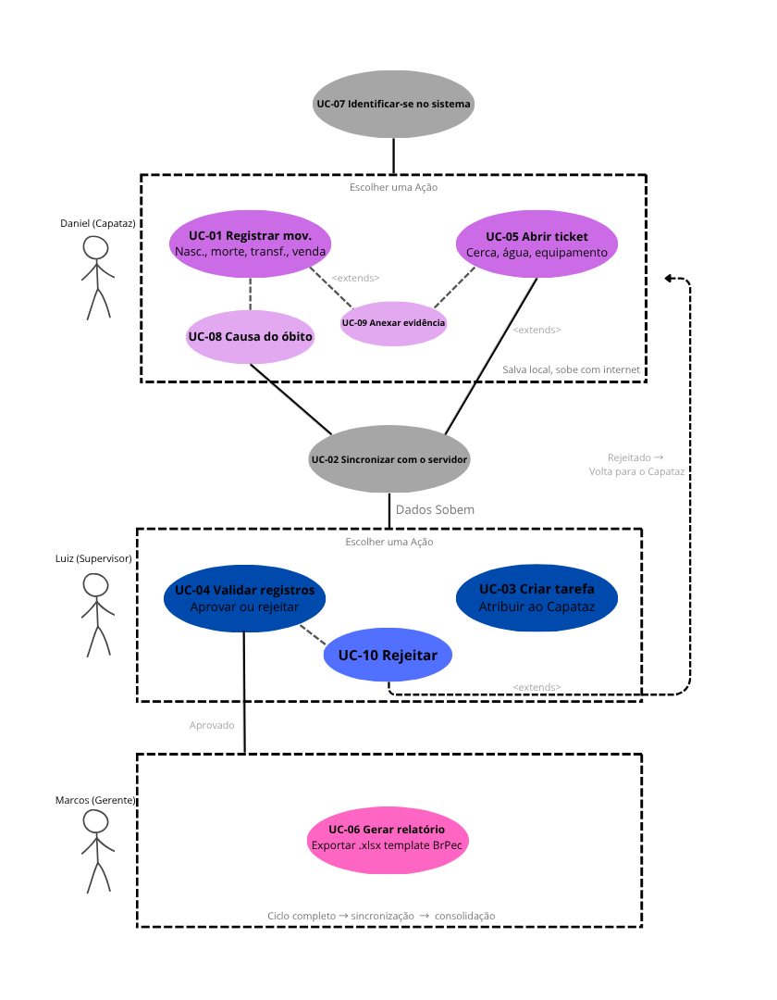</a>
</p>

<p align="center">Fonte: Próprios autores (2026).</p>
</div>

--- 

<p>Quadro 22 - Use Case 01 </p>

#### UC-01 - Registrar Movimentação de Rebanho

| Campo | Conteúdo |
|---|---|
| **UC-ID + Nome** | UC-01 — Registrar Movimentação de Rebanho |
| **Ator primário** | Capataz (Daniel) |
| **Atores secundários** | Sistema de Armazenamento Local; Servidor de Sincronização |
| **RFs relacionados** | RF001, RF004 |
| **RNs relacionadas** | RN01, RN04 |
| **RNFs relacionados** | USAB, CONF |
| **Relacionamentos UML** | `<<include>>` UC-07; `<<extend>>` UC-08 [tipo = morte]; `<<extend>>` UC-09 [evidência adicional] |

<p>Fonte: Próprios autores (2026).</p>
</div> 

--- 
**Pré-condição:** O Capataz está identificado no sistema (UC-07) com perfil "Capataz" e tem acesso ao retiro associado à sua conta. O dispositivo possui armazenamento local funcional, mesmo sem conexão com a internet.

**Fluxo Principal (cenário de sucesso):**

1. O Capataz acessa o módulo "Movimentações" no menu principal.
2. O sistema apresenta a tela de registro com ícones grandes e textos curtos, adequada ao baixo letramento digital do usuário (RN05), contendo os campos: tipo de movimentação, origem, destino, quantidade, estágio da vida e anexo de evidência.
3. O Capataz seleciona o tipo de movimentação (nascimento, morte, transferência, compra ou venda).
4. O Capataz informa origem, destino, quantidade e estágio da vida dos animais.
5. O Capataz anexa uma foto como evidência da movimentação.
6. O sistema valida se a foto possui metadados de georreferenciamento (latitude e longitude).
7. O Capataz confirma o registro.
8. O sistema persiste a movimentação no armazenamento local do dispositivo com status "pendente de validação pelo Supervisor".
9. O sistema exibe confirmação visual de registro bem-sucedido com indicação do estado de sincronização (pendente ou sincronizado).

**Fluxos Alternativos:**

- **A1** (no passo 3): se o Capataz seleciona "morte" como tipo de movimentação, o sistema dispara o UC-08 (Registrar Causa de Óbito), tornando o campo "causa do óbito" estritamente obrigatório e exibindo-o em destaque junto aos demais campos obrigatórios (RN01). `<<extend>>`
- **A2** (no passo 5): se o Capataz opta por anexar áudio ou mensagem escrita em vez de foto, o sistema aceita a evidência alternativa e pula a validação de georreferenciamento do passo 6. O Capataz pode também anexar evidências adicionais via UC-09 (Anexar Evidência). `<<extend>>`
- **A3** (no passo 8): se houver conexão ativa com a internet no momento do registro, o sistema dispara a sincronização automática (UC-02) e marca a movimentação como "sincronizada" (RN03).

**Exceções:**

- **E1** (no passo 6): se a foto anexada não possuir metadados de georreferenciamento válidos, o sistema rejeita o anexo, exibe mensagem clara e visual ao Capataz solicitando nova foto e mantém os demais campos preenchidos (RN04).
- **E2** (no passo 7): se algum campo obrigatório (origem, destino, quantidade, estágio da vida ou causa do óbito quando aplicável) estiver em branco, o sistema bloqueia o envio, destaca visualmente os campos faltantes com linguagem simples e exibe mensagem de erro de validação (RN01).
- **E3** (no passo 8): se houver falha no armazenamento local, o sistema exibe alerta claro ao Capataz, mantém os dados preenchidos em memória e solicita nova tentativa.

**Pós-condição:** A movimentação está registrada no armazenamento local do dispositivo, associada ao Capataz autor (Daniel) e ao retiro de origem, com status "pendente de validação". A movimentação fica disponível para envio ao servidor (UC-02) e posterior validação pelo Supervisor Luiz (UC-04).

---
<p>Quadro 23 - Use Case 02 </p>

#### UC-02 - Sincronizar Dados Offline com o Servidor

| Campo | Conteúdo |
|---|---|
| **UC-ID + Nome** | UC-02 — Sincronizar Dados Offline com o Servidor |
| **Ator primário** | Sistema (disparado automaticamente por evento de conexão) |
| **Atores secundários** | Servidor de Sincronização; Capataz e Supervisor (notificados do resultado) |
| **RFs relacionados** | RF003 |
| **RNs relacionadas** | RN03 |
| **RNFs relacionados** | CONF, DES |
| **Relacionamentos UML** | `<<include>>` UC-07 |

<p>Fonte: Próprios autores (2026).</p>
</div> 

---

**Pré-condição:** Existem registros pendentes no armazenamento local do dispositivo (movimentações, tarefas concluídas, evidências ou tickets) gerados em modo offline pelo Capataz Daniel. O usuário está identificado no sistema (UC-07).

**Fluxo Principal (cenário de sucesso):**

1. O sistema monitora continuamente o status da conexão de rede do dispositivo.
2. O sistema detecta que a conexão foi restabelecida e retorna um status HTTP válido em uma requisição de teste ao servidor.
3. O sistema enfileira todos os registros pendentes do armazenamento local em ordem cronológica.
4. O sistema envia cada registro ao endpoint correspondente no servidor.
5. O servidor processa cada registro, persiste no banco central e retorna confirmação de recebimento.
6. O sistema marca cada registro local como "sincronizado" após confirmação do servidor.
7. O sistema exibe ao Capataz uma notificação não intrusiva indicando o número de registros sincronizados com sucesso.

**Fluxos Alternativos:**

- **A1** (no passo 3): se houver muitos registros pendentes, o sistema processa a fila em lotes para evitar sobrecarga na conexão Starlink (DES — p95 < 3000ms), mantendo a ordem cronológica.
- **A2** (no passo 7): se a sincronização ocorre em segundo plano sem o aplicativo aberto, o sistema apenas atualiza os indicadores visuais sem notificação explícita.

**Exceções:**

- **E1** (no passo 2): se o status HTTP retornado não for válido (timeout, 5xx, sem resposta), o sistema mantém o modo offline ativo, não dispara a sincronização e tenta novamente após intervalo de espera (RN03).
- **E2** (no passo 5): se o servidor rejeita um registro específico por erro de validação, o sistema mantém esse registro como "pendente com erro", exibe alerta detalhado ao Capataz e prossegue com os demais registros da fila.
- **E3** (no passo 5): se a conexão cai durante o envio, o sistema interrompe a sincronização, mantém os registros não confirmados como "pendentes" e retoma do ponto de parada quando a conexão for restabelecida.

**Pós-condição:** Todos os registros que foram sincronizados com sucesso estão persistidos no servidor central e marcados localmente como "sincronizados". Registros que falharam permanecem no armazenamento local com flag de erro para nova tentativa. Nenhum dado é perdido no processo (CONF — 0% de perda). Os dados sincronizados ficam disponíveis para o Supervisor Luiz validar (UC-04).

---
<p>Quadro 24 - Use Case 03 </p>

#### UC-03 - Criar e Atribuir Tarefa a Capataz

| Campo | Conteúdo |
|---|---|
| **UC-ID + Nome** | UC-03 — Criar e Atribuir Tarefa a Capataz |
| **Ator primário** | Supervisor (Luiz) |
| **Atores secundários** | Capataz Daniel (destinatário da tarefa); Sistema de Notificação |
| **RFs relacionados** | RF002 |
| **RNs relacionadas** | RN02 |
| **RNFs relacionados** | USAB, ORG |
| **Relacionamentos UML** | `<<include>>` UC-07; `<<extend>>` UC-09 [evidência adicional] |

<p>Fonte: Próprios autores (2026).</p>
</div> 

---

**Pré-condição:** O Supervisor está identificado no sistema (UC-07) com perfil "Supervisor". Existe pelo menos um Capataz cadastrado e vinculado a um retiro sob sua coordenação. O Supervisor escolheu a ação "Criar tarefa" após identificar-se.

**Fluxo Principal (cenário de sucesso):**

1. O Supervisor acessa o módulo "Tarefas" e seleciona "Nova Tarefa".
2. O sistema apresenta o formulário de criação com os campos: Capataz atribuído, data, horário, prioridade, categoria e descrição.
3. O Supervisor seleciona o Capataz responsável a partir da lista de usuários do retiro.
4. O Supervisor preenche data, horário, prioridade (alta, média, baixa) e categoria da tarefa.
5. O Supervisor adiciona descrição textual da tarefa.
6. O Supervisor confirma a criação.
7. O sistema valida o preenchimento simultâneo de todos os campos obrigatórios.
8. O sistema persiste a tarefa no servidor (ou local, se offline) e a vincula ao Capataz selecionado.
9. O sistema notifica o Capataz atribuído sobre a nova tarefa.
10. O sistema exibe confirmação ao Supervisor e retorna à listagem de tarefas com a nova tarefa visível.

**Fluxos Alternativos:**

- **A1** (no passo 5): o Supervisor pode anexar evidências descritivas (foto georreferenciada, áudio ou mensagem) à tarefa criada, disparando o UC-09 (Anexar Evidência), conforme RF004. `<<extend>>`
- **A2** (no passo 6): o Supervisor pode optar por salvar a tarefa como "rascunho" para edição posterior, sem disparar a validação dos campos obrigatórios.

**Exceções:**

- **E1** (no passo 7): se algum dos campos obrigatórios (Capataz atribuído, data, horário, prioridade ou categoria) estiver em branco, o sistema bloqueia a criação, retorna erro de validação e destaca os campos faltantes (RN02).
- **E2** (no passo 8): se houver falha de persistência no servidor e o dispositivo estiver online, o sistema salva a tarefa localmente e a marca como pendente de sincronização (UC-02).
- **E3** (no passo 9): se o Capataz atribuído estiver offline no momento da criação, a notificação fica pendente e é entregue assim que o dispositivo dele restabelecer conexão.

**Pós-condição:** A tarefa está registrada no sistema, vinculada ao Capataz Daniel, com status inicial "pendente" e disponível tanto na visão do Supervisor quanto na do Capataz. O Capataz Daniel recebe a tarefa e a executa no campo. Ao concluir, a tarefa entra no fluxo de validação pelo Supervisor Luiz (UC-04).

---

<p>Quadro 25 - Use Case 04 </p>

#### UC-04 - Validar Registros do Capataz

| Campo | Conteúdo |
|---|---|
| **UC-ID + Nome** | UC-04 — Validar Registros do Capataz |
| **Ator primário** | Supervisor (Luiz) |
| **Atores secundários** | Capataz Daniel (autor do registro, notificado); Gerente Marcos (recebe dados aprovados) |
| **RFs relacionados** | RF006 |
| **RNs relacionadas** | RN06 |
| **RNFs relacionados** | SEG, USAB |
| **Relacionamentos UML** | `<<include>>` UC-07; `<<extend>>` UC-10 [recusa do registro] |

<p>Fonte: Próprios autores (2026).</p>
</div>  

---

**Pré-condição:** O Supervisor está identificado no sistema (UC-07) com perfil "Supervisor" (RN06). O Supervisor escolheu a ação "Validar registros" após identificar-se. Existe pelo menos um registro (movimentação ou tarefa concluída) com status "pendente de validação" submetido pelo Capataz Daniel e já sincronizado com o servidor (UC-02).

**Fluxo Principal (cenário de sucesso):**

1. O Supervisor acessa o painel de "Validações Pendentes".
2. O sistema lista todos os registros pendentes de validação dos Capatazes sob sua coordenação, ordenados por data e agrupados por retiro.
3. O Supervisor seleciona um registro específico para análise.
4. O sistema apresenta os detalhes completos do registro: autor (Capataz Daniel), data, conteúdo dos campos e evidências anexadas (foto georreferenciada, áudio ou mensagem).
5. O Supervisor analisa as informações e as evidências.
6. O Supervisor seleciona a ação "Aprovar".
7. O sistema altera o status do registro para "Aprovado", grava o identificador do Supervisor validador e o timestamp da ação.
8. O sistema envia os dados aprovados para a camada de consolidação visível ao Gerente Marcos (UC-06).
9. O sistema notifica o Capataz Daniel sobre a aprovação.
10. O sistema retorna o Supervisor ao painel com o registro removido da lista de pendências.

**Fluxos Alternativos:**

- **A1** (no passo 6): o Supervisor pode optar por "Rejeitar" o registro, disparando o UC-10 (Rejeitar Registro). O Supervisor deve informar justificativa textual obrigatória. O registro retorna ao Capataz Daniel com status "rejeitado" e a justificativa visível, para que ele corrija e ressubmeta. `<<extend>>`
- **A2** (no passo 6): o Supervisor pode optar por "Solicitar mais informações", enviando uma mensagem ao Capataz Daniel sem alterar o status final do registro.
- **A3** (no passo 2): o Supervisor pode aplicar filtros por Capataz, tipo de registro ou período para reduzir a sobrecarga visual e focar na validação por prioridade.

**Exceções:**

- **E1** (no passo 1): se um usuário sem perfil "Supervisor" tentar acessar o painel de validações por manipulação direta de URL ou token, o sistema retorna erro 403 (Forbidden) e registra a tentativa em log de auditoria (RN06, SEG).
- **E2** (no passo 7): se houver falha de gravação no servidor, o sistema mantém o registro como "pendente de validação", exibe erro ao Supervisor e solicita nova tentativa.

**Pós-condição:** O registro está aprovado, com identificação do Supervisor Luiz e timestamp persistidos para auditoria. Os dados aprovados ficam visíveis ao Gerente Marcos, que pode consultar quem registrou e quem aprovou. Apenas registros aprovados entram nos relatórios oficiais (UC-06). Se rejeitado, o registro volta ao Capataz Daniel para correção.

---

<p>Quadro 26 - Use Case 05 </p> 

#### UC-05 - Abrir Ticket de Infraestrutura

| Campo | Conteúdo |
|---|---|
| **UC-ID + Nome** | UC-05 — Abrir Ticket de Infraestrutura |
| **Ator primário** | Capataz (Daniel) |
| **Atores secundários** | Supervisor Luiz (notificado, pode atribuir); Equipe de Infraestrutura |
| **RFs relacionados** | RF008, RF004 |
| **RNs relacionadas** | RN08 |
| **RNFs relacionados** | SUP, USAB |
| **Relacionamentos UML** | `<<include>>` UC-07; `<<extend>>` UC-09 [evidência adicional] |

<p>Fonte: Próprios autores (2026).</p>
</div> 

---

**Pré-condição:** O Capataz está identificado no sistema (UC-07) com perfil "Capataz". O Capataz escolheu a ação "Abrir chamado" após identificar-se. Existe um problema de infraestrutura no retiro (cerca quebrada, falta de água, equipamento danificado, problema em edificação) que precisa ser reportado.

**Fluxo Principal (cenário de sucesso):**

1. O Capataz acessa o módulo "Chamados" e seleciona "Abrir Novo Chamado".
2. O sistema apresenta o formulário de abertura com ícones de categoria e campos simplificados, adequados ao baixo letramento digital (RN05), contendo: categoria do problema, localização, descrição e área de evidências.
3. O Capataz seleciona a categoria do problema via ícone (cerca, abastecimento de água, equipamento, edificação).
4. O Capataz informa a localização aproximada dentro do retiro.
5. O Capataz adiciona ao menos uma evidência descritiva obrigatória: mensagem escrita ou áudio (RN08).
6. O Capataz confirma a abertura do ticket.
7. O sistema valida a presença obrigatória de pelo menos uma evidência descritiva.
8. O sistema persiste o ticket (no servidor ou localmente, se offline) com status "aberto" e identificador único.
9. O sistema notifica o Supervisor Luiz (que pode atribuir o chamado) e a equipe de Infraestrutura sobre o novo chamado.
10. O sistema exibe ao Capataz a confirmação com o número do ticket gerado.

**Fluxos Alternativos:**

- **A1** (no passo 5): o Capataz pode opcionalmente anexar foto georreferenciada como evidência adicional, disparando o UC-09 (Anexar Evidência). Se a foto não tiver coordenadas válidas, o sistema rejeita apenas a foto, mas mantém o ticket válido caso já haja mensagem ou áudio (RN04). `<<extend>>`
- **A2** (no passo 8): se o dispositivo está offline, o ticket é salvo localmente e entra na fila de sincronização (UC-02).

**Exceções:**

- **E1** (no passo 7): se o Capataz tentar enviar o ticket sem nenhuma evidência descritiva (mensagem ou áudio), o sistema bloqueia o envio e exibe mensagem clara e visual solicitando o cumprimento da obrigação (RN08).
- **E2** (no passo 8): se houver falha de persistência mesmo com armazenamento local disponível, o sistema mantém os dados em memória e oferece nova tentativa.

**Pós-condição:** O ticket de infraestrutura está registrado com identificador único, evidência(s) anexada(s), categoria, localização e Capataz autor Daniel. O Supervisor Luiz é notificado e pode atribuir o chamado. A equipe de Infraestrutura pode iniciar o atendimento remotamente (SUP — 100% das correções sem deslocamento a campo).

---

<p>Quadro 27 - Use Case 06 </p>

#### UC-06 - Visualizar Dados Aprovados e Gerar Relatório

| Campo | Conteúdo |
|---|---|
| **UC-ID + Nome** | UC-06 — Visualizar Dados Aprovados e Gerar Relatório |
| **Ator primário** | Gerente (Marcos) |
| **Atores secundários** | Servidor de Dados Sincronizados e Aprovados |
| **RFs relacionados** | RF007 |
| **RNs relacionadas** | RN07 |
| **RNFs relacionados** | ORG, DES |
| **Relacionamentos UML** | `<<include>>` UC-07 |

<p>Fonte: Próprios autores (2026).</p>
</div> 

---

**Pré-condição:** O Gerente está identificado no sistema (UC-07) com perfil "Gerente" e possui conexão ativa com a internet. Existem dados de movimentação ou tarefas que já foram sincronizados (UC-02) e aprovados pelo Supervisor Luiz (UC-04) para o período desejado (RN07).

**Fluxo Principal (cenário de sucesso):**

1. O Gerente acessa o painel de consolidação do sistema.
2. O sistema apresenta a visão geral dos dados aprovados: movimentações, tarefas concluídas e tickets, com identificação de quem registrou (Capataz Daniel) e quem aprovou (Supervisor Luiz), data e horário de cada ação.
3. O Gerente analisa os dados consolidados para ter visão do que aconteceu na operação.
4. O Gerente acessa o módulo "Relatórios" e seleciona o tipo de relatório (movimentação de rebanho ou tarefas).
5. O Gerente define o período (semanal ou mensal) e o(s) retiro(s) de interesse.
6. O Gerente confirma a geração.
7. O sistema consulta exclusivamente os dados que já foram sincronizados e aprovados pelo Supervisor para o filtro definido.
8. O sistema processa os dados e gera o arquivo no formato de planilha (.xlsx ou .csv).
9. O sistema disponibiliza o arquivo para download.
10. O Gerente faz o download da planilha gerada e segue com o trabalho de gestão.

**Fluxos Alternativos:**

- **A1** (no passo 5): o Gerente pode aplicar filtros adicionais, como tipo de movimentação (apenas mortes, apenas transferências), Capataz responsável ou Supervisor validador.
- **A2** (no passo 2): o Gerente pode consultar apenas a visão consolidada sem gerar relatório, caso queira apenas acompanhar a operação em tempo quase real.

**Exceções:**

- **E1** (no passo 7): se não houver dados sincronizados e aprovados para o filtro selecionado, o sistema exibe mensagem informando ausência de dados e oferece sugestão de ampliar o período ou alterar o filtro.
- **E2** (no passo 7): o sistema explicitamente exclui  registros não aprovados pelo Supervisor, garantindo consistência do relatório oficial (RN07).
- **E3** (no passo 8): se houver falha no processamento (timeout ou erro do servidor), o sistema exibe erro claro ao Gerente com opção de nova tentativa.
- **E4** (no passo 1): se um usuário com perfil "Capataz" tentar acessar o painel de consolidação ou o módulo de relatórios, o sistema bloqueia o acesso e retorna erro 403 (SEG).

**Pós-condição:** O Gerente Marcos possui visão completa da operação (quem registrou, quem aprovou, quando) e, se necessário, um arquivo de planilha no formato compatível, contendo exclusivamente dados sincronizados e aprovados, pronto para análises gerenciais e comunicação com a sede. O ciclo completo: campo → sincronização → validação → consolidação.

---

<p>Quadro 28 - Use Case 07 </p>

#### UC-07 - Identificar-se no Sistema

| Campo | Conteúdo |
|---|---|
| **UC-ID + Nome** | UC-07 — Identificar-se no Sistema |
| **Ator primário** | Capataz (Daniel), Supervisor (Luiz) ou Gerente (Marcos) |
| **Atores secundários** | Servidor de Autenticação |
| **RFs relacionados** | RF005 |
| **RNs relacionadas** | RN05 |
| **RNFs relacionados** | USAB, SEG |
| **Relacionamento UML** | `<<include>>` por UC-01, UC-02, UC-03, UC-04, UC-05 e UC-06 |

<p>Fonte: Próprios autores (2026).</p>
</div> 

--- 

**Pré-condição:** O usuário possui credencial cadastrada no sistema. O dispositivo está acessível.

**Fluxo Principal (cenário de sucesso):**

1. O usuário acessa o sistems .
2. O sistema apresenta a tela de identificação com elementos visuais grandes, poucos campos e instruções objetivas, adequada ao baixo letramento digital do Capataz Daniel (RN05).
3. O usuário informa sua identificação e credencial.
4. O sistema valida a credencial junto ao servidor de autenticação.
5. O sistema identifica o perfil (Capataz, Supervisor ou Gerente) e o retiro vinculado.
6. O sistema libera o menu principal contextualizado para o perfil identificado, exibindo apenas as ações disponíveis para aquele perfil.

**Fluxos Alternativos:**

- **A1** (no passo 1): se o usuário já tinha sessão ativa válida, o sistema pula direto para o passo 6.
- **A2** (no passo 3): o sistema pode oferecer mecanismo simplificado de identificação (PIN visual, foto do perfil para seleção, biometria), priorizando o menor número possível de etapas (RN05).

**Exceções:**

- **E1** (no passo 4): se a credencial é inválida, o sistema exibe mensagem clara em linguagem objetiva e oferece nova tentativa.
- **E2** (no passo 4): se não há conexão com o servidor, o sistema permite identificação offline com credencial armazenada localmente, mantendo a sessão limitada às funcionalidades offline.

**Pós-condição:** O usuário está autenticado com perfil identificado e sessão ativa. O menu exibe apenas as ações do perfil: Daniel (Capataz) vê "Registrar movimentação" e "Abrir chamado"; Luiz (Supervisor) vê "Validar registros" e "Criar tarefa"; Marcos (Gerente) vê "Visualizar dados" e "Gerar relatório". Todas as ações ficam vinculadas ao usuário para rastreabilidade e auditoria.

--- 
<p>Quadro 29 - Use Case 08 </p>

#### UC-08 - Registrar Causa de Óbito

| Campo | Conteúdo |
|---|---|
| **UC-ID + Nome** | UC-08 — Registrar Causa de Óbito |
| **Ator primário** | Capataz (Daniel) |
| **Atores secundários** | — |
| **RFs relacionados** | RF001 |
| **RNs relacionadas** | RN01 |
| **RNFs relacionados** | USAB |
| **Relacionamento UML** | `<<extend>>` UC-01 — condição: tipo da movimentação = "morte" |

<p>Fonte: Próprios autores (2026).</p>
</div> 

---

**Pré-condição:** O Capataz está executando o UC-01 (Registrar Movimentação) e selecionou "morte" como tipo de movimentação no passo 3.

**Fluxo Principal (cenário de sucesso):**

1. O sistema exibe o campo "causa do óbito" como obrigatório, em destaque visual.
2. O sistema apresenta lista pré-definida de causas comuns (predação, doença, acidente, intempérie, desconhecida) com ícones adequados ao baixo letramento digital.
3. O Capataz seleciona a causa aplicável ou opta por descrever em campo livre.
4. O Capataz pode adicionar observações textuais complementares.
5. O sistema valida o preenchimento do campo e retorna o controle ao fluxo principal do UC-01 (passo 4).

**Exceções:**

- **E1** (no passo 5): se o campo "causa do óbito" está em branco, o sistema bloqueia o avanço do UC-01 e mantém o usuário nesta tela até o preenchimento (RN01).

**Pós-condição:** A causa do óbito está registrada como parte da movimentação de morte. O fluxo retorna ao UC-01, que prossegue normalmente com os demais campos.

---

<p>Quadro 30 - Use Case 09 </p>

#### UC-09 - Anexar Evidência
| Campo | Conteúdo |
|---|---|
| **UC-ID + Nome** | UC-09 — Anexar Evidência |
| **Ator primário** | Capataz (Daniel) ou Supervisor (Luiz) |
| **Atores secundários** | Sistema de Localização (GPS); Câmera; Microfone |
| **RFs relacionados** | RF004 |
| **RNs relacionadas** | RN04|
| **RNFs relacionados** | USAB |
| **Relacionamento UML** | UML<<extend>> UC-01, UC-03 e UC-05 — condição: usuário aciona "Anexar evidência" |

<p>Fonte: Próprios autores (2026).</p>
</div> 

---

**Pré-condição:** O usuário está executando um dos UCs base (UC-01, UC-03 ou UC-05) e está na etapa de preenchimento onde evidências podem ser adicionadas.

**Fluxo Principal (cenário de sucesso):**

1. O sistema apresenta as opções de evidência: foto, áudio ou mensagem escrita, com ícones grandes.
2. O usuário seleciona o tipo de evidência.
3. Para foto: o sistema aciona a câmera, captura a imagem e extrai automaticamente os metadados de georreferenciamento.
4. Para áudio: o sistema aciona o microfone e grava o áudio até o usuário encerrar.
5. Para mensagem: o sistema apresenta campo de texto para digitação livre.
6. O sistema valida a evidência (no caso de foto, verifica georreferenciamento — RN04).
7. O sistema anexa a evidência ao registro principal e retorna o controle ao UC base.

**Fluxos Alternativos:**

- **A1** (no passo 2): o usuário pode anexar mais de um tipo de evidência ao mesmo registro (ex.: foto + áudio).

**Exceções:**

- **E1** (no passo 6): se a foto não possui metadados de georreferenciamento válidos, o sistema rejeita a foto, exibe mensagem clara e oferece nova captura (RN04). O registro base continua válido se já houver outra evidência.
- **E2** (no passo 3): se o GPS do dispositivo está desligado, o sistema solicita ativação antes de capturar a foto.

**Pós-condição:** A evidência está anexada ao registro principal com seus metadados (tipo, timestamp, localização quando aplicável). O fluxo retorna ao UC base.

---
<p>Quadro 31 - Use Case 10 </p>

#### UC-10 - Rejeitar Registro
| Campo | Conteúdo |
|---|---|
| **UC-ID + Nome** | UC-10 — Rejeitar Registro |
| **Ator primário** | Supervisor (Luiz) |
| **Atores secundários** | Capataz Daniel (notificado da rejeição) |
| **RFs relacionados** | RF006 |
| **RNs relacionadas** | RN06|
| **RNFs relacionados** | SEG |
| **Relacionamento UML** | <<extend>> UC-04 — condição: Supervisor opta por rejeitar o registro |

<p>Fonte: Próprios autores (2026).</p>
</div> 

---
**Pré-condição:** O Supervisor está executando o UC-04 (Validar Registros) e identificou inconsistência ou problema no registro analisado, optando por rejeitá-lo no passo 6.

**Fluxo Principal (cenário de sucesso):**

1. O Supervisor seleciona a ação "Rejeitar".
2. O sistema apresenta campo obrigatório de justificativa textual.
3. O Supervisor preenche a justificativa explicando o motivo da rejeição.
4. O Supervisor confirma a rejeição.
5. O sistema altera o status do registro para "Rejeitado", grava o identificador do Supervisor, timestamp e a justificativa.
6. O sistema notifica o Capataz Daniel sobre a rejeição, exibindo o motivo.
7. O sistema retorna o Supervisor ao painel de validações (UC-04).

**Exceções:**

- **E1** (no passo 4): se a justificativa está em branco, o sistema bloqueia a confirmação e exige preenchimento.

**Pós-condição:** O registro está marcado como "Rejeitado" com justificativa visível. O Capataz Daniel é notificado e pode corrigir o registro e ressubmetê-lo, reiniciando o ciclo (UC-01 → UC-02 → UC-04). 
Registros rejeitados não entram nos relatórios oficiais do Gerente Marcos (UC-06 / RN07).


### <a name="c3.2.3"></a>3.2.3. Diagrama de Classes do Domínio (sprint 2)

*Diagrama UML de classes com entidades, atributos, relacionamentos e responsabilidades. Diferencie **associação**, **agregação** (losango vazio), **composição** (losango cheio) e **herança** (triângulo vazio). Multiplicidade explícita em toda associação.*

### <a name="c3.2.4"></a>3.2.4. Diagrama de Sequência UML (sprint 3)

*Ao menos um fluxo prioritário, mostrando a interação entre as camadas Controller → Service → Repository → Banco. Linhas de vida verticais, ativação correta, mensagens síncronas e assíncronas diferenciadas, retornos tracejados.*

### <a name="c3.2.5"></a>3.2.5. Diagrama de Atividades ou Estados (sprint 3)

*Ao menos um fluxo relevante em UML ou BPMN. Use a notação da ferramenta escolhida de forma consistente (sem misturar convenções).*

### <a name="c3.2.6"></a>3.2.6. Diagrama de Implantação (sprints 4 e 5)

*Diagrama UML de deployment mostrando nós físicos, artefatos e canais de comunicação. Representa a visão Engineering + Technology do RM-ODP.*

### <a name="c3.2.7"></a>3.2.7. Padrões de Projeto Aplicados (sprints 3 a 5)

*Documente os design patterns utilizados (Repository, Strategy, Factory, DTO etc.) e quais princípios SOLID se aplicam. Justifique a adoção de cada padrão com base em uma necessidade real do projeto.*

## <a name="c3.3"></a>3.3. Wireframes (sprint 2)

&nbsp;&nbsp;&nbsp;&nbsp;Wireframe é uma representação visual simplificada da interface de um sistema, utilizada para planejar a organização das telas, a navegação e a experiência do usuário. Nesta seção, serão apresentados os wireframes desenvolvidos para a aplicação web da BRPEC, demonstrando como a interface foi estruturada para atender às necessidades operacionais da fazenda. O objetivo é apresentar a disposição dos elementos, os fluxos de navegação e as funcionalidades disponíveis para cada perfil de usuário do sistema, priorizando simplicidade, rapidez e acessibilidade no uso em campo.

### Capataz

A interface de uso para capatazes foi construida visando maximizar a simplicidade e facilidade de uso da plataforma. Como  os capatazes possuem um nível de instrução e letramento digital baixo, como foi constatado em nosso kickoff e expressado na persona, essa abordagem de disposição de elementos é assertiva. Outra escolha guiada por esse princípio de simplicidade foi desenvolver apenas a versão mobile do wireframe para o capataz, visto que essa classe de usuário só acessará o site pelo celular. A interface é composta por quatro seções principais, home, movimentação do rebanho, abrir chamado e minhas tarefas, cujos wireframes se apresentam a seguir:

<div align="center">
<p>Figura 9 - Wireframe da aba "Entrar e home" do capataz</p>
<p align="center">
<a href="https://www.inteli.edu.br/">
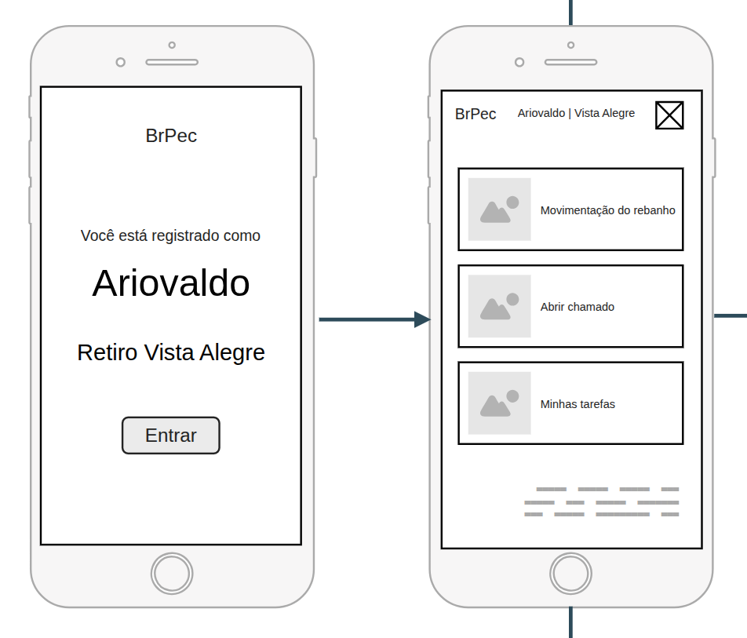
</a>
</p>
</div>

<p align="center">Fonte: Próprios autores (2026).</p>
</div>

<div align="center">
<p>Figura 10 - Wireframe da aba "Registrar movimentação" do capataz</p>
<p align="center">
<a href="https://www.inteli.edu.br/">
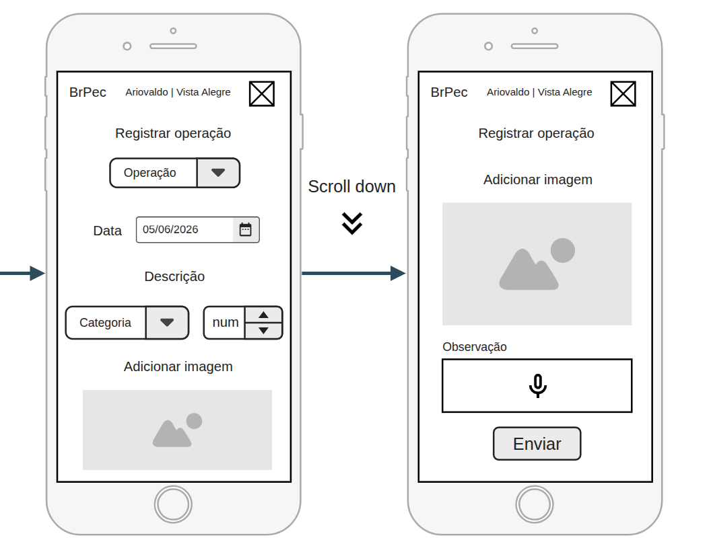
</a>
</p>
</div>

<p align="center">Fonte: Próprios autores (2026).</p>
</div>

<div align="center">
<p>Figura 11 - Wireframe da aba "Abrir chamado" do capataz</p>
<p align="center">
<a href="https://www.inteli.edu.br/">
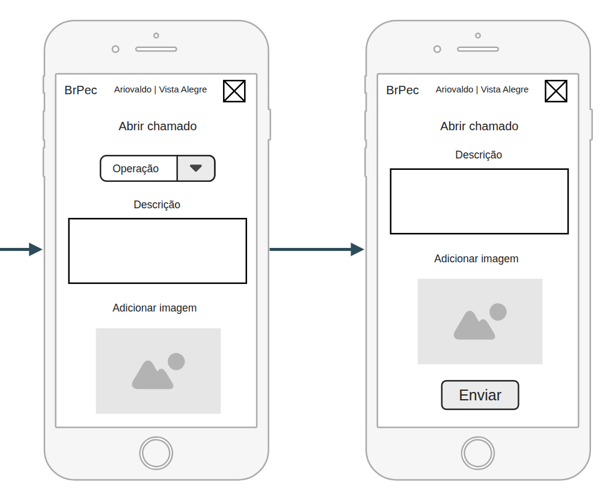
</a>
</p>
</div>

<p align="center">Fonte: Próprios autores (2026).</p>
</div>

<div align="center">
<p>Figura 12 - Wireframe da aba "Minhas tarefas" do capataz</p>
<p align="center">
<a href="https://www.inteli.edu.br/">
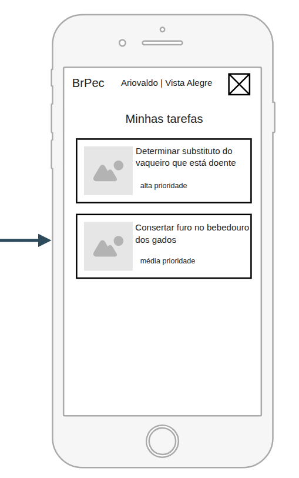
</a>
</p>
</div>

<p align="center">Fonte: Próprios autores (2026).</p>
</div>

### Supervisor 

&nbsp;&nbsp;&nbsp;&nbsp;As interfaces do supervisor foram desenvolvidas com foco técnico e operacional, permitindo o acompanhamento das atividades realizadas nos retiros e a validação das informações registradas pelos capatazes. O fluxo inicial contempla telas de login simplificadas para dispositivos mobile, organizadas com poucos elementos visuais e campos objetivos, facilitando o acesso rápido ao sistema.

**Versão Mobile:**

&nbsp;&nbsp;&nbsp;&nbsp;Na versão mobile, o dashboard principal apresenta atalhos rápidos para relatórios, registros pendentes, alertas e delegação de tarefas, permitindo acesso direto às principais funcionalidades utilizadas no dia a dia da fazenda. Além disso, o supervisor consegue visualizar relatórios operacionais com filtros por período, retiro e tipo de relatório, incluindo uma prévia das informações antes da exportação da planilha.

<div align="center">
<p>Figura 9 - Wireframe Versão Mobile do Supervisor</p>
<p align="center">
<a href="https://www.inteli.edu.br/">

</a>
</p>
</div>

<p align="center">Fonte: Próprios autores (2026).</p>
</div>

<div align="center">
<p>Figura 10 - Wireframe Versão Mobile do Supervisor</p>
<p align="center">
<a href="https://www.inteli.edu.br/">
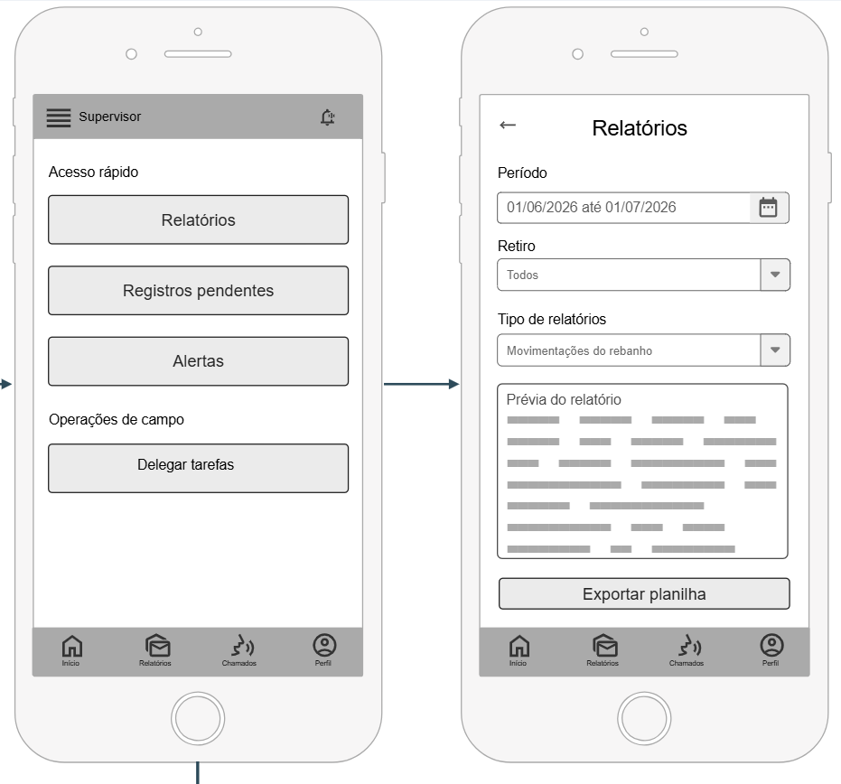
</a>
</p>
</div>

<p align="center">Fonte: Próprios autores (2026).</p>
</div>

<div align="center">
<p>Figura 11 - Wireframe Versão Mobile do Supervisor</p>
<p align="center">
<a href="https://www.inteli.edu.br/">

</a>
</p>
</div>

<p align="center">Fonte: Próprios autores (2026).</p>
</div>

**Versão Desktop:**

&nbsp;&nbsp;&nbsp;&nbsp;Já na versão desktop, a interface foi estruturada com áreas de visualização ampliadas, menus laterais e listagens organizadas, proporcionando maior controle administrativo e melhor acompanhamento das operações da fazenda. O supervisor consegue monitorar registros pendentes, acompanhar alertas operacionais e delegar tarefas de maneira centralizada, facilitando a gestão dos retiros sob sua responsabilidade.

<div align="center">
<p>Figura 12 - Wireframe Versão Desktop do Supervisor</p>
<p align="center">
<a href="https://www.inteli.edu.br/">

</a>
</p>
</div>

<div align="center">
<p>Figura 13 - Wireframe Versão Desktop do Supervisor</p>
<p align="center">
<a href="https://www.inteli.edu.br/">
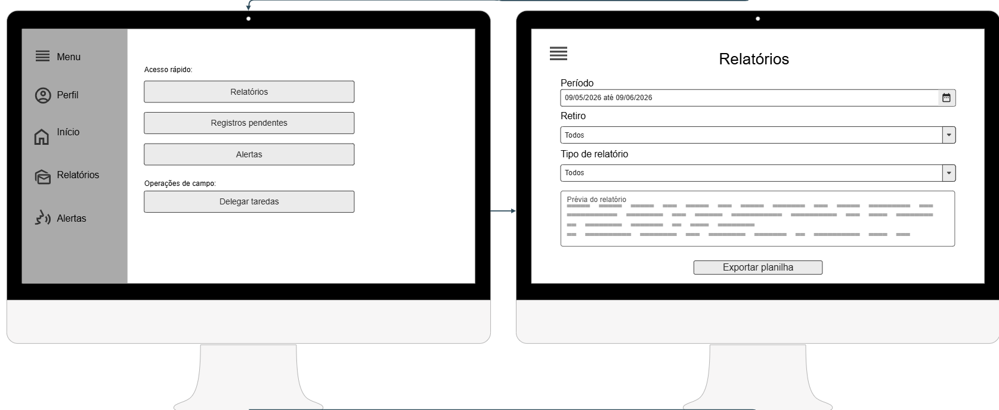
</a>
</p>
</div>

<p align="center">Fonte: Próprios autores (2026).</p>
</div>

<div align="center">
<p>Figura 14 - Wireframe Versão Desktop do Supervisor</p>
<p align="center">
<a href="https://www.inteli.edu.br/">
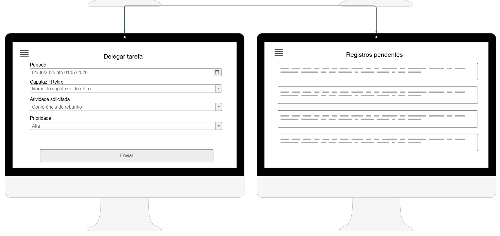
</a>
</p>
</div>

<p align="center">Fonte: Próprios autores (2026).</p>
</div>

<div align="center">
<p>Figura 15 - Wireframe Versão Desktop do Supervisor</p>
<p align="center">
<a href="https://www.inteli.edu.br/">
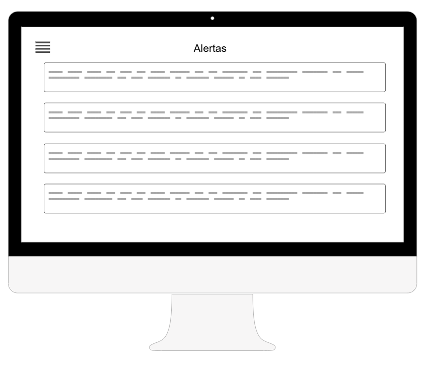
</a>
</p>
</div>

<p align="center">Fonte: Próprios autores (2026).</p>
</div>

### Gerente

&nbsp;&nbsp;&nbsp;&nbsp;As interfaces do gerente foram desenvolvidas com foco estratégico e gerencial, permitindo acompanhamento consolidado das operações da BRPEC. O fluxo inicial também contempla telas de login simplificadas para dispositivos mobile, organizadas de forma intuitiva para facilitar a navegação e o acesso rápido às funcionalidades do sistema.


**Versão Mobile:**

&nbsp;&nbsp;&nbsp;&nbsp;Na versão mobile, o dashboard principal apresenta indicadores gerais da fazenda, como quantidade de movimentações realizadas, tarefas pendentes, chamados abertos e informações consolidadas do rebanho. Além disso, a interface disponibiliza acesso rápido aos relatórios operacionais e à visualização de ocorrências recentes da fazenda.

&nbsp;&nbsp;&nbsp;&nbsp;As telas de relatórios permitem a aplicação de filtros por período, retiro e tipo de relatório, apresentando uma prévia visual das informações antes da exportação em planilha. Dessa forma, o gerente consegue acompanhar dados consolidados da operação pecuária e apoiar a tomada de decisão de maneira centralizada.


<div align="center">
<p>Figura 16 - Wireframe Versão Mobile do Gerente</p>
<p align="center">
<a href="https://www.inteli.edu.br/">

</a>
</p>
</div>

<p align="center">Fonte: Próprios autores (2026).</p>
</div>


<div align="center">
<p>Figura 17 - Wireframe Versão Mobile do Gerente</p>
<p align="center">
<a href="https://www.inteli.edu.br/">
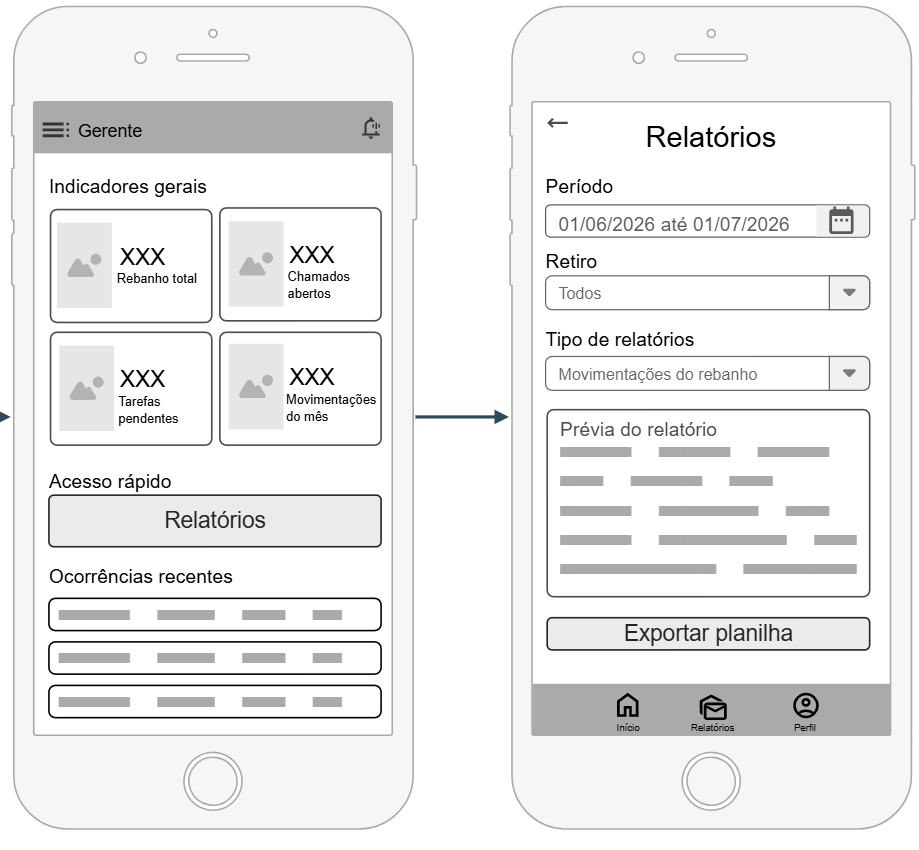
</a>
</p>
</div>

<p align="center">Fonte: Próprios autores (2026).</p>
</div>

&nbsp;&nbsp;&nbsp;&nbsp;Na versão desktop, as interfaces foram organizadas utilizando menus laterais, tabelas e áreas ampliadas de visualização, permitindo melhor acompanhamento dos relatórios operacionais, alertas e informações estratégicas da fazenda. O objetivo é proporcionar maior controle gerencial e facilitar análises administrativas mais detalhadas.


## <a name="c3.4"></a>3.4. Guia de estilos (sprint 3)

*Descreva aqui orientações gerais para o leitor sobre como utilizar os componentes do guia de estilos de sua solução*

### <a name="c3.4.1"></a>3.4.1 Cores

*Apresente aqui a paleta de cores, com seus códigos de aplicação e suas respectivas funções*

### <a name="c3.4.2"></a>3.4.2 Tipografia

*Apresente aqui a tipografia da solução, com famílias de fontes e suas respectivas funções*

### <a name="c3.4.3"></a>3.4.3 Iconografia e imagens 

*(esta subseção é opcional, caso não existam ícones e imagens, apague esta subseção)*

*posicione aqui imagens e textos contendo exemplos padronizados de ícones e imagens, com seus respectivos atributos de aplicação, utilizadas na solução*

## <a name="c3.5"></a>3.5 Protótipo de alta fidelidade (sprint 3)

*posicione aqui algumas imagens demonstrativas de seu protótipo de alta fidelidade e o link para acesso ao protótipo completo (mantenha o link sempre público para visualização)*

## <a name="c3.6"></a>3.6. Modelagem do banco de dados (sprints 2 e 4)

### <a name="c3.6.1"></a>3.6.1. Modelo Entidade-Relacionamento (ER) (sprint 2)

*Apresente o modelo ER conceitual com entidades, atributos e relacionamentos. Use notação consistente (Chen ou Crow's Foot — não misture).*

### <a name="c3.6.2"></a>3.6.2. Diagrama Entidade-Relacionamento (DER) (sprint 2)

*Posicione aqui o DER com cardinalidades explícitas em ambos os lados de cada relação e identificação de PK/FK. O DER deve ser coerente com o diagrama de classes (3.2.3).*

### <a name="c3.6.3"></a>3.6.3. Modelo Relacional e Modelo Físico (sprints 2 e 4)

**Modelo Relacional**

&nbsp;&nbsp;&nbsp;&nbsp;O modelo relacional foi construído com base no minimundo descrito na seção 3.1, que define as entidades, os perfis de usuário e os fluxos operacionais da BrPec Agropecuária S.A. A modelagem considera a estrutura hierárquica da operação ( composta por Capatazes, Supervisores e Gerentes) e o ciclo completo de dados: registros e tarefas em campo, sincronização, validação e consolidação para relatórios. Cada decisão estrutural do modelo buscou refletir diretamente os requisitos funcionais e as regras de negócio levantados junto ao parceiro.

 <p>Figura  – Modelo Relacional</p>
  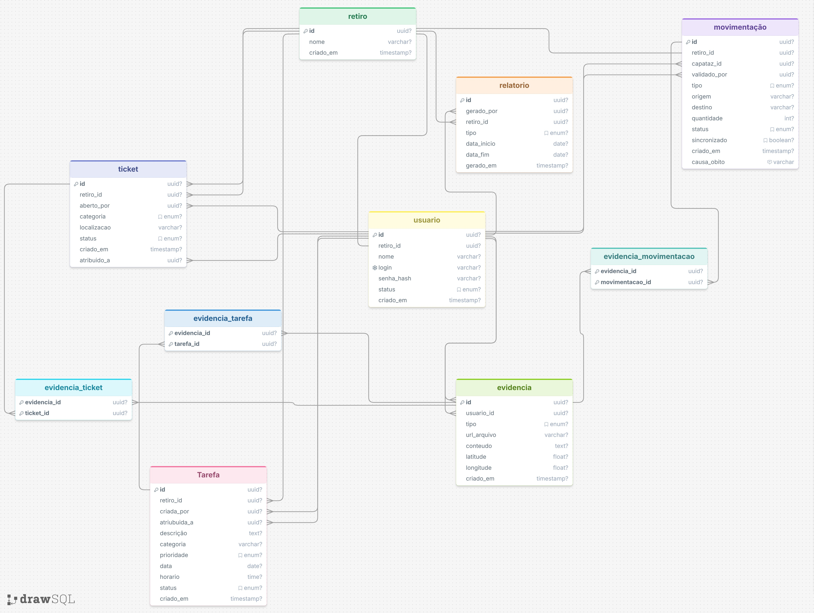
  <p align="center">Fonte: Próprios autores (2026).</p>
</div>

&nbsp;&nbsp;&nbsp;&nbsp;O modelo relacional foi desenvolvido utilizando a ferramenta drawSQL, tendo como banco de dados alvo o MySQL. As tabelas, colunas, tipos de dados e chaves primárias e estrangeiras foram definidos com base no minimundo descrito na seção 3.1, adotando-se o padrão de nomenclatura snake_case em todos os nomes de tabelas e campos, garantindo consistência e legibilidade ao longo do modelo.

&nbsp;&nbsp;&nbsp;&nbsp;Identificou-se a necessidade de resolver os relacionamentos N:N (muitos-para-muitos) entre a tabela evidencia e as tabelas movimentacao, tarefa e ticket. Para isso, foram criadas três tabelas intermediárias (evidencia_movimentacao, evidencia_tarefa e evidencia_ticket), cada uma contendo dois campos: a chave estrangeira da tabela evidencia e a chave estrangeira da entidade correspondente.

&nbsp;&nbsp;&nbsp;&nbsp;Optou-se por organizar o modelo de forma a evitar repetição desnecessária de informações entre as tabelas. Cada tabela armazena apenas os dados que lhe pertencem, referenciando informações de outras tabelas por meio de chaves estrangeiras. Por exemplo, o nome do retiro é armazenado exclusivamente na tabela retiro, sendo referenciado nas demais tabelas por meio do campo retiro_id.

&nbsp;&nbsp;&nbsp;&nbsp;As restrições de integridade foram aplicadas conforme as regras de negócio levantadas junto ao parceiro. O campo causa_obito da tabela movimentacao foi definido como nullable, uma vez que sua obrigatoriedade é condicional ao tipo de movimentação ser "morte", validação essa realizada na camada de backend conforme a RN01. Ao campo login da tabela usuario foi atribuída a restrição UNIQUE, impedindo cadastros duplicados. O campo sincronizado da tabela movimentacao recebeu valor padrão false, garantindo que todo registro criado em modo offline seja iniciado como não sincronizado, em conformidade com a RN07. Os campos que representam categorias ou estados fixos como tipo, status e prioridade foram definidos como ENUM, restringindo os valores aceitos àqueles previstos nas regras de negócio e impedindo inserções inválidas diretamente no banco.

&nbsp;&nbsp;&nbsp;&nbsp;A integridade referencial foi assegurada por meio de chaves estrangeiras em todas as relações do modelo, impedindo que qualquer registro referencie um identificador inexistente em outra tabela. O modelo físico completo, contendo o script DDL com os comandos CREATE TABLE e ALTER TABLE para definição das constraints e relacionamentos, é apresentado na sequência.

**Modelo Físico**

&nbsp;&nbsp;&nbsp;&nbsp;O modelo físico foi desenvolvido a partir do modelo relacional apresentado anteriormente, traduzindo as tabelas, campos e relacionamentos em um script DDL executável no MySQL. A seguir, são apresentados os comandos CREATE TABLE e ALTER TABLE utilizados para a criação das tabelas e a definição das constraints e chaves estrangeiras do banco de dados do AgroFlow.

```sql

--------------
Tabela: retiro
--------------

CREATE TABLE `retiro` (
    `id`        CHAR(36)     NOT NULL,
    `nome`      VARCHAR(255) NULL,
    `criado_em` TIMESTAMP    NULL,
    PRIMARY KEY (`id`)
);

---------------
Tabela: usuario
---------------

CREATE TABLE `usuario` (
    `id`         CHAR(36)                 NOT NULL,
    `retiro_id`  CHAR(36)                 NULL,
    `nome`       VARCHAR(255)             NULL,
    `login`      VARCHAR(255)             NULL,
    `senha_hash` VARCHAR(255)             NULL,
    `status`     ENUM('ativo', 'inativo') NULL,
    `criado_em`  TIMESTAMP                NULL,
    PRIMARY KEY (`id`)
);

ALTER TABLE `usuario`
    ADD UNIQUE `usuario_login_unique` (`login`);

ALTER TABLE `usuario`
    ADD CONSTRAINT `usuario_retiro_id_foreign`
    FOREIGN KEY (`retiro_id`) REFERENCES `retiro` (`id`);

--------------
Tabela: tarefa
--------------

CREATE TABLE `tarefa` (
    `id`          CHAR(36)                                                   NOT NULL,
    `retiro_id`   CHAR(36)                                                   NULL,
    `criada_por`  CHAR(36)                                                   NULL,
    `atribuida_a` CHAR(36)                                                   NULL,
    `descricao`   TEXT                                                       NULL,
    `categoria`   VARCHAR(255)                                               NULL,
    `prioridade`  ENUM('alta', 'media', 'baixa')                             NULL,
    `data`        DATE                                                       NULL,
    `horario`     TIME                                                       NULL,
    `status`      ENUM('pendente', 'em_andamento', 'concluida', 'cancelada') NULL,
    `criado_em`   TIMESTAMP                                                  NULL,
    PRIMARY KEY (`id`)
);

ALTER TABLE `tarefa`
    ADD CONSTRAINT `tarefa_retiro_id_foreign`
    FOREIGN KEY (`retiro_id`) REFERENCES `retiro` (`id`);

ALTER TABLE `tarefa`
    ADD CONSTRAINT `tarefa_criada_por_foreign`
    FOREIGN KEY (`criada_por`) REFERENCES `usuario` (`id`);

ALTER TABLE `tarefa`
    ADD CONSTRAINT `tarefa_atribuida_a_foreign`
    FOREIGN KEY (`atribuida_a`) REFERENCES `usuario` (`id`);

--------------------
Tabela: movimentacao
--------------------

CREATE TABLE `movimentacao` (
    `id`           CHAR(36)                                                        NOT NULL,
    `retiro_id`    CHAR(36)                                                        NULL,
    `capataz_id`   CHAR(36)                                                        NULL,
    `validado_por` CHAR(36)                                                        NULL,
    `tipo`         ENUM('nascimento', 'morte', 'transferencia', 'compra', 'venda') NULL,
    `origem`       VARCHAR(255)                                                    NULL,
    `destino`      VARCHAR(255)                                                    NULL,
    `quantidade`   INT                                                             NULL,
    `status`       ENUM('pendente', 'aprovado', 'rejeitado')                       NULL,
    `sincronizado` BOOLEAN                                                         NULL DEFAULT 0,
    `causa_obito`  VARCHAR(255)                                                    NULL,
    `criado_em`    TIMESTAMP                                                       NULL,
    PRIMARY KEY (`id`)
);

ALTER TABLE `movimentacao`
    ADD CONSTRAINT `movimentacao_retiro_id_foreign`
    FOREIGN KEY (`retiro_id`) REFERENCES `retiro` (`id`);

ALTER TABLE `movimentacao`
    ADD CONSTRAINT `movimentacao_capataz_id_foreign`
    FOREIGN KEY (`capataz_id`) REFERENCES `usuario` (`id`);

ALTER TABLE `movimentacao`
    ADD CONSTRAINT `movimentacao_validado_por_foreign`
    FOREIGN KEY (`validado_por`) REFERENCES `usuario` (`id`);

--------------
Tabela: ticket
--------------

CREATE TABLE `ticket` (
    `id`          CHAR(36)                                                                           NOT NULL,
    `retiro_id`   CHAR(36)                                                                           NULL,
    `aberto_por`  CHAR(36)                                                                           NULL,
    `atribuido_a` CHAR(36)                                                                           NULL,
    `categoria`   ENUM('cerca', 'hidraulica', 'eletrica', 'edificacao', 'abastecimento_agua', 'outro') NULL,
    `localizacao` VARCHAR(255)                                                                       NULL,
    `status`      ENUM('aberto', 'em_atendimento', 'resolvido', 'cancelado')                         NULL,
    `criado_em`   TIMESTAMP                                                                          NULL,
    PRIMARY KEY (`id`)
);

ALTER TABLE `ticket`
    ADD CONSTRAINT `ticket_retiro_id_foreign`
    FOREIGN KEY (`retiro_id`) REFERENCES `retiro` (`id`);

ALTER TABLE `ticket`
    ADD CONSTRAINT `ticket_aberto_por_foreign`
    FOREIGN KEY (`aberto_por`) REFERENCES `usuario` (`id`);

ALTER TABLE `ticket`
    ADD CONSTRAINT `ticket_atribuido_a_foreign`
    FOREIGN KEY (`atribuido_a`) REFERENCES `usuario` (`id`);

-----------------
Tabela: evidencia
-----------------

CREATE TABLE `evidencia` (
    `id`          CHAR(36)                          NOT NULL,
    `usuario_id`  CHAR(36)                          NULL,
    `tipo`        ENUM('foto', 'audio', 'mensagem') NULL,
    `url_arquivo` VARCHAR(255)                      NULL,
    `conteudo`    TEXT                              NULL,
    `latitude`    FLOAT(53)                         NULL,
    `longitude`   FLOAT(53)                         NULL,
    `criado_em`   TIMESTAMP                         NULL,
    PRIMARY KEY (`id`)
);

ALTER TABLE `evidencia`
    ADD CONSTRAINT `evidencia_usuario_id_foreign`
    FOREIGN KEY (`usuario_id`) REFERENCES `usuario` (`id`);

------------------------------
Tabela: evidencia_movimentacao
------------------------------

CREATE TABLE `evidencia_movimentacao` (
    `evidencia_id`    CHAR(36) NOT NULL,
    `movimentacao_id` CHAR(36) NOT NULL,
    PRIMARY KEY (`evidencia_id`, `movimentacao_id`)
);

ALTER TABLE `evidencia_movimentacao`
    ADD CONSTRAINT `evidencia_movimentacao_evidencia_id_foreign`
    FOREIGN KEY (`evidencia_id`) REFERENCES `evidencia` (`id`);

ALTER TABLE `evidencia_movimentacao`
    ADD CONSTRAINT `evidencia_movimentacao_movimentacao_id_foreign`
    FOREIGN KEY (`movimentacao_id`) REFERENCES `movimentacao` (`id`);

------------------------
Tabela: evidencia_tarefa
------------------------

CREATE TABLE `evidencia_tarefa` (
    `evidencia_id` CHAR(36) NOT NULL,
    `tarefa_id`    CHAR(36) NOT NULL,
    PRIMARY KEY (`evidencia_id`, `tarefa_id`)
);

ALTER TABLE `evidencia_tarefa`
    ADD CONSTRAINT `evidencia_tarefa_evidencia_id_foreign`
    FOREIGN KEY (`evidencia_id`) REFERENCES `evidencia` (`id`);

ALTER TABLE `evidencia_tarefa`
    ADD CONSTRAINT `evidencia_tarefa_tarefa_id_foreign`
    FOREIGN KEY (`tarefa_id`) REFERENCES `tarefa` (`id`);

-----------------------
Tabela: evidencia_ticket
------------------------

CREATE TABLE `evidencia_ticket` (
    `evidencia_id` CHAR(36) NOT NULL,
    `ticket_id`    CHAR(36) NOT NULL,
    PRIMARY KEY (`evidencia_id`, `ticket_id`)
);

ALTER TABLE `evidencia_ticket`
    ADD CONSTRAINT `evidencia_ticket_evidencia_id_foreign`
    FOREIGN KEY (`evidencia_id`) REFERENCES `evidencia` (`id`);

ALTER TABLE `evidencia_ticket`
    ADD CONSTRAINT `evidencia_ticket_ticket_id_foreign`
    FOREIGN KEY (`ticket_id`) REFERENCES `ticket` (`id`);

-----------------
Tabela: relatorio
-----------------

CREATE TABLE `relatorio` (
    `id`          CHAR(36)                                                  NOT NULL,
    `gerado_por`  CHAR(36)                                                  NULL,
    `retiro_id`   CHAR(36)                                                  NULL,
    `tipo`        ENUM('movimentacao', 'tarefas', 'tickets', 'consolidado') NULL,
    `data_inicio` DATE                                                      NULL,
    `data_fim`    DATE                                                      NULL,
    `url_arquivo` VARCHAR(255)                                              NULL,
    `gerado_em`   TIMESTAMP                                                 NULL,
    PRIMARY KEY (`id`)
);

ALTER TABLE `relatorio`
    ADD CONSTRAINT `relatorio_gerado_por_foreign`
    FOREIGN KEY (`gerado_por`) REFERENCES `usuario` (`id`);

ALTER TABLE `relatorio`
    ADD CONSTRAINT `relatorio_retiro_id_foreign`
    FOREIGN KEY (`retiro_id`) REFERENCES `retiro` (`id`);
```
&nbsp;&nbsp;&nbsp;&nbsp;Ao longo do desenvolvimento do modelo, algumas decisões técnicas foram tomadas com base nas regras de negócio e nos requisitos do sistema. Para os campos identificadores de todas as tabelas, optou-se pelo tipo CHAR(36), uma vez que o MySQL não possui suporte nativo ao tipo UUID — o CHAR(36) armazena o UUID no formato padrão de 36 caracteres, garantindo compatibilidade entre todas as tabelas do banco.

&nbsp;&nbsp;&nbsp;&nbsp;Os campos que representam categorias ou estados fixos, como tipo, status e prioridade, foram definidos como ENUM, restringindo os valores aceitos àqueles previstos nas regras de negócio e impedindo inserções inválidas diretamente no banco. O campo sincronizado da tabela movimentacao foi definido como BOOLEAN com valor padrão 0 (false), garantindo que todo registro criado em modo offline seja iniciado como não sincronizado, tornando-se 1 (true) apenas após a sincronização com o servidor, em conformidade com a RN07. Os campos latitude e longitude da tabela evidencia foram definidos como nullable, pois o georreferenciamento é exigido apenas para evidências do tipo foto, validação essa realizada no backend conforme a RN04. O campo criado_em, presente em todas as tabelas, utiliza o tipo TIMESTAMP, permitindo rastrear cronologicamente todas as operações realizadas no sistema.

&nbsp;&nbsp;&nbsp;&nbsp;A integridade referencial foi implementada por meio de FOREIGN KEY em todas as relações, utilizando ALTER TABLE após a criação das tabelas, padrão adotado pela ferramenta drawSQL. Esse padrão garante que nenhum registro possa referenciar um identificador inexistente em outra tabela, mantendo a consistência dos dados ao longo de todas as operações do sistema.


### <a name="c3.6.4"></a>3.6.4. Consultas SQL e lógica proposicional (sprint 2)

*posicione aqui uma lista de consultas SQL compostas, realizadas pelo back-end da aplicação web, com sua respectiva lógica proposicional, descrita conforme template abaixo. Lembre-se que para usar LaTeX em markdown, basta você colocar as expressões entre $ ou $$*

*Template de SQL + lógica proposicional*
#1 | ---
--- | ---
**Expressão SQL** | SELECT * FROM suppliers WHERE (state = 'California' AND supplier_id <> 900) OR (supplier_id = 100); 
**Proposições lógicas** | $A$: O estado é 'California' (state = 'California') <br> $B$: O ID do fornecedor não é 900 (supplier_id ≠ 900) <br> $C$: O ID do fornecedor é 100 (supplier_id = 100)
**Expressão lógica proposicional** | $(A \land B) \lor C$
**Tabela Verdade** | <table> <thead> <tr> <th>$A$</th> <th>$B$</th> <th>$C$</th> <th>$(A \land B)$</th> <th>$(A \land B) \lor C$</th> </tr> </thead> <tbody> <tr> <td>F</td> <td>F</td> <td>F</td> <td>F</td> <td>F</td> </tr> <tr> <td>F</td> <td>F</td> <td>V</td> <td>F</td> <td>V</td> </tr> <tr> <td>F</td> <td>V</td> <td>F</td> <td>F</td> <td>F</td> </tr> <tr> <td>F</td> <td>V</td> <td>V</td> <td>F</td> <td>V</td> </tr> <tr> <td>V</td> <td>F</td> <td>F</td> <td>F</td> <td>F</td> </tr> <tr> <td>V</td> <td>F</td> <td>V</td> <td>F</td> <td>V</td> </tr> <tr> <td>V</td> <td>V</td> <td>F</td> <td>V</td> <td>V</td> </tr> <tr> <td>V</td> <td>V</td> <td>V</td> <td>V</td> <td>V</td> </tr> </tbody> </table>

*Dica: edite a tabela verdade fora do markdown, para ter melhor controle*

## <a name="c3.7"></a>3.7. WebAPI e endpoints (sprints 3 e 4)

*Utilize um link para outra página de documentação contendo a descrição completa de cada endpoint. Ou descreva aqui cada endpoint criado para seu sistema.* 

*Cada endpoint deve conter endereço, método (GET, POST, PUT, PATCH, DELETE), header, body, formatos de response e os status codes possíveis (200, 201, 204, 400, 401, 403, 404, 409, 422, 500).*

## <a name="c3.8"></a>3.8. Autenticação, Autorização e Resiliência (sprint 5)

### <a name="c3.8.1"></a>3.8.1. Autenticação

*Descreva o fluxo de autenticação implementado: persistência de senha com hash bcrypt/argon2 (parâmetros de custo explícitos e justificados), validação de credenciais e criação de sessão. Senhas em texto plano no banco não são aceitas.*

### <a name="c3.8.2"></a>3.8.2. Controle de sessão

*Descreva o controle de sessão baseado em `session id` persistido em tabela própria, com expiração. Se optar por JWT, justifique a escolha explicando os trade-offs (stateless, não revogável, payload exposto).*

### <a name="c3.8.3"></a>3.8.3. Autorização

*Descreva as regras de autorização por rota e por operação, baseadas no perfil do usuário autenticado. A verificação deve ocorrer no backend — o frontend nunca é fonte de verdade para autorização.*

### <a name="c3.8.4"></a>3.8.4. Estratégias de Resiliência

*Descreva as estratégias aplicadas no tratamento de falhas de rede: timeout, retry com backoff exponencial, circuit breaker e idempotência em operações críticas (`PUT`, `DELETE`, operações de pagamento etc.).*

## <a name="c3.9"></a>3.9. Matriz de Rastreabilidade (RTM) (sprints 3 a 5)

*A RTM consolida a rastreabilidade completa do sistema. Um elo quebrado invalida toda a cadeia — mantenha-a atualizada a cada sprint. A partir da sprint 3 não deve haver lacunas nos fluxos centrais.*

| Persona | RF    | RN   | Endpoint    | Tela     | Teste | Evidência        |
|---------|-------|------|-------------|----------|-------|------------------|
| ...     | RF001 | RN01 | `/usuarios` | Cadastro | CT02  | print, log, relatório de cobertura |

# <a name="c4"></a>4. Desenvolvimento da Aplicação Web

## <a name="c4.1"></a>4.1. Primeira versão da aplicação web (sprint 3)

*Descreva e ilustre aqui o desenvolvimento da primeira versão do sistema web. Utilize prints de tela para ilustrar. Indique obrigatoriamente: (a) o que foi implementado, (b) o que não foi concluído, (c) dificuldades técnicas enfrentadas e próximos passos.*

## <a name="c4.2"></a>4.2. Segunda versão da aplicação web (sprint 4)

*Descreva e ilustre aqui o desenvolvimento da segunda versão do sistema web, com foco no que foi consolidado entre a primeira versão funcional e o sistema operacional integrado. Utilize prints de tela para ilustrar. Indique obrigatoriamente: (a) o que foi implementado, (b) o que não foi concluído, (c) dificuldades técnicas enfrentadas e próximos passos.*

## <a name="c4.3"></a>4.3. Versão final da aplicação web (sprint 5)

*Descreva e ilustre aqui o desenvolvimento da versão final do sistema web, com foco em refatorações, correções finais e na camada de autenticação/autorização entregue. Utilize prints de tela para ilustrar. Indique obrigatoriamente: (a) o que foi refinado ou adicionado desde a sprint 4, (b) pendências remanescentes, (c) dificuldades técnicas enfrentadas.*

# <a name="c5"></a>5. Testes

## <a name="c5.1"></a>5.1. Relatório de testes de integração de endpoints automatizados (sprint 4)

*Liste e descreva os testes automatizados dos endpoints criados e planejados para sua solução, implementados com **Jest**. Cubra as duas abordagens:*

- ***White-box*** *— testes unitários de Service que exercitam ramos internos, exceções e regras de negócio (conhecimento da implementação).*
- ***Black-box*** *— testes de integração dos endpoints via Jest + Supertest, verificando apenas o contrato HTTP (status, body, efeito observável), sem depender da implementação interna.*

*Posicione aqui também o relatório de cobertura de testes Jest se houver (através de link ou transcrito para estrutura markdown).*

## <a name="c5.2"></a>5.2. Testes de usabilidade (sprint 5)

### <a name="c5.2.1"></a>5.2.1. Relatório de testes de guerrilha

*Posicione aqui as tabelas com enunciados de tarefas, etapas e resultados de testes de usabilidade. Ou utilize um link para seu relatório de testes (mantenha o link sempre público para visualização).*

### <a name="c5.2.2"></a>5.2.2. Relatório de testes SUS (System Usability Scale)

*Posicione aqui o relatório dos testes SUS realizados.*

# <a name="c6"></a>6. Estudo de Mercado e Plano de Marketing (sprint 4)

## <a name="c6.1"></a>6.1 Resumo Executivo

*Preencher com até 300 palavras, sem necessidade de fonte*

*Apresente de forma clara e objetiva os principais destaques do projeto: oportunidades de mercado, diferenciais competitivos da aplicação web e os objetivos estratégicos pretendidos.*

## <a name="c6.2"></a>6.2 Análise de Mercado

*a) Visão Geral do Setor (até 250 palavras)*
*Contextualize o setor no qual a aplicação está inserida, considerando aspectos econômicos, tecnológicos e regulatórios. Utilize fontes confiáveis.*

*b) Tamanho e Crescimento do Mercado (até 250 palavras)*
*Apresente dados quantitativos sobre o tamanho atual e projeções de crescimento do mercado. Utilize fontes confiáveis.*

*c) Tendências de Mercado (até 300 palavras)*
*Identifique e analise tendências relevantes (tecnológicas, comportamentais e mercadológicas) que influenciam o setor. Utilize fontes confiáveis.*

## <a name="c6.3"></a>6.3 Análise da Concorrência

*a) Principais Concorrentes (até 250 palavras)*
*Liste os concorrentes diretos e indiretos, destacando suas principais características e posicionamento no mercado.*

*b) Vantagens Competitivas da Aplicação Web (até 250 palavras)*
*Descreva os diferenciais da sua aplicação em relação aos concorrentes, sem necessidade de citação de fontes.*


## <a name="c6.4"></a>6.4 Público-Alvo

*a) Segmentação de Mercado (até 250 palavras)*
Descreva os principais segmentos de mercado a serem atendidos pela aplicação. Utilize bases de dados e fontes confiáveis.*

*b) Perfil do Público-Alvo (até 250 palavras)*
*Caracterize o público-alvo com dados demográficos, psicográficos e comportamentais, incluindo necessidades específicas. Utilize fontes obrigatórias.*


## <a name="c6.5"></a>6.5 Posicionamento

*a) Proposta de Valor Única (até 250 palavras)*
*Defina de maneira clara o que torna a sua aplicação única e valiosa para o mercado.*

*b) Estratégia de Diferenciação (até 250 palavras)*
*Explique como sua aplicação se destacará da concorrência, evidenciando a lógica por trás do posicionamento.*

## <a name="c6.6"></a>6.6 Estratégia de Marketing 

*a) Produto/Serviço (até 200 palavras)*
*Descreva as funcionalidades, benefícios e diferenciais da aplicação*

*b) Preço (até 200 palavras)*
*Explique o modelo de precificação adotado e justifique com base nas análises anteriores.*

*c) Praça (Distribuição) (até 200 palavras)*
*Apresente os canais digitais utilizados para distribuir e entregar a aplicação ao público.*

*d) Promoção (até 200 palavras)*
*Descreva as estratégias digitais planejadas, como SEO, redes sociais, marketing de conteúdo e campanhas pagas.*

# <a name="c7"></a>7. Conclusões e trabalhos futuros (sprint 5)

*Escreva de que formas a solução da aplicação web atingiu os objetivos descritos na seção 2 deste documento. Indique pontos fortes e pontos a melhorar de maneira geral.*

*Relacione os pontos de melhorias evidenciados nos testes com planos de ações para serem implementadas. O grupo não precisa implementá-las, pode deixar registrado aqui o plano para ações futuras*

*Relacione também quaisquer outras ideias que o grupo tenha para melhorias futuras*

# <a name="c8"></a>8. Referências (sprints 1 a 5)

APROSOJA MS. Panorama da soja em Mato Grosso do Sul. Mato Grosso do Sul, 2024. Disponível em: https://aprosojams.org.br
. Acesso em: 30 abr. 2026.

BRASIL. Lei nº 12.651, de 25 de maio de 2012. Dispõe sobre a proteção da vegetação nativa (Código Florestal). Diário Oficial da União: seção 1, Brasília, DF, 28 maio 2012.

BRPEC AGROPECUÁRIA S.A. Informações institucionais e operacionais. Mato Grosso do Sul, 2026.

DE OLHO NOS RURALISTAS. Relatórios sobre ESG e agronegócio. 2025. Disponível em: https://deolhonosruralistas.com.br
. Acesso em: 30 abr. 2026.

ECONODATA. Dados empresariais da BRPec Agropecuária S.A. 2026. Disponível em: https://www.econodata.com.br
. Acesso em: 30 abr. 2026.

G4 EDUCAÇÃO. Canvas de Proposta de Valor: conceitos e aplicações. 2025. Disponível em: https://g4educacao.com
. Acesso em: 30 abr. 2026.

HARLEY, Aurora. Personas make users memorable for product team members. Nielsen Norman Group, 2015. Disponível em: https://www.nngroup.com/articles/personas-users/
. Acesso em: 30 abr. 2026.

JACOBSON, Ivar; SPENCE, Ian; DE MENDONÇA, R. Use Case 3.0: the guide to succeeding with use cases. 2024.

OSTERWALDER, Alexander. Value Proposition Design: How to Create Products and Services Customers Want. Hoboken: Wiley, 2014.

PMI – PROJECT MANAGEMENT INSTITUTE. A guide to the Project Management Body of Knowledge (PMBOK Guide). 7. ed. Newtown Square: PMI, 2021.

PORTER, Michael E. Competitive Strategy: techniques for analyzing industries and competitors. New York: Free Press, 1980.

PORTER, Michael E. The five competitive forces that shape strategy. Harvard Business Review, v. 86, n. 1, p. 78-93, jan. 2008.

COHN, Mike. User Stories Applied: for Agile Software Development. Boston: Addison-Wesley, 2004.

PATTON, Jeff. User Story Mapping: discover the whole story, build the right product. Sebastopol: O'Reilly Media, 2014.

PRESSMAN, Roger S.; MAXIM, Bruce R. Engenharia de Software: uma abordagem profissional. 9. ed. Porto Alegre: AMGH, 2020.

# <a name="c9"></a>Anexos

*Inclua aqui quaisquer complementos para seu projeto, como diagramas, imagens, tabelas etc. Organize em sub-tópicos utilizando headings menores (use ## ou ### para isso)*
