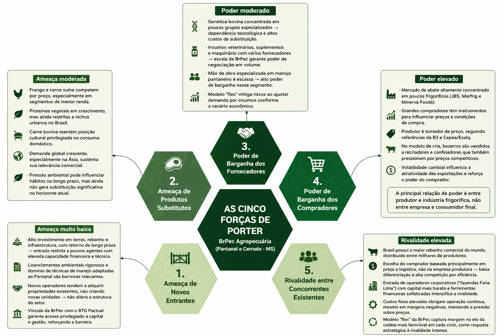

# WAD - Web Application Document - Módulo 2 - Inteli

**_Os trechos em itálico servem apenas como guia para o preenchimento da seção. Por esse motivo, não devem fazer parte da documentação final_**

## Nome do Grupo

#### Integrantes do grupo:

  <table>
    <tr>
      <td align="center"><a href="https://www.linkedin.com/in/ana-clara-silvestre-328706326/"> <b>Ana Clara da Silva Silvestre</b></a></td>
      <td align="center"><a href="https://www.linkedin.com/in/andr%C3%A9-fischer-de-carvalho-5588443b0/"> <b>André Fischer de Carvalho</b></a></td>
      <td align="center"><a href="https://www.linkedin.com/in/enzo-braga-heins-b706603b9/"> <b>Enzo Braga Heins</b></a></td>
      <td align="center"><a href="https://www.linkedin.com/in/fabiana-dias-souza/"> <b>Fabiana Dias de Souza</b></a></td>
       <td align="center"><a href="https://www.linkedin.com/in/jo%C3%A3o-glauco-fernandes-2292513a9//"> <b>João Glauco Fernandes Araújo de Freitas</b></a></td>
      <td align="center"><a href="https://www.linkedin.com/in/levi-correia-silveira-4900a4312/"> <b>Levi Correia Silveira</b></a></td>
      <td align="center"><a href="https://www.linkedin.com/in/matheus-augusto-corr%C3%AAa-santos-0bab03373/?locale=en"> <b>Matheus Augusto Corrêa Santos</b></a></td>
      <td align="center"><a href="https://www.linkedin.com/in/theo-moreda"> <b>Théo Pires Morêda</b></a></td>

  </table>

## Sumário

[1. Introdução](#c1)

 

[2. Visão Geral da Aplicação Web](#c2)

  
Subtópicos

  - [2.1. Escopo do Projeto](#c2.1)

    - [2.1.1. Modelo de 5 Forças de Porter](#c2.1.1)

    - [2.1.2. Análise SWOT da Instituição Parceira](#c2.1.2)

    - [2.1.3. Solução](#c2.1.3)

    - [2.1.4. Value Proposition Canvas](#c2.1.4)

    - [2.1.5. Matriz de Riscos do Projeto](#c2.1.5)

  - [2.2. Personas](#c2.2)

  - [2.3. User Stories](#c2.3)

 

[3. Projeto da Aplicação Web](#c3)

  
Subtópicos

  - [3.1. Requisitos do Sistema](#c3.1)

    - [3.1.1. Requisitos Funcionais](#c3.1.1)

    - [3.1.2. Regras de Negócio](#c3.1.2)

    - [3.1.3. Requisitos Não Funcionais — 8 Eixos ISO/IEC 25010](#c3.1.3)

    - [3.1.4. Matriz RF → RN → Endpoint](#c3.1.4)

  - [3.2. Arquitetura](#c3.2)

    - [3.2.1. Diagrama de Arquitetura](#c3.2.1)

    - [3.2.2. Diagrama de Casos de Uso](#c3.2.2)

    - [3.2.3. Diagrama de Classes do Domínio](#c3.2.3)

    - [3.2.4. Diagrama de Sequência UML](#c3.2.4)

    - [3.2.5. Diagrama de Atividades ou Estados](#c3.2.5)

    - [3.2.6. Diagrama de Implantação](#c3.2.6)

    - [3.2.7. Padrões de Projeto Aplicados](#c3.2.7)

  - [3.3. Wireframes](#c3.3)

  - [3.4. Guia de estilos](#c3.4)

    - [3.4.1. Cores](#c3.4.1)

    - [3.4.2. Tipografia](#c3.4.2)

    - [3.4.3. Iconografia e imagens](#c3.4.3)

  - [3.5. Protótipo de alta fidelidade](#c3.5)

  - [3.6. Modelagem do banco de dados](#c3.6)

    - [3.6.1. Modelo Entidade-Relacionamento (ER)](#c3.6.1)

    - [3.6.2. Diagrama Entidade-Relacionamento (DER)](#c3.6.2)

    - [3.6.3. Modelo Relacional e Modelo Físico](#c3.6.3)

    - [3.6.4. Consultas SQL e lógica proposicional](#c3.6.4)

  - [3.7. WebAPI e endpoints](#c3.7)

  - [3.8. Autenticação, Autorização e Resiliência](#c3.8)

    - [3.8.1. Autenticação](#c3.8.1)

    - [3.8.2. Controle de sessão](#c3.8.2)

    - [3.8.3. Autorização](#c3.8.3)

    - [3.8.4. Estratégias de Resiliência](#c3.8.4)

  - [3.9. Matriz de Rastreabilidade (RTM)](#c3.9)

 

[4. Desenvolvimento da Aplicação Web](#c4)

  
Subtópicos

  - [4.1. Primeira versão da aplicação web](#c4.1)

  - [4.2. Segunda versão da aplicação web](#c4.2)

  - [4.3. Versão final da aplicação web](#c4.3)

 

[5. Testes](#c5)

  
Subtópicos

  - [5.1. Relatório de testes de integração de endpoints automatizados](#c5.1)

  - [5.2. Testes de usabilidade](#c5.2)

    - [5.2.1. Relatório de testes de guerrilha](#c5.2.1)

    - [5.2.2. Relatório de testes SUS (System Usability Scale)](#c5.2.2)

 

[6. Estudo de Mercado e Plano de Marketing](#c6)

  
Subtópicos

  - [6.1. Resumo Executivo](#c6.1)

  - [6.2. Análise de Mercado](#c6.2)

  - [6.3. Análise da Concorrência](#c6.3)

  - [6.4. Público-Alvo](#c6.4)

  - [6.5. Posicionamento](#c6.5)

  - [6.6. Estratégia de Marketing](#c6.6)

 

[7. Conclusões e trabalhos futuros](#c7)

 

[8. Referências](#c8)

[Anexos](#c9)

 

# 1. Introdução (sprints 1 a 5)

No início do projeto, a **BrPec Agro-Pecuária S.A.** apresentou sua necessidade em aprimorar a forma de registro de cada animal em seu rebanho bovino. Atualmente, o fluxo de informações entre o campo e o escritório é prejudicado por **processos manuais** baseados em **"boletas" de papel**, o que acarreta lentidão na consolidação de dados e riscos de erros durante a **redigitação em planilhas**. Essa desconexão entre as áreas operacional e administrativa dificulta o acompanhamento estratégico em **tempo real** e a precisão do inventário pecuário.

Para solucionar essa problemática, uma **aplicação web centralizada** foi projetada para integrar a **gestão de cronogramas operacionais** e o **controle de movimentação bovina**. A solução permite a digitalização de **eventos zootécnicos** essenciais, como nascimentos, óbitos, compras, vendas e transferências entre retiros. O valor fundamental do produto reside na arquitetura preparada para **operação offline**, garantindo a integridade dos registros em áreas remotas e a **sincronização automática** de dados assim que a conexão for restabelecida.

A interface foi estruturada para atender a diferentes **níveis hierárquicos**: tarefas calendarizadas são atribuídas por **gerentes**, enquanto a execução é reportada por capatazes mediante o envio de **evidências digitais**, como fotos e áudios. Por fim, as informações são validadas por **coordenadores**, sendo os dados consolidados **exportados em formatos Excel ou CSV** para suporte à tomada de decisão. Com essa implementação, os processos manuais são eliminados, as falhas de comunicação são reduzidas e uma **integração efetiva** entre as frentes agrícola e pecuária é estabelecida.

# 2. Visão Geral da Aplicação Web (sprint 1)

## 2.1. Escopo do Projeto (sprints 1 e 4)

### 2.1.1. Modelo de 5 Forças de Porter 

# Análise das 5 Forças de Porter — BrPec Agropecuária

A estrutura competitiva do setor pecuário no Pantanal e Cerrado sul mato grossenses é marcada por intensividade em capital, dependência ambiental e inserção em um mercado global de commodities, o que reduz a capacidade de diferenciação e torna o produtor essencialmente tomador de preço.

## 5 Forças de Porter

Figura 1 - Autoria Própria (2026)

---

## 1. Ameaça de Novos Entrantes

O risco de novos entrantes é muito baixo. A pecuária de grande escala no Pantanal e Cerrado exige investimentos elevados em terras, rebanho e infraestrutura, com horizonte de retorno de longo prazo, o que restringe a entrada a poucos agentes com elevada capacidade financeira e técnica. A BrPec, com 132.660 hectares em Miranda e Corumbá, ilustra essa escala.

Além disso, a operação no Pantanal depende de licenciamentos ambientais rigorosos e domínio de técnicas de manejo adaptadas ao bioma. Novos operadores tendem a adquirir propriedades existentes em vez de criar novas unidades, o que não altera substancialmente a estrutura do setor. O vínculo da BrPec com o BTG Pactual reforça essa barreira ao conferir acesso privilegiado a capital e gestão.

---

## 2. Ameaça de Produtos Substitutos

O risco de substituição é moderado. Frango e carne suína competem por preço, especialmente em segmentos de menor renda, e o crescimento das proteínas vegetais representa uma tendência a ser monitorada, embora ainda restrita a nichos urbanos no Brasil.

Por outro lado, a carne bovina mantém posição cultural privilegiada no consumo doméstico, e a demanda global crescente, sobretudo nos mercados asiáticos, sustenta sua relevância comercial. A pressão ambiental pode influenciar hábitos no longo prazo, mas no horizonte atual ainda não se traduz em substituição significativa.

---

## 3. Poder de Barganha dos Fornecedores

O poder de barganha dos fornecedores é moderado, com variações por segmento. A genética bovina de alta qualidade está concentrada em poucos grupos especializados, o que aumenta a dependência tecnológica e eleva os custos de substituição ao longo do ciclo produtivo.

Em contrapartida, insumos veterinários, suplementos e maquinário contam com diversos fornecedores, e a escala da BrPec confere poder de negociação em compras de volume. Contudo, a mão de obra especializada em manejo pantaneiro é escassa e de difícil substituição, elevando o poder de barganha nesse segmento. O modelo "flex" da empresa funciona como mecanismo de mitigação ao ajustar a demanda por insumos conforme o cenário econômico.

---

## 4. Poder de Barganha dos Compradores

O poder de barganha dos compradores é elevado e constitui uma das forças mais relevantes para a BrPec. O mercado de abate é altamente concentrado em poucos grandes frigoríficos JBS, Marfrig e Minerva Foods, que possuem instrumentos diretos para influenciar preços e condições de compra. O produtor é tomador de preço, seguindo referências definidas pela B3 e pelo Cepea/Esalq.

Essa dinâmica se intensifica no modelo de cria adotado pela BrPec, no qual os bezerros são vendidos a recriadores e confinadores que também pressionam por preços competitivos. A volatilidade cambial agrava o cenário ao influenciar a atratividade das exportações. Assim, a principal relação de poder se estabelece entre produtor e indústria frigorífica, não entre empresa e consumidor final.

---

## 5. Rivalidade entre Concorrentes Existentes

A rivalidade entre concorrentes é elevada. O Brasil possui o maior rebanho comercial do mundo, distribuído entre milhares de produtores, e a escolha do comprador é condicionada primariamente ao preço e à logística, não à empresa responsável pela produção. Isso reduz a diferenciação e intensifica a competição por eficiência operacional.

A rivalidade se acentua com a entrada de operadores corporativos ligados ao mercado financeiro as chamadas "fazendas Faria Lima", que acessam capital a custo mais baixo e utilizam ferramentas financeiras sofisticadas. Os custos fixos elevados forçam operação contínua mesmo em margens negativas, mantendo a pressão sobre preços. O modelo "flex" da BrPec representa resposta estratégica direta a essa intensidade competitiva, ao capturar margem no elo da cadeia mais favorável em cada ciclo.

### 2.1.2. Análise SWOT da Instituição Parceira (sprint 1)

A análise SWOT (ou FOFA) é uma ferramenta de planejamento estratégico utilizada para avaliar fatores internos e externos que impactam o desempenho organizacional, sendo estruturada em forças, fraquezas, oportunidades e ameaças (PORTER, 1980). Com base nisso, realizou-se a análise SWOT da BRPec Agropecuária S.A., considerando seu contexto operacional, financeiro e de mercado.

Figura 1 - Análise de SWOT

Fonte: Próprios autores (2026).

**FORÇAS**

A BRPec apresenta vantagens competitivas relevantes, destacando-se pela integração entre agricultura e pecuária, que permite redução de custos e maior eficiência operacional (ECONODATA, 2026). Sua grande escala produtiva contribui para ganhos de produtividade e diluição de riscos, enquanto o suporte financeiro do BTG Pactual amplia o acesso a crédito e instrumentos financeiros. Além disso, sua localização estratégica, com acesso a diferentes modais logísticos, favorece o escoamento da produção e a inserção em mercados relevantes (BRPEC, 2026).

**FRAQUEZAS:** 

Por outro lado, a dependência das decisões estratégicas do BTG Pactual, empresa controladora da BRPEC, pode limitar a autonomia da organização. A complexidade operacional, característica de operações de grande escala, exige elevado nível de gestão e controle, além de envolver forte dependência de mão de obra operacional, devido ao grande número de trabalhadores, aos custos associados e às dificuldades de gestão em áreas remotas. Soma-se a isso a exposição a riscos ambientais e regulatórios, que podem gerar impactos reputacionais e financeiros, especialmente diante das exigências do Código Florestal (BRASIL, 2012). 

**OPORTUNIDADES:**

No ambiente externo, observa-se um cenário favorável à expansão, impulsionado pela crescente demanda global por proteína animal e pela valorização de práticas sustentáveis. Nesse contexto, iniciativas ligadas a ESG e créditos de carbono surgem como potenciais fontes de geração de valor (DE OLHO NOS RURALISTAS, 2025). Além disso, o avanço da fronteira agrícola e o crescimento projetado da produção de soja no Mato Grosso do Sul ampliam as possibilidades de expansão das áreas produtivas, aumento da oferta de insumos para alimentação animal e maior integração entre agricultura e pecuária, fortalecendo a eficiência e a escala das operações da empresa (APROSOJA MS, 2024).

**AMEAÇAS:**

Em contrapartida, a BRPec está inserida em um ambiente de crescente rigor regulatório, especialmente no que se refere às questões ambientais (BRASIL, 2012). A volatilidade climática, particularmente em regiões como o Pantanal, pode impactar diretamente a produtividade. Adicionalmente, a oscilação nos preços de commodities e o aumento dos custos operacionais representam riscos à rentabilidade, exigindo estratégias robustas de gestão de risco e eficiência operacional para garantir sustentabilidade no longo prazo (PORTER, 1980).

### 2.1.3. Solução

*1. Problema a ser resolvido*

Ao sair do retiro e seguir para os campos da fazenda, os capatazes precisam registrar todas as informações em papel, devido à ausência de uma ferramenta que funcione offline. Isso gera excesso de trabalho na transcrição posterior para a planilha digital e aumenta o risco de perda ou inconsistência de dados. Além disso, como não há um formato fixo, certas informações podem deixar de ser anotadas, como a causa da morte de um boi.

*2. Dados disponíveis*

Não se aplica.

*3. Solução proposta*

 Propusemos desenvolver uma aplicação web com funcionamento offline que, ao restabelecer a conexão com a internet quando o capataz chegar ao retiro, envia automaticamente as informações registradas para a planilha que será utilizada para armazenar dados sobre nascimento, morte, transferência etc., eliminando a dependência de anotações em papel e da transcrição manual.

*4. Forma de utilização da solução*

A aplicação será utilizada pelos capatazes em campo, fora do retiro. As informações serão inseridas e armazenadas localmente no celular enquanto o dispositivo estiver offline e, ao se conectar à internet, serão sincronizadas automaticamente com a base central de dados, otimizando o trabalho dos capatazes ao eliminar a necessidade de transcrição manual para a planilha.

*5. Benefícios esperados*

Os benefícios visados incluem a agilização da coleta e do processamento de dados, com a redução do trabalho manual de anotação em papel e da posterior transcrição em planilhas no retiro. Além disso, a solução facilita a conciliação de informações entre diferentes retiros, otimizando a comunicação e a integração entre eles, o que torna as operações mais coordenadas e reduz os riscos de erros ou perda de dados.

*6. Critério de sucesso e como será avaliado*

Será considerado sucesso se a interface for simples e compreensível por qualquer público, sem complicações no uso, garantindo agilidade e redução significativa do tempo atualmente gasto para inserir as informações na base central de dados. É necessário que o público sem repertório digital também seja capaz de usar a aplicação web sem dificuldades, pois se trata de maior parte de nosso público alvo.

### 2.1.4. Value Proposition Canvas (sprint 1)

&nbsp;&nbsp;&nbsp;&nbsp;Segundo Osterwalder (2011), a ferramenta Canvas de Proposta de Valor (CPV) é utilizada estrategicamente para mapear e validar se a proposta de valor de um produto ou serviço se adequa às necessidades, dores e expectativas dos clientes. Essa ferramenta permite compreender a relação entre o que a empresa oferece e o que o cliente busca, facilitando a criação de soluções eficazes e relevantes. Assim, esse recurso foi utilizado no presente projeto a fim de apresentar a construção da proposta de valor e o diagnóstico dos problemas identificados a partir das demandas da BRPec Agropecuária S.A (Conforme a figura 2).

Figura 2 - Canvas Proposta de Valor

Fonte: Próprios autores (2026).

---

#### Perfil do Cliente

##### Tarefas do Cliente

&nbsp;&nbsp;&nbsp;&nbsp;Nas tarefas do cliente, são delimitadas as tarefas que um cliente está tentando fazer, especialmente antes de utilizar uma nova solução proposta por uma determinada organização (G4 EDUCAÇÃO, 2025). Com isso, a equipe identificou as seguintes tarefas do cliente:

- Controlar a movimentação do rebanho bovino (nascimentos, mortes, compras, vendas e transferências entre retiros);
- Consolidar dados operacionais para subsidiar decisões estratégicas de negócio;
- Gerenciar e acompanhar tarefas diárias de campo.

##### Dores

&nbsp;&nbsp;&nbsp;&nbsp;Na seção de dores do Canvas Proposta de Valor, são adicionadas as frustrações que o cliente sofre ao tentar realizar determinada tarefa (G4 EDUCAÇÃO, 2025). Desse modo, foram elencadas as seguintes dores do cliente:

- Dependência de processos manuais e anotações em papel (boletas), gerando retrabalho de redigitação em planilhas;
- Lentidão na comunicação entre campo e escritório, dependendo de repasse humano para atualizar informações;
- Risco de falhas e inconsistências na transcrição de dados operacionais e zootécnicos;
- Falta de visibilidade agilizada sobre o status das atividades e do rebanho.

##### Ganhos

&nbsp;&nbsp;&nbsp;&nbsp;Na seção de ganhos do Canvas Proposta de Valor, são colocados os resultados que o cliente aspira ter quando realiza uma tarefa (G4 EDUCAÇÃO, 2025). Assim, foram identificados os seguintes ganhos do cliente:

- Registro digital direto na fonte, eliminando a redigitação manual;
- Acesso a dados consolidados e atualizados do rebanho para tomada de decisão estratégica;
- Maior rastreabilidade e transparência nas operações de campo;
- Agilidade no acompanhamento de tarefas e movimentações diariamente.

---

#### Proposta de Valor

##### Produtos e Serviços

&nbsp;&nbsp;&nbsp;&nbsp;A seção de produtos e serviços de um Canvas Proposta de Valor se refere aos recursos oferecidos por uma determinada organização (G4 EDUCAÇÃO, 2025). Dessa forma, é possível mencionar os seguintes no que se refere à solução proposta pela equipe:

- Aplicação web com interface de campo para o Capataz registrar digitalmente eventos do rebanho (nascimentos, mortes, compras, vendas e transferências);
- Interface de calendarização e monitoramento de tarefas para o Gerente;
- Funcionalidade offline com sincronização automática ao restabelecer conexão com a internet.

##### Criadores de Ganho

&nbsp;&nbsp;&nbsp;&nbsp;A seção de criadores de ganhos de um Canvas Proposta de Valor diz respeito a como os produtos e serviços de uma determinada organização acarretam os resultados que o cliente espera (G4 EDUCAÇÃO, 2025). A partir disso, foram elencados os seguintes criadores de ganho:

- Centraliza os registros do rebanho diariamente, substituindo anotações dispersas em papel;
- Permite ao Gerente acompanhar o status das tarefas de campo sem depender de repasse humano;
- Registra a identificação do usuário em cada ação, aumentando a rastreabilidade das operações.

##### Aliviam as Dores

&nbsp;&nbsp;&nbsp;&nbsp;A seção de aliviadores de dor de um Canvas Proposta de Valor mostra de qual maneira os produtos e serviços propostos por uma organização tratam as dores do cliente (G4 EDUCAÇÃO, 2025). Por conseguinte, foram elaborados os seguintes aliviadores de dor:

- Elimina o uso de boletas de papel ao digitalizar o registro de movimentações diretamente no campo;
- Reduz o retrabalho de redigitação ao sincronizar automaticamente os dados com o servidor;
- Minimiza falhas de transcrição ao padronizar a entrada de dados na aplicação;
- Garante operação contínua em campo mesmo sem internet via modo offline.

### 2.1.5. Matriz de Riscos do Projeto (sprint 1)

A matriz de risco é uma ferramenta utilizada para identificar, analisar e classificar os riscos de um projeto, permitindo compreender tanto as ameaças (riscos negativos) quanto às oportunidades (riscos positivos) que devem ser priorizadas ao longo do seu desenvolvimento (PMI, 2021). Dessa forma, foi elaborada a matriz de risco do projeto BRPEC, conforme apresentado na Figura 3.

Figura 3 – Matriz De Risco.
 

 Fonte: Próprios autores (2026).

**Planos de ação, impacto e probabilidade**

Em linhas gerais, um plano de ação consiste em um conjunto de medidas definidas para lidar com os riscos identificados, estando diretamente relacionado à matriz de riscos, com o objetivo de potencializar oportunidades e mitigar ameaças ao longo do projeto (PMI, 2021). Dessa forma, foram elaborados planos de ação referentes aos riscos apresentados na matriz de risco do projeto BRPEC (conforme os quadros 1 e 2). Além disso, foram considerados os impactos e as probabilidades de cada risco, uma vez que são fundamentais para sua análise e acompanhamento durante o desenvolvimento do projeto. 

Quadro 1 – Plano de ação para as ameaças.
 

| Ameaça                                                   | Plano de ação                                                                    | Probabilidade | Impacto    |
| -------------------------------------------------------- | -------------------------------------------------------------------------------- | ------------- | ---------- |
| Ajustes de escopo ao longo do projeto                    | Validar os requisitos no início de cada sprint e registrar alterações no backlog | 70%           | Moderado   |
| Dependência de testes em ambiente real de campo          | Criar cenários simulados para testes antes da validação em campo                 | 50%           | Alto       |
| Retrabalho por ajustes de requisitos ao longo do projeto | Realizar alinhamentos frequentes com o parceiro antes da implementação           | 30%           | Moderado   |
| Problemas de comunicação interna                         | Manter reuniões periódicas e alinhamentos constantes durante as sprints          | 30%           | Muito alto |
| Desalinhamentos pontuais na definição de tarefas         | Definir responsáveis e critérios de aceite no início de cada sprint              | 30%           | Baixo      |

Fonte: Próprios autores (2026).
 

Quadro 2 – Plano de ação para as oportunidades.
 

| Oportunidade                                        | Plano de ação                                                                    | Probabilidade | Impacto    |
| --------------------------------------------------- | -------------------------------------------------------------------------------- | ------------- | ---------- |
| Parceiro engajado com o projeto                     | Manter contato frequente e apresentar entregas parciais para validação           | 90%           | Muito alto |
| Testes contínuos durante o desenvolvimento          | Realizar testes a cada funcionalidade desenvolvida                               | 70%           | Muito alto |
| Validação frequente das funcionalidades             | Validar as funcionalidades ao final de cada sprint com o parceiro                | 70%           | Alto       |
| Melhoria na rastreabilidade das atividades no campo | Estruturar os registros no sistema e garantir o preenchimento adequado dos dados | 50%           | Alto       |
| Evolução do sistema com base em feedback prático    | Coletar feedback após cada entrega e priorizar melhorias no backlog              | 50%           | Moderado   |

Fonte: Próprios autores (2026).
 

## 2.2. Personas (sprint 1)

*Posicione aqui suas Personas em forma de texto markdown com imagens, ou como imagem de template preenchido. Atualize esta seção ao longo do módulo se necessário.*

## 2.3. User Stories (sprints 1 a 5)

*Posicione aqui a lista de User Stories levantadas para o projeto. Siga o template de User Stories e utilize a mesma referência USXX no roadmap de seu quadro Kanban. Indique todas as User Stories mapeadas, mesmo aquelas que não forem implementadas ao longo do projeto. Não se esqueça de explicar o INVEST das 5 User Stories prioritárias*

*ATUALIZE ESTA SEÇÃO SEMPRE QUE ALGUMA DEMANDA MUDAR EM SEU PROJETO*

| Identificação | US01 |
| - | - |
| Persona | Daniel Carvalho |
| User Story | Como capataz, posso registrar movimentações do rebanho, para substituir o uso de boletas em papel. |
| Critério de aceite 1 | CR1: Dado que o usuário acessa o formulário, quando preenche os campos obrigatórios, então o sistema permite o registro. |
| Critério de aceite 2 | CR2: Dado que há campos obrigatórios vazios, quando tenta salvar, então o sistema impede o envio. |
| Critério de aceite 3 | CR3: Dado que não há conexão, quando registra, então o dado é salvo localmente. |
| Critérios INVEST | 
Independente: A funcionalidade pode ser desenvolvida de forma isolada, sem depender de outros módulos.
 
Negociável: Os campos do formulário podem ser ajustados conforme necessidade.
 
Valorosa: Elimina o uso de boletas em papel, reduzindo erros e retrabalho.
 
Estimável: Possui escopo claro, envolvendo formulário e validação.
 
Pequena: Restrita ao registro de movimentações.
 
Testável: Pode ser validada pelo preenchimento e salvamento correto dos dados.
 |

| Identificação | US02 |
| - | - |
| Persona | Daniel Carvalho |
| User Story | Como capataz, posso usar o sistema offline, para registrar dados sem internet. |
| Critério de aceite 1 | CR1: Dado que não há conexão, quando acessa o sistema, então as funcionalidades principais permanecem disponíveis. |
| Critério de aceite 2 | CR2: Dado que registra dados offline, quando salva, então o sistema armazena localmente. |
| Critério de aceite 3 | CR3: Dado que a conexão retorna, quando o sistema detecta internet, então os dados são sincronizados automaticamente. |
| Critérios INVEST | 
Independente: Pode ser implementada sem depender de outros módulos além do armazenamento local.
 
Negociável: A estratégia de sincronização pode ser ajustada conforme decisão técnica.
 
Valorosa: Permite o uso do sistema em campo sem acesso à internet.
 
Estimável: O fluxo offline e sincronização está claramente definido.
 
Pequena: Pode ser implementada inicialmente para funções essenciais.
 
Testável: Pode ser validada simulando ausência e retorno de conexão.
 |

*Template de User Story*
Identificação | USXX (troque XX por numeração ordenada das User Stories)
--- | ---
Persona | nome da Persona
User Story | "como (papel/perfil), posso (ação/meta), para (benefício/razão)"
Critério de aceite 1 | CR1: descrever cenário + testes de aceite
Critério de aceite 2 | CR2: descrever cenário + testes de aceite
Critério de aceite ... | CR...
Critérios INVEST | *(Por que é Independente? Por que é Negociável? Por que é Valorosa? Por que é Estimável? Por que é Pequena? Por que é Testável?)*

*Template de User Story*
Identificação | USXX (troque XX por numeração ordenada das User Stories)
--- | ---
Persona | nome da Persona
User Story | "como (papel/perfil), posso (ação/meta), para (benefício/razão)"
Critério de aceite 1 | CR1: descrever cenário + testes de aceite
Critério de aceite 2 | CR2: descrever cenário + testes de aceite
Critério de aceite ... | CR...
Critérios INVEST | *(Por que é Independente? Por que é Negociável? Por que é Valorosa? Por que é Estimável? Por que é Pequena? Por que é Testável?)*

*Template de User Story*
Identificação | USXX (troque XX por numeração ordenada das User Stories)
--- | ---
Persona | nome da Persona
User Story | "como (papel/perfil), posso (ação/meta), para (benefício/razão)"
Critério de aceite 1 | CR1: descrever cenário + testes de aceite
Critério de aceite 2 | CR2: descrever cenário + testes de aceite
Critério de aceite ... | CR...
Critérios INVEST | *(Por que é Independente? Por que é Negociável? Por que é Valorosa? Por que é Estimável? Por que é Pequena? Por que é Testável?)*

*Template de User Story*
Identificação | USXX (troque XX por numeração ordenada das User Stories)
--- | ---
Persona | nome da Persona
User Story | "como (papel/perfil), posso (ação/meta), para (benefício/razão)"
Critério de aceite 1 | CR1: descrever cenário + testes de aceite
Critério de aceite 2 | CR2: descrever cenário + testes de aceite
Critério de aceite ... | CR...
Critérios INVEST | *(Por que é Independente? Por que é Negociável? Por que é Valorosa? Por que é Estimável? Por que é Pequena? Por que é Testável?)*

*Template de User Story*
Identificação | USXX (troque XX por numeração ordenada das User Stories)
--- | ---
Persona | nome da Persona
User Story | "como (papel/perfil), posso (ação/meta), para (benefício/razão)"
Critério de aceite 1 | CR1: descrever cenário + testes de aceite
Critério de aceite 2 | CR2: descrever cenário + testes de aceite
Critério de aceite ... | CR...
Critérios INVEST | *(Por que é Independente? Por que é Negociável? Por que é Valorosa? Por que é Estimável? Por que é Pequena? Por que é Testável?)*

*Template de User Story*
Identificação | USXX (troque XX por numeração ordenada das User Stories)
--- | ---
Persona | nome da Persona
User Story | "como (papel/perfil), posso (ação/meta), para (benefício/razão)"
Critério de aceite 1 | CR1: descrever cenário + testes de aceite
Critério de aceite 2 | CR2: descrever cenário + testes de aceite
Critério de aceite ... | CR...
Critérios INVEST | *(Por que é Independente? Por que é Negociável? Por que é Valorosa? Por que é Estimável? Por que é Pequena? Por que é Testável?)*

*Template de User Story*
Identificação | USXX (troque XX por numeração ordenada das User Stories)
--- | ---
Persona | nome da Persona
User Story | "como (papel/perfil), posso (ação/meta), para (benefício/razão)"
Critério de aceite 1 | CR1: descrever cenário + testes de aceite
Critério de aceite 2 | CR2: descrever cenário + testes de aceite
Critério de aceite ... | CR...
Critérios INVEST | *(Por que é Independente? Por que é Negociável? Por que é Valorosa? Por que é Estimável? Por que é Pequena? Por que é Testável?)*

*Template de User Story*
Identificação | USXX (troque XX por numeração ordenada das User Stories)
--- | ---
Persona | nome da Persona
User Story | "como (papel/perfil), posso (ação/meta), para (benefício/razão)"
Critério de aceite 1 | CR1: descrever cenário + testes de aceite
Critério de aceite 2 | CR2: descrever cenário + testes de aceite
Critério de aceite ... | CR...
Critérios INVEST | *(Por que é Independente? Por que é Negociável? Por que é Valorosa? Por que é Estimável? Por que é Pequena? Por que é Testável?)*

# 3. Projeto da Aplicação Web (sprints 1 a 5)

## 3.1. Requisitos do Sistema (sprints 1 a 5)

Os requisitos do sistema representam o ponto de partida para tudo que será construído, estabelecendo um entendimento comum entre nossa equipe e o parceiro sobre o que a aplicação precisa ser, como deve se comportar e sob quais critérios será testada e aprovada.

Eles estão organizados em duas categorias complementares, os requisitos funcionais, que descrevem o que o sistema deve fazer, como o registro de movimentações, o controle de acesso por perfil e a operação offline e os requisitos não funcionais, que definem a qualidade com que essas funcionalidades devem ser entregues, abrangendo desempenho, segurança, confiabilidade e usabilidade.

Para garantir objetividade na avaliação dessa qualidade, os requisitos não funcionais foram estruturados com base na norma ISO/IEC 25010. Todo o conteúdo desta seção foi levantado junto ao parceiro BrPec Agropecuária, considerando a realidade operacional dos retiros e o perfil dos usuários finais.

### 3.1.1. Requisitos Funcionais (sprint 1, refinar até sprint 5)

| ID    | Descrição | Prioridade | Status       |
|-------|-----------|------------|--------------|
| RF001 | O sistema deve permitir o registro de movimentações do rebanho (nascimento, morte, transferência, compra e venda), com campos obrigatórios de origem, destino, quantidade, estágio da vida e causa do óbito.  | Alta       | Planejado |
| RF002 | O sistema deve permitir a criação e atribuição de tarefas a usuários específicos, com data, horário, prioridade e categoria.  | Alta      | Planejado    |
| RF003 | O sistema deve funcionar de forma off-line e on-line, armazenando os dados localmente e sincronizando automaticamente com o servidor ao restabelecer conexão com a internet.  | Alta  | Planejado |
| RF004 | O sistema deve permitir o anexo de evidências às tarefas e movimentações, incluindo foto georreferenciada, áudios e mensagens escritas. | Alta  | Planejado |
| RF005 | O sistema deve identificar o usuário por meio de um processo simples, intuitivo e de fácil compreensão. | Alta  | Planejado |
| RF006 | O sistema deve permitir que o Supervisor visualize e valide tarefas e movimentações registradas pelos Capatazes.  | Média | Planejado |
| RF007 | O sistema deve gerar relatórios semanais e mensais de movimentação do rebanho e de tarefas, com exportação em formato de planilha.  | Média | Planejado |
| RF008 | O sistema deve disponibilizar um ticket de chamados de infraestrutura, permitindo que Capatazes abram chamados para a equipe de infraestrutura e que Supervisores atribuam chamados aos Capatazes.  | Média | Planejado |

### 3.1.2. Regras de Negócio (sprint 1, refinar até sprint 5)

*Numere e redija as RN de forma implementável e testável. Toda RN deve ter pelo menos um teste automatizado associado a partir da sprint 3.*

| ID   | Descrição | RF associado |
|------|-----------|--------------|
| RN01 | O sistema deve bloquear o envio de qualquer movimentação de rebanho caso os campos obrigatórios (origem, destino, quantidade e estágio da vida) estejam em branco. Se a movimentação for do tipo "morte", o campo "causa do óbito" também passa a ser estritamente obrigatório. | RF001 |
| RN02 | A criação de uma nova tarefa no sistema deve falhar e retornar um erro de validação caso não contenha o preenchimento simultâneo de: usuário atribuído, data, horário, prioridade e categoria. | RF002 |
| RN03 | Durante a operação em modo off-line, os dados devem ser salvos no armazenamento local do dispositivo. A sincronização (envio dos dados para o servidor) só deve ser disparada automaticamente quando o sistema detectar um status HTTP válido de conexão restabelecida. | RF003 |
| RN04 | Para a anexação de fotos como evidência, o sistema deve validar se o arquivo de imagem possui metadados de georreferenciamento (latitude e longitude válidas). Caso não possua, a foto deve ser rejeitada pelo sistema. | RF004 |
| RN05 | A identificação do usuário deverá ocorrer com o menor número possível de etapas, utilizando linguagem clara, instruções objetivas e elementos visuais que facilitem o uso por pessoas com baixo letramento digital. | RF005 |
| RN06 | A ação de alterar o status de uma tarefa ou movimentação para "Validada" deve ser restrita e estar visível/habilitada apenas para usuários que acessarem o sistema com o perfil/identificação de "Supervisor". | RF006 |
| RN07 | A geração e exportação de relatórios semanais e mensais em formato de planilha só poderá ser processada utilizando dados que já foram sincronizados com o servidor (dados apenas locais/off-line não devem entrar no relatório gerado). | RF007 |
| RN08 | Para a abertura de um ticket de infraestrutura por um Capataz, o sistema deve exigir obrigatoriamente a inclusão de pelo menos uma evidência descritiva associada ao chamado (uma mensagem escrita ou um áudio). | RF008 |

### 3.1.3. Requisitos Não Funcionais — 8 Eixos ISO/IEC 25010 (sprints 1 a 5)

*Preencha os 8 eixos. Cada eixo deve ter ao menos um RNF verificável (com métrica, limite ou critério concreto) ou justificativa explícita de ausência. Evolua do conceitual (sprint 1) ao técnico mensurável (sprint 5).*

| Eixo                     | Requisito | Métrica / Critério | Como atendido |
|--------------------------|-----------|--------------------|---------------|
| USAB — Usabilidade       | A interface deve ser operável por usuários com baixa alfabetização, sem necessidade de treinamento extenso | Usuário conclui tarefa básica (ex: registrar movimentação) em até 3 minutos sem auxílio | Uso de ícones grandes, botões visuais, textos curtos e fluxos simplificados |
| CONF — Confiabilidade    | O sistema deve garantir que nenhum dado registrado offline seja perdido durante a sincronização | 0% de perda de registros em ciclos de sincronização testados | Armazenamento local persistente, com fila de sincronização e confirmação de envio ao servidor |
| DES — Desempenho         | As telas principais devem carregar de forma responsiva mesmo em conexões instáveis | p95 < 3000 ms em conexão Starlink; operações offline sem latência perceptível | Assets leves, dados carregados localmente no modo offline, requisições otimizadas |
| SUP — Suportabilidade    | O sistema deve operar sem suporte técnico presencial nos retiros, sendo mantido remotamente pela sede | 100% das atualizações e correções realizadas sem deslocamento a campo | Arquitetura web centralizada, atualizações via deploy remoto, logs de erro acessíveis pela sede |
| SEG — Segurança          | O acesso às funcionalidades deve ser restrito por perfil, impedindo que um Capataz acesse dados de outro retiro | 0 ocorrências de acesso indevido entre retiros em testes de perfil | Controle de acesso baseado em perfil (RBAC), com isolamento de dados por retiro no nível do banco de dados |
| CAP — Capacidade         | O sistema deve suportar os 20–25 usuários simultâneos previstos e os 14 retiros ativos sem degradação | p95 < 3000 ms com 25 usuários simultâneos em carga simulada | Infraestrutura escalável em nuvem, banco de dados particionado por retiro |
| REST — Restrições Design | A identidade visual deve seguir a logo e paleta de cores da BrPec Agropecuária; a aplicação deve ser exclusivamente web | 100% das telas aprovadas pelo parceiro em revisão de UI | Aplicação de design system com tokens de cor e tipografia baseados na identidade visual da BrPec Agropecuária, validado em revisão de UI com o parceiro |
| ORG — Organizacionais    | O sistema deve exportar relatórios no formato de planilha compatível com o modelo já utilizado pelo parceiro | 99,9% dos campos do modelo atual do parceiro presentes na exportação | Geração de arquivo .xlsx/.csv mapeado conforme template fornecido pelo parceiro |

### 3.1.4. Matriz RF → RN → Endpoint (sprints 3 a 5)

*Matriz de cobertura mostrando quais RN e endpoints implementam cada RF.*

| RF    | RN associadas | Endpoint    | Método |
|:-------:|:---------------:|:-------------:|:--------:|
| RF001 | RN01    | `/usuarios` | POST   |
| RF002 | RN02    | `/usuarios` | POST   |
| RF003 | RN03    | `/usuarios` | POST   |
| RF004 | RN04    | `/usuarios` | POST   |
| RF005 | RN05    | `/usuarios` | POST   |
| RF006 | RN06    | `/usuarios` | POST   |
| RF007 | RN07    | `/usuarios` | POST   |
| RF008 | RN08    | `/usuarios` | POST   |

## 3.2. Arquitetura (sprints 1 a 5)

### 3.2.1. Diagrama de Arquitetura (sprints 3 e 4)

*Posicione aqui o diagrama de arquitetura da solução, indicando as camadas principais (Controller, Service, Repository, Model) e suas responsabilidades. Atualize sempre que necessário.*

### 3.2.2. Diagrama de Casos de Uso (sprint 1)

*Apresente o diagrama de casos de uso com atores (boneco), casos (elipse) e as relações `<<include>>` / `<<extend>>` com semântica correta. Consulte a notação de referência em `in02/suporte/use-case_3.0_v1.0.pdf`.*

### 3.2.3. Diagrama de Classes do Domínio (sprint 2)

*Diagrama UML de classes com entidades, atributos, relacionamentos e responsabilidades. Diferencie **associação**, **agregação** (losango vazio), **composição** (losango cheio) e **herança** (triângulo vazio). Multiplicidade explícita em toda associação.*

### 3.2.4. Diagrama de Sequência UML (sprint 3)

*Ao menos um fluxo prioritário, mostrando a interação entre as camadas Controller → Service → Repository → Banco. Linhas de vida verticais, ativação correta, mensagens síncronas e assíncronas diferenciadas, retornos tracejados.*

### 3.2.5. Diagrama de Atividades ou Estados (sprint 3)

*Ao menos um fluxo relevante em UML ou BPMN. Use a notação da ferramenta escolhida de forma consistente (sem misturar convenções).*

### 3.2.6. Diagrama de Implantação (sprints 4 e 5)

*Diagrama UML de deployment mostrando nós físicos, artefatos e canais de comunicação. Representa a visão Engineering + Technology do RM-ODP.*

### 3.2.7. Padrões de Projeto Aplicados (sprints 3 a 5)

*Documente os design patterns utilizados (Repository, Strategy, Factory, DTO etc.) e quais princípios SOLID se aplicam. Justifique a adoção de cada padrão com base em uma necessidade real do projeto.*

## 3.3. Wireframes (sprint 2)

*Posicione aqui as imagens do wireframe construído para sua solução e, opcionalmente, o link para acesso (mantenha o link sempre público para visualização)*

## 3.4. Guia de estilos (sprint 3)

*Descreva aqui orientações gerais para o leitor sobre como utilizar os componentes do guia de estilos de sua solução*

### 3.4.1 Cores

*Apresente aqui a paleta de cores, com seus códigos de aplicação e suas respectivas funções*

### 3.4.2 Tipografia

*Apresente aqui a tipografia da solução, com famílias de fontes e suas respectivas funções*

### 3.4.3 Iconografia e imagens 

*(esta subseção é opcional, caso não existam ícones e imagens, apague esta subseção)*

*posicione aqui imagens e textos contendo exemplos padronizados de ícones e imagens, com seus respectivos atributos de aplicação, utilizadas na solução*

## 3.5 Protótipo de alta fidelidade (sprint 3)

*posicione aqui algumas imagens demonstrativas de seu protótipo de alta fidelidade e o link para acesso ao protótipo completo (mantenha o link sempre público para visualização)*

## 3.6. Modelagem do banco de dados (sprints 2 e 4)

### 3.6.1. Modelo Entidade-Relacionamento (ER) (sprint 2)

*Apresente o modelo ER conceitual com entidades, atributos e relacionamentos. Use notação consistente (Chen ou Crow's Foot — não misture).*

### 3.6.2. Diagrama Entidade-Relacionamento (DER) (sprint 2)

*Posicione aqui o DER com cardinalidades explícitas em ambos os lados de cada relação e identificação de PK/FK. O DER deve ser coerente com o diagrama de classes (3.2.3).*

### 3.6.3. Modelo Relacional e Modelo Físico (sprints 2 e 4)

*Posicione aqui os diagramas de modelos relacionais do banco de dados, apresentando todos os esquemas de tabelas e suas relações. Inclua as migrations DDL numeradas e reproduzíveis (`CREATE TABLE`, `CREATE INDEX`, constraints `NOT NULL`, `UNIQUE`, `FOREIGN KEY`, `CHECK`). Utilize texto para complementar suas explicações quando necessário.*

### 3.6.4. Consultas SQL e lógica proposicional (sprint 2)

*posicione aqui uma lista de consultas SQL compostas, realizadas pelo back-end da aplicação web, com sua respectiva lógica proposicional, descrita conforme template abaixo. Lembre-se que para usar LaTeX em markdown, basta você colocar as expressões entre $ ou $$*

*Template de SQL + lógica proposicional*
#1 | ---
--- | ---
**Expressão SQL** | SELECT * FROM suppliers WHERE (state = 'California' AND supplier_id <> 900) OR (supplier_id = 100); 
**Proposições lógicas** | $A$: O estado é 'California' (state = 'California')   $B$: O ID do fornecedor não é 900 (supplier_id ≠ 900)   $C$: O ID do fornecedor é 100 (supplier_id = 100)
**Expressão lógica proposicional** | $(A \land B) \lor C$
**Tabela Verdade** | <table> <thead> <tr> <th>$A$</th> <th>$B$</th> <th>$C$</th> <th>$(A \land B)$</th> <th>$(A \land B) \lor C$</th> </tr> </thead> <tbody> <tr> <td>F</td> <td>F</td> <td>F</td> <td>F</td> <td>F</td> </tr> <tr> <td>F</td> <td>F</td> <td>V</td> <td>F</td> <td>V</td> </tr> <tr> <td>F</td> <td>V</td> <td>F</td> <td>F</td> <td>F</td> </tr> <tr> <td>F</td> <td>V</td> <td>V</td> <td>F</td> <td>V</td> </tr> <tr> <td>V</td> <td>F</td> <td>F</td> <td>F</td> <td>F</td> </tr> <tr> <td>V</td> <td>F</td> <td>V</td> <td>F</td> <td>V</td> </tr> <tr> <td>V</td> <td>V</td> <td>F</td> <td>V</td> <td>V</td> </tr> <tr> <td>V</td> <td>V</td> <td>V</td> <td>V</td> <td>V</td> </tr> </tbody> </table>

*Dica: edite a tabela verdade fora do markdown, para ter melhor controle*

## 3.7. WebAPI e endpoints (sprints 3 e 4)

*Utilize um link para outra página de documentação contendo a descrição completa de cada endpoint. Ou descreva aqui cada endpoint criado para seu sistema.* 

*Cada endpoint deve conter endereço, método (GET, POST, PUT, PATCH, DELETE), header, body, formatos de response e os status codes possíveis (200, 201, 204, 400, 401, 403, 404, 409, 422, 500).*

## 3.8. Autenticação, Autorização e Resiliência (sprint 5)

### 3.8.1. Autenticação

*Descreva o fluxo de autenticação implementado: persistência de senha com hash bcrypt/argon2 (parâmetros de custo explícitos e justificados), validação de credenciais e criação de sessão. Senhas em texto plano no banco não são aceitas.*

### 3.8.2. Controle de sessão

*Descreva o controle de sessão baseado em `session id` persistido em tabela própria, com expiração. Se optar por JWT, justifique a escolha explicando os trade-offs (stateless, não revogável, payload exposto).*

### 3.8.3. Autorização

*Descreva as regras de autorização por rota e por operação, baseadas no perfil do usuário autenticado. A verificação deve ocorrer no backend — o frontend nunca é fonte de verdade para autorização.*

### 3.8.4. Estratégias de Resiliência

*Descreva as estratégias aplicadas no tratamento de falhas de rede: timeout, retry com backoff exponencial, circuit breaker e idempotência em operações críticas (`PUT`, `DELETE`, operações de pagamento etc.).*

## 3.9. Matriz de Rastreabilidade (RTM) (sprints 3 a 5)

*A RTM consolida a rastreabilidade completa do sistema. Um elo quebrado invalida toda a cadeia — mantenha-a atualizada a cada sprint. A partir da sprint 3 não deve haver lacunas nos fluxos centrais.*

| Persona | RF    | RN   | Endpoint    | Tela     | Teste | Evidência        |
|---------|-------|------|-------------|----------|-------|------------------|
| ...     | RF001 | RN01 | `/usuarios` | Cadastro | CT02  | print, log, relatório de cobertura |

# 4. Desenvolvimento da Aplicação Web

## 4.1. Primeira versão da aplicação web (sprint 3)

*Descreva e ilustre aqui o desenvolvimento da primeira versão do sistema web. Utilize prints de tela para ilustrar. Indique obrigatoriamente: (a) o que foi implementado, (b) o que não foi concluído, (c) dificuldades técnicas enfrentadas e próximos passos.*

## 4.2. Segunda versão da aplicação web (sprint 4)

*Descreva e ilustre aqui o desenvolvimento da segunda versão do sistema web, com foco no que foi consolidado entre a primeira versão funcional e o sistema operacional integrado. Utilize prints de tela para ilustrar. Indique obrigatoriamente: (a) o que foi implementado, (b) o que não foi concluído, (c) dificuldades técnicas enfrentadas e próximos passos.*

## 4.3. Versão final da aplicação web (sprint 5)

*Descreva e ilustre aqui o desenvolvimento da versão final do sistema web, com foco em refatorações, correções finais e na camada de autenticação/autorização entregue. Utilize prints de tela para ilustrar. Indique obrigatoriamente: (a) o que foi refinado ou adicionado desde a sprint 4, (b) pendências remanescentes, (c) dificuldades técnicas enfrentadas.*

# 5. Testes

## 5.1. Relatório de testes de integração de endpoints automatizados (sprint 4)

*Liste e descreva os testes automatizados dos endpoints criados e planejados para sua solução, implementados com **Jest**. Cubra as duas abordagens:*

- ***White-box*** *— testes unitários de Service que exercitam ramos internos, exceções e regras de negócio (conhecimento da implementação).*
- ***Black-box*** *— testes de integração dos endpoints via Jest + Supertest, verificando apenas o contrato HTTP (status, body, efeito observável), sem depender da implementação interna.*

*Posicione aqui também o relatório de cobertura de testes Jest se houver (através de link ou transcrito para estrutura markdown).*

## 5.2. Testes de usabilidade (sprint 5)

### 5.2.1. Relatório de testes de guerrilha

*Posicione aqui as tabelas com enunciados de tarefas, etapas e resultados de testes de usabilidade. Ou utilize um link para seu relatório de testes (mantenha o link sempre público para visualização).*

### 5.2.2. Relatório de testes SUS (System Usability Scale)

*Posicione aqui o relatório dos testes SUS realizados.*

# 6. Estudo de Mercado e Plano de Marketing (sprint 4)

## 6.1 Resumo Executivo

*Preencher com até 300 palavras, sem necessidade de fonte*

*Apresente de forma clara e objetiva os principais destaques do projeto: oportunidades de mercado, diferenciais competitivos da aplicação web e os objetivos estratégicos pretendidos.*

## 6.2 Análise de Mercado

*a) Visão Geral do Setor (até 250 palavras)*
*Contextualize o setor no qual a aplicação está inserida, considerando aspectos econômicos, tecnológicos e regulatórios. Utilize fontes confiáveis.*

*b) Tamanho e Crescimento do Mercado (até 250 palavras)*
*Apresente dados quantitativos sobre o tamanho atual e projeções de crescimento do mercado. Utilize fontes confiáveis.*

*c) Tendências de Mercado (até 300 palavras)*
*Identifique e analise tendências relevantes (tecnológicas, comportamentais e mercadológicas) que influenciam o setor. Utilize fontes confiáveis.*

## 6.3 Análise da Concorrência

*a) Principais Concorrentes (até 250 palavras)*
*Liste os concorrentes diretos e indiretos, destacando suas principais características e posicionamento no mercado.*

*b) Vantagens Competitivas da Aplicação Web (até 250 palavras)*
*Descreva os diferenciais da sua aplicação em relação aos concorrentes, sem necessidade de citação de fontes.*

## 6.4 Público-Alvo

*a) Segmentação de Mercado (até 250 palavras)*
Descreva os principais segmentos de mercado a serem atendidos pela aplicação. Utilize bases de dados e fontes confiáveis.*

*b) Perfil do Público-Alvo (até 250 palavras)*
*Caracterize o público-alvo com dados demográficos, psicográficos e comportamentais, incluindo necessidades específicas. Utilize fontes obrigatórias.*

## 6.5 Posicionamento

*a) Proposta de Valor Única (até 250 palavras)*
*Defina de maneira clara o que torna a sua aplicação única e valiosa para o mercado.*

*b) Estratégia de Diferenciação (até 250 palavras)*
*Explique como sua aplicação se destacará da concorrência, evidenciando a lógica por trás do posicionamento.*

## 6.6 Estratégia de Marketing 

*a) Produto/Serviço (até 200 palavras)*
*Descreva as funcionalidades, benefícios e diferenciais da aplicação*

*b) Preço (até 200 palavras)*
*Explique o modelo de precificação adotado e justifique com base nas análises anteriores.*

*c) Praça (Distribuição) (até 200 palavras)*
*Apresente os canais digitais utilizados para distribuir e entregar a aplicação ao público.*

*d) Promoção (até 200 palavras)*
*Descreva as estratégias digitais planejadas, como SEO, redes sociais, marketing de conteúdo e campanhas pagas.*

# 7. Conclusões e trabalhos futuros (sprint 5)

*Escreva de que formas a solução da aplicação web atingiu os objetivos descritos na seção 2 deste documento. Indique pontos fortes e pontos a melhorar de maneira geral.*

*Relacione os pontos de melhorias evidenciados nos testes com planos de ações para serem implementadas. O grupo não precisa implementá-las, pode deixar registrado aqui o plano para ações futuras*

*Relacione também quaisquer outras ideias que o grupo tenha para melhorias futuras*

# 8. Referências (sprints 1 a 5)

1. G4 EDUCAÇÃO. Value Proposition Canvas: o que é e como funciona essa metodologia?. [S. l.], 16 abr. 2025. Disponível em: https://g4educacao.com/blog/value-proposition-canvas. Acesso em: 24 abr. 2026.

2. OSTERWALDER, A, PIGNEUR, Y. Business Model Generation: Inovação em Modelos de Negócios. Rio de Janeiro. Alta Books, 2011. https://www.academia.edu/37075116/Business_Model_Generation. Acesso em: 23 abr. 2026.

3. Mesquita, A. "Aposta no modelo flex". Portal DBO, 2022.
Disponível em: https://portaldbo.com.br/aposta-no-modelo-flex/

4. Brasil de Fato. "Fusão entre Marfrig e BRF: entenda os impactos da nova gigante do setor de carnes na soberania alimentar", agosto de 2025.
Disponível em: https://www.brasildefato.com.br/2025/08/21/fusao-marfrig-brf-impactos-gigante-carnes-soberania-alimentar/

5. Higa, V. "As cinco forças competitivas de Porter". AgroTVM, 2014.
Disponível em: https://agrotvm.wordpress.com/2014/11/12/as-cinco-forcas-competitivas-de-porter/

# Anexos

*Inclua aqui quaisquer complementos para seu projeto, como diagramas, imagens, tabelas etc. Organize em sub-tópicos utilizando headings menores (use ## ou ### para isso)*
