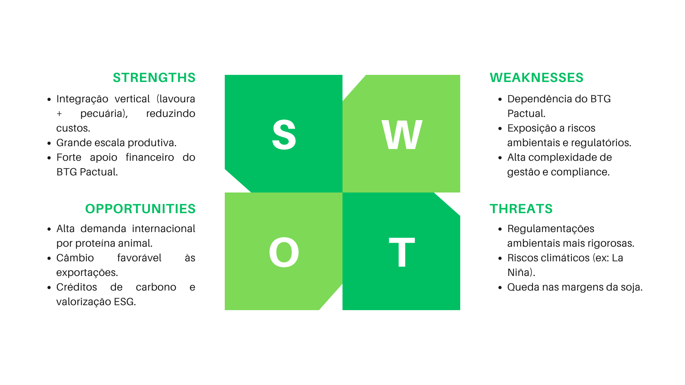

# WAD - Web Application Document - Módulo 2 - Inteli

**_Os trechos em itálico servem apenas como guia para o preenchimento da seção. Por esse motivo, não devem fazer parte da documentação final_**

## Nome do Grupo

#### Integrantes do grupo:

  <table>
    <tr>
      <td align="center"><a href="https://www.linkedin.com/in/ana-clara-silvestre-328706326/"> <b>Ana Clara da Silva Silvestre</b></a></td>
      <td align="center"><a href="https://www.linkedin.com/in/andr%C3%A9-fischer-de-carvalho-5588443b0/"> <b>André Fischer de Carvalho</b></a></td>
      <td align="center"><a href="https://www.linkedin.com/in/enzo-braga-heins-b706603b9/"> <b>Enzo Braga Heins</b></a></td>
      <td align="center"><a href="https://www.linkedin.com/in/fabiana-dias-souza/"> <b>Fabiana Dias de Souza</b></a></td>
       <td align="center"><a href="https://www.linkedin.com/in/jo%C3%A3o-glauco-fernandes-2292513a9//"> <b>João Glauco Fernandes Araújo de Freitas</b></a></td>
      <td align="center"><a href="https://www.linkedin.com/in/levi-correia-silveira-4900a4312/"> <b>Levi Correia Silveira</b></a></td>
      <td align="center"><a href="https://www.linkedin.com/in/matheus-augusto-corr%C3%AAa-santos-0bab03373/?locale=en"> <b>Matheus Augusto Corrêa Santos</b></a></td>
      <td align="center"><a href="https://www.linkedin.com/in/theo-moreda"> <b>Théo Pires Morêda</b></a></td>

  </table>

## Sumário

[1. Introdução](#c1)

 

[2. Visão Geral da Aplicação Web](#c2)

  
Subtópicos

  - [2.1. Escopo do Projeto](#c2.1)

    - [2.1.1. Modelo de 5 Forças de Porter](#c2.1.1)

    - [2.1.2. Análise SWOT da Instituição Parceira](#c2.1.2)

    - [2.1.3. Solução](#c2.1.3)

    - [2.1.4. Value Proposition Canvas](#c2.1.4)

    - [2.1.5. Matriz de Riscos do Projeto](#c2.1.5)

  - [2.2. Personas](#c2.2)

  - [2.3. User Stories](#c2.3)

 

[3. Projeto da Aplicação Web](#c3)

  
Subtópicos

  - [3.1. Requisitos do Sistema](#c3.1)

    - [3.1.1. Requisitos Funcionais](#c3.1.1)

    - [3.1.2. Regras de Negócio](#c3.1.2)

    - [3.1.3. Requisitos Não Funcionais — 8 Eixos ISO/IEC 25010](#c3.1.3)

    - [3.1.4. Matriz RF → RN → Endpoint](#c3.1.4)

  - [3.2. Arquitetura](#c3.2)

    - [3.2.1. Diagrama de Arquitetura](#c3.2.1)

    - [3.2.2. Diagrama de Casos de Uso](#c3.2.2)

    - [3.2.3. Diagrama de Classes do Domínio](#c3.2.3)

    - [3.2.4. Diagrama de Sequência UML](#c3.2.4)

    - [3.2.5. Diagrama de Atividades ou Estados](#c3.2.5)

    - [3.2.6. Diagrama de Implantação](#c3.2.6)

    - [3.2.7. Padrões de Projeto Aplicados](#c3.2.7)

  - [3.3. Wireframes](#c3.3)

  - [3.4. Guia de estilos](#c3.4)

    - [3.4.1. Cores](#c3.4.1)

    - [3.4.2. Tipografia](#c3.4.2)

    - [3.4.3. Iconografia e imagens](#c3.4.3)

  - [3.5. Protótipo de alta fidelidade](#c3.5)

  - [3.6. Modelagem do banco de dados](#c3.6)

    - [3.6.1. Modelo Entidade-Relacionamento (ER)](#c3.6.1)

    - [3.6.2. Diagrama Entidade-Relacionamento (DER)](#c3.6.2)

    - [3.6.3. Modelo Relacional e Modelo Físico](#c3.6.3)

    - [3.6.4. Consultas SQL e lógica proposicional](#c3.6.4)

  - [3.7. WebAPI e endpoints](#c3.7)

  - [3.8. Autenticação, Autorização e Resiliência](#c3.8)

    - [3.8.1. Autenticação](#c3.8.1)

    - [3.8.2. Controle de sessão](#c3.8.2)

    - [3.8.3. Autorização](#c3.8.3)

    - [3.8.4. Estratégias de Resiliência](#c3.8.4)

  - [3.9. Matriz de Rastreabilidade (RTM)](#c3.9)

 

[4. Desenvolvimento da Aplicação Web](#c4)

  
Subtópicos

  - [4.1. Primeira versão da aplicação web](#c4.1)

  - [4.2. Segunda versão da aplicação web](#c4.2)

  - [4.3. Versão final da aplicação web](#c4.3)

 

[5. Testes](#c5)

  
Subtópicos

  - [5.1. Relatório de testes de integração de endpoints automatizados](#c5.1)

  - [5.2. Testes de usabilidade](#c5.2)

    - [5.2.1. Relatório de testes de guerrilha](#c5.2.1)

    - [5.2.2. Relatório de testes SUS (System Usability Scale)](#c5.2.2)

 

[6. Estudo de Mercado e Plano de Marketing](#c6)

  
Subtópicos

  - [6.1. Resumo Executivo](#c6.1)

  - [6.2. Análise de Mercado](#c6.2)

  - [6.3. Análise da Concorrência](#c6.3)

  - [6.4. Público-Alvo](#c6.4)

  - [6.5. Posicionamento](#c6.5)

  - [6.6. Estratégia de Marketing](#c6.6)

 

[7. Conclusões e trabalhos futuros](#c7)

 

[8. Referências](#c8)

[Anexos](#c9)

 

# 1. Introdução (sprints 1 a 5)

*Preencha com até 300 palavras – sem necessidade de fonte*

*Contextualize aqui a problemática trazida pelo parceiro de projeto.*

*Descreva brevemente a solução desenvolvida para o parceiro de negócios. Descreva os aspectos essenciais para a criação de valor do produto, com o objetivo de ajudar a entender melhor a realidade do cliente e entregar uma solução que está alinhado com o que ele espera.*

*Observe a seção 2 e verifique que ali é possível trazer mais detalhes, portanto seja objetivo aqui. Atualize esta descrição até a entrega final, conforme desenvolvimento.*

# 2. Visão Geral da Aplicação Web (sprint 1)

## 2.1. Escopo do Projeto (sprints 1 e 4)

### 2.1.1. Modelo de 5 Forças de Porter (sprint 1)

*Preencha com até 400 palavras*

*Posicione aqui o modelo de 5 Forças de Porter para sustentar o contexto da indústria.*

### 2.1.2. Análise SWOT da Instituição Parceira (sprint 1)

A análise SWOT da BRPEC evidencia os principais fatores internos e externos que impactam sua atuação no agronegócio brasileiro. Entre as forças, destacam-se a integração vertical, a escala produtiva e o sólido respaldo financeiro. Por outro lado, surgem desafios relacionados à dependência estratégica e à complexidade regulatória. O cenário também apresenta oportunidades relevantes, como o crescimento da demanda internacional e o avanço de práticas sustentáveis, ao mesmo tempo em que impõe ameaças como riscos climáticos, pressão regulatória e redução de margens. Essa visão sintetiza os elementos-chave para orientar decisões estratégicas e garantir 
competitividade no setor.

*Apresente uma visão geral da situação do parceiro com base na matriz SWOT (forças, fraquezas, oportunidades e ameaças). Foque na relação com os concorrentes e o posicionamento da instituição.*

### 2.1.3. Solução (sprints 1 a 5)

*Explique detalhadamente os seguintes aspectos (até 60 palavras por item):*
1. Problema a ser resolvido
2. Dados disponíveis (mencionar fonte e conteúdo; se não houver, indicar “não se aplica”)
3. Solução proposta
4. Forma de utilização da solução
5. Benefícios esperados
6. Critério de sucesso e como será avaliado

### 2.1.4. Value Proposition Canvas (sprint 1)

&nbsp;&nbsp;&nbsp;&nbsp;Segundo Osterwalder (2011), a ferramenta Canvas de Proposta de Valor (CPV) é utilizada estrategicamente para mapear e validar se a proposta de valor de um produto ou serviço se adequa às necessidades, dores e expectativas dos clientes. Essa ferramenta permite compreender a relação entre o que a empresa oferece e o que o cliente busca, facilitando a criação de soluções eficazes e relevantes. Assim, esse recurso foi utilizado no presente projeto a fim de apresentar a construção da proposta de valor e o diagnóstico dos problemas identificados a partir das demandas da BRPec Agropecuária S.A. A análise desenvolvida pode ser consultada na figura 2.

---

#### Perfil do Cliente

##### Tarefas do Cliente

&nbsp;&nbsp;&nbsp;&nbsp;Nas tarefas do cliente, são delimitadas as tarefas que um cliente está tentando fazer, especialmente antes de utilizar uma nova solução proposta por uma determinada organização (G4 EDUCAÇÃO, 2025). Com isso, a equipe identificou as seguintes tarefas do cliente:

- Controlar a movimentação do rebanho bovino (nascimentos, mortes, compras, vendas e transferências entre retiros);
- Consolidar dados operacionais para subsidiar decisões estratégicas de negócio;
- Gerenciar e acompanhar tarefas diárias de campo.

##### Dores

&nbsp;&nbsp;&nbsp;&nbsp;Na seção de dores do Canvas Proposta de Valor, são adicionadas as frustrações que o cliente sofre ao tentar realizar determinada tarefa (G4 EDUCAÇÃO, 2025). Desse modo, foram elencadas as seguintes dores do cliente:

- Dependência de processos manuais e anotações em papel (boletas), gerando retrabalho de redigitação em planilhas;
- Lentidão na comunicação entre campo e escritório, dependendo de repasse humano para atualizar informações;
- Risco de falhas e inconsistências na transcrição de dados operacionais e zootécnicos;
- Falta de visibilidade agilizada sobre o status das atividades e do rebanho.

##### Ganhos

&nbsp;&nbsp;&nbsp;&nbsp;Na seção de ganhos do Canvas Proposta de Valor, são colocados os resultados que o cliente aspira ter quando realiza uma tarefa (G4 EDUCAÇÃO, 2025). Assim, foram identificados os seguintes ganhos do cliente:

- Registro digital direto na fonte, eliminando a redigitação manual;
- Acesso a dados consolidados e atualizados do rebanho para tomada de decisão estratégica;
- Maior rastreabilidade e transparência nas operações de campo;
- Agilidade no acompanhamento de tarefas e movimentações diariamente.

---

#### Proposta de Valor

##### Produtos e Serviços

&nbsp;&nbsp;&nbsp;&nbsp;A seção de produtos e serviços de um Canvas Proposta de Valor se refere aos recursos oferecidos por uma determinada organização (G4 EDUCAÇÃO, 2025). Dessa forma, é possível mencionar os seguintes no que se refere à solução proposta pela equipe:

- Aplicação web com interface de campo para o Capataz registrar digitalmente eventos do rebanho (nascimentos, mortes, compras, vendas e transferências);
- Interface de calendarização e monitoramento de tarefas para o Gerente;
- Funcionalidade offline com sincronização automática ao restabelecer conexão com a internet.

##### Criadores de Ganho

&nbsp;&nbsp;&nbsp;&nbsp;A seção de criadores de ganhos de um Canvas Proposta de Valor diz respeito a como os produtos e serviços de uma determinada organização acarretam os resultados que o cliente espera (G4 EDUCAÇÃO, 2025). A partir disso, foram elencados os seguintes criadores de ganho:

- Centraliza os registros do rebanho diariamente, substituindo anotações dispersas em papel;
- Permite ao Gerente acompanhar o status das tarefas de campo sem depender de repasse humano;
- Registra a identificação do usuário em cada ação, aumentando a rastreabilidade das operações.

##### Aliviam as Dores

&nbsp;&nbsp;&nbsp;&nbsp;A seção de aliviadores de dor de um Canvas Proposta de Valor mostra de qual maneira os produtos e serviços propostos por uma organização tratam as dores do cliente (G4 EDUCAÇÃO, 2025). Por conseguinte, foram elaborados os seguintes aliviadores de dor:

- Elimina o uso de boletas de papel ao digitalizar o registro de movimentações diretamente no campo;
- Reduz o retrabalho de redigitação ao sincronizar automaticamente os dados com o servidor;
- Minimiza falhas de transcrição ao padronizar a entrada de dados na aplicação;
- Garante operação contínua em campo mesmo sem internet via modo offline.

Figura 2 - Canvas Proposta de Valor

Fonte: Próprios autores (2026).

### 2.1.5. Matriz de Riscos do Projeto (sprint 1)

*Sem limite de palavras – usar template do curso*

*Registre na matriz os riscos identificados no projeto.*

## 2.2. Personas (sprint 1)

*Posicione aqui suas Personas em forma de texto markdown com imagens, ou como imagem de template preenchido. Atualize esta seção ao longo do módulo se necessário.*

## 2.3. User Stories (sprints 1 a 5)

*Posicione aqui a lista de User Stories levantadas para o projeto. Siga o template de User Stories e utilize a mesma referência USXX no roadmap de seu quadro Kanban. Indique todas as User Stories mapeadas, mesmo aquelas que não forem implementadas ao longo do projeto. Não se esqueça de explicar o INVEST das 5 User Stories prioritárias*

*ATUALIZE ESTA SEÇÃO SEMPRE QUE ALGUMA DEMANDA MUDAR EM SEU PROJETO*

*Template de User Story*
Identificação | USXX (troque XX por numeração ordenada das User Stories)
--- | ---
Persona | nome da Persona
User Story | "como (papel/perfil), posso (ação/meta), para (benefício/razão)"
Critério de aceite 1 | CR1: descrever cenário + testes de aceite
Critério de aceite 2 | CR2: descrever cenário + testes de aceite
Critério de aceite ... | CR...
Critérios INVEST | *(Por que é Independente? Por que é Negociável? Por que é Valorosa? Por que é Estimável? Por que é Pequena? Por que é Testável?)*

# 3. Projeto da Aplicação Web (sprints 1 a 5)

## 3.1. Requisitos do Sistema (sprints 1 a 5)

*Esta seção formaliza o que o sistema deve fazer, sob quais regras e com quais qualidades. Atualize a cada sprint conforme os requisitos evoluem.*

### 3.1.1. Requisitos Funcionais (sprint 1, refinar até sprint 5)

*Liste os RF numerados de forma objetiva e verificável. Cada RF deve poder ser convertido em caso de teste.*

| ID    | Descrição | Prioridade | Status       |
|-------|-----------|------------|--------------|
| RF001 | ...       | Alta       | Implementado |
| RF002 | ...       | Média      | Planejado    |

### 3.1.2. Regras de Negócio (sprint 1, refinar até sprint 5)

*Numere e redija as RN de forma implementável e testável. Toda RN deve ter pelo menos um teste automatizado associado a partir da sprint 3.*

| ID   | Descrição | RF associado |
|------|-----------|--------------|
| RN01 | ...       | RF001        |
| RN02 | ...       | RF001        |

### 3.1.3. Requisitos Não Funcionais — 8 Eixos ISO/IEC 25010 (sprints 1 a 5)

*Preencha os 8 eixos. Cada eixo deve ter ao menos um RNF verificável (com métrica, limite ou critério concreto) ou justificativa explícita de ausência. Evolua do conceitual (sprint 1) ao técnico mensurável (sprint 5).*

| Eixo                     | Requisito | Métrica / Critério | Como atendido |
|--------------------------|-----------|--------------------|---------------|
| USAB — Usabilidade       | ...       | ...                | ...           |
| CONF — Confiabilidade    | ...       | ...                | ...           |
| DES — Desempenho         | ...       | p95 < X ms         | ...           |
| SUP — Suportabilidade    | ...       | ...                | ...           |
| SEG — Segurança          | ...       | ...                | ...           |
| CAP — Capacidade         | ...       | ...                | ...           |
| REST — Restrições Design | ...       | ...                | ...           |
| ORG — Organizacionais    | ...       | ...                | ...           |

### 3.1.4. Matriz RF → RN → Endpoint (sprints 3 a 5)

*Matriz de cobertura mostrando quais RN e endpoints implementam cada RF.*

| RF    | RN associadas | Endpoint    | Método |
|-------|---------------|-------------|--------|
| RF001 | RN01, RN02    | `/usuarios` | POST   |

## 3.2. Arquitetura (sprints 1 a 5)

### 3.2.1. Diagrama de Arquitetura (sprints 3 e 4)

*Posicione aqui o diagrama de arquitetura da solução, indicando as camadas principais (Controller, Service, Repository, Model) e suas responsabilidades. Atualize sempre que necessário.*

### 3.2.2. Diagrama de Casos de Uso (sprint 1)

*Apresente o diagrama de casos de uso com atores (boneco), casos (elipse) e as relações `<<include>>` / `<<extend>>` com semântica correta. Consulte a notação de referência em `in02/suporte/use-case_3.0_v1.0.pdf`.*

### 3.2.3. Diagrama de Classes do Domínio (sprint 2)

*Diagrama UML de classes com entidades, atributos, relacionamentos e responsabilidades. Diferencie **associação**, **agregação** (losango vazio), **composição** (losango cheio) e **herança** (triângulo vazio). Multiplicidade explícita em toda associação.*

### 3.2.4. Diagrama de Sequência UML (sprint 3)

*Ao menos um fluxo prioritário, mostrando a interação entre as camadas Controller → Service → Repository → Banco. Linhas de vida verticais, ativação correta, mensagens síncronas e assíncronas diferenciadas, retornos tracejados.*

### 3.2.5. Diagrama de Atividades ou Estados (sprint 3)

*Ao menos um fluxo relevante em UML ou BPMN. Use a notação da ferramenta escolhida de forma consistente (sem misturar convenções).*

### 3.2.6. Diagrama de Implantação (sprints 4 e 5)

*Diagrama UML de deployment mostrando nós físicos, artefatos e canais de comunicação. Representa a visão Engineering + Technology do RM-ODP.*

### 3.2.7. Padrões de Projeto Aplicados (sprints 3 a 5)

*Documente os design patterns utilizados (Repository, Strategy, Factory, DTO etc.) e quais princípios SOLID se aplicam. Justifique a adoção de cada padrão com base em uma necessidade real do projeto.*

## 3.3. Wireframes (sprint 2)

*Posicione aqui as imagens do wireframe construído para sua solução e, opcionalmente, o link para acesso (mantenha o link sempre público para visualização)*

## 3.4. Guia de estilos (sprint 3)

*Descreva aqui orientações gerais para o leitor sobre como utilizar os componentes do guia de estilos de sua solução*

### 3.4.1 Cores

*Apresente aqui a paleta de cores, com seus códigos de aplicação e suas respectivas funções*

### 3.4.2 Tipografia

*Apresente aqui a tipografia da solução, com famílias de fontes e suas respectivas funções*

### 3.4.3 Iconografia e imagens 

*(esta subseção é opcional, caso não existam ícones e imagens, apague esta subseção)*

*posicione aqui imagens e textos contendo exemplos padronizados de ícones e imagens, com seus respectivos atributos de aplicação, utilizadas na solução*

## 3.5 Protótipo de alta fidelidade (sprint 3)

*posicione aqui algumas imagens demonstrativas de seu protótipo de alta fidelidade e o link para acesso ao protótipo completo (mantenha o link sempre público para visualização)*

## 3.6. Modelagem do banco de dados (sprints 2 e 4)

### 3.6.1. Modelo Entidade-Relacionamento (ER) (sprint 2)

*Apresente o modelo ER conceitual com entidades, atributos e relacionamentos. Use notação consistente (Chen ou Crow's Foot — não misture).*

### 3.6.2. Diagrama Entidade-Relacionamento (DER) (sprint 2)

*Posicione aqui o DER com cardinalidades explícitas em ambos os lados de cada relação e identificação de PK/FK. O DER deve ser coerente com o diagrama de classes (3.2.3).*

### 3.6.3. Modelo Relacional e Modelo Físico (sprints 2 e 4)

*Posicione aqui os diagramas de modelos relacionais do banco de dados, apresentando todos os esquemas de tabelas e suas relações. Inclua as migrations DDL numeradas e reproduzíveis (`CREATE TABLE`, `CREATE INDEX`, constraints `NOT NULL`, `UNIQUE`, `FOREIGN KEY`, `CHECK`). Utilize texto para complementar suas explicações quando necessário.*

### 3.6.4. Consultas SQL e lógica proposicional (sprint 2)

*posicione aqui uma lista de consultas SQL compostas, realizadas pelo back-end da aplicação web, com sua respectiva lógica proposicional, descrita conforme template abaixo. Lembre-se que para usar LaTeX em markdown, basta você colocar as expressões entre $ ou $$*

*Template de SQL + lógica proposicional*
#1 | ---
--- | ---
**Expressão SQL** | SELECT * FROM suppliers WHERE (state = 'California' AND supplier_id <> 900) OR (supplier_id = 100); 
**Proposições lógicas** | $A$: O estado é 'California' (state = 'California')   $B$: O ID do fornecedor não é 900 (supplier_id ≠ 900)   $C$: O ID do fornecedor é 100 (supplier_id = 100)
**Expressão lógica proposicional** | $(A \land B) \lor C$
**Tabela Verdade** | <table> <thead> <tr> <th>$A$</th> <th>$B$</th> <th>$C$</th> <th>$(A \land B)$</th> <th>$(A \land B) \lor C$</th> </tr> </thead> <tbody> <tr> <td>F</td> <td>F</td> <td>F</td> <td>F</td> <td>F</td> </tr> <tr> <td>F</td> <td>F</td> <td>V</td> <td>F</td> <td>V</td> </tr> <tr> <td>F</td> <td>V</td> <td>F</td> <td>F</td> <td>F</td> </tr> <tr> <td>F</td> <td>V</td> <td>V</td> <td>F</td> <td>V</td> </tr> <tr> <td>V</td> <td>F</td> <td>F</td> <td>F</td> <td>F</td> </tr> <tr> <td>V</td> <td>F</td> <td>V</td> <td>F</td> <td>V</td> </tr> <tr> <td>V</td> <td>V</td> <td>F</td> <td>V</td> <td>V</td> </tr> <tr> <td>V</td> <td>V</td> <td>V</td> <td>V</td> <td>V</td> </tr> </tbody> </table>

*Dica: edite a tabela verdade fora do markdown, para ter melhor controle*

## 3.7. WebAPI e endpoints (sprints 3 e 4)

*Utilize um link para outra página de documentação contendo a descrição completa de cada endpoint. Ou descreva aqui cada endpoint criado para seu sistema.* 

*Cada endpoint deve conter endereço, método (GET, POST, PUT, PATCH, DELETE), header, body, formatos de response e os status codes possíveis (200, 201, 204, 400, 401, 403, 404, 409, 422, 500).*

## 3.8. Autenticação, Autorização e Resiliência (sprint 5)

### 3.8.1. Autenticação

*Descreva o fluxo de autenticação implementado: persistência de senha com hash bcrypt/argon2 (parâmetros de custo explícitos e justificados), validação de credenciais e criação de sessão. Senhas em texto plano no banco não são aceitas.*

### 3.8.2. Controle de sessão

*Descreva o controle de sessão baseado em `session id` persistido em tabela própria, com expiração. Se optar por JWT, justifique a escolha explicando os trade-offs (stateless, não revogável, payload exposto).*

### 3.8.3. Autorização

*Descreva as regras de autorização por rota e por operação, baseadas no perfil do usuário autenticado. A verificação deve ocorrer no backend — o frontend nunca é fonte de verdade para autorização.*

### 3.8.4. Estratégias de Resiliência

*Descreva as estratégias aplicadas no tratamento de falhas de rede: timeout, retry com backoff exponencial, circuit breaker e idempotência em operações críticas (`PUT`, `DELETE`, operações de pagamento etc.).*

## 3.9. Matriz de Rastreabilidade (RTM) (sprints 3 a 5)

*A RTM consolida a rastreabilidade completa do sistema. Um elo quebrado invalida toda a cadeia — mantenha-a atualizada a cada sprint. A partir da sprint 3 não deve haver lacunas nos fluxos centrais.*

| Persona | RF    | RN   | Endpoint    | Tela     | Teste | Evidência        |
|---------|-------|------|-------------|----------|-------|------------------|
| ...     | RF001 | RN01 | `/usuarios` | Cadastro | CT02  | print, log, relatório de cobertura |

# 4. Desenvolvimento da Aplicação Web

## 4.1. Primeira versão da aplicação web (sprint 3)

*Descreva e ilustre aqui o desenvolvimento da primeira versão do sistema web. Utilize prints de tela para ilustrar. Indique obrigatoriamente: (a) o que foi implementado, (b) o que não foi concluído, (c) dificuldades técnicas enfrentadas e próximos passos.*

## 4.2. Segunda versão da aplicação web (sprint 4)

*Descreva e ilustre aqui o desenvolvimento da segunda versão do sistema web, com foco no que foi consolidado entre a primeira versão funcional e o sistema operacional integrado. Utilize prints de tela para ilustrar. Indique obrigatoriamente: (a) o que foi implementado, (b) o que não foi concluído, (c) dificuldades técnicas enfrentadas e próximos passos.*

## 4.3. Versão final da aplicação web (sprint 5)

*Descreva e ilustre aqui o desenvolvimento da versão final do sistema web, com foco em refatorações, correções finais e na camada de autenticação/autorização entregue. Utilize prints de tela para ilustrar. Indique obrigatoriamente: (a) o que foi refinado ou adicionado desde a sprint 4, (b) pendências remanescentes, (c) dificuldades técnicas enfrentadas.*

# 5. Testes

## 5.1. Relatório de testes de integração de endpoints automatizados (sprint 4)

*Liste e descreva os testes automatizados dos endpoints criados e planejados para sua solução, implementados com **Jest**. Cubra as duas abordagens:*

- ***White-box*** *— testes unitários de Service que exercitam ramos internos, exceções e regras de negócio (conhecimento da implementação).*
- ***Black-box*** *— testes de integração dos endpoints via Jest + Supertest, verificando apenas o contrato HTTP (status, body, efeito observável), sem depender da implementação interna.*

*Posicione aqui também o relatório de cobertura de testes Jest se houver (através de link ou transcrito para estrutura markdown).*

## 5.2. Testes de usabilidade (sprint 5)

### 5.2.1. Relatório de testes de guerrilha

*Posicione aqui as tabelas com enunciados de tarefas, etapas e resultados de testes de usabilidade. Ou utilize um link para seu relatório de testes (mantenha o link sempre público para visualização).*

### 5.2.2. Relatório de testes SUS (System Usability Scale)

*Posicione aqui o relatório dos testes SUS realizados.*

# 6. Estudo de Mercado e Plano de Marketing (sprint 4)

## 6.1 Resumo Executivo

*Preencher com até 300 palavras, sem necessidade de fonte*

*Apresente de forma clara e objetiva os principais destaques do projeto: oportunidades de mercado, diferenciais competitivos da aplicação web e os objetivos estratégicos pretendidos.*

## 6.2 Análise de Mercado

*a) Visão Geral do Setor (até 250 palavras)*
*Contextualize o setor no qual a aplicação está inserida, considerando aspectos econômicos, tecnológicos e regulatórios. Utilize fontes confiáveis.*

*b) Tamanho e Crescimento do Mercado (até 250 palavras)*
*Apresente dados quantitativos sobre o tamanho atual e projeções de crescimento do mercado. Utilize fontes confiáveis.*

*c) Tendências de Mercado (até 300 palavras)*
*Identifique e analise tendências relevantes (tecnológicas, comportamentais e mercadológicas) que influenciam o setor. Utilize fontes confiáveis.*

## 6.3 Análise da Concorrência

*a) Principais Concorrentes (até 250 palavras)*
*Liste os concorrentes diretos e indiretos, destacando suas principais características e posicionamento no mercado.*

*b) Vantagens Competitivas da Aplicação Web (até 250 palavras)*
*Descreva os diferenciais da sua aplicação em relação aos concorrentes, sem necessidade de citação de fontes.*

## 6.4 Público-Alvo

*a) Segmentação de Mercado (até 250 palavras)*
Descreva os principais segmentos de mercado a serem atendidos pela aplicação. Utilize bases de dados e fontes confiáveis.*

*b) Perfil do Público-Alvo (até 250 palavras)*
*Caracterize o público-alvo com dados demográficos, psicográficos e comportamentais, incluindo necessidades específicas. Utilize fontes obrigatórias.*

## 6.5 Posicionamento

*a) Proposta de Valor Única (até 250 palavras)*
*Defina de maneira clara o que torna a sua aplicação única e valiosa para o mercado.*

*b) Estratégia de Diferenciação (até 250 palavras)*
*Explique como sua aplicação se destacará da concorrência, evidenciando a lógica por trás do posicionamento.*

## 6.6 Estratégia de Marketing 

*a) Produto/Serviço (até 200 palavras)*
*Descreva as funcionalidades, benefícios e diferenciais da aplicação*

*b) Preço (até 200 palavras)*
*Explique o modelo de precificação adotado e justifique com base nas análises anteriores.*

*c) Praça (Distribuição) (até 200 palavras)*
*Apresente os canais digitais utilizados para distribuir e entregar a aplicação ao público.*

*d) Promoção (até 200 palavras)*
*Descreva as estratégias digitais planejadas, como SEO, redes sociais, marketing de conteúdo e campanhas pagas.*

# 7. Conclusões e trabalhos futuros (sprint 5)

*Escreva de que formas a solução da aplicação web atingiu os objetivos descritos na seção 2 deste documento. Indique pontos fortes e pontos a melhorar de maneira geral.*

*Relacione os pontos de melhorias evidenciados nos testes com planos de ações para serem implementadas. O grupo não precisa implementá-las, pode deixar registrado aqui o plano para ações futuras*

*Relacione também quaisquer outras ideias que o grupo tenha para melhorias futuras*

# 8. Referências (sprints 1 a 5)

G4 EDUCAÇÃO. Value Proposition Canvas: o que é e como funciona essa metodologia?. [S. l.], 16 abr. 2025. Disponível em: https://g4educacao.com/blog/value-proposition-canvas. Acesso em: 24 abr. 2026.

OSTERWALDER, A, PIGNEUR, Y. Business Model Generation: Inovação em Modelos de Negócios. Rio de Janeiro. Alta Books, 2011. https://www.academia.edu/37075116/Business_Model_Generation. Acesso em: 23 abr. 2026.

# Anexos

*Inclua aqui quaisquer complementos para seu projeto, como diagramas, imagens, tabelas etc. Organize em sub-tópicos utilizando headings menores (use ## ou ### para isso)*
