# WAD - Web Application Document - Módulo 2 - Inteli

## AgroFlow

#### Integrantes do grupo:

<div align="center">
  <table>
    <tr>
      <td align="center"><a href="https://www.linkedin.com/in/ana-clara-silvestre-328706326/"><br><sub><b>Ana Clara da Silva Silvestre</b></sub></a></td>
      <td align="center"><a href="https://www.linkedin.com/in/andr%C3%A9-fischer-de-carvalho-5588443b0/"><br><sub><b>André Fischer de Carvalho</b></sub></a></td>
      <td align="center"><a href="https://www.linkedin.com/in/enzo-braga-heins-b706603b9/"><br><sub><b>Enzo Braga Heins</b></sub></a></td>
      <td align="center"><a href="https://www.linkedin.com/in/fabiana-dias-souza/"><br><sub><b>Fabiana Dias de Souza</b></sub></a></td>
       <td align="center"><a href="https://www.linkedin.com/in/jo%C3%A3o-glauco-fernandes-2292513a9//"><br><sub><b>João Glauco Fernandes Araújo de Freitas</b></sub></a></td>
      <td align="center"><a href="https://www.linkedin.com/in/levi-correia-silveira-4900a4312/"><br><sub><b>Levi Correia Silveira</b></sub></a></td>
      <td align="center"><a href="https://www.linkedin.com/in/matheus-augusto-corr%C3%AAa-santos-0bab03373/?locale=en"><br><sub><b>Matheus Augusto Corrêa Santos</b></sub></a></td>
      <td align="center"><a href="https://www.linkedin.com/in/theo-moreda"><br><sub><b>Théo Pires Morêda</b></sub></a></td>
    </tr>
  </table>
</div>

## Sumário

[1. Introdução](#c1)

<br>

[2. Visão Geral da Aplicação Web](#c2)

<details>
  <summary>Subtópicos</summary>

  - [2.1. Escopo do Projeto](#c2.1)

    - [2.1.1. Modelo de 5 Forças de Porter](#c2.1.1)

    - [2.1.2. Análise SWOT da Instituição Parceira](#c2.1.2)

    - [2.1.3. Solução](#c2.1.3)

    - [2.1.4. Value Proposition Canvas](#c2.1.4)

    - [2.1.5. Matriz de Riscos do Projeto](#c2.1.5)

  - [2.2. Personas](#c2.2)

  - [2.3. User Stories](#c2.3)

</details>

<br>

[3. Projeto da Aplicação Web](#c3)

<details>
  <summary>Subtópicos</summary>

  - [3.1. Requisitos do Sistema](#c3.1)

    - [3.1.1. Requisitos Funcionais](#c3.1.1)

    - [3.1.2. Regras de Negócio](#c3.1.2)

    - [3.1.3. Requisitos Não Funcionais — 8 Eixos ISO/IEC 25010](#c3.1.3)

    - [3.1.4. Matriz RF → RN → Endpoint](#c3.1.4)

  - [3.2. Arquitetura](#c3.2)

    - [3.2.1. Diagrama de Arquitetura](#c3.2.1)

    - [3.2.2. Diagrama de Casos de Uso](#c3.2.2)

    - [3.2.3. Diagrama de Classes do Domínio](#c3.2.3)

    - [3.2.4. Diagrama de Sequência UML](#c3.2.4)

    - [3.2.5. Diagrama de Atividades ou Estados](#c3.2.5)

    - [3.2.6. Diagrama de Implantação](#c3.2.6)

    - [3.2.7. Padrões de Projeto Aplicados](#c3.2.7)

  - [3.3. Wireframes](#c3.3)

  - [3.4. Guia de estilos](#c3.4)

    - [3.4.1. Cores](#c3.4.1)

    - [3.4.2. Tipografia](#c3.4.2)

    - [3.4.3. Iconografia e imagens](#c3.4.3)

  - [3.5. Protótipo de alta fidelidade](#c3.5)

  - [3.6. Modelagem do banco de dados](#c3.6)

    - [3.6.1. Modelo Entidade-Relacionamento (ER)](#c3.6.1)

    - [3.6.2. Diagrama Entidade-Relacionamento (DER)](#c3.6.2)

    - [3.6.3. Modelo Relacional e Modelo Físico](#c3.6.3)

    - [3.6.4. Consultas SQL e lógica proposicional](#c3.6.4)

  - [3.7. WebAPI e endpoints](#c3.7)

  - [3.8. Autenticação, Autorização e Resiliência](#c3.8)

    - [3.8.1. Autenticação](#c3.8.1)

    - [3.8.2. Controle de sessão](#c3.8.2)

    - [3.8.3. Autorização](#c3.8.3)

    - [3.8.4. Estratégias de Resiliência](#c3.8.4)

  - [3.9. Matriz de Rastreabilidade (RTM)](#c3.9)

</details>

<br>

[4. Desenvolvimento da Aplicação Web](#c4)

<details>
  <summary>Subtópicos</summary>

  - [4.1. Primeira versão da aplicação web](#c4.1)

  - [4.2. Segunda versão da aplicação web](#c4.2)

  - [4.3. Versão final da aplicação web](#c4.3)

</details>

<br>

[5. Testes](#c5)

<details>
  <summary>Subtópicos</summary>

  - [5.1. Relatório de testes de integração de endpoints automatizados](#c5.1)

  - [5.2. Testes de usabilidade](#c5.2)

    - [5.2.1. Relatório de testes de guerrilha](#c5.2.1)

    - [5.2.2. Relatório de testes SUS (System Usability Scale)](#c5.2.2)

</details>

<br>

[6. Estudo de Mercado e Plano de Marketing](#c6)

<details>
  <summary>Subtópicos</summary>

  - [6.1. Resumo Executivo](#c6.1)

  - [6.2. Análise de Mercado](#c6.2)

  - [6.3. Análise da Concorrência](#c6.3)

  - [6.4. Público-Alvo](#c6.4)

  - [6.5. Posicionamento](#c6.5)

  - [6.6. Estratégia de Marketing](#c6.6)

</details>

<br>

[7. Conclusões e trabalhos futuros](#c7)

<br>

[8. Referências](#c8)

[Anexos](#c9)


# <a name="c1"></a>1. Introdução (sprints 1 a 5)

&nbsp;&nbsp;&nbsp;&nbsp;No início do projeto, a **BrPec Agro-Pecuária S.A.** apresentou sua necessidade em aprimorar a forma de registro de cada animal em seu rebanho bovino. Atualmente, o fluxo de informações entre o campo e o escritório é prejudicado por **processos manuais** baseados em **"boletas" de papel**, o que acarreta lentidão na consolidação de dados e riscos de erros durante a **redigitação em planilhas**. Essa desconexão entre as áreas operacional e administrativa compromete a precisão do inventário pecuário e impede maior agilidade na consolidação das informações, fator crítico para a gestão eficiente.

&nbsp;&nbsp;&nbsp;&nbsp;Para solucionar essa problemática, uma **aplicação web centralizada** foi projetada para integrar a **gestão de cronogramas operacionais** e o **controle de movimentação bovina**. A solução permite a digitalização de **eventos zootécnicos** essenciais, como nascimentos, óbitos, compras, vendas e transferências entre retiros. O valor fundamental do produto reside na arquitetura preparada para **operação offline**, garantindo a integridade dos registros em áreas remotas e a **sincronização** de dados assim que a conexão for restabelecida, eliminando a dependência de processos manuais e reduzindo a janela de inconsistência entre campo e escritório.

&nbsp;&nbsp;&nbsp;&nbsp;A interface foi estruturada para atender a diferentes **níveis hierárquicos** da operação: gerentes definem e distribuem as tarefas calendarizadas, o que impacta diretamente a previsibilidade e o controle dos ciclos produtivos; capatazes registram a execução mediante envio de evidências digitais, como fotos e áudios; e coordenadores validam as informações antes da consolidação final. Os dados aprovados são exportados em formatos Excel ou CSV, suportando a tomada de decisão administrativa. Com essa implementação, os processos manuais são eliminados, as falhas de comunicação são reduzidas e uma **integração efetiva** entre as frentes agrícola e pecuária é estabelecida.

# <a name="c2"></a>2. Visão Geral da Aplicação Web (sprint 1)

## <a name="c2.1"></a>2.1. Escopo do Projeto (sprints 1 e 4)

### <a name="c2.1.1"></a>2.1.1. Modelo de 5 Forças de Porter

#### Análise das 5 Forças de Porter - BrPec Agropecuária

&nbsp;&nbsp;&nbsp;&nbsp;A análise das Cinco Forças de Porter permite compreender a estrutura competitiva do setor em que a BRPec está inserida, avaliando fatores que impactam diretamente sua rentabilidade e posicionamento estratégico. No contexto do agronegócio, especialmente na pecuária de larga escala no Pantanal e Cerrado, essa análise se torna essencial devido à alta dependência de capital, fatores ambientais, logística e dinâmica de mercado. A partir desse modelo, é possível identificar como barreiras à entrada, produtos substitutos, relações com fornecedores e compradores, além da intensidade da concorrência, influenciam as decisões da empresa, contribuindo para uma visão mais clara dos desafios e oportunidades do negócio (PORTER, 2008).


<div align="center">
  <p align="center">Figura 1 - 5 Forças de Porter</p>
  <p>
    </a>
  </p>
  <p align="center">Fonte: Próprios autores (2026).</p>
</div>

**1. Ameaça de Novos Entrantes:**

&nbsp;&nbsp;&nbsp;&nbsp;O risco de novos entrantes é muito baixo. A pecuária de grande escala no Pantanal e Cerrado exige investimentos elevados em terras, rebanho e infraestrutura, com horizonte de retorno de longo prazo, o que restringe a entrada a poucos agentes com elevada capacidade financeira e técnica. A BrPec, com 132.660 hectares em Miranda e Corumbá, ilustra essa escala.

&nbsp;&nbsp;&nbsp;&nbsp;Além disso, a operação no Pantanal depende de licenciamentos ambientais rigorosos e domínio de técnicas de manejo adaptadas ao bioma. Novos operadores tendem a adquirir propriedades existentes em vez de criar novas unidades, o que não altera substancialmente a estrutura do setor. O vínculo da BrPec com o BTG Pactual reforça essa barreira ao conferir acesso privilegiado a capital e gestão.

**2. Ameaça de Produtos Substitutos:**

&nbsp;&nbsp;&nbsp;&nbsp;O risco de substituição é moderado. Frango e carne suína competem por preço, especialmente em segmentos de menor renda, e o crescimento das proteínas vegetais representa uma tendência a ser monitorada, embora ainda restrita a nichos urbanos no Brasil.

&nbsp;&nbsp;&nbsp;&nbsp;Por outro lado, a carne bovina mantém posição cultural privilegiada no consumo doméstico, e a demanda global crescente, sobretudo nos mercados asiáticos, sustenta sua relevância comercial. A pressão ambiental pode influenciar hábitos no longo prazo, mas no horizonte atual ainda não se traduz em substituição significativa.

**3. Poder de Barganha dos Fornecedores:**

&nbsp;&nbsp;&nbsp;&nbsp;O poder de barganha dos fornecedores é moderado, com variações por segmento da cadeia produtiva. A genética bovina de alta qualidade está concentrada em poucos grupos especializados, elevando a dependência tecnológica e os custos de substituição ao longo do ciclo produtivo. Além disso, mercados ligados a insumos veterinários, defensivos, suplementação animal e maquinário agrícola apresentam forte concentração tecnológica e sanitária, especialmente em empresas líderes do setor, o que reduz o poder de negociação dos produtores rurais.

&nbsp;&nbsp;&nbsp;&nbsp;Em contrapartida, a escala da BrPec confere poder de negociação em compras de volume. Contudo, a mão de obra especializada em manejo pantaneiro é escassa e de difícil substituição, ampliando o poder de barganha nesse segmento. O modelo "flex" da empresa funciona como mecanismo de mitigação ao ajustar a demanda por insumos conforme o cenário econômico.

**4. Poder de Barganha dos Compradores:**

&nbsp;&nbsp;&nbsp;&nbsp;O poder de barganha dos compradores é elevado e constitui uma das forças mais relevantes para a BrPec. O mercado de abate é altamente concentrado em poucos grandes frigoríficos JBS, Marfrig e Minerva Foods, que possuem instrumentos diretos para influenciar preços e condições de compra. O produtor é tomador de preço, seguindo referências definidas pela B3 e pelo Cepea/Esalq.

&nbsp;&nbsp;&nbsp;&nbsp;Essa dinâmica se intensifica no modelo de cria adotado pela BrPec, no qual os bezerros são vendidos a recriadores e confinadores que também pressionam por preços competitivos. A volatilidade cambial agrava o cenário ao influenciar a atratividade das exportações. Assim, a principal relação de poder se estabelece entre produtor e indústria frigorífica, não entre empresa e consumidor final.

**5. Rivalidade entre Concorrentes Existentes:**

&nbsp;&nbsp;&nbsp;&nbsp;A rivalidade entre concorrentes é elevada, marcada pela baixa diferenciação da carne bovina como produto e pela forte competição por eficiência operacional, escala e logística. O Brasil possui um dos maiores rebanhos comercias do mundo, distribuído entre milhares de produtores, fazendo com que fatores como custo de produção, capacidade logística e produtividade sejam determinantes para competitividade no setor.

&nbsp;&nbsp;&nbsp;&nbsp;Além disso, a presença crescente de grupos agropecuários corporativos vinculados ao mercado financeiro amplia a concorrência por terras, tecnologia, mão de obra qualificada e acesso a capital. Nesse contexto, empresas com maior capacidade operacional e financeira conseguem suportar oscilações de mercado com maior estabilidade. O modelo “flex” da BrPec representa uma resposta estratégica à intensidade competitiva do setor, permitindo maior adaptação às variações de margem ao longo da cadeia produtiva.

### <a name="c2.1.2"></a>2.1.2. Análise SWOT da Instituição Parceira (sprint 1)

&nbsp;&nbsp;&nbsp;&nbsp;A análise SWOT (ou FOFA) é uma ferramenta de planejamento estratégico utilizada para avaliar fatores internos e externos que impactam o desempenho organizacional, sendo estruturada em forças, fraquezas, oportunidades e ameaças. Com base nisso, realizou-se a análise SWOT da BRPec Agropecuária S.A., considerando seu contexto operacional, financeiro e de mercado, como demonstra a figura 2.

<div align="center">
<p align="center">Figura 2 - Análise de SWOT</p>
<p align="center">
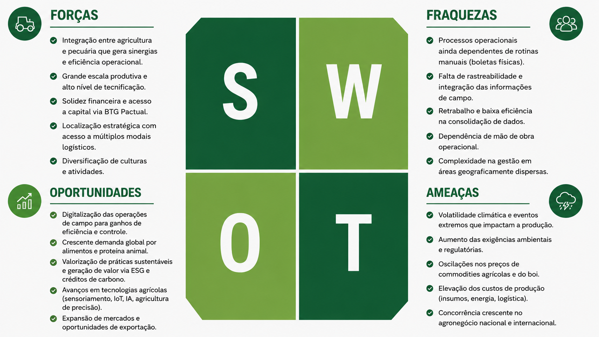</a>
</p>

<p align="center">Fonte: Próprios autores (2026).</p>
</div>

**1. Forças:**

&nbsp;&nbsp;&nbsp;&nbsp;A BRPec apresenta vantagens competitivas relevantes, destacando-se pela integração entre agricultura e pecuária, que permite redução de custos e maior eficiência operacional (ECONODATA, 2026). Sua grande escala produtiva contribui para ganhos de produtividade e diluição de riscos, enquanto o suporte financeiro do BTG Pactual amplia o acesso a crédito e instrumentos financeiros. Além disso, a consolidação de suas operações e sua localização logística estratégica, com acesso a diferentes modais de transporte, favorece o escoamento da produção e a inserção em mercados relevantes (BRPEC, 2026).

**2. Fraquezas:** 

&nbsp;&nbsp;&nbsp;&nbsp;Por outro lado, a dependência das decisões estratégicas do BTG Pactual, empresa controladora da BRPEC, pode limitar a autonomia da organização. A complexidade operacional, característica de operações de grande escala, exige elevado nível de gestão e controle, além de envolver forte dependência de mão de obra operacional, devido ao grande número de trabalhadores, aos custos associados e às dificuldades de gestão em áreas remotas. Soma-se a isso a presença de gargalos operacionais relacionados à utilização de boletas físicas, ao retrabalho na consolidação de dados e à ausência de rastreabilidade das informações de campo. Adicionalmente, a exposição a riscos ambientais e regulatórios pode gerar impactos reputacionais e financeiros, especialmente diante das exigências do Código Florestal (BRASIL, 2012).

**3. Oportunidades:**

&nbsp;&nbsp;&nbsp;&nbsp; No ambiente externo, a digitalização das operações de campo surge como oportunidade estratégica para aumentar eficiência, integração e controle operacional, reduzindo falhas de comunicação, retrabalho e atrasos na consolidação das informações. Além disso, a crescente demanda global por proteína animal, a valorização de práticas sustentáveis ligadas à agenda ESG e créditos de carbono (DE OLHO NOS RURALISTAS, 2025), bem como o avanço de tecnologias aplicadas ao agronegócio, ampliam o potencial competitivo da BRPec e fortalecem suas possibilidades de expansão e otimização operacional (APROSOJA MS, 2024).

**4. Ameaças:**

&nbsp;&nbsp;&nbsp;&nbsp;Em contrapartida, a BRPec está inserida em um ambiente de crescente rigor regulatório, especialmente no que se refere às questões ambientais (BRASIL, 2012). A volatilidade climática, particularmente em regiões como o Pantanal, pode impactar diretamente a produtividade. Adicionalmente, a continuidade de processos manuais e descentralizados pode ampliar riscos de falhas na comunicação, perda de informações e atrasos na consolidação dos dados operacionais. Soma-se isso a oscilação nos preços de commodities e o aumento dos custos operacionais representam riscos à rentabilidade, exigindo estratégias robustas de gestão de risco e eficiência operacional para garantir sustentabilidade no longo prazo.


### <a name="c2.1.3"></a>2.1.3. Solução

**1. Problema a ser resolvido**

&nbsp;&nbsp;&nbsp;&nbsp;Os capatazes da BrPec registram informações operacionais em papel durante atividades em campo, principalmente em locais sem internet. Isso gera retrabalho na transcrição para planilhas, risco de perda de dados, falta de padronização dos registros e dificuldade para consolidar informações como nascimento, morte, transferência de gado e solicitações operacionais.

**2. Dados disponíveis**

&nbsp;&nbsp;&nbsp;&nbsp;Serão utilizados dados levantados no TAPI e nas informações fornecidas pela BrPec, incluindo estrutura operacional dos retiros, registros de movimentação bovina, ocorrências de nascimento, morte e transferência, solicitações de manutenção, necessidades relacionadas ao envio de evidências pelos usuários e requisitos definidos para os perfis de capataz, supervisor e gerente.

**3. Solução proposta**

 &nbsp;&nbsp;&nbsp;&nbsp;A solução proposta é uma aplicação web offline-first para registrar informações operacionais em campo, com sincronização automática ao restabelecer a conexão com a internet. O sistema permitirá registrar eventos, anexar evidências multimodais, organizar dados por retiro e tipo de ocorrência, além de possibilitar exportação em Excel/CSV e acompanhamento por diferentes perfis de usuário.

**4. Forma de utilização da solução**

&nbsp;&nbsp;&nbsp;&nbsp; Os capatazes utilizarão a aplicação em dispositivos móveis durante as atividades no campo, mesmo sem internet. Os dados serão salvos localmente e sincronizados automaticamente quando houver conexão disponível. Supervisores e gerentes poderão acessar os registros consolidados, acompanhar ocorrências, validar informações e exportar relatórios para apoio à gestão operacional.

**5. Benefícios esperados**

&nbsp;&nbsp;&nbsp;&nbsp;Espera-se reduzir o uso de papel, diminuir erros de transcrição, padronizar os registros operacionais e acelerar a consolidação das informações entre retiros. A solução também melhora a rastreabilidade das ocorrências, facilita a comunicação entre capatazes, supervisores e gerentes, e apoia decisões com dados mais organizados, completos e atualizados.

**6. Critério de sucesso e como será avaliado**

&nbsp;&nbsp;&nbsp;&nbsp;O sucesso será avaliado por testes com usuários, considerando métricas como conclusão de registros em até três etapas, sincronização correta dos dados após reconexão, exportação funcional em Excel/CSV e facilidade de utilização da interface por usuários com baixa familiaridade digital. Também será verificada a redução de erros e retrabalho em comparação ao processo manual.


### <a name="c2.1.4"></a>2.1.4. Value Proposition Canvas (sprint 1)
&nbsp;&nbsp;&nbsp;&nbsp;Segundo Osterwalder (2014), a ferramenta Canvas de Proposta de Valor (CPV) é utilizada estrategicamente para mapear e validar se a proposta de valor de um produto ou serviço se adequa às necessidades, dores e expectativas dos clientes. Essa ferramenta permite compreender a relação entre o que a empresa oferece e o que o cliente busca, facilitando a criação de soluções eficazes e relevantes. Assim, esse recurso foi utilizado no presente projeto a fim de apresentar a construção da proposta de valor e o diagnóstico dos problemas identificados a partir das demandas da BRPec Agropecuária S.A. Conforme a figura 3.

<div align="center">
<p align="center">Figura 3 - Canvas Proposta de Valor</p>
<p align="center">

>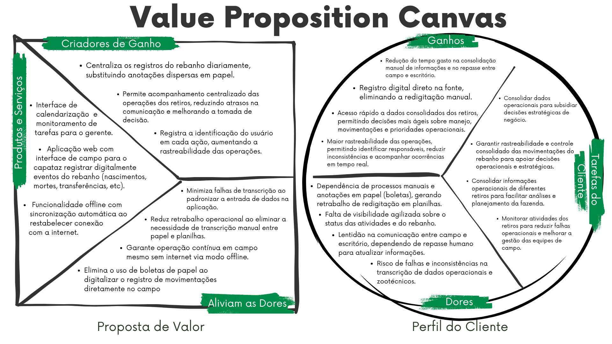</a>
</p>

<p align="center">Fonte: Próprios autores (2026).</p>
</div>


### Perfil do Cliente

**- Tarefas do Cliente:**

&nbsp;&nbsp;&nbsp;&nbsp;Nas tarefas do cliente, são delimitadas as tarefas que um cliente está tentando fazer, especialmente antes de utilizar uma nova solução proposta por uma determinada organização (G4 EDUCAÇÃO, 2025). Com isso, a equipe identificou as seguintes tarefas do cliente:

- Consolidar dados operacionais para subsidiar decisões estratégicas de negócios;
- Garantir rastreabilidade e controle consolidado das movimentações do rebanho para apoiar decisões operacionais e estratégicas;
- Consolidar informações operacionais de diferentes retiros para facilitar análises e planejamento da fazenda;
- Monitorar atividades dos retiros para reduzir falhas operacionais e melhorar a gestão de equipes de campo.


**- Dores:**

&nbsp;&nbsp;&nbsp;&nbsp;Na seção de dores do Canvas Proposta de Valor, são adicionadas as frustrações que o cliente sofre ao tentar realizar determinada tarefa (G4 EDUCAÇÃO, 2025). Desse modo, foram elencadas as seguintes dores do cliente:

- Dependência de processos manuais e anotações em papel (boletas), gerando retrabalho de redigitação em planilhas;
- Falta de visibilidade agilizada sobre o status das atividades e do rebanho;
- Lentidão na comunicação entre campo e escritório, dependendo de repasse humano para atualizar informações;
- Risco de falhas e inconsistências na transcrição de dados operacionais e zootécnicos.


**- Ganhos:**

&nbsp;&nbsp;&nbsp;&nbsp;Na seção de ganhos do Canvas Proposta de Valor, são colocados os resultados que o cliente aspira ter quando realiza uma tarefa (G4 EDUCAÇÃO, 2025). Assim, foram identificados os seguintes ganhos do cliente:

- Redução do tempo gasto na consolidação manual de informações e no repasse entre campo e escritório;
- Registro digital direto na fonte, eliminando a redigitação manual;
- Acesso rápido a dados consolidados dos retiros para tomada de decisão operacional estratégica;
- Maior rastreabilidade e controle nas operações, permitindo identificar responsáveis, reduzir inconsistências e acompanhar ocorrências em tempo real.

### Proposta de Valor

**- Produtos e Serviços:**

&nbsp;&nbsp;&nbsp;&nbsp;A seção de produtos e serviços de um Canvas Proposta de Valor se refere aos recursos oferecidos por uma determinada organização (G4 EDUCAÇÃO, 2025). Dessa forma, é possível mencionar os seguintes no que se refere à solução proposta pela equipe:

- Interface de calendarização e acompanhamento operacional para supervisores e gerentes;
- Aplicação web com interface de campo para o capataz registrar digitalmente eventos do rebanho (nascimentos, mortes, compras, vendas e transferências);
- Funcionalidade offline com sincronização automática ao restabelecer conexão com a internet.

**- Criadores de Ganho:**

&nbsp;&nbsp;&nbsp;&nbsp;A seção de criadores de ganhos de um Canvas Proposta de Valor diz respeito a como os produtos e serviços de uma determinada organização acarretam os resultados que o cliente espera (G4 EDUCAÇÃO, 2025). A partir disso, foram elencados os seguintes criadores de ganho:

- Centraliza os registros do rebanho diariamente, substituindo anotações dispersas em papel;
- Permite acompanhamento centralizado das operações dos retiros, reduzindo atrasos na comunicação e melhorando a tomada de decisão;
- Registra a identificação do usuário em cada ação, aumentando a rastreabilidade das operações.

**- Aliviadores de Dores:**

&nbsp;&nbsp;&nbsp;&nbsp;A seção de aliviadores de dor de um Canvas Proposta de Valor mostra de qual maneira os produtos e serviços propostos por uma organização tratam as dores do cliente (G4 EDUCAÇÃO, 2025). Por conseguinte, foram elaborados os seguintes aliviadores de dor:

- Minimiza falhas de transcrição ao padronizar a entrada de dados na aplicação;
- Reduz retrabalho operacional ao eliminar a necessidade de transcrição manual entre papel e planilha;
- Garante operação contínua em campo mesmo sem conexão com a internet (via modo offline);
- Elimina o uso de boletas de papel ao digitalizar o registro de movimentações diretamente no campo.


### <a name="c2.1.5"></a>2.1.5. Matriz de Riscos do Projeto (sprint 1)

&nbsp;&nbsp;&nbsp;&nbsp;A matriz de risco é uma ferramenta utilizada para identificar, analisar e classificar os riscos de um projeto, permitindo compreender tanto as ameaças (riscos negativos) quanto às oportunidades (riscos positivos) que devem ser priorizadas ao longo do seu desenvolvimento (PMI, 2021). Dessa forma, foi elaborada a matriz de risco do projeto BRPEC, conforme apresentado na Figura 4.

<div align="center">
  <p align="center">Figura 4 - Matriz de Risco</p>
  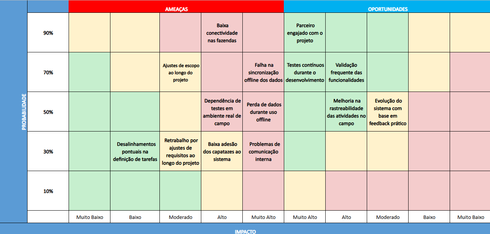
  <p align="center">Fonte: Próprios autores (2026).</p>
</div>

**Planos de ação, impacto e probabilidade**

&nbsp;&nbsp;&nbsp;&nbsp;Em linhas gerais, um plano de ação consiste em um conjunto de medidas definidas para lidar com os riscos identificados, estando diretamente relacionado à matriz de riscos, com o objetivo de potencializar oportunidades e mitigar ameaças ao longo do projeto (PMI, 2021). Dessa forma, foram elaborados planos de ação referentes aos riscos apresentados na matriz de risco do projeto BRPEC, de acordo com os quadros 1 e 2. Além disso, foram considerados os impactos e as probabilidades de cada risco, uma vez que são fundamentais para sua análise e acompanhamento durante o desenvolvimento do projeto. 

<p align="center">Quadro 1 - Plano de ação para as ameaças.</p>

| Ameaça                                                   | Plano de ação                                                                                                                            | Probabilidade | Impacto    |
| -------------------------------------------------------- | ---------------------------------------------------------------------------------------------------------------------------------------- | ------------- | ---------- |
| Baixa conectividade nas fazendas                         | Desenvolver funcionalidades offline-first, permitindo o registro de informações mesmo sem conexão com a internet.                        | 90%           | Alto       |
| Falha na sincronização offline dos dados                 | Implementar validações automáticas e testes de sincronização para garantir o envio correto dos dados quando a conexão for restabelecida. | 70%           | Muito Alto |
| Ajustes de escopo ao longo do projeto                    | Validar os requisitos no início de cada sprint e registrar mudanças no backlog do projeto.                                               | 70%           | Moderado   |
| Dependência de testes em ambiente real de campo          | Criar cenários simulados de uso para antecipar falhas antes da validação em campo.                                                       | 50%           | Alto       |
| Perda de dados durante uso offline                       | Implementar salvamento automático local e mecanismos de recuperação de dados não sincronizados.                                          | 50%           | Muito Alto |
| Desalinhamentos pontuais na definição de tarefas         | Definir responsáveis, prazos e critérios de aceite antes do início de cada sprint.                                                       | 30%           | Baixo      |
| Retrabalho por ajustes de requisitos ao longo do projeto | Realizar revisões frequentes dos requisitos com o parceiro antes da implementação das funcionalidades.                                   | 30%           | Moderado   |
| Baixa adesão dos capatazes ao sistema                    | Desenvolver interface simples, com botões claros e fluxo de uso intuitivo, além de realizar validações com usuários finais.              | 30%           | Alto       |
| Problemas de comunicação interna                         | Manter reuniões periódicas, registrar decisões importantes e acompanhar o andamento das tarefas no quadro de gestão do projeto.          | 30%           | Muito Alto |


<p align="center">Fonte: Próprios autores (2026).</p>

------


<p align="center">Quadro 2 - Plano de ação para as oportunidades.</p>

| Oportunidade                                        | Plano de ação                                                                    | Probabilidade | Impacto    |
| --------------------------------------------------- | -------------------------------------------------------------------------------- | ------------- | ---------- |
| Parceiro engajado com o projeto                     | Manter contato frequente e apresentar entregas parciais para validação           | 90%           | Muito Alto |
| Testes contínuos durante o desenvolvimento          | Realizar testes a cada funcionalidade desenvolvida                               | 70%           | Muito Alto |
| Validação frequente das funcionalidades             | Validar as funcionalidades ao final de cada sprint com o parceiro                | 70%           | Alto       |
| Melhoria na rastreabilidade das atividades no campo | Estruturar os registros no sistema e garantir o preenchimento adequado dos dados | 50%           | Alto       |
| Evolução do sistema com base em feedback prático    | Coletar feedback após cada entrega e priorizar melhorias no backlog              | 50%           | Moderado   |

<p align="center">Fonte: Próprios autores (2026).</p>


***Conclusão***

&nbsp;&nbsp;&nbsp;&nbsp;A aplicação integrada das análises SWOT, Cinco Forças de Porter e Business Model Canvas foi fundamental para entender melhor o problema enfrentado pela BRPec e direcionar a solução proposta. A análise SWOT ajudou a organizar os principais pontos internos e externos do negócio, evidenciando tanto a força da operação quanto limitações como a dependência de processos manuais. Já o modelo de Porter mostrou como o setor é altamente competitivo, com forte pressão de compradores e baixa diferenciação, exigindo maior eficiência operacional. Por fim, o Canvas permitiu enxergar o negócio de forma mais completa, conectando a proposta de valor com as necessidades reais da operação. No conjunto, essas análises deixaram claro que o principal desafio está na organização e confiabilidade das informações do campo, e que a digitalização dos processos é essencial para reduzir retrabalho, organizar os dados e aumentar o controle da operação.

## <a name="c2.2"></a>2.2. Personas (sprint 1)

&nbsp;&nbsp;&nbsp;&nbsp;Personas são definidas como representações fictícias, porém realistas, de usuários, utilizadas para sintetizar comportamentos, motivações, necessidades e objetivos de um determinado grupo. Embora não correspondam a indivíduos reais, são construídas com base em dados e padrões observáveis, permitindo-se uma compreensão mais aprofundada do público-alvo e apoiando o desenvolvimento de soluções orientadas ao usuário (HARLEY, 2015).

&nbsp;&nbsp;&nbsp;&nbsp;No contexto deste projeto, foram desenvolvidas três personas, como demonstra as figuras 5, 6 e 7, com o objetivo de representar os principais perfis de partes interessadas usuárias da solução proposta. Cada persona foi associada a um cargo presente na estrutura das fazendas da BrPec (capataz, supervisor e gerente), possibilitando-se a análise de diferentes perspectivas, responsabilidades e necessidades no contexto do sistema proposto.

### Persona 1 - Daniel Carvalho

<div align="center">
<p align="center">Figura 5 - Persona 1 (Daniel Carvalho)</p>
<p align="center">
<a href="https://www.inteli.edu.br/">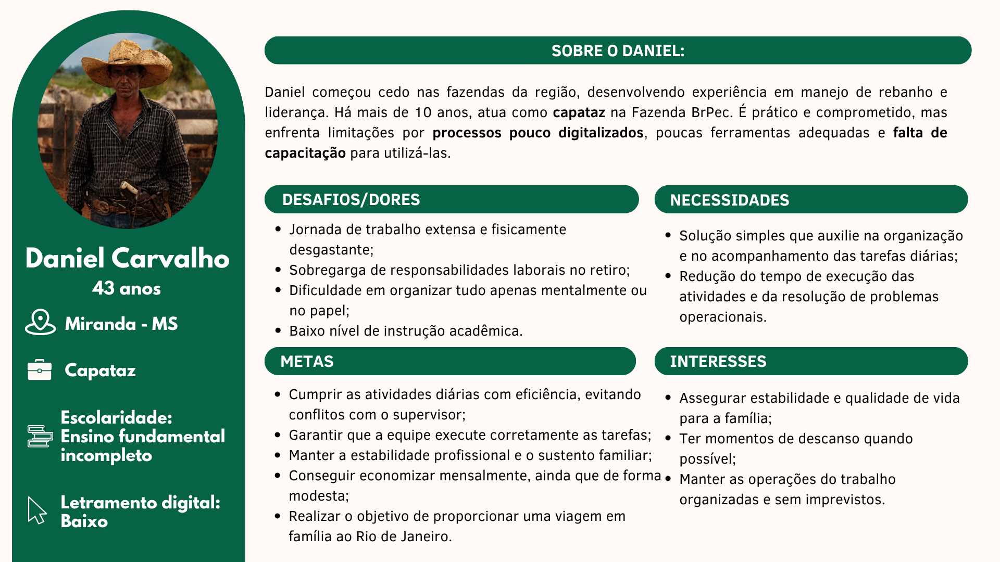</a>
</p>
<p align="center">Fonte: Próprios autores (2026).</p>
</div>

#### Informações

<p align="center">Quadro 3 - Informações do Daniel.</p>

| Campo               | Descrição                      |
|---------------------|--------------------------------|
| **Idade**           | 43 anos                        |
| **Localização**     | Miranda – MS                   |
| **Cargo**           | Capataz                        |
| **Escolaridade**    | Ensino fundamental incompleto  |
| **Letramento digital** | Baixo                       |

<p align="center">Fonte: Próprios autores (2026).</p>

**Biografia:**

&nbsp;&nbsp;&nbsp;&nbsp;Daniel Carvalho iniciou sua trajetória ainda jovem em fazendas da região, desenvolvendo experiência prática no manejo de rebanho e na coordenação de equipes. Atualmente, atua há mais de 10 anos como capataz na Fazenda BrPec, sendo responsável pela execução das atividades operacionais no retiro.

&nbsp;&nbsp;&nbsp;&nbsp;Apesar de ser um profissional experiente, prático e comprometido, enfrenta limitações relacionadas à baixa digitalização dos processos, à escassez de ferramentas adequadas e à falta de capacitação para utilização de tecnologias. Essas condições impactam diretamente a organização das tarefas e a eficiência no dia a dia.

**Metas:**

- Cumprir as atividades diárias com eficiência;
- Garantir que a equipe execute corretamente as tarefas;
- Manter a estabilidade profissional e o sustento familiar;
- Conseguir economizar mensalmente, ainda que de forma modesta;
- Proporcionar uma viagem em família.

**Necessidades:**

- Soluções simples e intuitivas para organização das tarefas;
- Ferramentas que auxiliem no acompanhamento das atividades;
- Redução do tempo gasto na execução e resolução de problemas.

**Desafios e Dores:**

- Jornada de trabalho extensa e fisicamente desgastante;
- Sobrecarga de responsabilidades no retiro;
- Dificuldade em organizar informações mentalmente ou em papel;
- Baixo nível de familiaridade com tecnologias digitais.

**Interesses:**

- Estabilidade financeira e qualidade de vida familiar;
- Momentos de descanso quando possível;
- Manter o trabalho organizado e sem imprevistos.

### Persona 2 - Luiz Felipe

<div align="center">
<p align="center">Figura 6 - Persona 2 (Luiz Felipe)</p>
<p align="center">
<a href="https://www.inteli.edu.br/"></a>
</p>
<p align="center">Fonte: Próprios autores (2026).</p>
</div>

**Informações:**

<p align="center">Quadro 4 - Informações do Luiz.</p>

| Campo               | Descrição               |
|---------------------|-------------------------|
| **Idade**           | 37 anos                 |
| **Localização**     | Campo Grande – MS       |
| **Cargo**           | Supervisor              |
| **Escolaridade**    | Ensino médio completo   |
| **Letramento digital** | Intermediário        |

<p align="center">Fonte: Próprios autores (2026).</p>

**Biografia:**

&nbsp;&nbsp;&nbsp;&nbsp;Luiz Felipe atua como supervisor na Fazenda Rocha Lima (BrPec), sendo responsável pela coordenação dos capatazes e pelo acompanhamento das operações de manejo. Possui experiência prática no campo e apresenta um perfil analítico, com foco na eficiência operacional e no desenvolvimento profissional.

&nbsp;&nbsp;&nbsp;&nbsp;No entanto, enfrenta dificuldades relacionadas à falta de integração de informações entre os retiros e a área administrativa, além de lidar com processos pouco estruturados, o que compromete a visibilidade e o controle das operações.

**Metas:**

- Reduzir erros e retrabalho;
- Aumentar a eficiência operacional;
- Desenvolver maior autonomia dos capatazes;
- Evoluir para funções de maior responsabilidade.

**Necessidades:**

- Tecnologias intuitivas que simplifiquem a gestão;
- Ferramentas que otimizem o tempo das atividades;
- Métodos que aumentem a produtividade da equipe.

**Desafios e Dores:**

- Dificuldade em supervisionar múltiplas frentes;
- Baixa visibilidade das operações;
- Comunicação informal e descentralizada;
- Retrabalho decorrente de falhas e desalinhamentos.

**Interesses:**

- Ferramentas simples para acompanhamento em tempo real;
- Visão consolidada das operações;
- Melhor organização das rotinas;
- Redução da dependência de comunicação informal.

### Persona 3 - Marcos Ferreira
<div align="center">
<p align="center">Figura 7 - Persona 3 (Marcos Ferreira)</p>
<p align="center">
<a href="https://www.inteli.edu.br/"></a>
</p>
<p align="center">Fonte: Próprios autores (2026).</p>
</div>

**Informações:**

<p align="center">Quadro 5 - Informações do Marcos.</p>

| Campo               | Descrição                    |
|---------------------|------------------------------|
| **Idade**           | 49 anos                      |
| **Localização**     | Dourados – MS                |
| **Cargo**           | Gerente da fazenda           |
| **Escolaridade**    | Ensino superior completo     |
| **Letramento digital** | Intermediário             |

<p align="center">Fonte: Próprios autores (2026).</p>

**Biografia:**

&nbsp;&nbsp;&nbsp;&nbsp;Marcos Ferreira atua como gerente da Fazenda Rocha Lima (BrPec), sendo responsável pela supervisão da equipe e pelos resultados operacionais. Formado em Administração, possui uma visão estratégica voltada para eficiência, controle e tomada de decisão baseada em dados.

&nbsp;&nbsp;&nbsp;&nbsp;Apesar disso, enfrenta desafios relacionados à baixa integração e confiabilidade dos dados operacionais, especialmente os provenientes do campo, além da dependência de registros manuais, o que impacta a qualidade das informações e a agilidade na gestão.

**Metas:**

- Reduzir o estresse operacional e a dependência de ações reativas;
- Garantir maior previsibilidade dos resultados;
- Melhorar a qualidade e agilidade das informações;
- Possibilitar melhor equilíbrio entre vida profissional e pessoal.

**Necessidades:**

- Visão consolidada e confiável das operações;
- Redução de erros na coleta de dados;
- Ferramentas acessíveis para todos os níveis da operação;
- Apoio à tomada de decisão com base em dados organizados.

**Desafios e Dores:**

- Baixa integração e confiabilidade dos dados;
- Dificuldade de acompanhamento do realizado vs. planejado;
- Dependência de registros manuais sujeitos a erros;
- Pressão por resultados e controle de custos.

**Interesses:**

- Soluções digitais práticas e de fácil adoção;
- Integração entre operação e gestão;
- Indicadores claros para tomada de decisão;
- Estabilidade financeira e qualidade de vida.


## <a name="c2.3"></a>2.3. User Stories (sprints 1 a 5)

&nbsp;&nbsp;&nbsp;&nbsp;As user stories (ou histórias de usuário) consistem em descrições simples e objetivas das funcionalidades de um sistema, elaboradas a partir da perspectiva do usuário final, com foco no valor entregue e sem o uso de linguagem técnica excessiva (COHN, 2004; PATTON, 2014). Nesse contexto, elas são centradas nas necessidades e experiências dos usuários, contribuindo para um desenvolvimento mais alinhado à realidade de uso e aos objetivos do negócio (PRESSMAN; MAXIM, 2020). No presente projeto da BRPec, as user stories foram definidas com base nos fluxos operacionais da fazenda, como gestão de tarefas, registro de movimentações do rebanho e comunicação entre campo e escritório, estruturando os requisitos da aplicação web proposta, de acordo com os quadros 6, 7, 8, 9, 10, 11, 12, 13, 14, 15, 16 e 17.

<p align="center">Quadro 6 - User Story 01.</p>

| Identificação | [US01](graduacao/2026-1b/t26/g02#36) |
| - | - |
| Persona | Daniel Carvalho |
| User Story | Como capataz, posso usar o sistema offline, para registrar dados sem internet. |
| Critério de aceite 1 | Dado que não há conexão, quando acessa o sistema, então as funcionalidades principais permanecem disponíveis. |
| Critério de aceite 2 | Dado que registra dados offline, quando salva, então o sistema armazena localmente. |
| Critério de aceite 3 | Dado que a conexão retorna, quando o sistema detecta internet, então os dados são sincronizados automaticamente. |
| Critérios INVEST | <p>Independente: Pode ser implementada sem depender de outros módulos além do armazenamento local.</p> <p>Negociável: A estratégia de sincronização pode ser ajustada conforme decisão técnica.</p> <p>Valorosa: Permite o uso do sistema em campo sem acesso à internet.</p> <p>Estimável: O fluxo offline e sincronização está claramente definido.</p> <p>Pequena: Pode ser implementada inicialmente para funções essenciais.</p> <p>Testável: Pode ser validada simulando ausência e retorno de conexão.</p> |

<p align="center">Fonte: Próprios autores (2026).</p>

---

<p align="center">Quadro 7 - User Story 02.</p>

| Identificação | [US02](graduacao/2026-1b/t26/g02#35) |
| - | - |
| Persona | Daniel Carvalho |
| User Story | Como capataz, posso registrar movimentações do rebanho, para substituir o uso de boletas em papel. |
| Critério de aceite 1 | Dado que o usuário acessa o formulário, quando preenche os campos obrigatórios, então o sistema permite o registro. |
| Critério de aceite 2 | Dado que há campos obrigatórios vazios, quando tenta salvar, então o sistema impede o envio. |
| Critério de aceite 3 | Dado que não há conexão, quando registra, então o dado é salvo localmente. |
| Critérios INVEST | <p>Independente: A funcionalidade pode ser desenvolvida de forma isolada, sem depender de outros módulos.</p> <p>Negociável: Os campos do formulário podem ser ajustados conforme necessidade.</p> <p>Valorosa: Elimina o uso de boletas em papel, reduzindo erros e retrabalho.</p> <p>Estimável: Possui escopo claro, envolvendo formulário e validação.</p> <p>Pequena: Restrita ao registro de movimentações.</p> <p>Testável: Pode ser validada pelo preenchimento e salvamento correto dos dados.</p> |

<p align="center">Fonte: Próprios autores (2026).</p>

---

<p align="center">Quadro 8 - User Story 03.</p>

| Identificação | [US03](graduacao/2026-1b/t26/g02#41) |
| - | - |
| Persona | Luiz Felipe |
| User Story | Como supervisor, posso criar tarefas para os capatazes, para organizar a operação. |
| Critério de aceite 1 | Dado que cria uma tarefa, quando preenche os dados, então o sistema permite salvar. |
| Critério de aceite 2 | Dado que salva a tarefa, quando concluído, então ela fica visível ao capataz. |
| Critério de aceite 3 | Dado que há erro no preenchimento, quando tenta salvar, então o sistema impede a ação. |
| Critérios INVEST | <p>Independente: Pode ser desenvolvida sem depender da execução das tarefas.</p> <p>Negociável: Campos e categorias podem ser ajustados.</p> <p>Valorosa: Organiza a distribuição das atividades.</p> <p>Estimável: Escopo claro de criação de tarefas.</p> <p>Pequena: Funcionalidade simples de cadastro.</p> <p>Testável: Pode ser validada pela criação correta da tarefa.</p> |

<p align="center">Fonte: Próprios autores (2026).</p>

---

<p align="center">Quadro 9 - User Story 04.</p>

| Identificação | [US04](graduacao/2026-1b/t26/g02#39) |
| - | - |
| Persona | Luiz Felipe |
| User Story | Como supervisor, posso validar registros enviados, para garantir a confiabilidade dos dados. |
| Critério de aceite 1 | Dado que existem registros pendentes, quando acessa a tela, então visualiza a lista. |
| Critério de aceite 2 | Dado que analisa uma movimentação pendente, quando valida, então o status é atualizado para validado. |
| Critério de aceite 3 | Dado que encontra inconsistência, quando solicita correção, então o registro permanece pendente para ajuste. |
| Critérios INVEST | <p>Independente: Pode ser executada após o registro dos dados.</p> <p>Negociável: As regras de validação podem ser ajustadas.</p> <p>Valorosa: Garante maior qualidade das informações.</p> <p>Estimável: Fluxo simples de conferência e validação.</p> <p>Pequena: Restrita à validação de registros.</p> <p>Testável: Pode ser validada pela alteração de status.</p> |

<p align="center">Fonte: Próprios autores (2026).</p>

---

<p align="center">Quadro 10 - User Story 05.</p>

| Identificação | [US05](graduacao/2026-1b/t26/g02#42) |
| - | - |
| Persona | Luiz Felipe |
| User Story | Como supervisor, posso receber alertas de problemas, para agir rapidamente. |
| Critério de aceite 1 | Dado que ocorre um problema, quando identificado, então o sistema gera um alerta. |
| Critério de aceite 2 | Dado que há alerta, quando acessa o painel, então o supervisor visualiza a notificação. |
| Critério de aceite 3 | Dado que clica no alerta, quando acessa, então é redirecionado ao detalhe correspondente. |
| Critérios INVEST | <p>Independente: Depende apenas da geração de eventos no sistema.</p> <p>Negociável: Tipos de alerta podem ser ajustados.</p> <p>Valorosa: Permite resposta rápida a problemas.</p> <p>Estimável: Escopo claro de notificação.</p> <p>Pequena: Restrita à exibição de alertas.</p> <p>Testável: Validada pela geração e visualização de alertas.</p> |

<p align="center">Fonte: Próprios autores (2026).</p>

---

<p align="center">Quadro 11 - User Story 06.</p>

| Identificação        | [US06](graduacao/2026-1b/t26/g02#40) |
| -------------------- | - |
| Persona              | Luiz Felipe   |
| User Story           | Como supervisor, posso visualizar chamados de infraestrutura, para gerenciar problemas. |
| Critério de aceite 1 | Dado que existem chamados, quando acessa a tela, então o sistema exibe a lista.  |
| Critério de aceite 2 | Dado que seleciona um chamado, quando abre, então visualiza os detalhes. |
| Critério de aceite 3 | Dado que altera o status, quando salva, então o sistema atualiza o chamado. |
| Critérios INVEST     | <p>Independente: Pode ser desenvolvido como módulo separado.</p> <p>Negociável: Os status podem ser ajustados.</p> <p>Valorosa: Permite gestão estruturada de problemas.</p> <p>Estimável: Escopo simples de listagem e atualização.</p> <p>Pequena: Restrita à visualização e alteração de status.</p> <p>Testável: Validada pela atualização do chamado.</p> |

<p align="center">Fonte: Próprios autores (2026).</p>

---

<p align="center">Quadro 12 - User Story 07.</p>

| Identificação | [US07](graduacao/2026-1b/t26/g02#38) |
| - | - |
| Persona | Daniel Carvalho |
| User Story | Como capataz, posso abrir chamados de infraestrutura, para reportar problemas. |
| Critério de aceite 1 | Dado que cria um chamado, quando preenche os dados, então o sistema permite envio. |
| Critério de aceite 2 | Dado que envia o chamado, quando salvo, então fica registrado no sistema. |
| Critério de aceite 3 | Dado que acessa histórico, quando consulta, então visualiza seus chamados. |
| Critérios INVEST | <p>Independente: Pode ser desenvolvida separadamente dos demais módulos.</p> <p>Negociável: Campos como prioridade e categoria podem ser ajustados.</p> <p>Valorosa: Permite comunicação estruturada de problemas no retiro.</p> <p>Estimável: Escopo claro envolvendo criação e consulta.</p> <p>Pequena: Restrita à abertura e visualização de chamados.</p> <p>Testável: Pode ser validada pela criação e listagem dos chamados.</p> |

<p align="center">Fonte: Próprios autores (2026).</p>

---

<p align="center">Quadro 13 - User Story 08.</p>

| Identificação        | [US08](graduacao/2026-1b/t26/g02#44) |
| -------- | ---- |
| Persona              | Marcos Ferreira   |
| User Story           | Como gerente, posso visualizar um dashboard com indicadores da fazenda, para acompanhar a operação.   |
| Critério de aceite 1 | Dado que existem dados, quando o gerente acessa o sistema, então o dashboard exibe indicadores principais.  |
| Critério de aceite 2 | Dado que novos dados são sincronizados, quando atualizados, então o dashboard reflete as mudanças. |
| Critério de aceite 3 | Dado que o dashboard é exibido, quando acessado, então mostra a data da última atualização. |
| Critérios INVEST     | <p>Independente: Depende apenas dos dados existentes.</p> <p>Negociável: Indicadores podem ser ajustados.</p> <p>Valorosa: Fornece visão estratégica da operação.</p> <p>Estimável: Escopo claro de visualização.</p> <p>Pequena: Restrita ao dashboard.</p> <p>Testável: Validada pela atualização dos indicadores.</p> |

<p align="center">Fonte: Próprios autores (2026).</p>
</div>

---

<p align="center">Quadro 14 - User Story 09.</p>

| Identificação        | [US09](graduacao/2026-1b/t26/g02#43)   |
| -------------------- | -- |
| Persona              | Luiz Felipe   |
| User Story           | Como supervisor, posso gerar relatórios semanais, para acompanhar a operação. |
| Critério de aceite 1 | Dado que existem dados, quando o supervisor solicita relatório, então o sistema gera o arquivo.   |
| Critério de aceite 2 | Dado que o relatório é gerado, quando aberto, então contém dados consolidados.  |
| Critério de aceite 3 | Dado que não há dados, quando gera relatório, então o sistema informa ausência de registros.|
| Critérios INVEST     | <p>Independente: Depende apenas dos dados já registrados.</p> <p>Negociável: O formato do relatório pode ser ajustado.</p> <p>Valorosa: Permite acompanhamento da operação.</p> <p>Estimável: Escopo claro de geração de relatório.</p> <p>Pequena: Restrita à exportação de dados.</p> <p>Testável: Validada pela geração e abertura do arquivo.</p> |

<p align="center">Fonte: Próprios autores (2026).</p>

---

<p align="center">Quadro 15 - User Story 10.</p>

| Identificação        | [US10](graduacao/2026-1b/t26/g02#46) |
| ---- | -- |
| Persona              | Marcos Ferreira    |
| User Story           | Como gerente, posso visualizar histórico de chamados, para acompanhar problemas recorrentes. |
| Critério de aceite 1 | Dado que existem chamados, quando acessa o sistema, então visualiza a lista completa. |
| Critério de aceite 2 | Dado que aplica filtros, quando seleciona critérios, então a lista é atualizada.  |
| Critério de aceite 3 | Dado que acessa um chamado, quando abre, então visualiza os detalhes.  |
| Critérios INVEST     | <p>Independente: Depende do módulo de chamados.</p> <p>Negociável: Os filtros podem ser ajustados.</p> <p>Valorosa: Permite análise de problemas recorrentes.</p> <p>Estimável: Escopo claro de consulta.</p> <p>Pequena: Restrita à visualização e filtragem.</p> <p>Testável: Validada pela listagem correta dos chamados.</p> |

<p align="center">Fonte: Próprios autores (2026).</p>

---

<p align="center">Quadro 16 - User Story 11.</p>

| Identificação        | [US11](graduacao/2026-1b/t26/g02#47) |
| -------------------- | --- |
| Persona              | Marcos Ferreira                                               |
| User Story           | Como gerente, posso filtrar dados por retiro, para analisar o desempenho de cada unidade da fazenda.  |
| Critério de aceite 1 | Dado que existem dados registrados, quando o gerente aplica filtro por retiro, então o sistema exibe apenas os dados correspondentes.   |
| Critério de aceite 2 | Dado que o gerente combina filtros, quando seleciona um período, então os dados são refinados conforme os critérios definidos.                                            |
| Critério de aceite 3 | Dado que o gerente altera o filtro, quando seleciona outro retiro, então os resultados são atualizados automaticamente.  |
| Critérios INVEST     | <p>Independente: Pode ser desenvolvida de forma isolada, desde que os dados já estejam disponíveis no sistema.</p> <p>Negociável: Os tipos de filtros podem ser ajustados conforme necessidade.</p> <p>Valorosa: Permite análise detalhada do desempenho por unidade, apoiando a tomada de decisão.</p> <p>Estimável: O escopo é claro, envolvendo aplicação de filtros sobre dados existentes.</p> <p>Pequena: Restrita à funcionalidade de filtragem e atualização de dados.</p> <p>Testável: Pode ser validada verificando se os dados exibidos correspondem aos filtros aplicados.</p> |

<p align="center">Fonte: Próprios autores (2026).</p>

---

<p align="center">Quadro 17 - User Story 12.</p>

| Identificação | [US12](graduacao/2026-1b/t26/g02#37) |
| - | - |
| Persona | Daniel Carvalho |
| User Story | Como capataz, posso anexar fotos como evidência, para comprovar ações realizadas. |
| Critério de aceite 1 | Dado que o usuário registra uma ação, quando anexa foto, então o sistema salva a imagem. |
| Critério de aceite 2 | Dado que a imagem é enviada, quando salva, então fica vinculada ao registro. |
| Critério de aceite 3 | Dado que acessa o registro, quando visualiza, então a imagem deve estar disponível. |
| Critérios INVEST | <p>Independente: Pode ser desenvolvida como complemento aos registros existentes.</p> <p>Negociável: O tipo de evidência pode ser ampliado para vídeo ou áudio.</p> <p>Valorosa: Aumenta a confiabilidade das informações registradas.</p> <p>Estimável: Escopo claro envolvendo upload e armazenamento.</p> <p>Pequena: Restrita ao envio e visualização de imagens.</p> <p>Testável: Pode ser validada pelo upload correto e exibição da imagem.</p> |

<p align="center">Fonte: Próprios autores (2026).</p>


# <a name="c3"></a>3. Projeto da Aplicação Web (sprints 1 a 5)

## <a name="c3.1"></a>3.1. Requisitos do Sistema (sprints 1 a 5)

&nbsp;&nbsp;&nbsp;&nbsp;Os requisitos do sistema representam o ponto de partida para tudo que será construído, estabelecendo um entendimento comum entre nossa equipe e o parceiro sobre o que a aplicação precisa ser, como deve se comportar e sob quais critérios será testada e aprovada.

&nbsp;&nbsp;&nbsp;&nbsp;Eles estão organizados em duas categorias complementares, os requisitos funcionais, que descrevem o que o sistema deve fazer, como o registro de movimentações, o controle de acesso por perfil e a operação offline e os requisitos não funcionais, que definem a qualidade com que essas funcionalidades devem ser entregues, abrangendo desempenho, segurança, confiabilidade e usabilidade.

&nbsp;&nbsp;&nbsp;&nbsp;Para garantir objetividade na avaliação dessa qualidade, os requisitos não funcionais foram estruturados com base na norma ISO/IEC 25010 (ISO/IEC 25010, 2023). Todo o conteúdo desta seção foi levantado junto ao parceiro BrPec Agropecuária, considerando a realidade operacional dos retiros e o perfil dos usuários finais.

**Minimundo**

&nbsp;&nbsp;&nbsp;&nbsp;O sistema BrPec Agropecuária atende às demandas operacionais de gestão pecuária em 14 retiros distribuídos entre o Pantanal e Cerrado sul mato-grossenses. A estrutura organizacional é composta por três perfis hierárquicos: Capataz, Supervisor e Gerente, cada qual com responsabilidades e níveis de acesso distintos.

&nbsp;&nbsp;&nbsp;&nbsp;Os Capatazes atuam no campo e registram movimentações do rebanho (nascimentos, mortes, transferências, compras e vendas), informando o estágio de vida e os dados específicos de cada tipo de movimentação, como origem, destino, quantidade ou causa do óbito quando aplicáveis. Também abrem tickets de infraestrutura para reportar problemas como cercas danificadas, falta de água ou equipamentos avariados, devendo anexar ao menos uma evidência descritiva.

&nbsp;&nbsp;&nbsp;&nbsp;Os Supervisores coordenam os Capatazes, criando e atribuindo tarefas com prioridade, categoria e descrição. Validam movimentações como conferência operacional e podem aprovar tarefas e tickets. Recebem notificações de tickets pendentes e podem atribuí-los conforme necessário.

&nbsp;&nbsp;&nbsp;&nbsp;O Gerente acessa o painel de consolidação, visualizando todas as movimentações validadas e tarefas e tickets aprovados pelo Supervisor, com rastreabilidade completa de quem registrou, quem validou ou aprovou e quando. Gera relatórios semanais e mensais em formato de planilha (.xlsx ou .csv), contendo exclusivamente dados sincronizados e conferidos.

&nbsp;&nbsp;&nbsp;&nbsp;Cada retiro possui usuários vinculados, garantindo isolamento de dados por perfil (RBAC). O sistema opera em modo offline, armazenando registros localmente e sincronizando automaticamente quando a conexão é restabelecida. Apenas dados sincronizados são visíveis ao Supervisor para validação e entram nos relatórios gerenciais.

&nbsp;&nbsp;&nbsp;&nbsp;O fluxo operacional completo segue a cadeia: Capataz registra → sistema sincroniza → Supervisor valida → dados conferidos são disponibilizados para o Gerente consolidar e gerar relatórios. Esse ciclo elimina boletas de papel, reduz erros de transcrição e centraliza digitalmente as informações operacionais da fazenda.

**Entidades principais:**

Usuário (perfis: Capataz, Supervisor, Gerente) vinculado a Retiro
Movimentação (registrada por Capataz, validada por Supervisor) associada a Evidências
Tarefa (criada por Supervisor, atribuída a Capataz) associada a Evidências
Ticket (aberto por Capataz, gerenciado por Supervisor) associada a Evidências
Evidência (foto georreferenciada, áudio ou mensagem) vinculada a Movimentações, Tarefas ou Tickets
Relatório (gerado por Gerente) consolidando dados conferidos

### <a name="c3.1.1"></a>3.1.1. Requisitos Funcionais (sprint 1, refinar até sprint 5)

<p align="center">Quadro 18 - Requisitos Funcionais</p>

| ID    | Descrição | Prioridade | Status       |
|-------|-----------|------------|--------------|
| RF001 | O sistema deve permitir o registro de movimentações do rebanho (nascimento, morte, transferência, compra e venda), com estágio de vida obrigatório e campos específicos conforme o tipo da movimentação.  | Alta       | Planejado |
| RF002 | O sistema deve permitir a criação e atribuição de tarefas a usuários específicos, com descrição, prioridade e categoria.  | Alta      | Planejado    |
| RF003 | O sistema deve funcionar de forma off-line e on-line, armazenando os dados localmente e sincronizando automaticamente com o servidor ao restabelecer conexão com a internet.  | Alta  | Planejado |
| RF004 | O sistema deve permitir o anexo de evidências às tarefas, movimentações e tickets, incluindo foto georreferenciada, áudios e mensagens escritas. | Alta  | Planejado |
| RF005 | O sistema deve identificar o usuário por meio de um processo simples, intuitivo e de fácil compreensão. | Alta  | Planejado |
| RF006 | O sistema deve permitir que o Supervisor visualize e valide movimentações registradas pelos Capatazes, além de aprovar tarefas e tickets pendentes.  | Média | Planejado |
| RF007 | O sistema deve gerar relatórios semanais e mensais de movimentação do rebanho e de tarefas, com exportação em formato de planilha.  | Média | Planejado |
| RF008 | O sistema deve disponibilizar tickets de infraestrutura, permitindo que Capatazes abram chamados pendentes e que Supervisores aprovem e atribuam chamados conforme necessário.  | Média | Planejado |
| RF009 | O sistema deve permitir que o Supervisor filtre movimentações por retiro, tipo de movimentação, período e status (pendente/validado) na interface de validação. | Média | Planejado |
| RF010 | O sistema deve exibir um dashboard ao Gerente com indicadores-chave consolidados: total de nascimentos, mortes, transferências, tickets aprovados e tarefas aprovadas, segmentados por retiro. | Média | Planejado |
| RF011 | O sistema deve permitir a definição de prioridade dos tickets de infraestrutura (alta, média ou baixa) para organização da demanda de manutenção. | Alta | Planejado |

<p align="center">Fonte: Próprios autores (2026).</p>

### <a name="c3.1.2"></a>3.1.2. Regras de Negócio (sprint 1, refinar até sprint 5)

&nbsp;&nbsp;&nbsp;&nbsp;As Regras de Negócio (RN) estabelecem as condições, restrições e validações que governam o comportamento do sistema, traduzindo políticas operacionais da BrPec Agropecuária em critérios implementáveis e testáveis. Cada regra está vinculada explicitamente a um ou mais Requisitos Funcionais (RF), garantindo rastreabilidade completa entre necessidades de negócio e especificações técnicas. A redação das RNs foi estruturada para permitir conversão direta em testes automatizados utilizando verbos de ação precisos e condições verificáveis.

<p align="center">Quadro 19 - Regras de Negócios</p>

| ID   | Descrição | RF Associado | Critério de Teste |
|:----:|-----------|:------------:|-------------------|
| RN01 | O sistema deve bloquear o envio de qualquer movimentação de rebanho caso o estágio de vida esteja ausente ou caso os campos específicos do tipo não sejam informados: compra e venda exigem quantidade; transferência exige origem, destino e quantidade; nascimento exige origem e quantidade; morte exige origem e causa do óbito. | RF001 | Dado que um usuário tenta registrar uma movimentação, quando algum campo obrigatório para o tipo selecionado está vazio, então o sistema retorna erro HTTP 400 com mensagem específica do campo faltante. |
| RN02 | A criação de uma nova tarefa no sistema deve falhar e retornar um erro de validação HTTP 400 caso não contenha o preenchimento simultâneo de: usuário atribuído, descrição, prioridade e categoria. | RF002 | Dado que um supervisor tenta criar uma tarefa, quando qualquer campo obrigatório (usuário, descrição, prioridade ou categoria) está ausente, então o sistema retorna HTTP 400 e lista os campos faltantes. |
| RN03 | Durante a operação em modo offline, os dados devem ser salvos no armazenamento local do dispositivo com flag `sincronizado = false`. A sincronização só deve ser disparada automaticamente quando o sistema detectar um status HTTP 200 válido de conexão restabelecida. | RF003 | Dado que o dispositivo está offline, quando uma movimentação é registrada, então o sistema salva localmente com `sincronizado = false` e dispara sincronização automática assim que receber HTTP 200 do servidor. |
| RN04 | Para a anexação de fotos como evidência, o sistema deve validar se o arquivo de imagem possui metadados de georreferenciamento (latitude entre −90 e +90, longitude entre −180 e +180). Caso não possua ou os valores sejam inválidos, a foto deve ser rejeitada com erro HTTP 400. | RF004 | Dado que um usuário anexa uma foto, quando latitude ou longitude estão ausentes ou fora dos intervalos válidos, então o sistema retorna HTTP 400 com mensagem "Foto rejeitada: georreferenciamento inválido ou ausente". |
| RN05 | A identificação do usuário deve ocorrer com no máximo 3 interações, utilizando linguagem clara (nível de escolaridade: ensino fundamental), instruções objetivas e elementos visuais (ícones, botões grandes) que facilitem o uso por pessoas com baixo letramento digital. | RF005 | Dado que um usuário acessa a tela de login, quando realiza a identificação, então o fluxo é concluído em até 3 interações (ex: selecionar perfil visual, inserir PIN, confirmar). |
| RN06 | A ação de validar uma movimentação ou aprovar uma tarefa/ticket deve ser restrita e estar visível/habilitada apenas para usuários com perfil "Supervisor". Usuários com perfil "Capataz" ou "Gerente" não devem ter acesso a essa funcionalidade. | RF006 | Dado que um usuário com perfil "Capataz" tenta validar uma movimentação, quando a requisição é enviada, então o sistema retorna HTTP 403. Dado que um usuário com perfil "Supervisor" valida uma movimentação, então o sistema retorna HTTP 200 e atualiza o status para "validado". |
| RN07 | A geração e exportação de relatórios semanais e mensais em formato de planilha (.xlsx ou .csv) só poderá ser processada utilizando dados com `sincronizado = true` no banco de dados. Dados com `sincronizado = false` (apenas locais/offline) não devem entrar no relatório gerado. | RF007 | Dado que um gerente solicita relatório semanal, quando o sistema processa os dados, então apenas registros com `sincronizado = true` são incluídos no arquivo exportado. |
| RN08 | Para a abertura de um ticket de infraestrutura por um Capataz, o sistema deve exigir obrigatoriamente a indicação de evidência descritiva no envio do chamado, podendo ser mensagem escrita válida ou áudio informado. Tickets sem evidência descritiva devem ser rejeitados com erro HTTP 400. | RF008 | Dado que um capataz tenta abrir um ticket, quando nenhuma evidência descritiva foi informada, então o sistema retorna HTTP 400 com mensagem "Ticket rejeitado: ao menos uma evidência descritiva é obrigatória". |
| RN09 | Os filtros de movimentação devem permitir seleção múltipla para os campos tipo (nascimento, morte, transferência, compra, venda, outros) e status (pendente, validado), mas apenas um retiro por vez. Quando nenhum filtro é aplicado, o sistema deve exibir todas as movimentações com status="pendente" dos retiros sob responsabilidade do Supervisor. | RF009 | Dado que um Supervisor acessa a interface de validação sem aplicar filtros, quando a página carrega, então o sistema exibe todas as movimentações com status="pendente" dos retiros vinculados ao perfil do Supervisor. Dado que o Supervisor aplica filtro tipo="morte" e status="validado", quando confirma, então apenas movimentações que atendem ambos os critérios são exibidas na listagem. |
| RN10 | O dashboard do Gerente deve calcular e exibir os indicadores consolidados (total de nascimentos, mortes, transferências, tickets aprovados e tarefas aprovadas) considerando exclusivamente movimentações com status="validado" e tarefas/tickets com status="aprovado", sempre com flag sincronizado=true. Registros pendentes ou não sincronizados não devem ser contabilizados nos indicadores. Os dados devem ser segmentados por retiro, exibindo totais individuais e um totalizador geral. | RF010 | Dado que o Gerente acessa o dashboard, quando o sistema processa os indicadores, então apenas registros conferidos e sincronizados são incluídos no cálculo. Dado que existem registros pendentes, quando o dashboard carrega, então esses registros não aparecem nos totalizadores exibidos. |
| RN11 | A prioridade do ticket (alta, média ou baixa) deve ser obrigatoriamente selecionada no momento da criação do ticket. O sistema deve bloquear o envio caso o campo prioridade não seja preenchido, retornando erro de validação HTTP 400. A alteração de prioridade posterior via edição deve ser permitida para reorganização da demanda operacional. | RF011 | Dado que um Capataz tenta criar um ticket sem selecionar o campo prioridade, quando tenta enviar, então o sistema retorna HTTP 400 com mensagem "Campo prioridade é obrigatório". |


<p align="center">Fonte: Próprios autores (2026).</p>

### <a name="c3.1.3"></a>3.1.3. Requisitos Não Funcionais — 8 Eixos ISO/IEC 25010 (sprints 1 a 5)

&nbsp;&nbsp;&nbsp;&nbsp;Os Requisitos Não Funcionais (RNF) estabelecem os critérios de qualidade que o sistema deve atender, traduzindo características operacionais, técnicas e organizacionais da BrPec Agropecuária em especificações mensuráveis e testáveis. Cada RNF foi estruturado segundo a norma ISO/IEC 25010 (ISO/IEC 25010, 2023), abrangendo oito eixos de qualidade de software, e derivado diretamente do contexto operacional do parceiro: os 14 retiros distribuídos no Pantanal e Cerrado, a conectividade instável via Starlink, o perfil dos usuários (capatazes com ensino fundamental incompleto), a criticidade da rastreabilidade de dados do rebanho e as restrições de suporte técnico remoto.

&nbsp;&nbsp;&nbsp;&nbsp;A derivação de cada RNF partiu da análise dos Requisitos Funcionais (RF), das Regras de Negócio (RN), das restrições organizacionais identificadas nas entrevistas com o parceiro e das limitações de infraestrutura dos retiros.Os critérios de aceite foram definidos com métricas objetivas, limites quantitativos e protocolos de teste específicos, permitindo validação em sessões controladas com usuários reais, testes de carga automatizados e auditorias de segurança. Essa estrutura garante rastreabilidade completa entre o contexto do parceiro, os requisitos funcionais e os atributos de qualidade esperados, estabelecendo uma base sólida para validação técnica e aceite do produto final.


<p align="center">Quadro 20 - Requisitos Não Funcionais — USAB — Usabilidade</p>

---

**USAB — Usabilidade**

| Campo | Conteúdo |
|:--|:--|
| **Requisito Não Funcional** | A interface deve ser operável por usuários com baixa alfabetização digital (ensino fundamental incompleto), sem necessidade de treinamento extenso ou suporte presencial. |
| **Métrica / Critério de Aceite** | **Quantitativa:** ≥80% dos capatazes testados (mínimo 5 participantes do perfil real: ensino fundamental incompleto, sem experiência com apps de gestão) concluem a tarefa de registrar uma movimentação de rebanho completa em até 3 minutos, sem auxílio externo, em no máximo 2 tentativas. **Protocolo de teste:** Sessão de usabilidade observada, com registro de tempo, número de tentativas e taxa de conclusão. Captura de erros de navegação e pontos de travamento. |
| **Derivação do Contexto do Parceiro** | Derivado do perfil dos capatazes da BrPec (baixo letramento digital, conforme personas Daniel e Luiz), da ausência de suporte técnico nos retiros isolados (restrição organizacional) e da necessidade de operação autônoma em campo. O RF005 exige identificação simples e intuitiva, traduzindo-se aqui em um critério de usabilidade mensurável aplicado ao fluxo crítico do sistema. |
| **RF/RN Associados** | RF001, RF005, RN05 |
| **Como será atendido** | Interface com ícones grandes, botões visuais autoexplicativos, textos curtos em linguagem simples (nível fundamental), fluxos de no máximo 3 etapas e feedback visual imediato. Design validado com usuários reais em sessões iterativas. |

---


<p align="center">Quadro 21 - Requisitos Não Funcionais — CONF — Confiabilidade</p>
</div>

**CONF — Confiabilidade**

| Campo | Conteúdo |
|:--|:--|
| **Requisito Não Funcional** | O sistema deve garantir integridade total dos dados registrados em modo offline, sem perda de informações durante o processo de sincronização com o servidor, mesmo em cenários adversos de conectividade. |
| **Métrica / Critério de Aceite** | **Quantitativa:** 0% de perda de registros em bateria de 100 ciclos de sincronização, cada ciclo contendo 50 registros de movimentação, cobrindo os cenários: (1) queda abrupta de rede durante envio, (2) timeout de servidor (>30s sem resposta), (3) conflito de versão entre cliente e servidor. **Protocolo de teste:** Testes automatizados de sincronização com simulação de falhas de rede (desconexão forçada, latência induzida, perda de pacotes). Logs de auditoria validando correspondência 1:1 entre registros locais e registros no servidor. Retomada automática em até 5 minutos após reconexão detectada. |
| **Derivação do Contexto do Parceiro** | Derivado da realidade de conectividade instável via Starlink nos retiros (identificada em entrevistas), da criticidade dos dados de movimentação bovina (registros de nascimento, morte, transferência são base para decisões de negócio e conformidade sanitária) e do RF003, que exige operação offline/online. A RN03 define a flag `sincronizado=false` como controle obrigatório, tornando este RNF crítico para evitar perda de informações operacionais e financeiras. |
| **RF/RN Associados** | RF003, RF004, RN03, RN07 |
| **Como será atendido** | Armazenamento local persistente com IndexedDB, fila de sincronização com retry automático exponencial, confirmação de envio com ACK do servidor, versionamento de registros com timestamp, logs locais de auditoria e tela de status de sincronização visível ao usuário. |

---

<p align="center">Quadro 22 - Requisitos Não Funcionais — DES — Desempenho</p>
</div>

**DES — Desempenho**

| Campo | Conteúdo |
|:--|:--|
| **Requisito Não Funcional** | As telas principais (registro de movimentação, listagem de tarefas, painel de tickets) devem carregar de forma responsiva, mesmo em conexões de baixa qualidade, sem latência perceptível para operações realizadas em modo offline. |
| **Métrica / Critério de Aceite** | **Quantitativa:** p95 (percentil 95) < 3000ms para carregamento inicial das telas principais em conexão Starlink real (ambiente de produção nos retiros). Operações offline (registro de movimentação sem conexão) com latência < 200ms (imperceptível ao usuário). **Protocolo de teste:** Testes de carga com monitoramento via Lighthouse e Web Vitals. Medições em ambiente real com dispositivos de campo (tablets Android utilizados pelos capatazes). Testes de regressão a cada sprint. |
| **Derivação do Contexto do Parceiro** | Derivado da infraestrutura de conectividade limitada dos retiros (Starlink com latência variável e períodos de instabilidade) e do contexto operacional em que capatazes registram dados durante atividades no campo (impossibilidade de esperar carregamentos longos). O RF003 exige operação offline fluida, e o RF001 (registro de movimentações) precisa ser ágil para não interromper o trabalho de campo. |
| **RF/RN Associados** | RF001, RF002, RF003, RF004 |
| **Como será atendido** | Assets leves otimizados (imagens WebP, minificação de JS/CSS), lazy loading de componentes, dados carregados do IndexedDB local no modo offline (sem requisições de rede), cache de recursos estáticos via Service Worker, compressão gzip/brotli no servidor. |

---


<p align="center">Quadro 23 - Requisitos Não Funcionais — SUP — Suportabilidade</p>
</div>

**SUP — Suportabilidade**

| Campo | Conteúdo |
|:--|:--|
| **Requisito Não Funcional** | O sistema deve operar sem necessidade de suporte técnico presencial nos retiros, sendo mantido, atualizado e corrigido remotamente pela equipe técnica na sede em São Paulo. |
| **Métrica / Critério de Aceite** | **Quantitativa:** 100% das atualizações de versão, correções de bugs e ajustes de configuração realizadas sem deslocamento físico a campo. Tempo de deployment de atualizações < 10 minutos. Logs de erro centralizados e acessíveis em tempo real pela equipe de suporte. **Protocolo de teste:** Simulação de ciclo completo de atualização (desenvolvimento → staging → produção) sem intervenção local. Validação de rollback automático em caso de falha de deploy. Testes de acesso remoto a logs via painel de monitoramento. |
| **Derivação do Contexto do Parceiro** | Derivado da restrição organizacional de ausência de equipe técnica nos retiros (identificada em entrevistas), da distância geográfica entre os 14 retiros e a sede (São Paulo) e do custo/tempo de deslocamento para manutenção presencial. O parceiro exige autonomia operacional completa sem dependência de técnicos no campo. |
| **RF/RN Associados** | Restrição organizacional (ausência de suporte local), RF003 |
| **Como será atendido** | Arquitetura web centralizada (frontend SPA + backend REST), deploy via CI/CD automatizado (GitHub Actions), atualizações via cache bust automático do Service Worker, logs centralizados com ELK Stack ou similar, monitoramento proativo com alertas (Sentry/New Relic), acesso SSH restrito via VPN para emergências. |

---


<p align="center">Quadro 24 - Requisitos Não Funcionais — SEG — Segurança</p>
</div>

**SEG — Segurança**

| Campo | Conteúdo |
|:--|:--|
| **Requisito Não Funcional** | O acesso às funcionalidades e aos dados do sistema deve ser estritamente controlado por perfil de usuário (RBAC), garantindo que capatazes acessem exclusivamente os dados do retiro ao qual estão vinculados, impedindo vazamento de informações entre retiros ou acesso indevido a funcionalidades administrativas. |
| **Métrica / Critério de Aceite** | **Quantitativa:** 0 ocorrências de acesso indevido entre retiros em matriz de testes cobrindo 100% das combinações de perfil (Capataz, Supervisor, Gerente) versus recursos do sistema. 100% das tentativas de acesso (autorizadas ou não) registradas em trilha de auditoria imutável, contendo: perfil do usuário, recurso solicitado, timestamp, IP de origem e resultado (permitido/negado). **Protocolo de teste:** Testes de penetração automatizados (OWASP ZAP), testes manuais de escalada de privilégios, validação de isolamento de dados via queries SQL diretas no banco, auditoria de logs com verificação de completude e integridade. |
| **Derivação do Contexto do Parceiro** | Derivado da estrutura organizacional da BrPec (14 retiros independentes, cada um com sua equipe de capatazes), da necessidade de isolamento de dados por retiro (confidencialidade operacional e concorrencial entre unidades) e da RN06, que exige validação de movimentações restrita ao perfil Supervisor. A análise SWOT identificou a complexidade de gestão em áreas geograficamente dispersas como fraqueza, tornando o controle de acesso crítico. |
| **RF/RN Associados** | RF006, RN06, Restrição organizacional (isolamento por retiro) |
| **Como será atendido** | RBAC implementado no backend por meio de middleware de autenticação JWT e autorização por cargo. O token inclui identificador do usuário, login, cargo e `retiro_id`, permitindo que as rotas protegidas validem a sessão e restrinjam ações sensíveis, como validações e relatórios. A senha é armazenada no campo `senha_hash`; no estado atual do backend, a comparação ainda é direta e a substituição por bcrypt permanece como melhoria técnica futura antes de produção. |

---

<p align="center">Quadro 25 - Requisitos Não Funcionais — CAP — Capacidade</p>
</div>

**CAP — Capacidade**

| Campo | Conteúdo |
|:--|:--|
| **Requisito Não Funcional** | O sistema deve suportar os 20–25 usuários simultâneos previstos (distribuídos nos 14 retiros) e o volume de dados operacionais sem degradação de desempenho, garantindo escalabilidade para crescimento futuro da operação. |
| **Métrica / Critério de Aceite** | **Quantitativa:** p95 < 3000ms para requisições HTTP sob carga de 25 usuários simultâneos gerando requisições contínuas por 30 minutos. Taxa de erro < 1% (máximo 10 erros em 1000 requisições). Requisições acima do limite de capacidade respondidas com HTTP 503 e mensagem amigável ao usuário. **Protocolo de teste:** Testes de carga com JMeter ou k6, simulando 25 usuários em operações típicas (registro de movimentação, criação de tarefa, upload de evidência, consulta de relatórios). Monitoramento de CPU, memória e latência de banco. Testes de stress para identificar ponto de ruptura. |
| **Derivação do Contexto do Parceiro** | Derivado do levantamento de usuários ativos da BrPec (20–25 usuários distribuídos nos 14 retiros) e da necessidade de suportar picos de acesso em horários de maior atividade no campo (início da manhã e final da tarde). O RF007 (geração de relatórios) exige processamento de volume significativo de dados sincronizados. A restrição de infraestrutura centralizada exige dimensionamento adequado do servidor. |
| **RF/RN Associados** | RF001, RF002, RF007, Restrição organizacional (infraestrutura centralizada) |
| **Como será atendido** | Infraestrutura escalável em nuvem (AWS EC2 ou equivalente com auto-scaling), banco de dados PostgreSQL/Supabase otimizado com índices nas colunas críticas (`retiro_id`, `data_criacao`, `sincronizado`), particionamento lógico de dados por retiro, cache de queries frequentes com Redis, rate limiting no backend (throttling por IP/usuário), balanceamento de carga se necessário. |

---


<p align="center">Quadro 26 - Requisitos Não Funcionais — REST — Restrições de Design</p>
</div>

**REST — Restrições de Design**

| Campo | Conteúdo |
|:--|:--|
| **Requisito Não Funcional** | A identidade visual do sistema deve seguir estritamente a logo, paleta de cores e tipografia oficial da BrPec Agropecuária. A aplicação deve ser exclusivamente web (não nativa), compatível com navegadores modernos (Chrome, Edge, Safari) e responsiva para tablets Android. |
| **Métrica / Critério de Aceite** | **Quantitativa:** 100% das telas aprovadas pelo stakeholder da BrPec (Marcos Ferreira, Gerente) em revisão formal de UI/UX ao final de cada sprint. Conformidade visual validada via design tokens extraídos do manual de identidade visual. **Protocolo de aceite:** Apresentação de protótipos navegáveis (Figma ou similar) para validação prévia. Aprovação formal registrada em ata. Testes de compatibilidade cross-browser em Chrome 120+, Edge 120+, Safari 17+ e tablets Android (viewport 768px–1024px). |
| **Derivação do Contexto do Parceiro** | Derivado da restrição organizacional explícita do parceiro (identidade visual da BrPec deve ser mantida para reconhecimento da marca pelos colaboradores) e da decisão técnica de aplicação web (não nativa) para simplificar manutenção e garantir atualizações instantâneas sem necessidade de app stores. O contexto operacional identifica tablets Android como dispositivos de campo dos capatazes. |
| **RF/RN Associados** | Restrição organizacional (identidade visual BrPec), Restrição técnica (plataforma web) |
| **Como será atendido** | Design system implementado com tokens CSS (CSS Custom Properties) para cores, tipografia e espaçamentos, baseados no manual de identidade visual da BrPec. SPA responsiva com media queries para tablets (breakpoints 768px, 1024px). Validação contínua de UI com stakeholder em sprint reviews. Documentação de componentes via Storybook. |

---


<p align="center">Quadro 27 - Requisitos Não Funcionais — ORG — Organizacionais</p>
</div>

**ORG — Organizacionais**

| Campo | Conteúdo |
|:--|:--|
| **Requisito Não Funcional** | O sistema deve exportar relatórios semanais e mensais no formato de planilha (.xlsx ou .csv) compatível com o modelo/template já utilizado pelo parceiro, contendo exclusivamente dados validados e sincronizados, preservando a estrutura de colunas e nomenclaturas existentes. |
| **Métrica / Critério de Aceite** | **Quantitativa:** 99,9% dos campos do template de planilha atual do parceiro presentes na exportação gerada pelo sistema, distinguindo corretamente campos obrigatórios vs. opcionais. 100% dos relatórios gerados contêm apenas movimentações com `sincronizado=true` e `status='validado'` e tarefas/tickets com `sincronizado=true` e `status='aprovado'`. **Protocolo de aceite:** Comparação estrutural entre planilha exportada e template de referência (nomes de colunas, ordem, tipos de dados, formatação de datas/números). Testes com datasets reais contendo registros sincronizados e não sincronizados. Aprovação formal do Gerente (Marcos Ferreira). |
| **Derivação do Contexto do Parceiro** | Derivado da restrição organizacional de compatibilidade com processos de gestão já estabelecidos na BrPec (o parceiro possui modelo de planilha consolidado usado há anos para tomada de decisão, e sua substituição total geraria resistência). O RF007 exige exportação em formato de planilha, e a RN07 determina que apenas dados sincronizados entrem no relatório. |
| **RF/RN Associados** | RF007, RN07, Restrição organizacional (compatibilidade com template existente) |
| **Como será atendido** | Geração de arquivo .xlsx via biblioteca SheetJS no backend, mapeamento de colunas conforme template do parceiro, query SQL filtrando exclusivamente registros sincronizados e conferidos, validação de tipos de dados (datas em DD/MM/YYYY, números com 2 casas decimais), testes automatizados comparando estrutura gerada vs. estrutura esperada. |

---
<p align="center">Fonte: Próprios autores (2026).</p>
</div> 

### <a name="c3.1.4"></a>3.1.4. Matriz RF → RN → Endpoint (sprints 3 a 5)

&nbsp;&nbsp;&nbsp;&nbsp;A Matriz RF → RN → Endpoint estabelece o vínculo direto entre cada Requisito Funcional (RF) definido na Seção 3.1.1, a Regra de Negócio (RN) que o restringe (Seção 3.1.2) e o endpoint REST responsável por implementá-lo no backend da aplicação. Essa rastreabilidade é fundamental para garantir que nenhuma funcionalidade definida em conjunto com o parceiro BrPec Agropecuária fique sem implementação correspondente, evitando lacunas entre o que foi especificado e o que será construído.

&nbsp;&nbsp;&nbsp;&nbsp;Os endpoints foram nomeados a partir das entidades consolidadas no modelo relacional apresentado na Seção 3.6.3, utilizando substantivos no plural conforme convenção REST (FIELDING, 2000). Cada rota reflete diretamente uma das tabelas centrais do sistema: `movimentacoes`, `tarefas`, `tickets`, `evidencias` e `relatorios`, ou uma operação transversal, como autenticação e sincronização. Essa coerência entre a camada de dados, os requisitos e a API garante que as três visões do sistema permaneçam alinhadas ao longo do desenvolvimento. 


&nbsp;&nbsp;&nbsp;&nbsp;O Quadro 28 espelha o fluxo operacional descrito no minimundo da Seção 3.1, partindo do registro em campo, passando pela sincronização e validação, até a consolidação gerencial.

<p align="center">Quadro 28 - Matriz RF → RN → Endpoint</p>

| RF    | RN associadas | Endpoint    | Método |
|:-------:|:---------------:|:-------------:|:--------:|
| RF001 | RN01 | `/movimentacoes`<br>`/movimentacoes/{id}` | POST<br>GET/PATCH/DELETE |
| RF002 | RN02 | `/tarefas`<br>`/tarefas/{id}`<br>`/tarefas/{id}/status` | POST/GET<br>GET/PATCH/DELETE<br>PATCH |
| RF003 | RN03 | `/sincronizacao/conexao`<br>`/sincronizacao`<br>`/sincronizacao/status`<br>`/sincronizacao/mensagem`<br>`/movimentacoes/sincronizar`<br>`/movimentacoes/{id}/sincronizar` | GET<br>POST<br>GET<br>GET<br>POST<br>PATCH |
| RF004 | RN04 | `/evidencias`<br>`/evidencias/{id}`<br>`/evidencias/fotos`<br>`/evidencias/audios`<br>`/evidencias/mensagens` | GET<br>GET<br>POST<br>POST<br>POST |
| RF005 | RN05 | `/usuarios/login` | POST |
| RF006 | RN06 | `/validacoes/permissao`<br>`/validacoes/movimentacoes/{id}/validar`<br>`/validacoes/tarefas/{id}/aprovar`<br>`/validacoes/tickets/{id}/aprovar` | POST<br>PATCH<br>PATCH<br>PATCH |
| RF007 | RN07 | `/relatorios/movimentacoes/dados`<br>`/relatorios/tarefas/dados`<br>`/relatorios/movimentacoes`<br>`/relatorios/semanal`<br>`/relatorios/mensal`<br>`/sincronizacao/relatorios/movimentacoes`<br>`/sincronizacao/relatorios/tarefas` | GET |
| RF008 | RN08 | `/tickets`<br>`/tickets/pendentes`<br>`/tickets/{id}`<br>`/tickets/{id}/atribuicao`<br>`/validacoes/tickets/{id}/aprovar` | POST/GET<br>GET<br>GET<br>PATCH<br>PATCH |
| RF009 | RN09 | `/movimentacoes/filtrar`<br>`/movimentacoes`<br>`/movimentacoes/pendentes` | GET |
| RF010 | RN10 | `/movimentacoes/dashboard`<br>`/movimentacoes/contagem/tipo`<br>`/tarefas/dashboard`<br>`/sincronizacao/dashboard/tickets`<br>`/tickets/contagem/prioridade` | GET |
| RF011 | RN11 | `/tickets/prioridade`<br>`/tickets/contagem/prioridade`<br>`/tickets/{id}/prioridade` | GET<br>GET<br>PATCH |

<p align="center">Fonte: Próprios autores (2026).</p>

&nbsp;&nbsp;&nbsp;&nbsp;Os endpoints de criação (`/movimentacoes`, `/tarefas`, `/evidencias/fotos`, `/evidencias/audios`, `/evidencias/mensagens` e `/tickets`) estão associados às regras de negócio que definem seus campos obrigatórios — RN01, RN02, RN04, RN08 e RN11. Essas validações ocorrem no backend antes da persistência, retornando erro HTTP apropriado quando um requisito não é atendido.

&nbsp;&nbsp;&nbsp;&nbsp;Três grupos de endpoints fogem desse padrão de criação simples. O grupo `/sincronizacao` (RF003) consulta conexão, processa dados pendentes e informa o estado da sincronização, atendendo à RN03 e ao eixo de Confiabilidade dos requisitos não funcionais. O grupo `/validacoes` (RF006) usa middlewares de autenticação e autorização por cargo, restringindo as ações ao perfil Supervisor conforme RN06. Já o grupo `/relatorios` (RF007) é protegido pelos mesmos mecanismos de autenticação, permitindo acesso a Gerente e Supervisor, e filtra a resposta para conter apenas dados sincronizados e válidos para consolidação.

&nbsp;&nbsp;&nbsp;&nbsp;O endpoint `/usuarios/login` (RF005) representa um caso à parte: embora não persista uma entidade de domínio, valida a identificação do usuário e emite o token utilizado pelos middlewares de autenticação das rotas protegidas.

## <a name="c3.2"></a>3.2. Arquitetura (sprints 1 a 5)

### <a name="c3.2.1"></a>3.2.1. Diagrama de Arquitetura (sprints 3 e 4)

### <a name="c3.2.2"></a>3.2.2. Diagrama de Casos de Uso (sprint 1)

&nbsp;&nbsp;&nbsp;&nbsp;Use cases são compreendidos como uma técnica consolidada para o levantamento e a documentação de requisitos, por meio da qual são descritas as diferentes formas de interação com um sistema, visando ao atendimento das necessidades dos usuários. Nessa abordagem, são considerados tanto os fluxos de sucesso quanto situações de exceção, desafios e falhas, independentemente de aspectos relacionados à implementação, tecnologia ou plataforma.

&nbsp;&nbsp;&nbsp;&nbsp;No contexto deste projeto, adotam-se os princípios do Use-Case 3.0, conforme proposto por Jacobson, Spence e De Mendonca (2024), caracterizado como uma abordagem escalável e ágil voltada à captura de requisitos e ao apoio ao desenvolvimento incremental.

<div align="center"><p align="center">Figura 8 - Diagrama de Casos de Uso</p>
<p align="center">


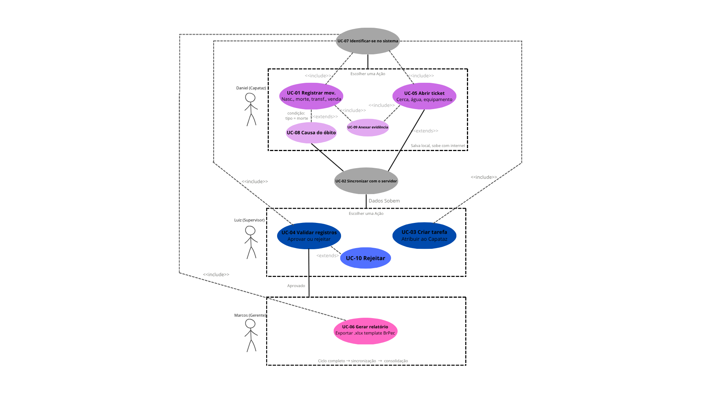</a>
</p>

<p align="center">Fonte: Próprios autores (2026).</p>
</div>

--- 

<p align="center">Quadro 29 - Use Case 01</p>

#### UC-01 - Registrar Movimentação de Rebanho

| Campo | Conteúdo |
|---|---|
| **UC-ID + Nome** | UC-01 — Registrar Movimentação de Rebanho |
| **Ator primário** | Capataz (Daniel) |
| **Atores secundários** | Sistema de Armazenamento Local; Servidor de Sincronização |
| **RFs relacionados** | RF001, RF004 |
| **RNs relacionadas** | RN01, RN04 |
| **RNFs relacionados** | USAB, CONF |
| **Relacionamentos UML** | `<<include>>` UC-07; `<<include>>` UC-09; `<<extend>>` UC-08 [condição: tipo = morte] |

<p align="center">Fonte: Próprios autores (2026).</p>
</div>

---
**Pré-condição:** O Capataz está identificado no sistema (UC-07) com perfil "Capataz" e tem acesso ao retiro associado à sua conta. O dispositivo possui armazenamento local funcional, mesmo sem conexão com a internet.

**Fluxo Principal (cenário de sucesso):**

1. O Capataz acessa o módulo "Movimentações" no menu principal.
2. O sistema apresenta a tela de registro com ícones grandes e textos curtos, adequada ao baixo letramento digital do usuário (RN05), contendo os campos: tipo de movimentação, origem, destino, quantidade, estágio da vida e anexo de evidência.
3. O Capataz seleciona o tipo de movimentação (nascimento, morte, transferência, compra ou venda).
4. O Capataz informa origem, destino, quantidade e estágio da vida dos animais.
5. O Capataz anexa uma foto como evidência da movimentação.
6. O sistema valida se a foto possui metadados de georreferenciamento (latitude e longitude).
7. O Capataz confirma o registro.
8. O sistema persiste a movimentação no armazenamento local do dispositivo com status "pendente de validação pelo Supervisor".
9. O sistema exibe confirmação visual de registro bem-sucedido com indicação do estado de sincronização (pendente ou sincronizado).

**Fluxos Alternativos:**

- **A1** (no passo 3): se o Capataz seleciona "morte" como tipo de movimentação, o sistema dispara o UC-08 (Registrar Causa de Óbito), tornando o campo "causa do óbito" estritamente obrigatório e exibindo-o em destaque junto aos demais campos obrigatórios (RN01). `<<extend>>`
- **A2** (no passo 5): se o Capataz opta por anexar áudio ou mensagem escrita em vez de foto, o sistema aceita a evidência alternativa e pula a validação de georreferenciamento do passo 6. O Capataz pode também anexar evidências adicionais via UC-09 (Anexar Evidência). `<<include>>`
- **A3** (no passo 8): se houver conexão ativa com a internet no momento do registro, o sistema dispara a sincronização automática (UC-02) e marca a movimentação como "sincronizada" (RN03).

**Exceções:**

- **E1** (no passo 6): se a foto anexada não possuir metadados de georreferenciamento válidos, o sistema rejeita o anexo, exibe mensagem clara e visual ao Capataz solicitando nova foto e mantém os demais campos preenchidos (RN04).
- **E2** (no passo 7): se algum campo obrigatório (origem, destino, quantidade, estágio da vida ou causa do óbito quando aplicável) estiver em branco, o sistema bloqueia o envio, destaca visualmente os campos faltantes com linguagem simples e exibe mensagem de erro de validação (RN01).
- **E3** (no passo 8): se houver falha no armazenamento local, o sistema exibe alerta claro ao Capataz, mantém os dados preenchidos em memória e solicita nova tentativa.

**Pós-condição:** A movimentação está registrada no armazenamento local do dispositivo, associada ao Capataz autor (Daniel) e ao retiro de origem, com status "pendente de validação". A movimentação fica disponível para envio ao servidor (UC-02) e posterior validação pelo Supervisor Luiz (UC-04).

---
<p align="center">Quadro 30 - Use Case 02</p>

#### UC-02 - Sincronizar Dados Offline com o Servidor

| Campo | Conteúdo |
|---|---|
| **UC-ID + Nome** | UC-02 — Sincronizar Dados Offline com o Servidor |
| **Ator primário** | Sistema (disparado automaticamente por evento de conexão) |
| **Atores secundários** | Servidor de Sincronização; Capataz e Supervisor (notificados do resultado) |
| **RFs relacionados** | RF003 |
| **RNs relacionadas** | RN03 |
| **RNFs relacionados** | CONF, DES |
| **Relacionamentos UML** | sem relacionamentos UML — ator é o sistema automático|

<p align="center">Fonte: Próprios autores (2026).</p>
</div>

---

**Pré-condição:** Existem registros pendentes no armazenamento local do dispositivo (movimentações, tarefas, evidências ou tickets) gerados em modo offline pelo Capataz Daniel. O usuário está identificado no sistema (UC-07).

**Fluxo Principal (cenário de sucesso):**

1. O sistema monitora continuamente o status da conexão de rede do dispositivo.
2. O sistema detecta que a conexão foi restabelecida e retorna um status HTTP válido em uma requisição de teste ao servidor.
3. O sistema enfileira todos os registros pendentes do armazenamento local em ordem cronológica.
4. O sistema envia cada registro ao endpoint correspondente no servidor.
5. O servidor processa cada registro, persiste no banco central e retorna confirmação de recebimento.
6. O sistema marca cada registro local como "sincronizado" após confirmação do servidor.
7. O sistema exibe ao Capataz uma notificação não intrusiva indicando o número de registros sincronizados com sucesso.

**Fluxos Alternativos:**

- **A1** (no passo 3): se houver muitos registros pendentes, o sistema processa a fila em lotes para evitar sobrecarga na conexão Starlink (DES — p95 < 3000ms), mantendo a ordem cronológica.
- **A2** (no passo 7): se a sincronização ocorre em segundo plano sem o aplicativo aberto, o sistema apenas atualiza os indicadores visuais sem notificação explícita.

**Exceções:**

- **E1** (no passo 2): se o status HTTP retornado não for válido (timeout, 5xx, sem resposta), o sistema mantém o modo offline ativo, não dispara a sincronização e tenta novamente após intervalo de espera (RN03).
- **E2** (no passo 5): se o servidor rejeita um registro específico por erro de validação, o sistema mantém esse registro como "pendente com erro", exibe alerta detalhado ao Capataz e prossegue com os demais registros da fila.
- **E3** (no passo 5): se a conexão cai durante o envio, o sistema interrompe a sincronização, mantém os registros não confirmados como "pendentes" e retoma do ponto de parada quando a conexão for restabelecida.

**Pós-condição:** Todos os registros que foram sincronizados com sucesso estão persistidos no servidor central e marcados localmente como "sincronizados". Registros que falharam permanecem no armazenamento local com flag de erro para nova tentativa. Nenhum dado é perdido no processo (CONF — 0% de perda). Os dados sincronizados ficam disponíveis para o Supervisor Luiz validar (UC-04).

---
<p align="center">Quadro 31 - Use Case 03</p>

#### UC-03 - Criar e Atribuir Tarefa a Capataz

| Campo | Conteúdo |
|---|---|
| **UC-ID + Nome** | UC-03 — Criar e Atribuir Tarefa a Capataz |
| **Ator primário** | Supervisor (Luiz) |
| **Atores secundários** | Capataz Daniel (destinatário da tarefa); Sistema de Notificação |
| **RFs relacionados** | RF002 |
| **RNs relacionadas** | RN02 |
| **RNFs relacionados** | USAB, ORG |
| **Relacionamentos UML** | `<<include>>` UC-07; `<<extend>>` UC-09 [condição: supervisor opta por anexar evidência] |

<p align="center">Fonte: Próprios autores (2026).</p>
</div>


---

**Pré-condição:** O Supervisor está identificado no sistema (UC-07) com perfil "Supervisor". Existe pelo menos um usuário cadastrado e vinculado ao retiro da tarefa. O Supervisor escolheu a ação "Criar tarefa" após identificar-se.

**Fluxo Principal (cenário de sucesso):**

1. O Supervisor acessa o módulo "Tarefas" e seleciona "Nova Tarefa".
2. O sistema apresenta o formulário de criação com os campos: usuário atribuído, prioridade, categoria e descrição.
3. O Supervisor seleciona o usuário responsável a partir da lista de usuários do retiro.
4. O Supervisor preenche prioridade (alta, média, baixa) e categoria da tarefa.
5. O Supervisor adiciona descrição textual da tarefa.
6. O Supervisor confirma a criação.
7. O sistema valida o preenchimento simultâneo de todos os campos obrigatórios.
8. O sistema persiste a tarefa no servidor (ou local, se offline) e a vincula ao Capataz selecionado.
9. O sistema notifica o Capataz atribuído sobre a nova tarefa.
10. O sistema exibe confirmação ao Supervisor e retorna à listagem de tarefas com a nova tarefa visível.

**Fluxos Alternativos:**

- **A1** (no passo 5): o Supervisor pode anexar evidências descritivas (foto georreferenciada, áudio ou mensagem) à tarefa criada, disparando o UC-09 (Anexar Evidência), conforme RF004. `<<extend>>`
- **A2** (no passo 6): o Supervisor pode optar por salvar a tarefa como "rascunho" para edição posterior, sem disparar a validação dos campos obrigatórios.

**Exceções:**

- **E1** (no passo 7): se algum dos campos obrigatórios (usuário atribuído, descrição, prioridade ou categoria) estiver em branco, o sistema bloqueia a criação, retorna erro de validação e destaca os campos faltantes (RN02).
- **E2** (no passo 8): se houver falha de persistência no servidor e o dispositivo estiver online, o sistema salva a tarefa localmente e a marca como pendente de sincronização (UC-02).
- **E3** (no passo 9): se o Capataz atribuído estiver offline no momento da criação, a notificação fica pendente e é entregue assim que o dispositivo dele restabelecer conexão.

**Pós-condição:** A tarefa está registrada no sistema, vinculada ao Capataz Daniel, com status inicial "pendente" e disponível tanto na visão do Supervisor quanto na do Capataz. O Capataz Daniel recebe a tarefa e a executa no campo. Ao concluir, a tarefa entra no fluxo de validação pelo Supervisor Luiz (UC-04).

---

<p align="center">Quadro 32 - Use Case 04</p>

#### UC-04 - Validar Registros do Capataz

| Campo | Conteúdo |
|---|---|
| **UC-ID + Nome** | UC-04 — Validar Registros do Capataz |
| **Ator primário** | Supervisor (Luiz) |
| **Atores secundários** | Capataz Daniel (autor do registro, notificado); Gerente Marcos (recebe dados conferidos) |
| **RFs relacionados** | RF006 |
| **RNs relacionadas** | RN06 |
| **RNFs relacionados** | SEG, USAB |
| **Relacionamentos UML** | `<<include>>` UC-07 |

<p align="center">Fonte: Próprios autores (2026).</p>
</div>

---

**Pré-condição:** O Supervisor está identificado no sistema (UC-07) com perfil "Supervisor" (RN06). O Supervisor escolheu a ação "Validar registros" após identificar-se. Existe pelo menos um registro (movimentação ou tarefa) com status "pendente de validação" submetido pelo Capataz Daniel e já sincronizado com o servidor (UC-02).

**Fluxo Principal (cenário de sucesso):**

1. O Supervisor acessa o painel de "Validações Pendentes".
2. O sistema lista todos os registros pendentes de validação dos Capatazes sob sua coordenação, ordenados por data e agrupados por retiro.
3. O Supervisor seleciona um registro específico para análise.
4. O sistema apresenta os detalhes completos do registro: autor (Capataz Daniel), data, conteúdo dos campos e evidências anexadas (foto georreferenciada, áudio ou mensagem).
5. O Supervisor analisa as informações e as evidências.
6. O Supervisor seleciona a ação "Validar".
7. O sistema altera o status da movimentação para "Validado", grava o identificador do Supervisor validador e o timestamp da ação.
8. O sistema envia os dados conferidos para a camada de consolidação visível ao Gerente Marcos (UC-06).
9. O sistema notifica o Capataz Daniel sobre a validação.
10. O sistema retorna o Supervisor ao painel com o registro removido da lista de pendências.

**Fluxos Alternativos:**

- **A1** (no passo 6): se o Supervisor identificar inconsistência durante a conferência, o registro permanece pendente e deve ser corrigido antes de ser validado. O sistema mantém o fluxo como uma etapa de check operacional.
- **A2** (no passo 6): o Supervisor pode optar por "Solicitar mais informações", enviando uma mensagem ao Capataz Daniel sem alterar o status final do registro.
- **A3** (no passo 2): o Supervisor pode aplicar filtros por Capataz, tipo de registro ou período para reduzir a sobrecarga visual e focar na validação por prioridade.

**Exceções:**

- **E1** (no passo 1): se um usuário sem perfil "Supervisor" tentar acessar o painel de validações por manipulação direta de URL ou token, o sistema retorna erro 403 (Forbidden), conforme a restrição aplicada pelo middleware de autorização (RN06, SEG).
- **E2** (no passo 7): se houver falha de gravação no servidor, o sistema mantém o registro como "pendente de validação", exibe erro ao Supervisor e solicita nova tentativa.

**Pós-condição:** A movimentação está validada, com identificação do Supervisor Luiz e timestamp persistidos para auditoria. Os dados conferidos ficam visíveis ao Gerente Marcos, que pode consultar quem registrou e quem validou. Apenas registros conferidos entram nos relatórios oficiais (UC-06).

---

<p align="center">Quadro 33 - Use Case 05</p>

#### UC-05 - Abrir Ticket de Infraestrutura

| Campo | Conteúdo |
|---|---|
| **UC-ID + Nome** | UC-05 — Abrir Ticket de Infraestrutura |
| **Ator primário** | Capataz (Daniel) |
| **Atores secundários** | Supervisor Luiz (notificado, pode atribuir); Equipe de Infraestrutura |
| **RFs relacionados** | RF008, RF004 |
| **RNs relacionadas** | RN08 |
| **RNFs relacionados** | SUP, USAB |
| **Relacionamentos UML** | `<<include>>` UC-07; `<<include>>` UC-09 |

<p align="center">Fonte: Próprios autores (2026).</p>
</div>

---

**Pré-condição:** O Capataz está identificado no sistema (UC-07) com perfil "Capataz". O Capataz escolheu a ação "Abrir chamado" após identificar-se. Existe um problema de infraestrutura no retiro (cerca quebrada, falta de água, equipamento danificado, problema em edificação) que precisa ser reportado.

**Fluxo Principal (cenário de sucesso):**

1. O Capataz acessa o módulo "Chamados" e seleciona "Abrir Novo Chamado".
2. O sistema apresenta o formulário de abertura com ícones de categoria e campos simplificados, adequados ao baixo letramento digital (RN05), contendo: categoria do problema, localização, descrição e área de evidências.
3. O Capataz seleciona a categoria do problema via ícone (cerca, abastecimento de água, equipamento, edificação).
4. O Capataz informa a localização aproximada dentro do retiro.
5. O Capataz adiciona ao menos uma evidência descritiva obrigatória: mensagem escrita ou áudio (RN08).
6. O Capataz confirma a abertura do ticket.
7. O sistema valida a presença obrigatória de pelo menos uma evidência descritiva.
8. O sistema persiste o ticket (no servidor ou localmente, se offline) com status "pendente" e identificador único.
9. O sistema notifica o Supervisor Luiz (que pode atribuir o chamado) e a equipe de Infraestrutura sobre o novo chamado.
10. O sistema exibe ao Capataz a confirmação com o número do ticket gerado.

**Fluxos Alternativos:**

- **A1** (no passo 5): o Capataz pode opcionalmente anexar foto georreferenciada como evidência adicional, disparando o UC-09 (Anexar Evidência). Se a foto não tiver coordenadas válidas, o sistema rejeita apenas a foto, mas mantém o ticket válido caso já haja mensagem ou áudio (RN04). `<<include>>`
- **A2** (no passo 8): se o dispositivo está offline, o ticket é salvo localmente e entra na fila de sincronização (UC-02).

**Exceções:**

- **E1** (no passo 7): se o Capataz tentar enviar o ticket sem nenhuma evidência descritiva (mensagem ou áudio), o sistema bloqueia o envio e exibe mensagem clara e visual solicitando o cumprimento da obrigação (RN08).
- **E2** (no passo 8): se houver falha de persistência mesmo com armazenamento local disponível, o sistema mantém os dados em memória e oferece nova tentativa.

**Pós-condição:** O ticket de infraestrutura está registrado com identificador único, evidência(s) anexada(s), categoria, localização e Capataz autor Daniel. O Supervisor Luiz é notificado e pode atribuir o chamado. A equipe de Infraestrutura pode iniciar o atendimento remotamente (SUP — 100% das correções sem deslocamento a campo).

---

<p align="center">Quadro 34 - Use Case 06</p>

#### UC-06 - Visualizar Dados Aprovados e Gerar Relatório

| Campo | Conteúdo |
|---|---|
| **UC-ID + Nome** | UC-06 — Visualizar Dados Aprovados e Gerar Relatório |
| **Ator primário** | Gerente (Marcos) |
| **Atores secundários** | Servidor de Dados Sincronizados e Aprovados |
| **RFs relacionados** | RF007 |
| **RNs relacionadas** | RN07 |
| **RNFs relacionados** | ORG, DES |
| **Relacionamentos UML** | `<<include>>` UC-07 |

<p align="center">Fonte: Próprios autores (2026).</p>
</div>

---

**Pré-condição:** O Gerente está identificado no sistema (UC-07) com perfil "Gerente" e possui conexão ativa com a internet. Existem movimentações já sincronizadas e validadas ou tarefas já sincronizadas e aprovadas pelo Supervisor Luiz (UC-04) para o período desejado (RN07).

**Fluxo Principal (cenário de sucesso):**

1. O Gerente acessa o painel de consolidação do sistema.
2. O sistema apresenta a visão geral dos dados conferidos: movimentações validadas, tarefas aprovadas e tickets aprovados, com identificação de quem registrou (Capataz Daniel) e quem validou ou aprovou (Supervisor Luiz), data e horário de cada ação.
3. O Gerente analisa os dados consolidados para ter visão do que aconteceu na operação.
4. O Gerente acessa o módulo "Relatórios" e seleciona o tipo de relatório (movimentação de rebanho ou tarefas).
5. O Gerente define o período (semanal ou mensal) e o(s) retiro(s) de interesse.
6. O Gerente confirma a geração.
7. O sistema consulta exclusivamente os dados que já foram sincronizados e conferidos pelo Supervisor para o filtro definido.
8. O sistema processa os dados e gera o arquivo no formato de planilha (.xlsx ou .csv).
9. O sistema disponibiliza o arquivo para download.
10. O Gerente faz o download da planilha gerada e segue com o trabalho de gestão.

**Fluxos Alternativos:**

- **A1** (no passo 5): o Gerente pode aplicar filtros adicionais, como tipo de movimentação (apenas mortes, apenas transferências), Capataz responsável ou Supervisor validador.
- **A2** (no passo 2): o Gerente pode consultar apenas a visão consolidada sem gerar relatório, caso queira apenas acompanhar a operação em tempo quase real.

**Exceções:**

- **E1** (no passo 7): se não houver dados sincronizados e conferidos para o filtro selecionado, o sistema exibe mensagem informando ausência de dados e oferece sugestão de ampliar o período ou alterar o filtro.
- **E2** (no passo 7): o sistema explicitamente exclui registros pendentes, garantindo consistência do relatório oficial (RN07).
- **E3** (no passo 8): se houver falha no processamento (timeout ou erro do servidor), o sistema exibe erro claro ao Gerente com opção de nova tentativa.
- **E4** (no passo 1): se um usuário com perfil "Capataz" tentar acessar o painel de consolidação ou o módulo de relatórios, o sistema bloqueia o acesso e retorna erro 403 (SEG).

**Pós-condição:** O Gerente Marcos possui visão completa da operação (quem registrou, quem validou ou aprovou, quando) e, se necessário, um arquivo de planilha no formato compatível, contendo exclusivamente dados sincronizados e conferidos, pronto para análises gerenciais e comunicação com a sede. O ciclo completo: campo → sincronização → validação → consolidação.

---

<p align="center">Quadro 35 - Use Case 07</p>

#### UC-07 - Identificar-se no Sistema

| Campo | Conteúdo |
|---|---|
| **UC-ID + Nome** | UC-07 — Identificar-se no Sistema |
| **Ator primário** | Supervisor (Luiz) ou Gerente (Marcos) |
| **Atores secundários** | Servidor de Autenticação |
| **RFs relacionados** | RF005 |
| **RNs relacionadas** | RN05 |
| **RNFs relacionados** | USAB, SEG |
| **Relacionamento UML** | `<<include>>` por UC-01, UC-03, UC-04, UC-05 e UC-06 |

<p align="center">Fonte: Próprios autores (2026).</p>
</div>

--- 

**Pré-condição:** O usuário possui credencial cadastrada no sistema. O dispositivo está acessível.

**Fluxo Principal (cenário de sucesso):**

1. O usuário acessa o sistema.
2. O sistema apresenta a tela de identificação com elementos visuais grandes, poucos campos e instruções objetivas, adequada ao baixo letramento digital do Capataz Daniel (RN05).
3. O usuário informa sua identificação e credencial.
4. O sistema valida a credencial junto ao servidor de autenticação.
5. O sistema identifica o perfil (Supervisor ou Gerente) e o retiro vinculado.
6. O sistema libera o menu principal contextualizado para o perfil identificado, exibindo apenas as ações disponíveis para aquele perfil.

**Fluxos Alternativos:**

- **A1** (no passo 1): se o usuário já tinha sessão ativa válida, o sistema pula direto para o passo 6.
- **A2** (no passo 3): o sistema pode oferecer mecanismo simplificado de identificação (PIN visual, foto do perfil para seleção, biometria), priorizando o menor número possível de etapas (RN05).

**Exceções:**

- **E1** (no passo 4): se a credencial é inválida, o sistema exibe mensagem clara em linguagem objetiva e oferece nova tentativa.
- **E2** (no passo 4): se não há conexão com o servidor, o sistema permite identificação offline com credencial armazenada localmente, mantendo a sessão limitada às funcionalidades offline.

**Pós-condição:** O usuário está autenticado com perfil identificado e token de acesso ativo. O menu exibe apenas as ações do perfil: Luiz (Supervisor) vê "Validar registros" e "Criar tarefa"; Marcos (Gerente) vê "Visualizar dados" e "Gerar relatório". O fluxo de login do backend não emite token para Capataz; registros operacionais desse perfil seguem os fluxos específicos de campo e sincronização.

--- 
<p align="center">Quadro 36 - Use Case 08</p>

#### UC-08 - Registrar Causa de Óbito

| Campo | Conteúdo |
|---|---|
| **UC-ID + Nome** | UC-08 — Registrar Causa de Óbito |
| **Ator primário** | Capataz (Daniel) |
| **Atores secundários** | — |
| **RFs relacionados** | RF001 |
| **RNs relacionadas** | RN01 |
| **RNFs relacionados** | USAB |
| **Relacionamento UML** | `<<extend>>` UC-01 [condição: tipo da movimentação = "morte"] |

<p align="center">Fonte: Próprios autores (2026).</p>
</div>

---

**Pré-condição:** O Capataz está executando o UC-01 (Registrar Movimentação) e selecionou "morte" como tipo de movimentação no passo 3.

**Fluxo Principal (cenário de sucesso):**

1. O sistema exibe o campo "causa do óbito" como obrigatório, em destaque visual.
2. O sistema apresenta lista pré-definida de causas comuns (predação, doença, acidente, intempérie, desconhecida) com ícones adequados ao baixo letramento digital.
3. O Capataz seleciona a causa aplicável ou opta por descrever em campo livre.
4. O Capataz pode adicionar observações textuais complementares.
5. O sistema valida o preenchimento do campo e retorna o controle ao fluxo principal do UC-01 (passo 4).

**Exceções:**

- **E1** (no passo 5): se o campo "causa do óbito" está em branco, o sistema bloqueia o avanço do UC-01 e mantém o usuário nesta tela até o preenchimento (RN01).

**Pós-condição:** A causa do óbito está registrada como parte da movimentação de morte. O fluxo retorna ao UC-01, que prossegue normalmente com os demais campos.

---

<p align="center">Quadro 37 - Use Case 09</p>

#### UC-09 - Anexar Evidência
| Campo | Conteúdo |
|---|---|
| **UC-ID + Nome** | UC-09 — Anexar Evidência |
| **Ator primário** | Capataz (Daniel) ou Supervisor (Luiz) |
| **Atores secundários** | Sistema de Localização (GPS); Câmera; Microfone |
| **RFs relacionados** | RF004 |
| **RNs relacionadas** | RN04|
| **RNFs relacionados** | USAB |
| **Relacionamento UML** | `<<include>>` por UC-01 e UC-05; `<<extend>>` UC-03 [condição: usuário opta por anexar evidência] |

<p align="center">Fonte: Próprios autores (2026).</p>
</div>

---

**Pré-condição:** O usuário está executando um dos UCs base (UC-01, UC-03 ou UC-05) e está na etapa de preenchimento onde evidências podem ser adicionadas.

**Fluxo Principal (cenário de sucesso):**

1. O sistema apresenta as opções de evidência: foto, áudio ou mensagem escrita, com ícones grandes.
2. O usuário seleciona o tipo de evidência.
3. Para foto: o sistema aciona a câmera, captura a imagem e extrai automaticamente os metadados de georreferenciamento.
4. Para áudio: o sistema aciona o microfone e grava o áudio até o usuário encerrar.
5. Para mensagem: o sistema apresenta campo de texto para digitação livre.
6. O sistema valida a evidência (no caso de foto, verifica georreferenciamento — RN04).
7. O sistema anexa a evidência ao registro principal e retorna o controle ao UC base.

**Fluxos Alternativos:**

- **A1** (no passo 2): o usuário pode anexar mais de um tipo de evidência ao mesmo registro (ex.: foto + áudio).

**Exceções:**

- **E1** (no passo 6): se a foto não possui metadados de georreferenciamento válidos, o sistema rejeita a foto, exibe mensagem clara e oferece nova captura (RN04). O registro base continua válido se já houver outra evidência.
- **E2** (no passo 3): se o GPS do dispositivo está desligado, o sistema solicita ativação antes de capturar a foto.

**Pós-condição:** A evidência está anexada ao registro principal com seus metadados (tipo, timestamp, localização quando aplicável). O fluxo retorna ao UC base.

---
<p align="center">Quadro 38 - Use Case 10</p>

#### UC-10 - Solicitar Correção de Registro
| Campo | Conteúdo |
|---|---|
| **UC-ID + Nome** | UC-10 — Solicitar Correção de Registro |
| **Ator primário** | Supervisor (Luiz) |
| **Atores secundários** | Capataz Daniel (notificado da solicitação) |
| **RFs relacionados** | RF006 |
| **RNs relacionadas** | RN06|
| **RNFs relacionados** | SEG |
| **Relacionamento UML** | <<extend>> UC-04 [condição: Supervisor identifica inconsistência no registro]|

<p align="center">Fonte: Próprios autores (2026).</p>
</div>

---
**Pré-condição:** O Supervisor está executando o UC-04 (Validar Registros) e identificou inconsistência ou problema no registro analisado, optando por solicitar correção antes da validação.

**Fluxo Principal (cenário de sucesso):**

1. O Supervisor seleciona a ação "Solicitar correção".
2. O sistema apresenta campo de observação textual.
3. O Supervisor preenche a observação explicando a inconsistência encontrada.
4. O Supervisor confirma a solicitação.
5. O sistema mantém o registro como pendente e envia a observação ao Capataz responsável.
6. O sistema notifica o Capataz Daniel sobre a solicitação, exibindo a observação.
7. O sistema retorna o Supervisor ao painel de validações (UC-04).

**Exceções:**

- **E1** (no passo 4): se a observação está em branco, o sistema bloqueia a confirmação e exige preenchimento.

**Pós-condição:** O registro permanece pendente com observação visível. O Capataz Daniel é notificado e pode corrigir o registro e ressubmetê-lo, reiniciando o ciclo (UC-01 → UC-02 → UC-04). 
Registros pendentes não entram nos relatórios oficiais do Gerente Marcos (UC-06 / RN07).


### <a name="c3.2.3"></a>3.2.3. Diagrama de Classes do Domínio (sprint 2)

&nbsp;&nbsp;&nbsp;&nbsp;Um diagrama de classes do domínio é um modelo visual da linguagem UML que representa as principais entidades de um sistema, seus atributos, operações e os relacionamentos entre elas. Diferente de um diagrama de implementação, seu foco está no domínio do negócio, ou seja, em como os conceitos do mundo real se traduzem em estruturas de software, estabelecendo uma linguagem comum entre as equipes técnica e de negócio.

&nbsp;&nbsp;&nbsp;&nbsp;No contexto do projeto, o diagrama modela o ciclo operacional completo da BrPec Agropecuária, desde o registro de movimentações do rebanho em campo pelo Capataz, passando pela validação do Supervisor, até a geração de relatórios gerenciais pelo Gerente. As três classes derivam de uma superclasse abstrata Usuário, cada uma vinculada a um Retiro e com responsabilidades distintas. Registros de qualquer natureza, Movimentações, Tarefas e Tickets, podem receber Evidências (fotos, áudios ou mensagens), e movimentações do tipo morte estendem-se obrigatoriamente à classe CausaObito. No backend atual, a sincronização é representada pela flag `sincronizado` nas entidades operacionais, enquanto o controle de autenticação das rotas protegidas ocorre por JWT.

<div align="center">
<p align="center">Figura 9 - Diagrama de Classes de Domínio</p>
<p align="center">
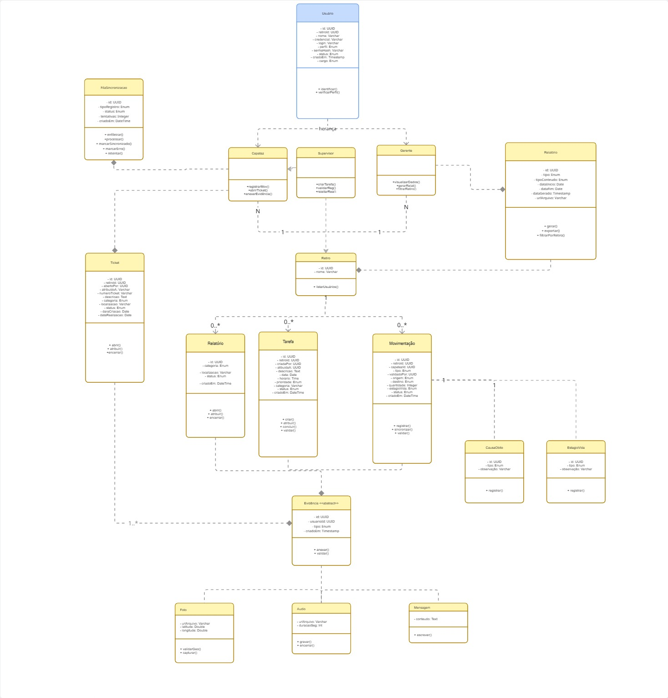</a>
</p>
<p align="center">Fonte: Próprios autores (2026).</p>
</div>

&nbsp;&nbsp;&nbsp;&nbsp;Mais do que um artefato técnico, o diagrama de classes do AgroFlow é o reflexo digital de uma operação que historicamente dependia de papel, memória e repasse verbal. Ao estruturar com precisão as responsabilidades de cada perfil, as regras que governam cada registro e os vínculos entre campo e gestão, o modelo estabelece a base sobre a qual toda a aplicação será construída, garantindo que nenhuma decisão de implementação precise ser tomada no escuro.

### <a name="c3.2.4"></a>3.2.4. Diagrama de Sequência UML (sprint 3)

&nbsp;&nbsp;&nbsp;&nbsp;Os diagramas de sequência UML constituem representações visuais que modelam a interação temporal entre os componentes de um sistema de software durante a execução de funcionalidades específicas. Diferentemente de outros artefatos que descrevem apenas estados ou resultados finais, os diagramas de sequência explicitam o fluxo completo de mensagens trocadas entre objetos, preservando a ordenação cronológica das interações (LARMAN, 2004).

&nbsp;&nbsp;&nbsp;&nbsp;No contexto do sistema AgroFlow, desenvolvido para a BrPec Agropecuária S.A., cada diagrama de sequência documenta uma funcionalidade crítica do sistema, incluindo autenticação de usuários, registro de movimentações do rebanho, abertura de tickets de manutenção de infraestrutura, entre outras operações centrais. Em todas as representações, a arquitetura segue o padrão de separação em camadas (layered architecture), no qual a camada de apresentação (Frontend) envia requisições à camada de controle (Controller), que delega a lógica de negócio à camada de serviço (Service), a qual, por sua vez, interage com a camada de persistência (Repository) para executar operações no banco de dados. O fluxo de retorno percorre o caminho inverso, propagando a resposta até a interface do usuário final.

&nbsp;&nbsp;&nbsp;&nbsp;Os diagramas de sequência apresentados também contemplam fluxos alternativos e de exceção, modelando cenários como falhas de autenticação, violação de regras de validação (campos obrigatórios não preenchidos, conforme RN01 e RN02) e restrições de autorização (tentativas de acesso a recursos protegidos por perfil de usuário, conforme RN06). A explicitação desses fluxos é fundamental para assegurar que o sistema trate adequadamente condições de erro, retornando mensagens claras e acionáveis ao usuário, em alinhamento com os requisitos não funcionais de usabilidade (USAB) definidos na [Seção 3.1.3](#c3.1.3) 


#### 1. Login (`/usuarios/login`)

**Fluxo Principal**

• O processo inicia quando o usuário informa seu login e senha na interface da aplicação.

• Após o preenchimento, a interface envia uma requisição `POST` para o endpoint `/usuarios/login`, encaminhando as credenciais ao *ControladorUsuario*.

• O controlador encaminha os dados ao *ServicoUsuario*, responsável pelas regras de autenticação do sistema.

• Em seguida, o serviço solicita ao *RepositorioUsuario* a busca do usuário correspondente ao login informado.

• O repositório realiza a consulta no banco de dados e retorna as informações do usuário ao serviço.

• Com os dados recuperados, o *ServicoUsuario* compara a senha enviada pelo usuário com a senha armazenada no sistema.

• Caso as credenciais estejam corretas e o usuário possua perfil Supervisor ou Gerente, o sistema gera um token JWT associado ao perfil e ao retiro do usuário.

• Por fim, o controlador retorna uma resposta `200 – Sucesso` para a interface, permitindo o acesso ao sistema.


**Fluxo Alternativo - Login ou senha inválidos**

• Durante a validação das credenciais, o *ServicoAutenticacao* verifica se o usuário existe e se a senha informada corresponde ao registro armazenado no banco de dados.

• Caso o login não exista ou a senha esteja incorreta, o serviço retorna um erro de autenticação ao controlador.

• Nesse cenário, o sistema responde à interface com status `401 – Não Autorizado`.

• Por fim, a interface exibe ao usuário uma mensagem informando que o login ou a senha estão inválidos.

**Fluxo Alternativo - Capataz no login protegido**

• Caso o usuário autenticado possua perfil de Capataz, o backend interrompe o fluxo de login protegido e retorna `403 – Proibido`, pois esse perfil não recebe JWT no endpoint `/usuarios/login`.


<div align="center">
<p align="center">Figura 10 - Diagrama Sequencial (RF005)</p>
<p align="center">
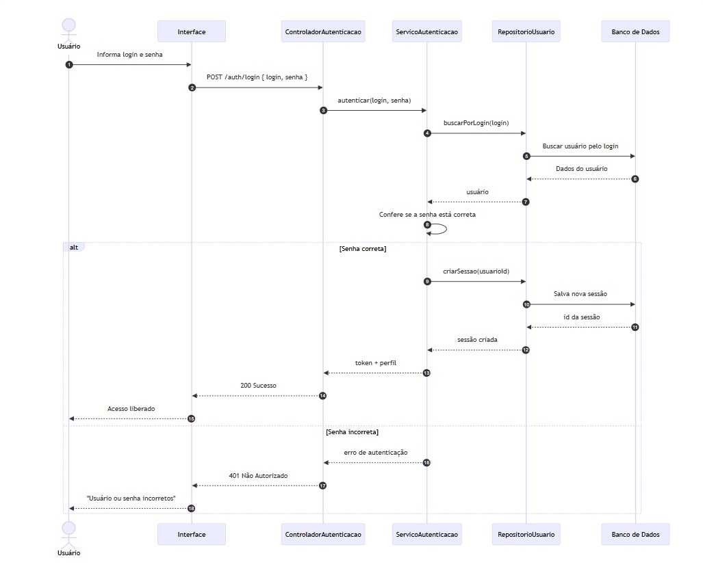</a>
</p>
<p align="center">Fonte: Próprios autores (2026).</p>
</div>

----
#### 2. Registrar Movimentação (`/movimentacoes`)
**Fluxo Principal**

• O processo inicia quando o capataz preenche o formulário de manejo na interface da aplicação, informando dados como nascimento, morte, compra, venda ou transferência de animais entre retiros.

• Quando existe conexão com a internet, a interface envia uma requisição `POST` para o endpoint `/movimentacoes`, encaminhando os dados ao *ControladorMovimentacao*.

• Inicialmente, o controlador valida o token e o perfil do usuário, garantindo que ele possui permissão para realizar a operação.

• Em seguida, os dados são encaminhados ao *ServicoMovimentacao*, responsável por executar as regras de negócio e validar os campos obrigatórios conforme o tipo de movimentação informado.

• Caso todas as informações estejam corretas, o serviço solicita ao *RepositorioMovimentacao* o salvamento da movimentação no banco de dados.

• Após a persistência, o banco retorna o identificador do registro criado, confirmando que a movimentação foi salva corretamente./

• Por fim, o controlador responde à interface com status `201 – Criado`, exibindo ao capataz a confirmação do registro da movimentação.


**Fluxo Alternativo - Operação offline**

• Caso o dispositivo esteja sem conexão com a internet durante o preenchimento do formulário, a aplicação ativa o modo offline automaticamente.

• Nesse cenário, os dados da movimentação são armazenados localmente no dispositivo do usuário.

• Após o salvamento local, a interface exibe uma mensagem confirmando que o registro foi salvo e será sincronizado posteriormente quando houver conexão disponível.


**Fluxo Alternativo - Registro de morte sem causa informada**

• Durante a validação dos dados, o *ServicoMovimentacao* verifica se movimentações do tipo “morte” possuem a causa do óbito preenchida corretamente.

• Caso a causa não seja informada, o serviço retorna um erro de validação ao controlador.

• O sistema então responde à interface com status `400 – Requisição Inválida`, solicitando o preenchimento obrigatório da causa da morte antes do salvamento da movimentação.


<div align="center">
<p align="center">Figura 11 - Diagrama Sequencial (RF001)</p>
<p align="center">
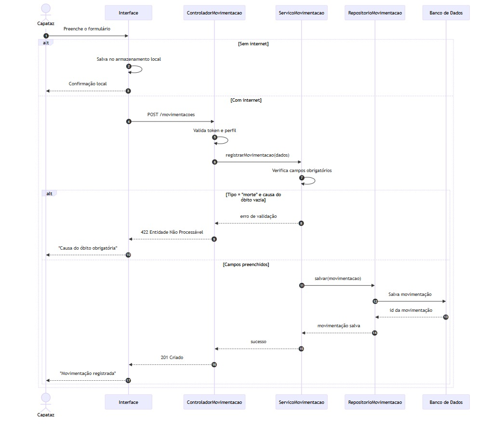</a>
</p>
<p align="center">Fonte: Próprios autores (2026).</p>
</div>

----

#### 3. Criar Tarefa (`/tarefas`)

**Fluxo Principal**

• O processo inicia quando o supervisor preenche, na interface da aplicação, as informações necessárias para o cadastro de uma nova atividade operacional, como descrição, prioridade, categoria e responsável.

• Após o preenchimento, a interface envia uma requisição `POST` para o endpoint `/tarefas`, encaminhando os dados ao *ControladorTarefa*.

• Inicialmente, o controlador recebe os dados da requisição e encaminha as informações ao serviço responsável pela validação dos campos obrigatórios.

• Em seguida, os dados são encaminhados ao *ServicoTarefa*, responsável por executar as regras de negócio e validar os campos obrigatórios.

• Quando todas as informações estão corretas, o serviço solicita ao *RepositorioTarefa* o salvamento da nova tarefa no banco de dados.

• Após a persistência, o banco retorna o identificador da tarefa criada, confirmando o sucesso da operação.

• Por fim, o controlador responde à interface com status `201 – Criado`, exibindo ao supervisor a confirmação de que a tarefa foi atribuída corretamente.


**Fluxo Alternativo - Campos obrigatórios inválidos**

• Durante a validação dos dados, o *ServicoTarefa* verifica se todos os campos obrigatórios foram preenchidos corretamente.

• Caso alguma informação esteja vazia ou inválida, o serviço retorna um erro de validação ao controlador.

• O sistema então responde à interface com status `400 – Requisição Inválida`, solicitando ao usuário o preenchimento correto dos campos obrigatórios.

<div align="center">
<p align="center">Figura 12 - Diagrama Sequencial (RF002)</p>
<p align="center">
<a href="https://www.inteli.edu.br/">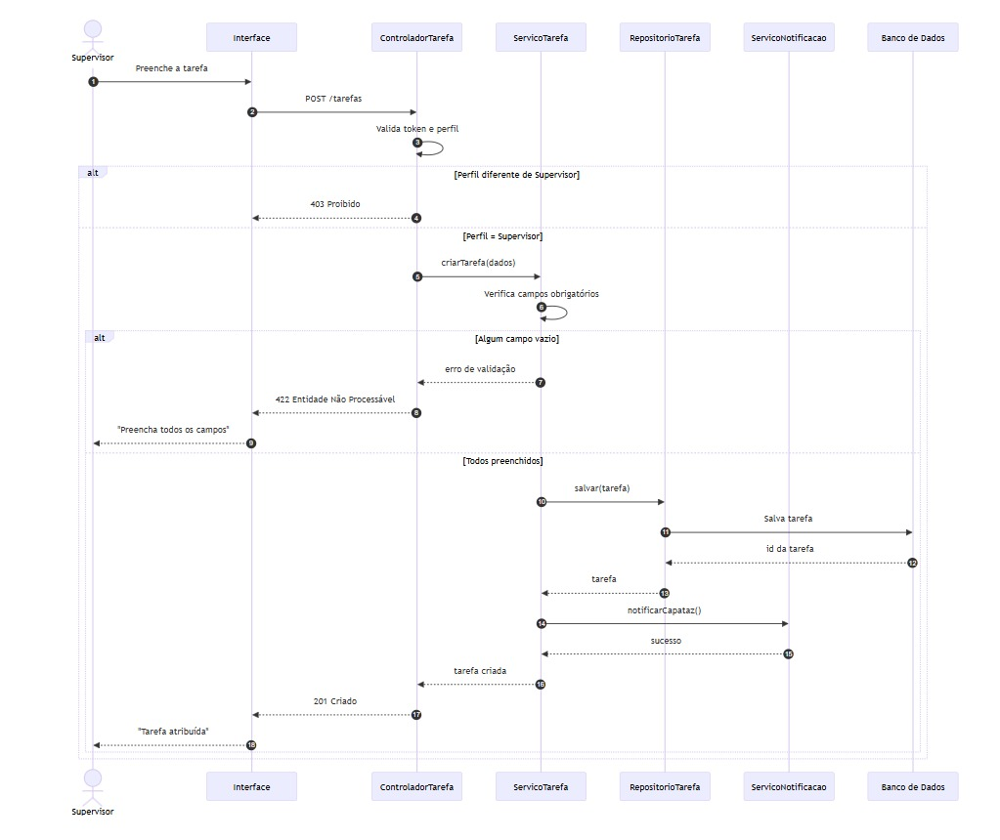</a>
</p>
<p align="center">Fonte: Próprios autores (2026).</p>
</div>

----

#### 4. Sincronização Offline (`/sincronizacao`)

**Fluxo Principal**

• O processo inicia automaticamente quando a aplicação detecta que a conexão com a internet foi restabelecida no dispositivo utilizado em campo. Nesse momento, a interface identifica os registros armazenados localmente durante o período offline e prepara um lote de dados para sincronização.

• Após a leitura dos registros locais, a interface envia uma requisição `POST` para o endpoint `/sincronizacao`, encaminhando todas as informações pendentes ao *ControladorSincronizacao*.

• O controlador encaminha o lote ao *ServicoSincronizacao*, responsável por processar individualmente cada registro armazenado localmente.

• Durante o processamento, o serviço percorre os itens do lote em um fluxo iterativo (*loop*), identificando o tipo de cada registro recebido.

• Caso o registro seja uma movimentação bovina, os dados são enviados ao *RepositorioMovimentacao*, responsável por persistir as informações no banco de dados. Se o item for um ticket ou chamado operacional, o registro é encaminhado ao *RepositorioTicket*.

• Após o salvamento, o banco de dados retorna o identificador do registro criado, confirmando que a sincronização foi realizada corretamente.

• Em seguida, o sistema marca o item como sincronizado localmente, evitando que ele seja reenviado em futuras sincronizações.

• Ao final do processamento de todos os registros, o serviço retorna ao controlador o resultado consolidado da sincronização. O controlador então responde à interface com status `200 – Sucesso`, e a aplicação atualiza o status local dos registros sincronizados.


**Fluxo Alternativo - Falha na sincronização**

• Durante o processamento do lote, podem ocorrer falhas relacionadas a inconsistências de dados, erros de validação ou indisponibilidade temporária do servidor.

• Caso algum registro apresente erro durante a tentativa de salvamento, o *ServicoSincronizacao* identifica a falha e interrompe apenas o processamento daquele item específico.

• Nesse cenário, o sistema marca o registro como “falha de sincronização”, mantendo os dados armazenados localmente no dispositivo.

• Dessa forma, o item permanece disponível para uma nova tentativa automática de sincronização quando houver conexão estável, evitando perda das informações registradas em campo.


<div align="center">
<p align="center">Figura 13 - Diagrama Sequencial (RF003)</p>
<p align="center">
<a href="https://www.inteli.edu.br/">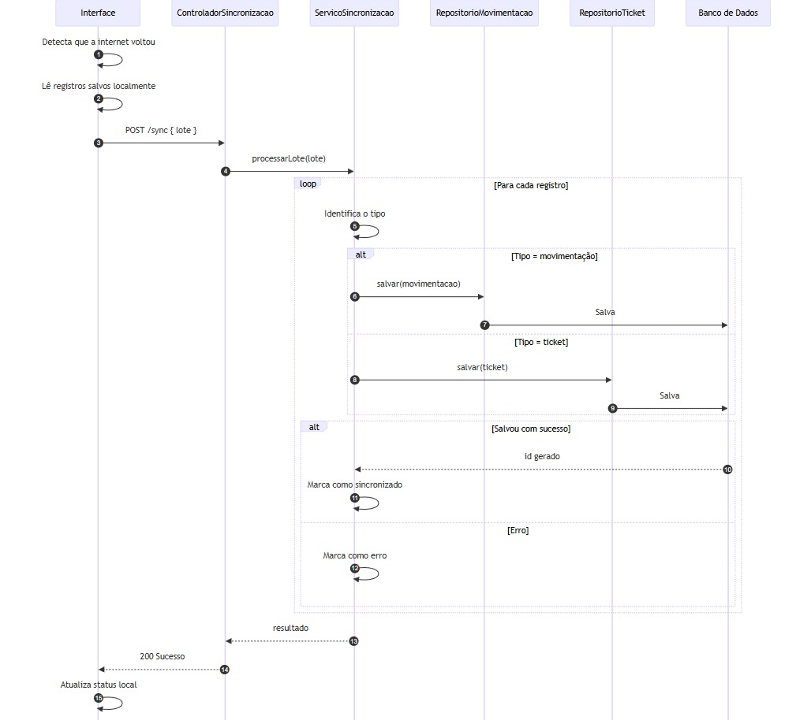</a>
</p>
<p align="center">Fonte: Próprios autores (2026).</p>
</div>

----

#### 5. Anexar Evidência (`/evidencias`)

**Fluxo Principal**

• O processo inicia quando o usuário seleciona o tipo de evidência que deseja anexar na aplicação, podendo ser uma foto, áudio ou mensagem de texto. Em seguida, a interface captura a mídia selecionada e envia uma requisição `POST` para o endpoint `/evidencias`, encaminhando os dados ao controlador de evidências (*ControladorEvidencia*).

• Ao receber a requisição, o controlador encaminha os dados ao serviço responsável (*ServicoEvidencia*), que identifica o tipo de evidência enviado e executa as validações necessárias.

• Quando a evidência corresponde a uma foto, o sistema realiza a leitura da localização geográfica associada ao arquivo, verificando se a imagem possui informações de GPS. Caso a foto esteja válida, o serviço envia o arquivo para o módulo de armazenamento (*Armazenamento*), responsável por salvar a mídia e retornar o link de acesso ao arquivo.

• Após o armazenamento da evidência, o serviço solicita ao repositório de evidências (*RepositorioEvidencia*) o salvamento das informações no banco de dados, incluindo o tipo da evidência, o link do arquivo e os metadados associados. O banco então retorna o identificador do registro criado, confirmando que a evidência foi salva corretamente.

• No caso de evidências do tipo áudio ou mensagem, o fluxo ocorre de maneira semelhante. O arquivo ou conteúdo textual é enviado ao módulo de armazenamento, o link correspondente é gerado e as informações são persistidas no banco de dados pelo repositório de evidências.

• Por fim, após a conclusão bem-sucedida do processo, o sistema retorna uma resposta `201 – Criado` para a interface, exibindo ao usuário a confirmação de que a evidência foi anexada corretamente.


**Fluxo Alternativo - Foto sem localização GPS**

• Durante o envio de evidências do tipo foto, o sistema valida se a imagem contém informações de geolocalização associadas ao arquivo. Essa validação é importante para garantir a rastreabilidade das atividades realizadas em campo.

• Caso a foto enviada não possua dados de GPS, o serviço de evidências identifica a inconsistência e retorna um erro de validação ao controlador. O controlador então responde à interface com o código `400 – Requisição Inválida`.

• Ao receber a resposta, a interface exibe ao usuário uma mensagem informando que a foto não contém localização válida, solicitando o envio de uma nova imagem com GPS habilitado no dispositivo. Nesse cenário, a evidência não é armazenada nem registrada no banco de dados até que a inconsistência seja corrigida.


<div align="center">
<p align="center">Figura 14 - Diagrama Sequencial (RF004)</p>
<p align="center">
<a href="https://www.inteli.edu.br/">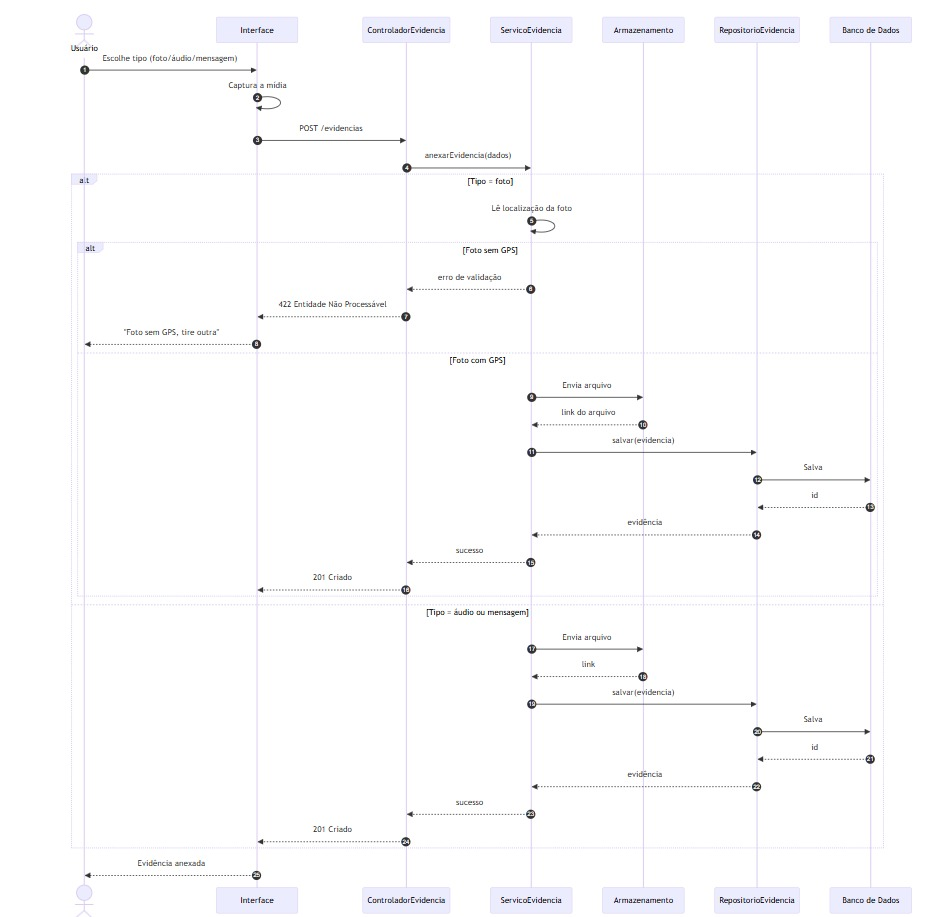</a>
</p>
<p align="center">Fonte: Próprios autores (2026).</p>
</div>

----

#### 6. Validar Movimentação (`/validacoes/movimentacoes/{id}/validar`)

**Fluxo Principal**

• O processo inicia quando o supervisor confere uma movimentação registrada no sistema.

• A interface envia uma requisição `PATCH` para o endpoint `/validacoes/movimentacoes/{id}/validar`, encaminhando a ação ao *ControladorValidacao*.

• Inicialmente, o controlador valida o token e o perfil do usuário, garantindo que apenas supervisores possam realizar a validação das movimentações.

• Caso o perfil seja válido, o controlador encaminha os dados ao *ServicoValidacao*, responsável pelas regras de negócio da operação.

• O serviço solicita ao *RepositorioMovimentacao* a busca da movimentação correspondente ao identificador informado.

• Após localizar o registro, o supervisor pode validar a movimentação ou mantê-la pendente para correção.

• Quando a ação escolhida é “validar”, o serviço atualiza o status da movimentação para “validado” no banco de dados.

• Em seguida, o sistema retorna a confirmação da validação, permitindo que a interface atualize o status exibido ao usuário.

• Por fim, o controlador retorna uma resposta `200 – Sucesso` para a interface, confirmando que o status foi atualizado corretamente.

**Fluxo Alternativo - Usuário sem permissão**

• Durante a validação inicial, o sistema verifica se o usuário autenticado possui perfil de supervisor.

• Caso o perfil seja inválido, o fluxo é interrompido e o *ControladorValidacao* retorna uma resposta `403 – Proibido`.

• Nesse cenário, a interface exibe uma mensagem informando que o usuário não possui permissão para validar movimentações.


**Fluxo Alternativo - Movimentação não encontrada**

• Durante a busca da movimentação, o *RepositorioMovimentacao* verifica se existe um registro correspondente ao identificador informado.

• Caso a movimentação não seja encontrada, o serviço retorna um erro ao controlador.

• O sistema então responde à interface com status `404 – Não Encontrado`, informando que a movimentação solicitada não existe.

**Fluxo Alternativo - Registro com inconsistência**

• Quando o supervisor identifica inconsistência na movimentação, o registro permanece com status "pendente" para correção antes da validação.

• Como a movimentação possui apenas os estados "pendente" e "validado", o serviço não altera o status nessa etapa.

• Nesse cenário, a interface orienta o capataz a corrigir as informações e reenviar o registro quando necessário.

<div align="center">
<p align="center">Figura 15 - Diagrama Sequencial (RF006)</p>
<p align="center">
<a href="https://www.inteli.edu.br/">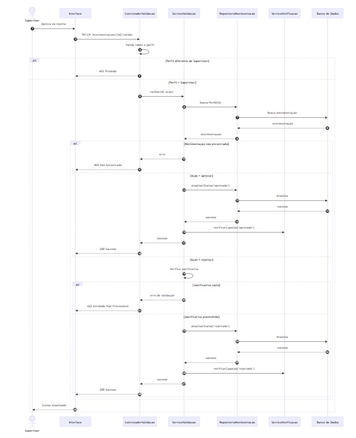</a>
</p>
<p align="center">Fonte: Próprios autores (2026).</p>
</div>

----

#### 7. Gerar Relatório (`/relatorios`)

**Fluxo Principal**

• O processo inicia quando o gerente define os filtros desejados para geração do relatório na interface da aplicação./

• Em seguida, a interface envia uma requisição `GET` para os endpoints de relatórios implementados, como `/relatorios/movimentacoes`, `/relatorios/semanal` ou `/relatorios/mensal`, encaminhando os parâmetros ao *ControladorRelatorio*.

• Inicialmente, o controlador valida o token e o perfil do usuário, garantindo que apenas gerentes ou supervisores possam acessar a funcionalidade de relatórios.

• Caso o perfil seja válido, o controlador encaminha a solicitação ao *ServicoRelatorio*, responsável pelas regras de geração do relatório.

• O serviço solicita ao *RepositorioMovimentacao* a busca das movimentações validadas e sincronizadas conforme os filtros informados.

• Após a consulta no banco de dados, o repositório retorna os dados encontrados ao serviço.

• Quando existem registros disponíveis, o *ServicoRelatorio* aciona o *ServicoPlanilha*, responsável por gerar o arquivo da planilha com os dados consolidados.

• Após a geração do arquivo, o serviço retorna a planilha ao controlador, que responde à interface com status `200 – Sucesso`, disponibilizando o download do relatório ao gerente.

**Fluxo Alternativo - Usuário sem permissão**

• Durante a validação inicial, o sistema verifica se o usuário autenticado possui perfil de gerente ou supervisor.

• Caso o perfil seja inválido, o fluxo é interrompido e o *ControladorRelatorio* retorna uma resposta `403 – Proibido`.

• Nesse cenário, a interface exibe uma mensagem informando que o usuário não possui permissão para acessar os relatórios.


**Fluxo Alternativo - Nenhum dado encontrado**

• Após a consulta das movimentações, o *RepositorioMovimentacao* pode retornar uma lista vazia caso não existam registros compatíveis com os filtros selecionados.

• Nesse cenário, o *ServicoRelatorio* informa ao controlador que não há dados disponíveis para geração da planilha.

• Por fim, o sistema responde à interface com status `200 – Sucesso`, exibindo uma mensagem indicando que não foram encontrados dados para o relatório solicitado.


<div align="center">
<p align="center">Figura 16 - Diagrama Sequencial (RF007)</p>
<p align="center">
<a href="https://www.inteli.edu.br/">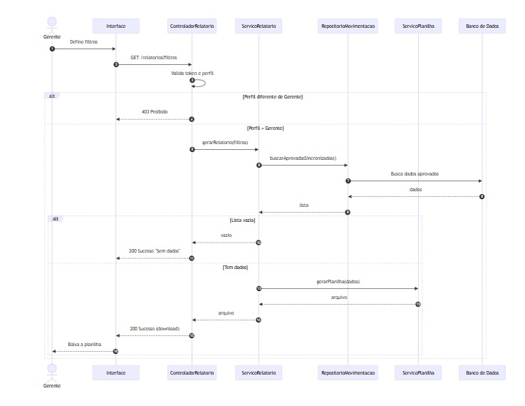</a>
</p>
<p align="center">Fonte: Próprios autores (2026).</p>
</div>

-----

#### 8. Abrir Chamado (`/tickets`)

**Fluxo Principal**

• O processo inicia quando o capataz preenche as informações do chamado na interface da aplicação.

• Após o preenchimento, a interface envia uma requisição `POST` para o endpoint `/tickets`, encaminhando os dados ao *ControladorTicket*.

• Inicialmente, o controlador valida o token e o perfil do usuário, garantindo que ele possui permissão para abrir chamados no sistema.

• Em seguida, os dados são encaminhados ao *ServicoTicket*, responsável pelas regras de negócio da operação.

• O serviço verifica se o chamado possui a indicação obrigatória de evidência descritiva no envio da requisição.

• Caso as informações estejam corretas, o *ServicoTicket* solicita ao *RepositorioTicket* o salvamento do chamado no banco de dados.

• Após a persistência, o banco retorna o identificador do chamado criado, confirmando o sucesso da operação.

• Em seguida, o ticket permanece disponível para consulta, atribuição e aprovação nos endpoints correspondentes.

• Por fim, o controlador responde à interface com status `201 – Criado`, exibindo ao capataz a confirmação de que o chamado foi aberto corretamente.

**Fluxo Alternativo - Chamado sem evidência**

• Durante a validação do chamado, o *ServicoTicket* verifica se a requisição indica a presença de evidência descritiva.

• Caso nenhuma evidência seja enviada, o serviço retorna um erro de validação ao controlador.

• Nesse cenário, o sistema responde à interface com status `400 – Requisição Inválida`.

• Por fim, a interface exibe uma mensagem solicitando que o usuário informe uma evidência descritiva antes de abrir o chamado.

<div align="center">
<p align="center">Figura 17 - Diagrama Sequencial (RF008)</p>
<p align="center">
<a href="https://www.inteli.edu.br/">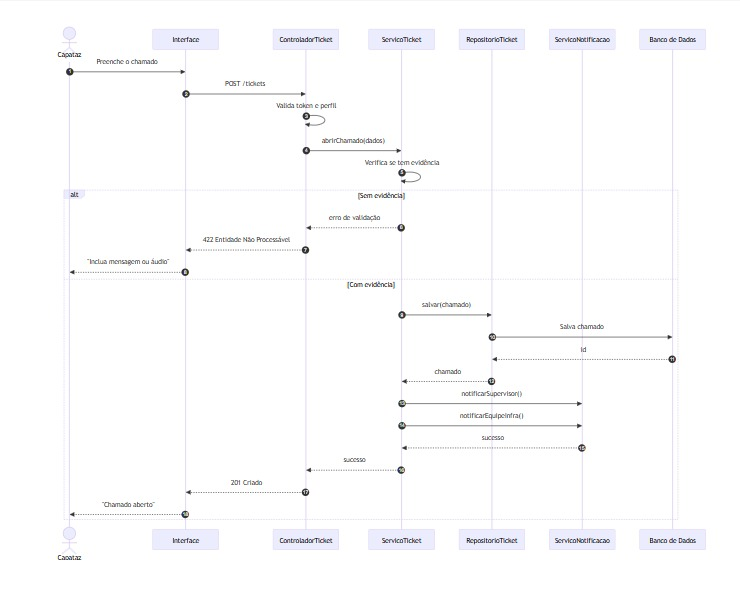</a>
</p>
<p align="center">Fonte: Próprios autores (2026).</p>
</div>

----
 
#### 9. Filtrar Movimentações (`/movimentacoes/filtrar`)
 
**Fluxo Principal**
 
• O processo inicia quando o supervisor define os filtros desejados na interface da aplicação, podendo selecionar retiro, tipo de movimentação, período e status do registro.
 
• Após a seleção dos filtros, a interface envia uma requisição `GET` para o endpoint `/movimentacoes/filtrar`, encaminhando os parâmetros ao *ControladorMovimentacao*.
 
• Inicialmente, o controlador valida o token e o perfil do usuário, garantindo que apenas supervisores possam acessar a funcionalidade de filtragem.
 
• Caso o perfil seja válido, o controlador encaminha os parâmetros ao *ServicoMovimentacao*, responsável pelas regras de filtragem.
 
• O serviço aplica os critérios informados e solicita ao *RepositorioMovimentacao* a busca das movimentações que atendem aos filtros selecionados.
 
• O repositório realiza a consulta no banco de dados e retorna os registros encontrados ao serviço.
 
• Por fim, o controlador responde à interface com status `200 – Sucesso`, exibindo ao supervisor a lista de movimentações filtradas.
 
 
**Fluxo Alternativo - Usuário sem permissão**
 
• Durante a validação inicial, o sistema verifica se o usuário autenticado possui perfil de supervisor.
 
• Caso o perfil seja inválido, o fluxo é interrompido e o *ControladorMovimentacao* retorna uma resposta `403 – Proibido`.
 
• Nesse cenário, a interface exibe uma mensagem informando que o usuário não possui permissão para filtrar movimentações.
 
 
**Fluxo Alternativo - Sem filtros aplicados**
 
• Quando o supervisor acessa a tela sem aplicar nenhum filtro, o *ServicoMovimentacao* aplica automaticamente o filtro padrão definido pela RN09.
 
• Nesse caso, o serviço busca apenas as movimentações com status "pendente" dos retiros sob responsabilidade do supervisor autenticado.
 
• A interface então exibe essa lista padrão, permitindo que o supervisor refine a busca posteriormente.
 
 
**Fluxo Alternativo - Nenhum dado encontrado**
 
• Após a consulta, o *RepositorioMovimentacao* pode retornar uma lista vazia caso nenhum registro corresponda aos filtros aplicados.
 
• Nesse cenário, o controlador responde à interface com status `200 – Sucesso`, exibindo uma mensagem informando que não foram encontradas movimentações para os critérios selecionados.
 
 
<div align="center">
<p align="center">Figura 18 - Diagrama Sequencial (RF009)</p>
<p align="center">
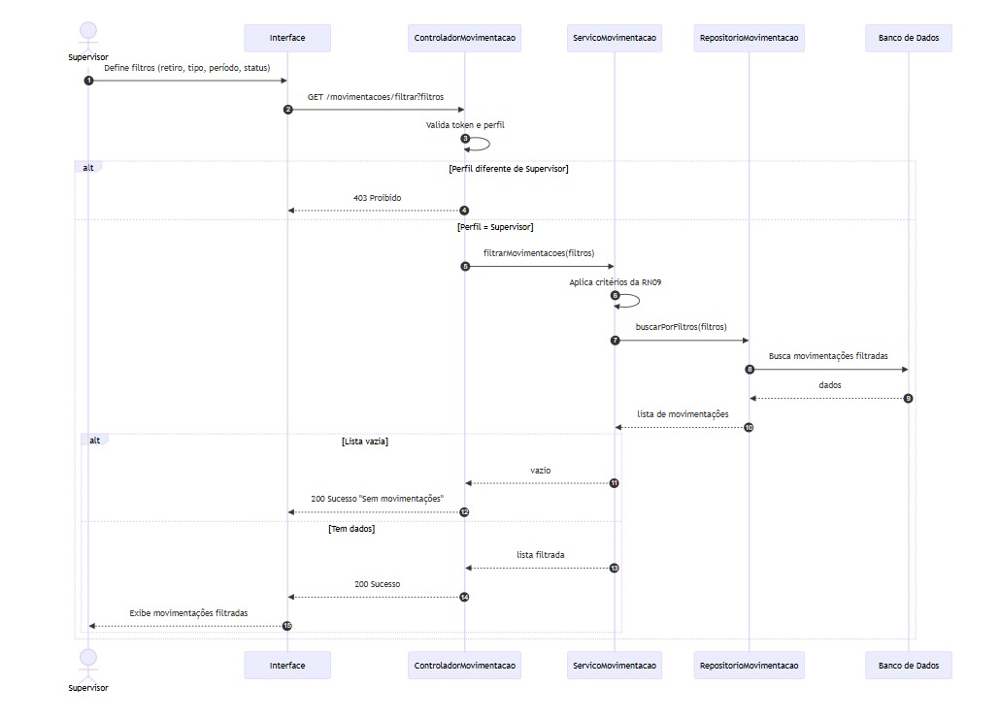</a>
</p>
<p align="center">Fonte: Próprios autores (2026).</p>
</div>

----

#### 10. Dashboard de Indicadores (`/movimentacoes/dashboard`, `/tarefas/dashboard`, `/sincronizacao/dashboard/tickets`)
 
**Fluxo Principal**
 
• O processo inicia quando o gerente acessa o painel de indicadores da fazenda na interface da aplicação.
 
• A interface envia requisições `GET` para os endpoints `/movimentacoes/dashboard`, `/tarefas/dashboard` e `/sincronizacao/dashboard/tickets`, encaminhando os pedidos aos controladores responsáveis por cada domínio.
 
• Inicialmente, os controladores validam o token e o perfil do usuário, garantindo que apenas gerentes possam acessar o dashboard consolidado.
 
• Caso o perfil seja válido, os controladores encaminham as requisições aos serviços de movimentação, tarefa e sincronização, responsáveis por retornar os dados operacionais já filtrados.
 
• O *ServicoMovimentacao* solicita ao *RepositorioMovimentacao* as movimentações validadas e sincronizadas, segmentáveis por tipo (nascimentos, mortes, transferências) e por retiro.
 
• Em seguida, o *ServicoTarefa* retorna tarefas aprovadas e o *ServicoSincronizacao* retorna tickets aprovados, ambos podendo ser filtrados por retiro.
 
• Após receber todos os dados, a interface consolida os indicadores calculando totais individuais por retiro e um totalizador geral, conforme determinado pela RN10.
 
• Por fim, os controladores respondem à interface com status `200 – Sucesso`, permitindo que o dashboard seja exibido ao gerente com os indicadores consolidados.
 
 
**Fluxo Alternativo - Usuário sem permissão**
 
• Durante a validação inicial, o sistema verifica se o usuário autenticado possui perfil de gerente.
 
• Caso o perfil seja inválido, o fluxo é interrompido e o backend retorna uma resposta `403 – Proibido`.
 
• Nesse cenário, a interface exibe uma mensagem informando que o usuário não possui permissão para acessar o dashboard.
 
 
**Fluxo Alternativo - Sem dados disponíveis**
 
• Caso não existam registros conferidos e sincronizados no banco, os serviços retornam listas vazias para consolidação.
 
• Nesse cenário, o sistema responde à interface com status `200 – Sucesso`, exibindo o dashboard com valores zerados e uma mensagem informativa indicando ausência de dados consolidados no período.
 
 
<div align="center">
<p align="center">Figura 19 - Diagrama Sequencial (RF010)</p>
<p align="center">
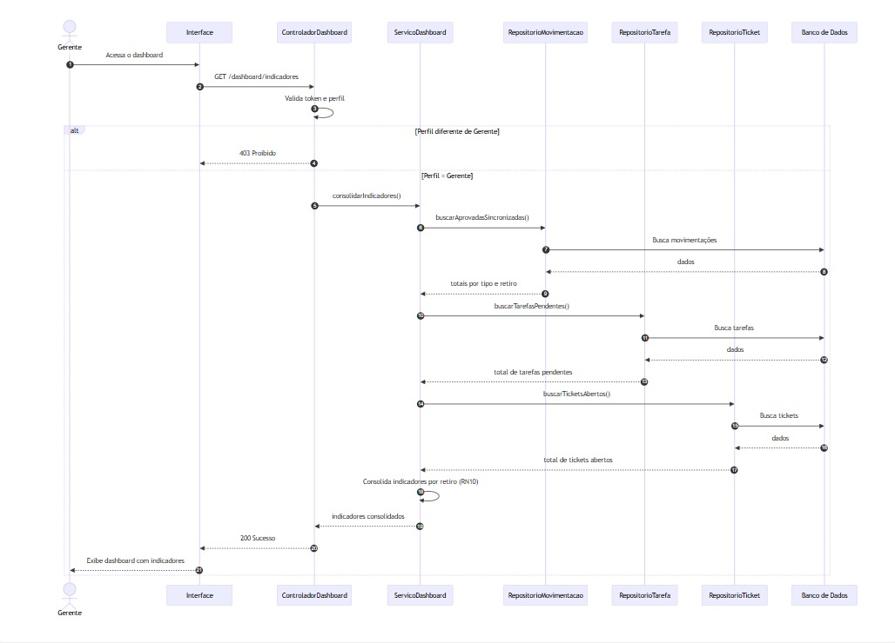</a>
</p>
<p align="center">Fonte: Próprios autores (2026).</p>
</div>

----

#### 11. Alterar Prioridade de Ticket (`/tickets/{id}/prioridade`)
 
**Fluxo Principal**
 
• O processo inicia quando o supervisor ou capataz seleciona um ticket e altera sua prioridade (alta, média ou baixa) na interface da aplicação.
 
• A interface envia uma requisição `PATCH` para o endpoint `/tickets/{id}/prioridade`, encaminhando a nova prioridade ao *ControladorTicket*.
 
• Inicialmente, o controlador valida o token e o perfil do usuário, garantindo que apenas supervisores ou capatazes possam alterar a prioridade dos tickets.
 
• Caso o perfil seja válido, o controlador encaminha os dados ao *ServicoTicket*, responsável pelas regras de alteração.
 
• O serviço solicita ao *RepositorioTicket* a busca do ticket correspondente ao identificador informado.
 
• Após localizar o registro, o serviço valida se a prioridade informada está dentro dos valores permitidos.
 
• Caso a prioridade seja válida, o serviço atualiza o campo no banco de dados, conforme determinado pela RN11.
 
• Por fim, o controlador responde à interface com status `200 – Sucesso`, confirmando ao usuário que a prioridade do ticket foi atualizada.
 
 
**Fluxo Alternativo - Usuário sem permissão**
 
• Durante a validação inicial, o sistema verifica se o usuário autenticado possui perfil de supervisor ou capataz.
 
• Caso o perfil seja inválido, o fluxo é interrompido e o *ControladorTicket* retorna uma resposta `403 – Proibido`.
 
• Nesse cenário, a interface exibe uma mensagem informando que o usuário não possui permissão para alterar a prioridade do ticket.
 
 
**Fluxo Alternativo - Ticket não encontrado**
 
• Durante a busca do ticket, o *RepositorioTicket* verifica se existe um registro correspondente ao identificador informado.
 
• Caso o ticket não seja encontrado, o serviço retorna um erro ao controlador.
 
• O sistema então responde à interface com status `404 – Não Encontrado`, informando que o ticket solicitado não existe.
 
 
**Fluxo Alternativo - Prioridade inválida**
 
• Durante a validação dos dados, o *ServicoTicket* verifica se a prioridade informada corresponde a um dos valores aceitos (alta, média ou baixa).
 
• Caso o valor seja inválido ou não tenha sido preenchido, o serviço retorna um erro de validação ao controlador.
 
• Nesse cenário, o sistema responde à interface com status `400 – Requisição Inválida`, solicitando o preenchimento correto do campo prioridade.
 
 
<div align="center">
<p align="center">Figura 20 - Diagrama Sequencial (RF011)</p>
<p align="center">
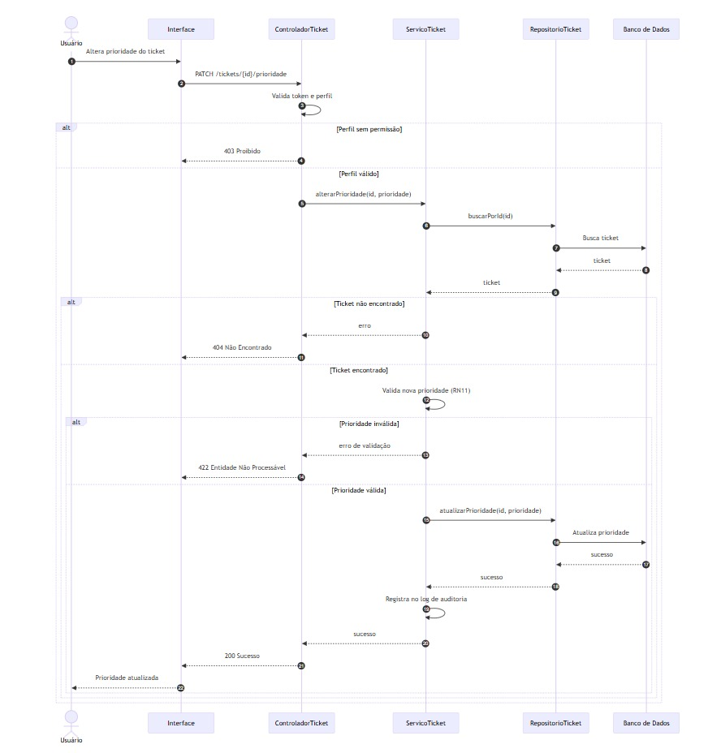</a>
</p>
<p align="center">Fonte: Próprios autores (2026).</p>
</div>

&nbsp;&nbsp;&nbsp;&nbsp;Os diagramas desenvolvidos permitem visualizar de forma detalhada o comportamento do AgroFlow durante a execução das principais operações da aplicação. A representação dos fluxos contribui para a compreensão das regras de negócio, das permissões de acesso e do tratamento de exceções presentes no sistema. Além disso, a modelagem evidencia preocupações importantes do projeto, como a integridade das informações registradas, o controle das validações e a continuidade da operação mesmo em cenários de conectividade limitada. Dessa forma, os diagramas auxiliam tanto na documentação técnica quanto na garantia de que os processos implementados atendem às necessidades operacionais da BRPEC.


### <a name="c3.2.5"></a>3.2.5. Diagrama de Atividades ou Estados (sprint 3)

*Ao menos um fluxo relevante em UML ou BPMN. Use a notação da ferramenta escolhida de forma consistente (sem misturar convenções).*

### <a name="c3.2.6"></a>3.2.6. Diagrama de Implantação (sprints 4 e 5)

*Diagrama UML de deployment mostrando nós físicos, artefatos e canais de comunicação. Representa a visão Engineering + Technology do RM-ODP.*

### <a name="c3.2.7"></a>3.2.7. Padrões de Projeto Aplicados (sprints 3 a 5)

&nbsp;&nbsp;&nbsp;&nbsp;A arquitetura do projeto BRPEC segue o padrão Model-View-Controller (MVC) adaptado para uma aplicação backend em API REST. Nesta implementação, o Model encapsula estrutura de dados e persistência através de Repositories, o Controller gerencia fluxo de requisições HTTP e orquestração com Services, e a View é abstraída pela própria API REST, consumida pelos clientes frontend (web e mobile). Esta separação permite que cada camada tenha responsabilidades bem definidas e desacopladas, facilitando testes unitários, manutenção independente e a possibilidade de múltiplos clientes consumirem a mesma lógica de negócio sem duplicação. Nas seções seguintes, detalha-se a implementação específica de cada componente e os padrões complementares utilizados.

***Model***

&nbsp;&nbsp;&nbsp;&nbsp;O componente Model define a estrutura de dados do projeto, implementado em /src/backend/models/ através de interfaces e tipos que representam as entidades do sistema (Usuário, Movimentação, Tarefa, Ticket, Evidência, Relatório, Sincronização, Retiro). Cada modelo declara a forma esperada dos dados: quais campos existem, seus tipos, quais são obrigatórios e quais são opcionais. Por exemplo, o modelo Movimentacao define que uma movimentação possui campos como tipo, origem, destino, quantidade, status, estagio_vida, cada um com seu tipo e restrições específicas. A necessidade de definir modelos formais justifica-se pela complexidade do domínio agrícola, onde diferentes tipos de operação requerem diferentes estruturas: uma movimentação do tipo "morte" exige causa_obito, enquanto "transferência" exige origem e destino. Modelos bem definidos garantem que toda camada da aplicação trabalhe com dados em formato consistente, reduzindo erros e facilitando documentação. 

&nbsp;&nbsp;&nbsp;&nbsp;Do ponto de vista SOLID, os modelos implementam Single Responsibility (cada modelo descreve uma entidade específica), Interface Segregation (interfaces específicas, não genéricas que obrigam campos desnecessários), e Dependency Inversion (todas as camadas dependem dessa definição abstrata de dados).

***Repositories***

&nbsp;&nbsp;&nbsp;&nbsp;A camada de Repositories, localizada em /src/backend/repositories/, é responsável por abstrair todo o acesso ao banco de dados, isolando a lógica de persistência do restante da aplicação. Cada entidade do sistema possui um repositório dedicado (UsuarioRepository, MovimentacaoRepository, TarefaRepository, entre outros) que implementa as operações de leitura e escrita por meio de queries SQL parametrizadas, sem conter qualquer regra de negócio. Por exemplo, o UsuarioRepository expõe métodos como findByLogin, que busca um usuário a partir de seu login, e findById, que recupera um registro específico pelo identificador. A adoção do padrão Repository justifica-se pela necessidade de centralizar a lógica de banco de dados em um único local, evitando que comandos SQL fiquem espalhados e duplicados pela aplicação, o que dificultaria a manutenção e aumentaria o risco de inconsistências.

&nbsp;&nbsp;&nbsp;&nbsp;Do ponto de vista SOLID, o padrão Repository implementa o princípio Single Responsibility, pois cada repositório é responsável exclusivamente pela persistência de uma única entidade, e o princípio Dependency Inversion, já que os Services dependem da abstração oferecida pelo repositório, e não diretamente da implementação SQL.

***Services***

&nbsp;&nbsp;&nbsp;&nbsp;A camada de Services, localizada em /src/backend/services/, concentra toda a lógica de negócio do sistema, atuando como intermediária entre os Controllers e os Repositories. É nesta camada que residem as validações, as regras de negócio e a orquestração de operações que podem envolver múltiplas entidades. No projeto BRPEC, os Services implementam as regras de negócio levantadas durante o desenvolvimento, como a validação de campos obrigatórios específicos para cada tipo de movimentação, a verificação de permissões de acordo com o cargo do usuário (apenas supervisores podem validar registros), o controle de sincronização de dados produzidos em modo offline e a filtragem de informações que alimentam relatórios e dashboards. Por exemplo, o MovimentacaoService valida que uma movimentação do tipo "morte" possua a causa do óbito e que uma "transferência" contenha origem e destino antes de persistir o registro, enquanto o UsuarioService é responsável pela autenticação e pela verificação de permissões. 

&nbsp;&nbsp;&nbsp;&nbsp;Do ponto de vista SOLID, os Services exemplificam o princípio Open/Closed, pois novas regras de negócio podem ser incorporadas a um serviço ou novos serviços podem ser criados sem alterar Controllers e Repositories existentes, e o princípio Single Responsibility, ao manter a lógica de negócio isolada das responsabilidades de transporte HTTP e de persistência, garantindo que mudanças nas regras do domínio não afetem as demais camadas.

***Middlewares***


***Routes***

&nbsp;&nbsp;&nbsp;&nbsp;A camada de Routes, localizada em /src/backend/routes/, é responsável por definir os endpoints da API, mapeando cada método HTTP e caminho para o respectivo método do Controller. As rotas são organizadas por entidade (usuario.route.ts, movimentacao.route.ts, tarefa.route.ts, ticket.routes.ts, entre outras), de modo que cada arquivo agrupa os endpoints relacionados a um único recurso, seguindo as convenções do padrão REST. No usuario.route.ts, por exemplo, a rota POST /login direciona para a autenticação, enquanto POST / cria um usuário, GET / lista todos, GET /:id busca um registro específico, PATCH /:id atualiza e DELETE /:id remove. As rotas também são ordenadas de forma cuidadosa, posicionando caminhos específicos (como /retiro/:retiroId) antes dos caminhos genéricos por identificador, evitando que uma rota capture indevidamente requisições destinadas a outra. 

&nbsp;&nbsp;&nbsp;&nbsp;Do ponto de vista SOLID, a camada de Routes reflete o princípio Open/Closed, pois novos endpoints podem ser incluídos por meio de novos arquivos de rota ou novas declarações sem necessidade de modificar o roteamento já estabelecido, mantendo a expansão da API de maneira controlada e desacoplada.

***Controllers***

&nbsp;&nbsp;&nbsp;&nbsp;A camada de Controllers, localizada em /src/backend/controllers/, é responsável por receber as requisições HTTP, coordenar o fluxo de processamento e devolver as respostas ao cliente. Cada Controller corresponde a um recurso da API (UsuarioController, MovimentacaoController, TarefaController, entre outros) e expõe métodos que extraem os dados da requisição (parâmetros de URL, corpo e query), realizam validações iniciais de presença de campos, invocam o Service apropriado e formatam a resposta de acordo com o protocolo HTTP, definindo os códigos de status adequados a cada situação. No UsuarioController, por exemplo, o método autenticar verifica a presença de login e senha antes de delegar a autenticação ao serviço, retornando status 400 quando faltam dados, 401 quando as credenciais são inválidas e 200 em caso de sucesso; além disso, o Controller remove o campo senha_hash antes de enviar os dados do usuário, garantindo que informações sensíveis não sejam expostas na resposta.

&nbsp;&nbsp;&nbsp;&nbsp;Do ponto de vista SOLID, os Controllers exemplificam o princípio Single Responsibility, ao se ocuparem exclusivamente do tratamento das requisições e respostas HTTP, como códigos de status, serialização e remoção de dados sensíveis, delegando toda a lógica de negócio aos Services e mantendo, assim, uma clara separação de responsabilidades entre as camadas.


## <a name="c3.3"></a>3.3. Wireframes (sprint 2)

&nbsp;&nbsp;&nbsp;&nbsp;Wireframe é uma representação visual simplificada da interface de um sistema, utilizada para planejar a organização das telas, a navegação e a experiência do usuário. Nesta seção, serão apresentados os wireframes desenvolvidos para a aplicação web da BRPEC, demonstrando como a interface foi estruturada para atender às necessidades operacionais da fazenda. 
&nbsp;&nbsp;&nbsp;&nbsp;O desenvolvimento dessas interfaces foi realizado com base nas [User Stories apresentadas na Seção 2.3](#23-user-stories-sprints-1-a-5) deste documento, garantindo alinhamento entre os requisitos levantados, os fluxos operacionais da fazenda e as necessidades de cada perfil de usuário identificado durante o levantamento de requisitos. Dessa forma, os wireframes buscam apresentar a disposição dos elementos, os fluxos de navegação e as funcionalidades disponíveis no sistema, priorizando simplicidade, rapidez e acessibilidade no uso em campo. 

### Capataz

&nbsp;&nbsp;&nbsp;&nbsp;A interface de uso para capatazes foi construida visando maximizar a simplicidade e facilidade de uso da plataforma. Considerando que os capatazes possuem um nível de instrução e letramento digital baixo, como foi constatado durante o kickoff do projeto e expressado na persona do capataz, as telas foram estruturadas utilizando poucos elementos visuais, botões objetivos e fluxos curtos de navegação, buscando tornar a utilização do sistema mais intuitiva durante as atividades realizadas em campo. Outra escolha guiada por esse princípio de simplicidade foi desenvolver apenas a versão mobile do wireframe para o capataz, visto que essa classe de usuário só acessará o site pelo celular. 

&nbsp;&nbsp;&nbsp;&nbsp;Para atender à US01, relacionada ao funcionamento offline da plataforma, a interface foi planejada de forma a permitir acesso rápido às funcionalidades principais mesmo em ambientes com baixa ou ausência de conexão com a internet. Além disso, os registros realizados pelo usuário podem ser armazenados localmente até que a conexão seja restabelecida e os dados sincronizados automaticamente.

&nbsp;&nbsp;&nbsp;&nbsp;Dentro da seção de operações de campo, foi desenvolvida a funcionalidade de movimentação do rebanho que foi implementada para atender à US02, permitindo que os capatazes realizem registros digitais das movimentações bovinas, substituindo o uso de boletas em papel. Para isso, foram desenvolvidos formulários simplificados e adaptados ao uso em campo, priorizando rapidez no preenchimento e facilidade de utilização. 

&nbsp;&nbsp;&nbsp;&nbsp;Já a funcionalidade de abertura de chamados foi desenvolvida para atender à US07, permitindo que os capatazes reportem problemas de infraestrutura identificados nos retiros. Nessa interface, o usuário pode selecionar a categoria do problema, descrever a ocorrência e registrar o chamado diretamente pelo dispositivo móvel. Complementando essa funcionalidade, foi implementado o envio de imagens como evidência, atendendo à US12, possibilitando o anexo de fotografias aos chamados e aumentando a confiabilidade das informações registradas.

&nbsp;&nbsp;&nbsp;&nbsp;Por fim, a funcionalidade “Minhas tarefas” foi desenvolvida para atender à US03, permitindo que os capatazes visualizem as atividades atribuídas pelos supervisores, incluindo descrições e níveis de prioridade. Dessa forma, a interface contribui para uma melhor organização das atividades operacionais realizadas diariamente na fazenda.

&nbsp;&nbsp;&nbsp;&nbsp;As principais seções da interface mobile do capataz são Home, Operações, Abrir Chamado e Minhas Tarefas, cujos wireframes são apresentados a seguir:

<div align="center">
<p align="center">Figura 18 - Wireframe da aba "Entrar e home" do capataz</p>
<p align="center">
  <a href="https://www.inteli.edu.br/">
    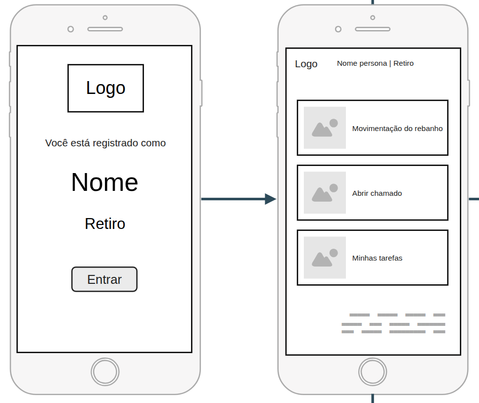
  </a>
</p>
<p align="center">Fonte: Próprios autores (2026).</p>
</div>

<div align="center">
<p align="center">Figura 19 - Wireframe da aba "Registrar operação" do capataz</p>
<p align="center">
  <a href="https://www.inteli.edu.br/">
    
  </a>
</p>
<p align="center">Fonte: Próprios autores (2026).</p>
</div>

<div align="center">
<p align="center">Figura 20 - Wireframe da aba "Abrir chamado" do capataz</p>
<p align="center">
<a href="https://www.inteli.edu.br/">
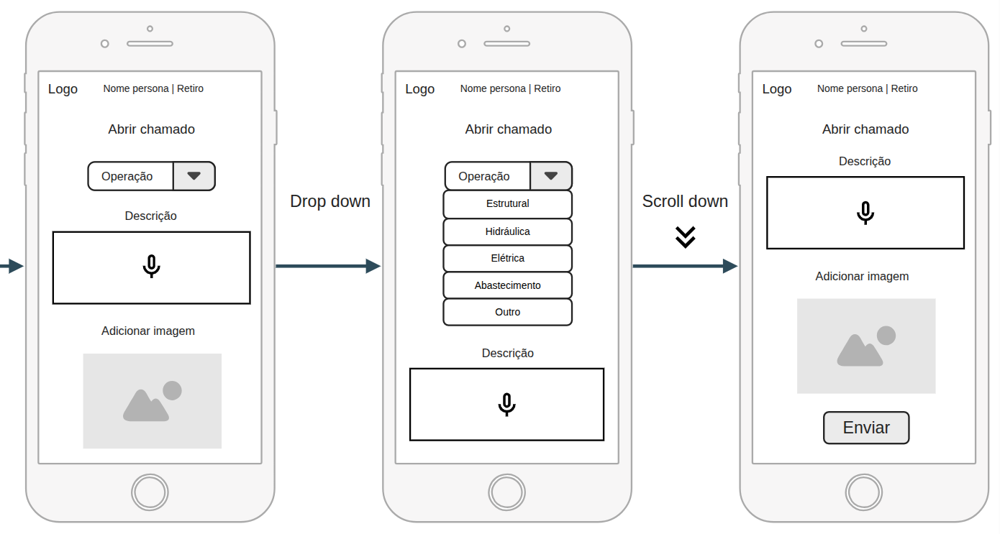
</a>
</p>
<p align="center">Fonte: Próprios autores (2026).</p>
</div>

<div align="center">
<p align="center">Figura 21 - Wireframe da aba "Minhas tarefas" do capataz</p>
<p align="center">
<a href="https://www.inteli.edu.br/">
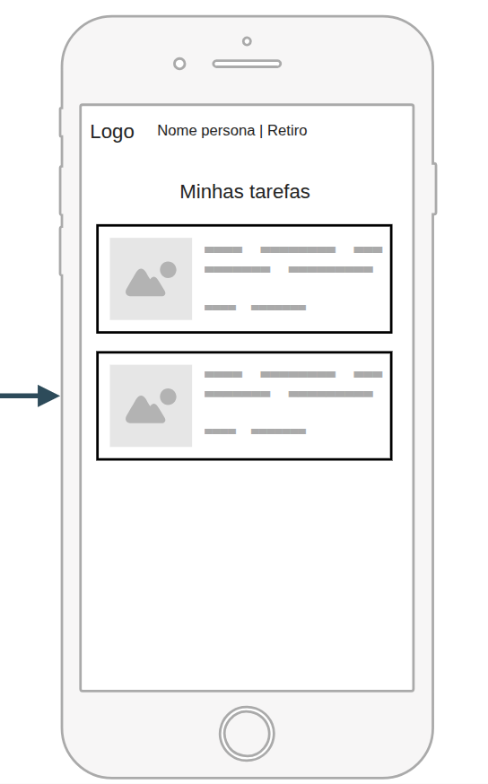
</a>
</p>
<p align="center">Fonte: Próprios autores (2026).</p>
</div>

### Supervisor

&nbsp;&nbsp;&nbsp;&nbsp;As interfaces do supervisor foram desenvolvidas com foco técnico e operacional, permitindo o acompanhamento das atividades realizadas nos retiros e a validação das informações registradas pelos capatazes. O fluxo inicial contempla telas de login simplificadas para dispositivos mobile, organizadas com poucos elementos visuais e campos objetivos, facilitando o acesso rápido ao sistema.

**Versão Mobile:**

&nbsp;&nbsp;&nbsp;&nbsp;Na versão mobile, o dashboard principal foi desenvolvido para centralizar as funcionalidades mais utilizadas pelos supervisores no dia a dia operacional. A interface apresenta atalhos rápidos para relatórios, registros pendentes, alertas e delegação de tarefas, permitindo acesso direto às principais operações do sistema de forma simplificada e organizada.

&nbsp;&nbsp;&nbsp;&nbsp;Para atender à US05, relacionada ao recebimento de alertas operacionais, foi desenvolvida a funcionalidade de visualização de alertas, permitindo que o supervisor acompanhe notificações relacionadas a problemas identificados nos retiros. Dessa forma, o sistema possibilita respostas mais rápidas às ocorrências registradas durante as operações da fazenda.

&nbsp;&nbsp;&nbsp;&nbsp;Visando atender à US04, foi implementada a funcionalidade de registros pendentes, permitindo que o supervisor visualize informações enviadas pelos capatazes para posterior análise e validação. Por meio dessa interface, os registros podem ser acompanhados de forma centralizada, contribuindo para maior confiabilidade e controle das informações operacionais armazenadas no sistema.

&nbsp;&nbsp;&nbsp;&nbsp;A funcionalidade de delegação de tarefas foi desenvolvida para atender à US03, permitindo que os supervisores distribuam atividades operacionais aos capatazes de maneira estruturada. Nessa tela, o supervisor consegue definir período, capataz responsável, atividade solicitada e nível de prioridade da tarefa, facilitando a organização das demandas operacionais realizadas nos retiros.

&nbsp;&nbsp;&nbsp;&nbsp;Além disso, foi implementada a funcionalidade de geração de relatórios operacionais, relacionada à US09. A interface permite a utilização de filtros por período, retiro e tipo de relatório, além da visualização prévia das informações antes da exportação da planilha. Dessa forma, o sistema auxilia o supervisor no acompanhamento e análise das operações realizadas na fazenda, permitindo acesso mais organizado aos dados operacionais.

&nbsp;&nbsp;&nbsp;&nbsp;As principais seções da interface mobile do supervisor são Dashboard, Relatórios, Registros Pendentes, Alertas e Delegação de Tarefas, cujos wireframes são apresentados a seguir:

<div align="center">
<p align="center">Figura 22 - Wireframe Versão Mobile do Supervisor</p>
<p align="center">
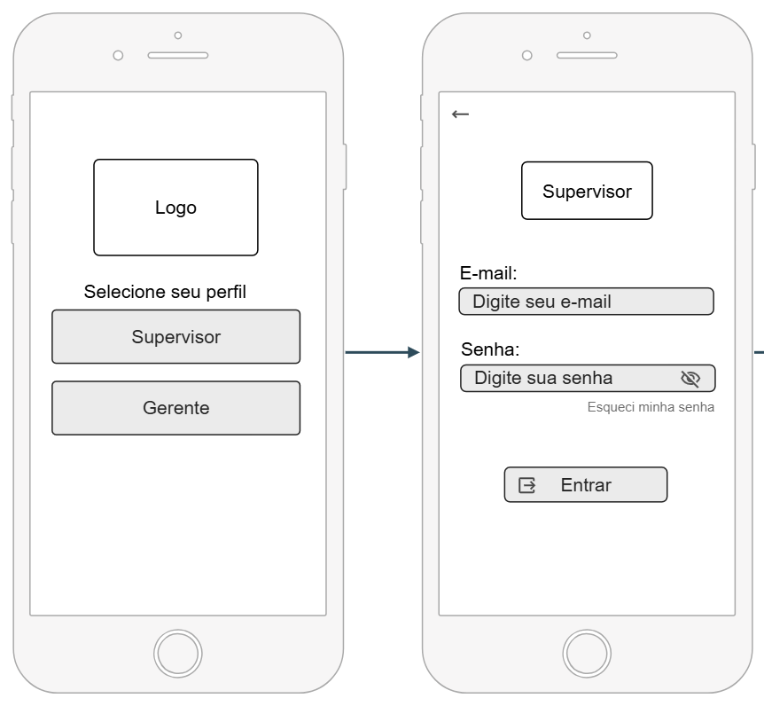
</a>
</p>
<p align="center">Fonte: Próprios autores (2026).</p>
</div>

<div align="center">
<p align="center">Figura 23 - Wireframe Versão Mobile do Supervisor</p>
<p align="center">

</a>
</p>
<p align="center">Fonte: Próprios autores (2026).</p>
</div>

<div align="center">
<p align="center">Figura 24 - Wireframe Versão Mobile do Supervisor</p>
<p align="center">
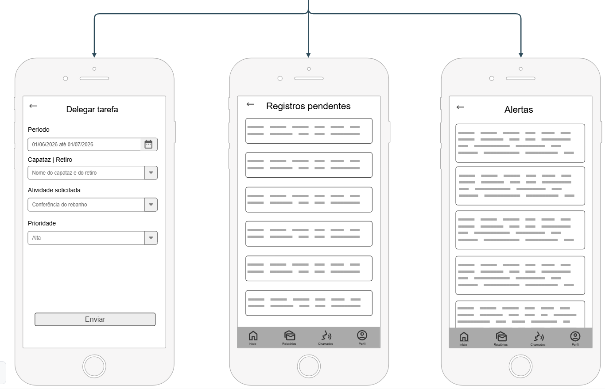
</a>
</p>
<p align="center">Fonte: Próprios autores (2026).</p>
</div>

**Versão Desktop:**

&nbsp;&nbsp;&nbsp;&nbsp;Já na versão desktop, a interface foi estruturada com áreas de visualização ampliadas, menus laterais e listagens organizadas, proporcionando maior controle administrativo e melhor acompanhamento das operações da fazenda. Nessa versão, foram mantidas as mesmas funcionalidades presentes na interface mobile, atendendo às US03, US04, US05, US06 e US09, porém com uma organização voltada à visualização simultânea de informações e ao gerenciamento centralizado das operações realizadas nos retiros. 

<div align="center">
<p align="center">Figura 25 - Wireframe Versão Desktop do Supervisor</p>
<p align="center">
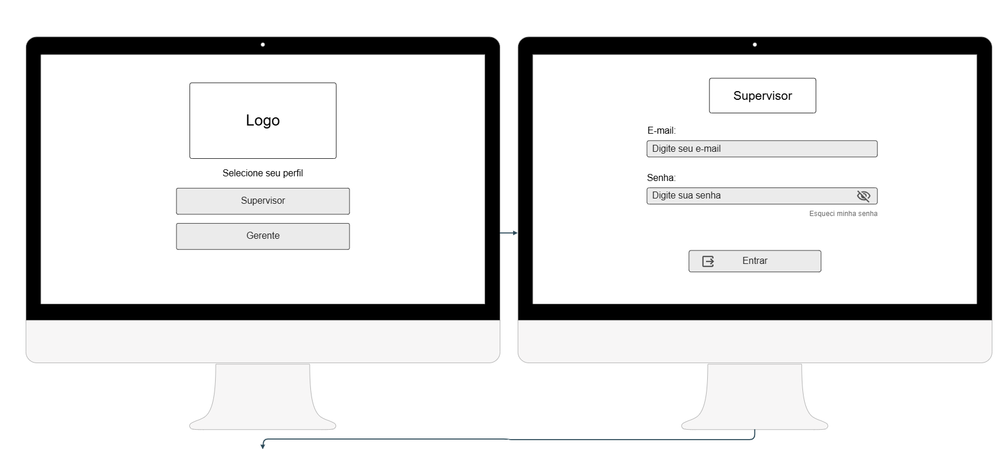
</a>
</p>
<p align="center">Fonte: Próprios autores (2026).</p>
</div>

<div align="center">
<p align="center">Figura 26 - Wireframe Versão Desktop do Supervisor</p>
<p align="center">

</a>
</p>
<p align="center">Fonte: Próprios autores (2026).</p>
</div>

<div align="center">
<p align="center">Figura 27 - Wireframe Versão Desktop do Supervisor</p>
<p align="center">

</a>
</p>
<p align="center">Fonte: Próprios autores (2026).</p>
</div>

<div align="center">
<p align="center">Figura 28 - Wireframe Versão Desktop do Supervisor</p>
<p align="center">

</a>
</p>
<p align="center">Fonte: Próprios autores (2026).</p>
</div>

### Gerente

&nbsp;&nbsp;&nbsp;&nbsp;As interfaces do gerente foram desenvolvidas com foco estratégico e gerencial, permitindo acompanhamento consolidado das operações da BRPEC. O fluxo inicial também contempla telas de login simplificadas, organizadas de forma intuitiva para facilitar a navegação e o acesso rápido às funcionalidades do sistema.


**Versão Mobile:**

&nbsp;&nbsp;&nbsp;&nbsp;Na versão mobile, o dashboard principal foi desenvolvido para centralizar indicadores gerais da fazenda, permitindo que o gerente acompanhe informações relacionadas ao rebanho, tickets aprovados, tarefas aprovadas e movimentações realizadas na operação. Essa funcionalidade foi implementada para atender à US08, relacionada à visualização de dashboards com indicadores operacionais da fazenda, permitindo uma visão mais estratégica e consolidada das atividades realizadas nos retiros.

&nbsp;&nbsp;&nbsp;&nbsp;Além disso, a interface apresenta acesso rápido aos relatórios operacionais e à visualização de ocorrências recentes da fazenda, facilitando o acompanhamento das principais atividades registradas no sistema.

&nbsp;&nbsp;&nbsp;&nbsp;As telas de relatórios foram desenvolvidas para atender à US11, permitindo a aplicação de filtros por período, retiro e tipo de relatório. Dessa forma, o gerente consegue analisar informações específicas de cada unidade da fazenda de maneira mais organizada e detalhada. Além disso, a interface disponibiliza uma prévia visual das informações antes da exportação em planilha, auxiliando no acompanhamento consolidado das operações pecuárias e apoiando a tomada de decisão de forma centralizada.

<div align="center">
<p align="center">Figura 29 - Wireframe Versão Mobile do Gerente</p>
<p align="center">
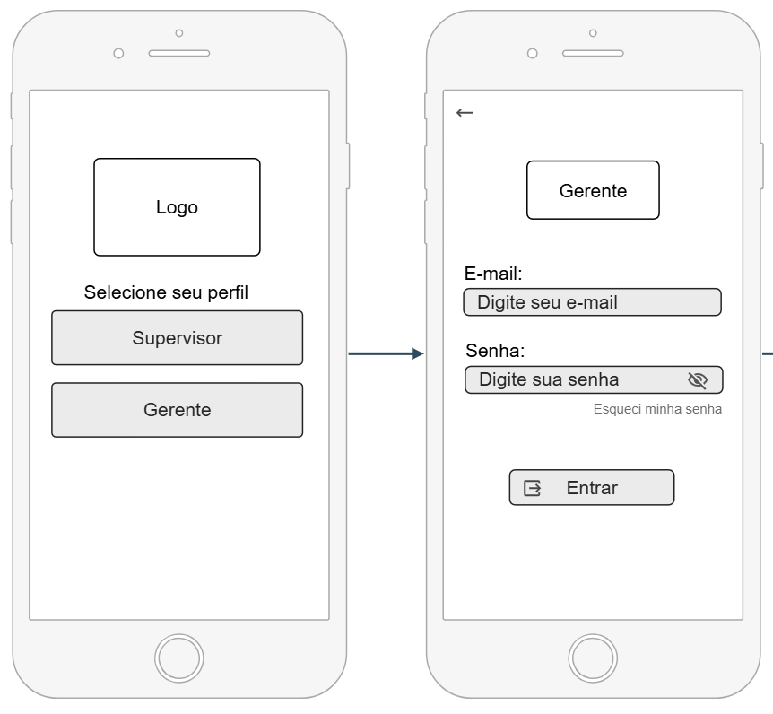
</a>
</p>
<p align="center">Fonte: Próprios autores (2026).</p>
</div>


<div align="center">
<p align="center">Figura 30 - Wireframe Versão Mobile do Gerente</p>
<p align="center">
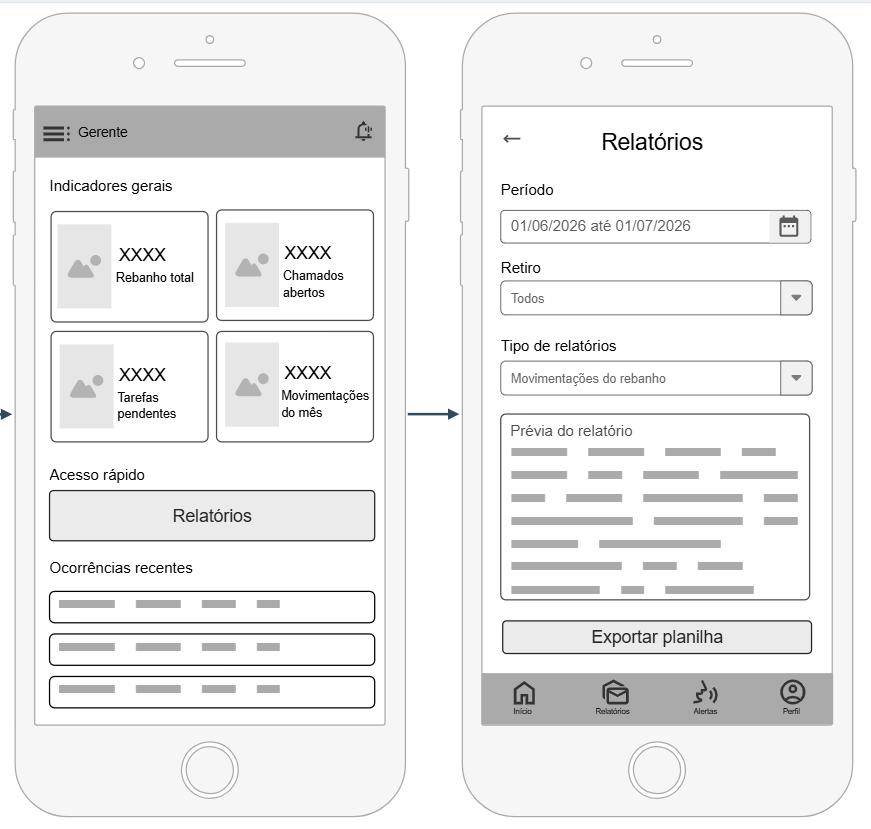
</a>
</p>
<p align="center">Fonte: Próprios autores (2026).</p>
</div>

&nbsp;&nbsp;&nbsp;&nbsp;Na versão desktop, as interfaces foram organizadas utilizando menus laterais, tabelas e áreas ampliadas de visualização, permitindo melhor acompanhamento dos relatórios operacionais, indicadores estratégicos e informações consolidadas da fazenda. Nessa versão, foram mantidas as funcionalidades relacionadas às US08 e US11, possibilitando ao gerente visualizar dashboards gerenciais, acompanhar ocorrências recentes e analisar dados operacionais utilizando filtros por período e retiro de forma centralizada e mais detalhada.

<div align="center">
<p align="center">Figura 31 - Wireframe da aba "Login" Versão Desktop do Gerente</p>
<p align="center">
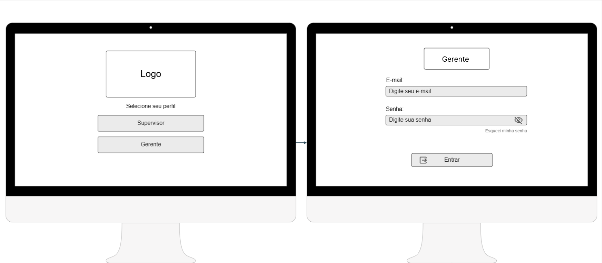
</a>
</p>
<p align="center">Fonte: Próprios autores (2026).</p>
</div>

<div align="center">
<p align="center">Figura 32 - Wireframe da aba "Home e Relatórios" Versão Desktop do Gerente</p>
<p align="center">
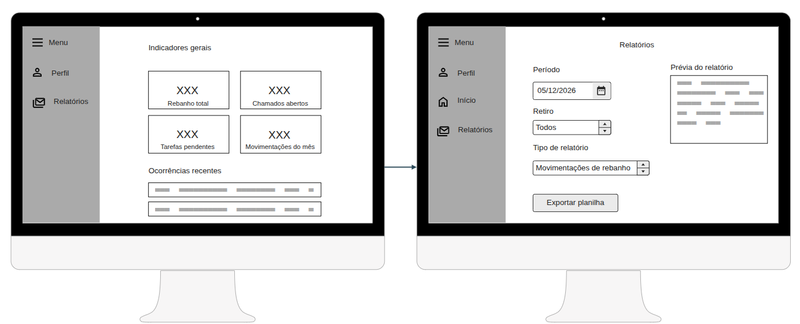
</a>
</p>
<p align="center">Fonte: Próprios autores (2026).</p>
</div>


## <a name="c3.4"></a>3.4. Guia de estilos (sprint 3)

&nbsp;&nbsp;&nbsp;&nbsp;O guia de estilos da aplicação tem como objetivo garantir consistência visual, organização e padronização em toda a interface do sistema desenvolvido para a BRPEC. Ele funciona como uma referência central para o desenvolvimento das telas, definindo diretrizes relacionadas ao uso de cores, tipografia, hierarquia visual e elementos gráficos da aplicação. Dessa forma, o guia auxilia na construção de interfaces mais intuitivas, acessíveis e visualmente coerentes entre os diferentes perfis de usuários do sistema.

&nbsp;&nbsp;&nbsp;&nbsp;Além de fortalecer a identidade visual da aplicação, o guia de estilos contribui para a manutenção da clareza visual e da experiência de uso em ambientes operacionais de campo, nos quais fatores como legibilidade, simplicidade e rápida interpretação das informações são essenciais. A padronização dos componentes também reduz inconsistências durante o desenvolvimento da interface, promovendo maior escalabilidade, facilidade de manutenção e alinhamento visual entre todas as telas do sistema.

### <a name="c3.4.1"></a>3.4.1 Cores

&nbsp;&nbsp;&nbsp;&nbsp;A paleta de cores da aplicação constitui um dos principais elementos da identidade visual do sistema, sendo responsável por transmitir organização, clareza e coerência visual durante a utilização da interface. Além do aspecto estético, a definição cromática contribui diretamente para a legibilidade, hierarquia das informações e identificação rápida de elementos importantes dentro da aplicação. Em sistemas utilizados em ambientes operacionais e dispositivos móveis, como no contexto da BRPEC, a escolha das cores também precisa considerar fatores como contraste, acessibilidade e visibilidade em ambientes externos com alta luminosidade.

&nbsp;&nbsp;&nbsp;&nbsp;Com base nisso, a paleta cromática da aplicação foi desenvolvida considerando o contexto do agronegócio e as necessidades operacionais da fazenda. Os tons de verde foram definidos como cores principais por remeterem visualmente ao campo, à natureza e à identidade do setor agropecuário, além de transmitirem sensação de estabilidade, confiabilidade e equilíbrio.

<div align="center">
<p align="center">Figura 33 - Cores</p>
<p align="center">
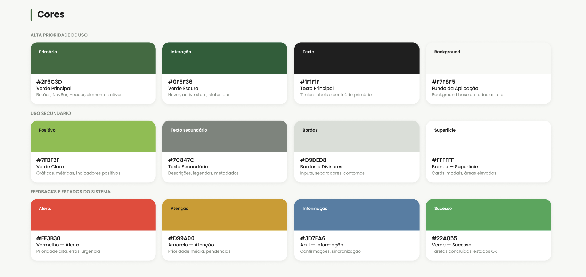
</a>
</p>
<p align="center">Fonte: Próprios autores (2026).</p>
</div>

**Hierarquia Visual das Cores**

&nbsp;&nbsp;&nbsp;&nbsp;A hierarquia visual das cores foi definida com base na frequência de uso e na importância dos elementos dentro da interface da aplicação. Dessa forma, as cores foram organizadas em categorias que representam desde componentes principais do sistema até elementos de apoio, interações e feedbacks operacionais. Essa organização contribui para uma navegação mais intuitiva, facilitando a identificação rápida das informações pelos usuários durante a utilização da aplicação em campo.


**Alta prioridade de uso:**

As cores desta categoria representam os elementos principais da interface, sendo utilizadas com maior frequência durante a navegação e interação com o sistema.

- Botões principais (HEX #2F6B3D): representa as ações centrais da aplicação, como salvar, confirmar e acessar funcionalidades importantes. O verde foi escolhido por remeter ao agronegócio e transmitir estabilidade e confiabilidade.

- Texto principal (HEX #1F1F1F): utilizado em títulos e informações prioritárias, garantindo alto contraste e boa legibilidade em diferentes condições de luminosidade.

- Fundo da aplicação (HEX #F7F8F5): utilizado como base visual da interface, proporcionando conforto visual e reduzindo o cansaço durante o uso contínuo da aplicação.


**Uso secundário:**

As cores secundárias atuam como elementos de apoio visual, auxiliando na organização das informações e na construção da hierarquia da interface.

- Indicadores positivos (HEX #7FBF3F): utilizado em gráficos, métricas e estados positivos do sistema, facilitando a rápida interpretação visual das informações.

- Texto secundário (HEX #7C847C): aplicado em descrições, legendas e informações complementares, mantendo equilíbrio visual sem competir com os conteúdos principais.

- Bordas (HEX #D9DED8): utilizado em divisórias, tabelas e separação de componentes, contribuindo para uma interface mais limpa e organizada.


**Estados de interação:**

As cores desta categoria representam interações e estados visuais dos elementos da interface.

- Destaques e interação (HEX #0F5F36): utilizado em estados de hover, seleção e destaque visual, auxiliando o usuário na percepção de interação com os componentes da aplicação.


**Feedbacks e estados do sistema:**

As cores semânticas são utilizadas para representar alertas, prioridades e feedbacks operacionais dentro do sistema.

- Prioridade alta e alertas (HEX #FF3B30): utilizado em situações críticas e alertas importantes devido ao seu forte destaque visual e rápida associação com urgência.

- Prioridade média (HEX #D99A00): representa estados intermediários de atenção e pendências operacionais, auxiliando na identificação de tarefas que exigem acompanhamento.

- Sucesso e sincronização (HEX #3D7EA6): utilizado em confirmações, sincronizações e feedbacks positivos do sistema, transmitindo sensação de estabilidade e segurança durante a navegação.


### <a name="c3.4.2"></a>3.4.2 Tipografia

&nbsp;&nbsp;&nbsp;&nbsp;A tipografia constitui um dos principais elementos da identidade visual de uma interface digital, sendo responsável por influenciar diretamente a legibilidade, a organização das informações e a experiência de navegação do usuário. A definição padronizada de fontes, tamanhos, pesos e espaçamentos contribui para a criação de interfaces mais consistentes, acessíveis e visualmente organizadas, facilitando a interpretação rápida dos conteúdos apresentados. Além disso, em aplicações utilizadas em dispositivos móveis e ambientes externos, como no contexto operacional da BRPEC, a escolha tipográfica torna-se ainda mais relevante devido à necessidade de boa visualização em diferentes condições de luminosidade e uso contínuo em campo.

&nbsp;&nbsp;&nbsp;&nbsp;Com base nisso, a aplicação adota a família tipográfica Poppins, escolhida por sua aparência moderna, limpa e alta legibilidade em interfaces digitais. A tipografia é aplicada em diferentes pesos e tamanhos conforme a hierarquia textual definida no sistema, contribuindo para a clareza visual, organização dos conteúdos e melhor experiência de uso dos usuários da aplicação.


<div align="center">
<p align="center">Figura 34 - Tipografia</p>
<p align="center">
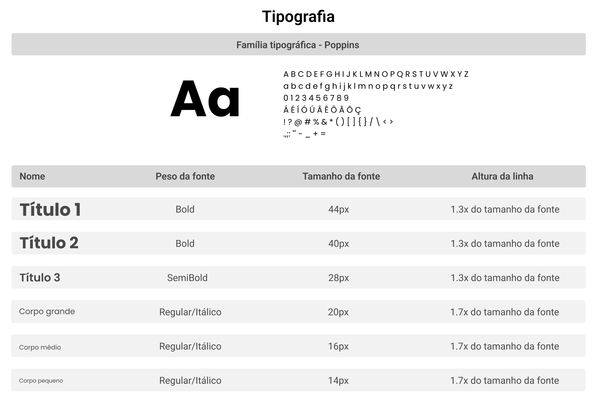
</a>
</p>
<p align="center">Fonte: Próprios autores (2026).</p>
</div>

&nbsp;&nbsp;&nbsp;&nbsp;Dessa forma, a utilização padronizada da tipografia contribui para uma interface mais clara, organizada e alinhada à identidade visual da aplicação. A definição hierárquica dos textos facilita a navegação e a interpretação das informações pelos usuários, especialmente no contexto operacional da BRPEC, no qual rapidez e facilidade de leitura são fatores essenciais para o uso eficiente da aplicação em campo.

### <a name="c3.4.3"></a>3.4.3 Iconografia e imagens

*(esta subseção é opcional, caso não existam ícones e imagens, apague esta subseção)*

*posicione aqui imagens e textos contendo exemplos padronizados de ícones e imagens, com seus respectivos atributos de aplicação, utilizadas na solução*

## <a name="c3.5"></a>3.5 Protótipo de alta fidelidade (sprint 3)

*posicione aqui algumas imagens demonstrativas de seu protótipo de alta fidelidade e o link para acesso ao protótipo completo (mantenha o link sempre público para visualização)*

## <a name="c3.6"></a>3.6. Modelagem do banco de dados (sprints 2 e 4)

### <a name="c3.6.1"></a>3.6.1. Modelo Entidade-Relacionamento (ER) (sprint 2)

&nbsp;&nbsp;&nbsp;&nbsp;O Modelo Entidade-Relacionamento (MER), proposto por Chen (1976), é uma representação conceitual e abstrata dos dados de um sistema, elaborada antes da implementação física do banco de dados. Para o aplicativo BRPec, voltado à logística interna da fazenda, o modelo foi construído a partir das User Stories da Seção 2.3, considerando as personas Daniel Carvalho (capataz), Luiz Felipe (supervisor) e Marcos Ferreira (gerente). A análise dessas histórias permitiu mapear as informações necessárias para suportar os principais fluxos do sistema, como o registro offline de movimentações do rebanho, a gestão de tarefas e tickets de manutenção, a validação de registros em campo e a geração de relatórios gerenciais. A representação adota a notação Chen, em que retângulos indicam entidades, losangos indicam relacionamentos e as cardinalidades aparecem no formato (mín, máx).

### Entidades e Atributos
&nbsp;&nbsp;&nbsp;&nbsp;Foram identificadas dezoito entidades no domínio da BRPec. A entidade EVIDENCIA é generalizada em três subclasses — EVIDENCIA_FOTO, EVIDENCIA_AUDIO e EVIDENCIA_MENSAGEM — implementadas como entidades especializadas que herdam o identificador da entidade pai. Os relacionamentos N:N entre EVIDENCIA e as entidades MOVIMENTACAO, TAREFA e TICKET são resolvidos pelas entidades associativas EVIDENCIA_MOVIMENTACAO, EVIDENCIA_TAREFA e EVIDENCIA_TICKET. Além disso, os dados específicos de movimentação foram separados nas entidades MOVIMENTACAO_COMPRA, MOVIMENTACAO_VENDA, MOVIMENTACAO_TRANSFERENCIA, MOVIMENTACAO_NASCIMENTO e MOVIMENTACAO_MORTE. O controle de sincronização offline é representado pelo atributo sincronizado nas entidades operacionais que passam por sincronização, em conformidade com a RN03 e RN07, eliminando a necessidade de uma entidade de fila separada. A validação de movimentações pelo supervisor é expressa pelos atributos status, validado_por e data_validacao dentro da entidade MOVIMENTACAO, em conformidade com a RN06.

&nbsp;&nbsp;&nbsp;&nbsp;O controle de sincronização offline é gerenciado diretamente pelo atributo sincronizado (boolean) nas entidades operacionais aplicáveis, inicializado como false no momento do registro. Isso significa que registros criados em campo podem ser armazenados localmente no dispositivo e, quando a conexão com o servidor é restabelecida, o sistema sincroniza automaticamente os dados e atualiza o atributo para true. Essa abordagem substitui a necessidade de uma entidade de fila separada, centralizando o controle de sincronização nos próprios registros, em conformidade com a US01, US02 e RN03.

&nbsp;&nbsp;&nbsp;&nbsp;O atributo estagio_vida permanece na entidade MOVIMENTACAO por ser comum ao registro do rebanho. Já atributos específicos, como causa_obito, origem, destino e quantidade, são distribuídos nas tabelas especializadas de movimentação conforme o tipo do evento registrado. O Quadro 39 consolida as entidades e o Quadro 40 apresenta seus atributos.

<p align="center">Quadro 39 - Entidades do modelo conceitual da BRPec.</p>

| Entidade | Descrição e origem nas User Stories |
|----------|-------------------------------------|
| USUARIO | Atores do sistema (capataz, supervisor, gerente), diferenciados pelo atributo cargo. Origem: US01, US03, US08. |
| RETIRO | Subdivisão geográfica e operacional da fazenda. Entidade central do modelo; todas as entidades operacionais referenciam um retiro. Origem: US02, US06, US07, US11.|
| MOVIMENTACAO | Registro base de eventos do rebanho (nascimento, morte, transferência, compra, venda ou outros), criado pelo capataz. Contém status, validado_por e data_validacao para o fluxo de validação pelo supervisor (US04, RN06), sincronizado para controle de operação offline (US01, RN03), e estagio_vida como atributo comum do rebanho. Origem: US01, US02, US04.|
| MOVIMENTACAO_COMPRA | Especialização de MOVIMENTACAO para registros de compra, contendo a quantidade comprada. Origem: US01, RN01. |
| MOVIMENTACAO_VENDA | Especialização de MOVIMENTACAO para registros de venda, contendo a quantidade vendida. Origem: US01, RN01. |
| MOVIMENTACAO_TRANSFERENCIA | Especialização de MOVIMENTACAO para registros de transferência, contendo origem, destino e quantidade. Origem: US01, RN01. |
| MOVIMENTACAO_NASCIMENTO | Especialização de MOVIMENTACAO para registros de nascimento, contendo origem e quantidade. Origem: US01, RN01. |
| MOVIMENTACAO_MORTE | Especialização de MOVIMENTACAO para registros de morte, contendo origem e causa do óbito. Origem: US01, RN01. |
| TAREFA | Atividade criada pelo supervisor e atribuída ao capataz para execução. Origem: US03. |
| TICKET | Solicitação de manutenção de infraestrutura. O supervisor gerencia o chamado e o atribui a um capataz para execução, conforme RF008. Origem: US06, US07, US10. |
| EVIDENCIA | Comprovação anexada a movimentações, tarefas ou tickets. Generalizada em três subclasses: EVIDENCIA_FOTO, EVIDENCIA_AUDIO e EVIDENCIA_MENSAGEM. Origem: US07, US12. |
| EVIDENCIA_FOTO | Especialização de EVIDENCIA com atributos de georreferenciamento (latitude e longitude). Origem: US12. |
| EVIDENCIA_AUDIO | Especialização de EVIDENCIA que armazena o caminho do arquivo de áudio. Origem: US07, US12. |
| EVIDENCIA_MENSAGEM | Especialização de EVIDENCIA que armazena conteúdo textual. Origem: US07, US12. |
| EVIDENCIA_MOVIMENTACAO | Entidade associativa que resolve o relacionamento N:N entre EVIDENCIA e MOVIMENTACAO. Origem: US01, US12. |
| EVIDENCIA_TAREFA | Entidade associativa que resolve o relacionamento N:N entre EVIDENCIA e TAREFA. Origem: US03, US12. |
| EVIDENCIA_TICKET | Entidade associativa que resolve o relacionamento N:N entre EVIDENCIA e TICKET. Origem: US06, US07, US12. |
| RELATORIO | Documento consolidado com indicadores operacionais, gerado por um usuário e associado a um retiro e a um período. Apenas dados com sincronizado = true compõem o relatório, conforme RN07. Origem: US08, US09, US11. |
<p align="center">Fonte: Próprios autores (2026).</p>

<p align="center">Quadro 40 - Atributos das entidades</p>

| Entidade | Atributos |
|----------|-----------|
| USUARIO | id (PK), retiro_id (FK), nome, login, senha_hash, status, data_criacao, cargo |
| RETIRO | id (PK), nome |
| MOVIMENTACAO | id (PK), retiro_id (FK), capataz_id (FK), validado_por (FK), tipo, status, sincronizado, data_criacao, data_validacao, estagio_vida |
| MOVIMENTACAO_COMPRA | movimentacao_id (PK/FK), quantidade |
| MOVIMENTACAO_VENDA | movimentacao_id (PK/FK), quantidade |
| MOVIMENTACAO_TRANSFERENCIA | movimentacao_id (PK/FK), origem, destino, quantidade |
| MOVIMENTACAO_NASCIMENTO | movimentacao_id (PK/FK), origem, quantidade |
| MOVIMENTACAO_MORTE | movimentacao_id (PK/FK), origem, causa_obito |
| TAREFA | id (PK), retiro_id (FK), criada_por (FK), atribuida_a (FK), descricao, categoria, prioridade, data_criacao, status, aprovado_por (FK), sincronizado |
| TICKET | id (PK), retiro_id (FK), aberto_por (FK), atribuido_a (FK), aprovado_por (FK), categoria, localizacao, descricao, prioridade, status, data_criacao, data_realizado, sincronizado |
| EVIDENCIA | id (PK), usuario_id (FK), tipo, data_criacao |
| EVIDENCIA_FOTO | evidencia_id (PK/FK), url_arquivo, latitude, longitude |
| EVIDENCIA_AUDIO | evidencia_id (PK/FK), url_arquivo |
| EVIDENCIA_MENSAGEM | evidencia_id (PK/FK), conteudo |
| EVIDENCIA_MOVIMENTACAO | evidencia_id (PK/FK), movimentacao_id (PK/FK) |
| EVIDENCIA_TAREFA | evidencia_id (PK/FK), tarefa_id (PK/FK) |
| EVIDENCIA_TICKET | evidencia_id (PK/FK), ticket_id (PK/FK) |
| RELATORIO | id (PK), gerado_por (FK), retiro_id (FK), tipo, data_inicio, data_fim, data_gerado, url_arquivo |

<p align="center">Fonte: Próprios autores (2026).</p>

### Relacionamentos e Cardinalidades

&nbsp;&nbsp;&nbsp;&nbsp;Os relacionamentos conectam as entidades segundo as regras de negócio extraídas das User Stories. O vínculo entre USUARIO e MOVIMENTACAO foi desdobrado em dois relacionamentos distintos — REGISTRA e VALIDA — para diferenciar o papel do capataz (autor do registro, conforme US01 e US02) e do supervisor (responsável pela conferência e validação, conforme US04 e RN06). O vínculo entre USUARIO e TAREFA foi desdobrado em CRIA e EXECUTA para refletir os diferentes perfis envolvidos (US03, RN02). O vínculo entre USUARIO e TICKET foi desdobrado em ABRE e ATRIBUIDO_A, diferenciando o capataz que abre o chamado (US07) do capataz ao qual o supervisor atribui o chamado para execução, conforme RF008. O Quadro 41 apresenta o conjunto de relacionamentos do modelo.


<p align="center">Quadro 41 - Relacionamentos do modelo conceitual</p>

| ID | Relacionamento | Entidades | Cardinalidade | Descrição |
|----|----------------|-----------|:-------------:|-----------|
| R1 | PERTENCE_A | USUARIO ↔ RETIRO | (1,1) : (0,N) | Cada usuário pertence a exatamente um retiro; um retiro pode ter zero ou vários usuários. Origem: US01, US03. |
| R2 | REGISTRA | USUARIO ↔ MOVIMENTACAO | (0,N) : (1,1) | Um capataz registra zero ou várias movimentações; toda movimentação tem exatamente um capataz registrador. Origem: US01, US02, RN01. |
| R3 | VALIDA | USUARIO ↔ MOVIMENTACAO | (0,N) : (0,1) | Um supervisor valida zero ou várias movimentações; uma movimentação pendente pode não ter validador e uma movimentação validada referencia exatamente um usuário validador. Origem: US04, RN06. |
| R4 | OCORRE_EM | MOVIMENTACAO ↔ RETIRO | (1,1) : (0,N) | Toda movimentação ocorre em exatamente um retiro; um retiro pode ter zero ou várias movimentações. Origem: US01, US02. |
| R5 | CRIA | USUARIO ↔ TAREFA | (0,N) : (1,1) | Um supervisor cria zero ou várias tarefas; toda tarefa tem exatamente um criador. Origem: US03, RN02. |
| R6 | EXECUTA | USUARIO ↔ TAREFA | (0,N) : (1,1) | Um capataz executa zero ou várias tarefas; toda tarefa é atribuída a exatamente um capataz. Origem: US03, RN02. |
| R7 | VINCULADA_A | TAREFA ↔ RETIRO | (1,1) : (0,N) | Toda tarefa está vinculada a exatamente um retiro; um retiro pode ter zero ou várias tarefas. Origem: US03. |
| R8 | ABRE | USUARIO ↔ TICKET | (0,N) : (1,1) | Um capataz abre zero ou vários tickets; todo ticket tem exatamente um capataz autor. Origem: US07, RN08. |
| R9 | ATRIBUIDO_A | TICKET ↔ USUARIO | (0,1) : (0,N) | Um ticket pode estar sem usuário atribuído ou pode ser atribuído pelo supervisor a um usuário executor; um usuário pode ter zero ou vários tickets atribuídos. Origem: US06, RF008. |
| R10 | LOCALIZADO_EM | TICKET ↔ RETIRO | (1,1) : (0,N) | Todo ticket está vinculado a exatamente um retiro; um retiro pode ter zero ou vários tickets. Origem: US06, US07. |
| R11 | REGISTRADA_POR | EVIDENCIA ↔ USUARIO | (1,1) : (0,N) | Toda evidência é registrada por exatamente um usuário; um usuário pode registrar zero ou várias evidências. Origem: RF004. |
| R12 | ANEXA_MOV | EVIDENCIA_MOVIMENTACAO ↔ EVIDENCIA | (0,N) : (1,1) | Cada associação referencia exatamente uma evidência; uma evidência pode ser vinculada a zero ou várias movimentações. Origem: RF004, US01. |
| R13 | ANEXA_MOV | EVIDENCIA_MOVIMENTACAO ↔ MOVIMENTACAO | (0,N) : (1,1) | Cada associação referencia exatamente uma movimentação; uma movimentação pode ter zero ou várias evidências vinculadas. Origem: RF004, US01. |
| R14 | ANEXA_TAR | EVIDENCIA_TAREFA ↔ EVIDENCIA | (0,N) : (1,1) | Cada associação referencia exatamente uma evidência; uma evidência pode ser vinculada a zero ou várias tarefas. Origem: RF004, US03. |
| R15 | ANEXA_TAR | EVIDENCIA_TAREFA ↔ TAREFA | (0,N) : (1,1) | Cada associação referencia exatamente uma tarefa; uma tarefa pode ter zero ou várias evidências vinculadas. Origem: RF004, US03. |
| R16 | ANEXA_TKT | EVIDENCIA_TICKET ↔ EVIDENCIA | (0,N) : (1,1) | Cada associação referencia exatamente uma evidência; uma evidência pode ser vinculada a zero ou vários tickets. Origem: RF004, US07. |
| R17 | ANEXA_TKT | EVIDENCIA_TICKET ↔ TICKET | (0,N) : (1,1) | Um ticket pode possuir zero ou várias evidências associadas na tabela relacional; a obrigatoriedade de evidência descritiva na criação do chamado é validada pela camada de serviço conforme RN08. Origem: US06, US07, RN08. |
| R18 | GERA | USUARIO ↔ RELATORIO | (0,N) : (1,1) | Um usuário gera zero ou vários relatórios; todo relatório tem exatamente um gerador. Origem: US08, US09, RN07. |
| R19 | ABRANGE | RELATORIO ↔ RETIRO | (1,1) : (0,N) | Todo relatório está associado a exatamente um retiro; um retiro pode aparecer em zero ou vários relatórios. Origem: US08, US09, US11. |
| R20 | ESPECIALIZA_FOTO | EVIDENCIA_FOTO ↔ EVIDENCIA | (0,1) : (1,1) | EVIDENCIA_FOTO especializa EVIDENCIA herdando seu identificador; acrescenta url_arquivo, latitude e longitude, obrigatórios conforme RN04. Origem: RF004, RN04. |
| R21 | ESPECIALIZA_AUDIO | EVIDENCIA_AUDIO ↔ EVIDENCIA | (0,1) : (1,1) | EVIDENCIA_AUDIO especializa EVIDENCIA herdando seu identificador; acrescenta url_arquivo do arquivo de áudio. Origem: RF004, US07. |
| R22 | ESPECIALIZA_MSG | EVIDENCIA_MENSAGEM ↔ EVIDENCIA | (0,1) : (1,1) | EVIDENCIA_MENSAGEM especializa EVIDENCIA herdando seu identificador; acrescenta o atributo conteudo textual. Origem: RF004, US07, RN08. |

<p align="center">Fonte: Próprios autores (2026).</p>

### <a name="c3.6.2"></a>3.6.2. Diagrama Entidade-Relacionamento (DER) (sprint 2)

&nbsp;&nbsp;&nbsp;&nbsp;Para compreender a persistência de dados do sistema por trás da aplicação web, foi elaborado o seguinte Diagrama Entidade-Relacionamento. Ele traduz os requisitos de negócio em uma estrutura técnica, definindo as propriedades de cada objeto (entidade) e as regras que regem suas associações. Esta modelagem é fundamental para assegurar que o banco de dados seja escalável e que as consultas às informações ocorram de maneira lógica e otimizada.

<div align="center">
<p align="center">Figura 34 - Diagrama Entidade-Relacionamento (DER)</p>
<p align="center">

</p>
<p align="center">Fonte: Próprios autores (2026).</p>
</div>

&nbsp;&nbsp;&nbsp;&nbsp;Para facilitar a interpretação dos elementos gráficos e a semântica do modelo, foi adotado o seguinte padrão de cores e formas:

- **Retangulos Verdes Escuros:** Representam as **Entidades** (objetos principais do sistema, como Usuário, Ticket, Movimentação, etc.).
- **Losangos Brancos:** Indicam os **Relacionamentos** e a lógica de interação entre as entidades, acompanhados de sua respectiva cardinalidade (ex: 1:N).
- **Elipses Azuis Claras:** Identificam a **Chave Primária (PK)**, o identificador único de cada registro na tabela.
- **Elipses Verdes Claras:** Identificam as **Chaves Estrangeiras (FK)**, que estabelecem os vínculos de referência entre diferentes entidades.
- **Elipses Cinzas:** Representam os **Atributos Comuns**, que armazenam as informações detalhadas (nome, data, status, etc.).

&nbsp;&nbsp;&nbsp;&nbsp;A estrutura dos dados foi definida para permitir o acompanhamento dos principais registros e operações do sistema. A entidade **Retiro** funciona como o centro do banco de dados, conectando-se com quase todas as outras tabelas. Um ponto importante é a ligação entre **Usuário** e **Movimentação**, que garante que cada entrada ou saída tenha um responsável identificado. Além disso, foi configurada a relação entre **Tarefa** e **Evidência** para que uma única atividade possa ter várias comprovações registradas, como fotos, áudios ou mensagens.

&nbsp;&nbsp;&nbsp;&nbsp;Em resumo, essa modelagem foi definida para garantir robustez, integridade e redução de duplicidade das informações. Com essa estrutura planejada de forma consistente, é possível assegurar que o banco de dados suporte todas as regras de negócio da aplicação, permitindo consultas rápidas e mantendo a organização necessária para as próximas etapas do desenvolvimento.

### <a name="c3.6.3"></a>3.6.3. Modelo Relacional e Modelo Físico (sprints 2 e 4)

**Modelo Relacional**

&nbsp;&nbsp;&nbsp;&nbsp;O modelo relacional foi construído com base no minimundo descrito na seção 3.1, que define as entidades, os perfis de usuário e os fluxos operacionais da BrPec Agropecuária S.A. A modelagem considera a estrutura hierárquica da operação ( composta por Capatazes, Supervisores e Gerentes) e o ciclo completo de dados: registros e tarefas em campo, sincronização, validação e consolidação para relatórios. Cada decisão estrutural do modelo buscou refletir diretamente os requisitos funcionais e as regras de negócio levantados junto ao parceiro.

<div align="center">
<p align="center">Figura 35 – Modelo Relacional</p>
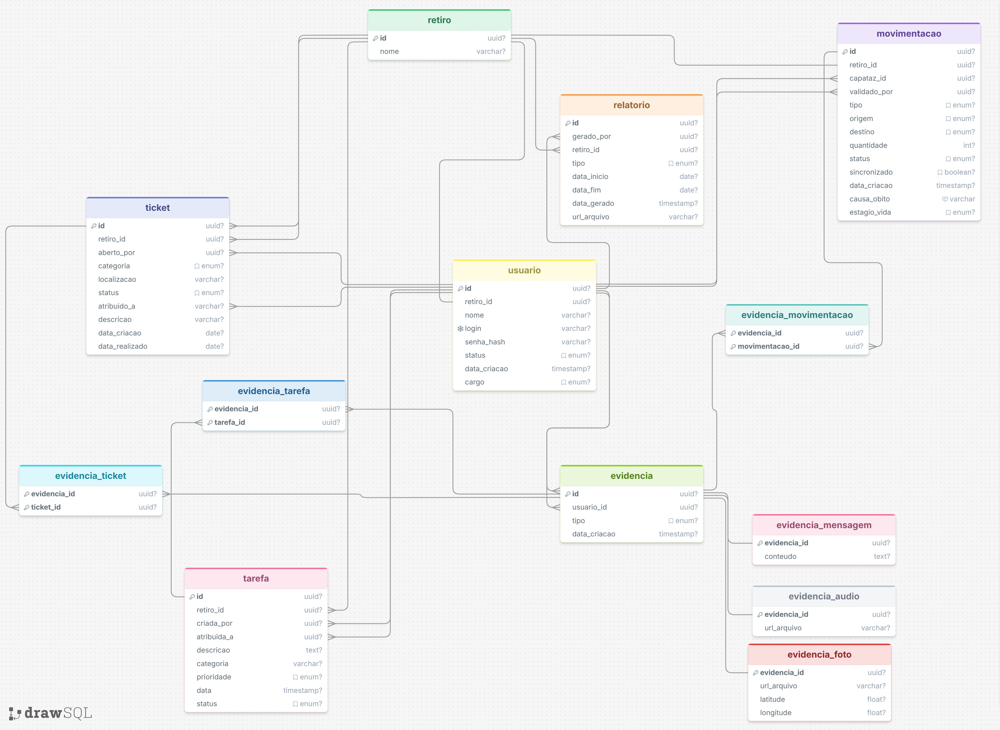
<p align="center">Fonte: Próprios autores (2026).</p>
</div>

&nbsp;&nbsp;&nbsp;&nbsp;O modelo relacional foi desenvolvido tendo como banco de dados alvo o PostgreSQL, utilizado no Supabase. As tabelas, colunas, tipos de dados e chaves primárias e estrangeiras foram definidos com base no minimundo descrito na seção 3.1, adotando-se o padrão de nomenclatura snake_case em todos os nomes de tabelas e campos, garantindo consistência e legibilidade ao longo do modelo.

&nbsp;&nbsp;&nbsp;&nbsp;Identificou-se a necessidade de resolver os relacionamentos N:N (muitos-para-muitos) entre a tabela evidencia e as tabelas movimentacao, tarefa e ticket. Para isso, foram criadas três tabelas intermediárias (evidencia_movimentacao, evidencia_tarefa e evidencia_ticket), cada uma contendo dois campos: a chave estrangeira da tabela evidencia e a chave estrangeira da entidade correspondente.

&nbsp;&nbsp;&nbsp;&nbsp;Optou-se por organizar o modelo de forma a evitar repetição desnecessária de informações entre as tabelas. Cada tabela armazena apenas os dados que lhe pertencem, referenciando informações de outras tabelas por meio de chaves estrangeiras. Por exemplo, o nome do retiro é armazenado exclusivamente na tabela retiro, sendo referenciado nas demais tabelas por meio do campo retiro_id.

&nbsp;&nbsp;&nbsp;&nbsp;As restrições de integridade foram aplicadas conforme as regras de negócio levantadas junto ao parceiro. A tabela movimentacao armazena os dados comuns do registro, enquanto os dados específicos de compra, venda, transferência, nascimento e morte foram separados em tabelas especializadas. Ao campo login da tabela usuario foi atribuída a restrição UNIQUE, impedindo cadastros duplicados. O campo sincronizado recebeu valor padrão false nas tabelas operacionais, garantindo que todo registro criado em modo offline seja iniciado como não sincronizado, em conformidade com a RN07. Os campos que representam categorias ou estados fixos como tipo, status e prioridade foram definidos como ENUM, restringindo os valores aceitos àqueles previstos nas regras de negócio e impedindo inserções inválidas diretamente no banco.

&nbsp;&nbsp;&nbsp;&nbsp;A integridade referencial foi assegurada por meio de chaves estrangeiras em todas as relações do modelo, impedindo que qualquer registro referencie um identificador inexistente em outra tabela. O modelo físico completo, contendo o script DDL com os comandos CREATE TABLE e ALTER TABLE para definição das constraints e relacionamentos, é apresentado na sequência.

**Modelo Físico**

&nbsp;&nbsp;&nbsp;&nbsp;O modelo físico foi desenvolvido a partir do modelo relacional apresentado anteriormente, traduzindo as tabelas, campos e relacionamentos em um script DDL executável no PostgreSQL/Supabase. A seguir, são apresentados os comandos CREATE TYPE e CREATE TABLE utilizados para a criação dos tipos enumerados, tabelas, constraints e chaves estrangeiras do banco de dados do AgroFlow.

```sql
CREATE EXTENSION IF NOT EXISTS pgcrypto;

CREATE TYPE usuario_status AS ENUM ('ativo', 'inativo');
CREATE TYPE usuario_cargo AS ENUM ('capataz', 'supervisor', 'gerente');
CREATE TYPE tarefa_prioridade AS ENUM ('alta', 'media', 'baixa');
CREATE TYPE tarefa_status AS ENUM ('pendente', 'aprovado');
CREATE TYPE ticket_categoria AS ENUM ('cerca', 'hidraulica', 'eletrica', 'edificacao', 'abastecimento_agua', 'outro');
CREATE TYPE ticket_status AS ENUM ('pendente', 'aprovado');
CREATE TYPE ticket_prioridade AS ENUM ('alta', 'media', 'baixa');
CREATE TYPE movimentacao_tipo AS ENUM ('nascimento', 'morte', 'transferencia', 'compra', 'venda', 'outros');
CREATE TYPE movimentacao_status AS ENUM ('pendente', 'validado');
CREATE TYPE movimentacao_estagio_vida AS ENUM (
    'BEZERRO 0 A 7 MESES',
    'GARROTE 8 A 12 MESES',
    'NOVILHA 8 A 12 MESES',
    'GARROTE 13 A 24 MESES',
    'NOVILHA 13 A 24 MESES',
    'BOI 25 A 36 MESES',
    'NOVILHA 25 A 36 MESES',
    'TOURO 25 A 36 MESES',
    'VACA ACIMA 36 MESES',
    'BOI ACIMA 36 MESES',
    'TOURO ACIMA 36 MESES'
);
CREATE TYPE evidencia_tipo AS ENUM ('foto', 'audio', 'mensagem');
CREATE TYPE relatorio_tipo AS ENUM ('movimentacao', 'tarefas', 'tickets', 'consolidado');

CREATE TABLE retiro (
    id BIGINT GENERATED BY DEFAULT AS IDENTITY PRIMARY KEY,
    nome VARCHAR(255) NOT NULL
);

CREATE TABLE usuario (
    id UUID PRIMARY KEY DEFAULT gen_random_uuid(),
    retiro_id BIGINT NOT NULL REFERENCES retiro(id),
    nome VARCHAR(255) NOT NULL,
    login VARCHAR(255) NOT NULL UNIQUE,
    senha_hash VARCHAR(255) NOT NULL,
    status usuario_status NOT NULL,
    data_criacao TIMESTAMP NOT NULL DEFAULT NOW(),
    cargo usuario_cargo NOT NULL
);

CREATE TABLE tarefa (
    id BIGINT GENERATED BY DEFAULT AS IDENTITY PRIMARY KEY,
    retiro_id BIGINT NOT NULL REFERENCES retiro(id),
    criada_por UUID NOT NULL REFERENCES usuario(id),
    atribuida_a UUID NOT NULL REFERENCES usuario(id),
    descricao TEXT NOT NULL,
    categoria VARCHAR(255) NOT NULL,
    prioridade tarefa_prioridade NOT NULL,
    data_criacao TIMESTAMP NOT NULL DEFAULT NOW(),
    status tarefa_status NOT NULL,
    aprovado_por UUID NULL REFERENCES usuario(id),
    sincronizado BOOLEAN NOT NULL DEFAULT false
);

CREATE TABLE movimentacao (
    id BIGINT GENERATED BY DEFAULT AS IDENTITY PRIMARY KEY,
    retiro_id BIGINT NOT NULL REFERENCES retiro(id),
    capataz_id UUID NOT NULL REFERENCES usuario(id),
    validado_por UUID NULL REFERENCES usuario(id),
    tipo movimentacao_tipo NOT NULL,
    status movimentacao_status NOT NULL,
    sincronizado BOOLEAN NOT NULL DEFAULT false,
    data_criacao TIMESTAMP NOT NULL DEFAULT NOW(),
    estagio_vida movimentacao_estagio_vida NOT NULL,
    data_validacao TIMESTAMP NULL
);

CREATE TABLE movimentacao_compra (
    movimentacao_id BIGINT PRIMARY KEY REFERENCES movimentacao(id),
    quantidade INT NOT NULL,
    CHECK (quantidade > 0)
);

CREATE TABLE movimentacao_venda (
    movimentacao_id BIGINT PRIMARY KEY REFERENCES movimentacao(id),
    quantidade INT NOT NULL,
    CHECK (quantidade > 0)
);

CREATE TABLE movimentacao_transferencia (
    movimentacao_id BIGINT PRIMARY KEY REFERENCES movimentacao(id),
    origem VARCHAR(255) NOT NULL,
    destino VARCHAR(255) NOT NULL,
    quantidade INT NOT NULL,
    CHECK (quantidade > 0)
);

CREATE TABLE movimentacao_nascimento (
    movimentacao_id BIGINT PRIMARY KEY REFERENCES movimentacao(id),
    origem VARCHAR(255) NOT NULL,
    quantidade INT NOT NULL,
    CHECK (quantidade > 0)
);

CREATE TABLE movimentacao_morte (
    movimentacao_id BIGINT PRIMARY KEY REFERENCES movimentacao(id),
    origem VARCHAR(255) NOT NULL,
    causa_obito VARCHAR(255) NOT NULL
);

CREATE TABLE ticket (
    id BIGINT GENERATED BY DEFAULT AS IDENTITY PRIMARY KEY,
    retiro_id BIGINT NOT NULL REFERENCES retiro(id),
    aberto_por UUID NOT NULL REFERENCES usuario(id),
    categoria ticket_categoria NOT NULL,
    localizacao VARCHAR(255) NOT NULL,
    status ticket_status NOT NULL,
    atribuido_a UUID NULL REFERENCES usuario(id),
    aprovado_por UUID NULL REFERENCES usuario(id),
    descricao VARCHAR(255) NOT NULL,
    prioridade ticket_prioridade NOT NULL,
    sincronizado BOOLEAN NOT NULL DEFAULT false,
    data_criacao DATE NOT NULL DEFAULT CURRENT_DATE,
    data_realizado DATE NOT NULL DEFAULT CURRENT_DATE
);

CREATE TABLE evidencia (
    id BIGINT GENERATED BY DEFAULT AS IDENTITY PRIMARY KEY,
    usuario_id UUID NOT NULL REFERENCES usuario(id),
    tipo evidencia_tipo NOT NULL,
    data_criacao TIMESTAMP NOT NULL DEFAULT NOW()
);

CREATE TABLE evidencia_foto (
    evidencia_id BIGINT PRIMARY KEY REFERENCES evidencia(id) ON DELETE CASCADE,
    url_arquivo TEXT NOT NULL,
    latitude DOUBLE PRECISION NOT NULL,
    longitude DOUBLE PRECISION NOT NULL
);

CREATE TABLE evidencia_audio (
    evidencia_id BIGINT PRIMARY KEY REFERENCES evidencia(id) ON DELETE CASCADE,
    url_arquivo TEXT NOT NULL
);

CREATE TABLE evidencia_mensagem (
    evidencia_id BIGINT PRIMARY KEY REFERENCES evidencia(id) ON DELETE CASCADE,
    conteudo TEXT NOT NULL
);

CREATE TABLE evidencia_movimentacao (
    evidencia_id BIGINT NOT NULL REFERENCES evidencia(id) ON DELETE CASCADE,
    movimentacao_id BIGINT NOT NULL REFERENCES movimentacao(id) ON DELETE CASCADE,
    PRIMARY KEY (evidencia_id, movimentacao_id)
);

CREATE TABLE evidencia_tarefa (
    evidencia_id BIGINT NOT NULL REFERENCES evidencia(id) ON DELETE CASCADE,
    tarefa_id BIGINT NOT NULL REFERENCES tarefa(id) ON DELETE CASCADE,
    PRIMARY KEY (evidencia_id, tarefa_id)
);

CREATE TABLE evidencia_ticket (
    evidencia_id BIGINT NOT NULL REFERENCES evidencia(id) ON DELETE CASCADE,
    ticket_id BIGINT NOT NULL REFERENCES ticket(id) ON DELETE CASCADE,
    PRIMARY KEY (evidencia_id, ticket_id)
);

CREATE TABLE relatorio (
    id BIGINT GENERATED BY DEFAULT AS IDENTITY PRIMARY KEY,
    gerado_por UUID NOT NULL REFERENCES usuario(id),
    retiro_id BIGINT NOT NULL REFERENCES retiro(id),
    tipo relatorio_tipo NOT NULL,
    data_inicio DATE NOT NULL,
    data_fim DATE NOT NULL,
    data_gerado TIMESTAMP NOT NULL DEFAULT NOW(),
    url_arquivo TEXT NOT NULL
);
```
&nbsp;&nbsp;&nbsp;&nbsp;Ao longo do desenvolvimento do modelo, algumas decisões técnicas foram tomadas com base nas regras de negócio e nos requisitos do sistema. Para a tabela usuario, optou-se pelo tipo UUID, considerando a sensibilidade dos dados de identificação dos usuários. Para as demais entidades operacionais, foram utilizados identificadores numéricos BIGINT gerados automaticamente por identidade, simplificando chaves primárias, chaves estrangeiras e consultas internas.

&nbsp;&nbsp;&nbsp;&nbsp;Os campos que representam categorias ou estados fixos, como tipo, status e prioridade, foram definidos como ENUM, restringindo os valores aceitos àqueles previstos nas regras de negócio e impedindo inserções inválidas diretamente no banco. O campo sincronizado foi definido como BOOLEAN com valor padrão false nas tabelas operacionais que passam pelo fluxo offline, garantindo que todo registro criado em modo offline seja iniciado como não sincronizado, tornando-se true apenas após a sincronização com o servidor, em conformidade com a RN07. Os campos latitude e longitude foram concentrados na tabela evidencia_foto, pois o georreferenciamento é exigido apenas para evidências do tipo foto. Os campos de data utilizam DATE ou TIMESTAMP conforme a necessidade de registrar apenas o dia ou o momento completo da operação.

&nbsp;&nbsp;&nbsp;&nbsp;A integridade referencial foi implementada por meio de FOREIGN KEY em todas as relações. Esse padrão garante que nenhum registro possa referenciar um identificador inexistente em outra tabela, mantendo a consistência dos dados ao longo de todas as operações do sistema.

&nbsp;&nbsp;&nbsp;&nbsp;Para melhor visualização o diagrama utiliza a notação Crow's Foot, na qual o símbolo de pé de galinha indica cardinalidade muitos (N) e a linha simples indica cardinalidade um (1), estando as multiplicidades representadas visualmente em ambos os lados de cada relacionamento.


&nbsp;&nbsp;&nbsp;&nbsp;Portanto, o modelo relacional e físico desenvolvido nesta seção centraliza digitalmente todas as entidades operacionais da BrPec Agropecuária S.A., traduzindo os fluxos descritos no minimundo em tabelas, relacionamentos e restrições executáveis no PostgreSQL/Supabase. As decisões estruturais tomadas ao longo da modelagem buscaram refletir diretamente as regras de negócio levantadas junto ao parceiro, garantindo que o banco de dados seja não apenas funcional, mas também consistente com a realidade operacional dos retiros. Com o modelo físico implementado, o sistema passa a contar com uma base de dados estruturada para suportar o ciclo completo de dados previsto no projeto: o registro de movimentações e tarefas em campo pelos capatazes, a sincronização com o servidor, a validação pelos supervisores e a consolidação das informações para geração de relatórios pelos gerentes.

### <a name="c3.6.4"></a>3.6.4. Consultas SQL e lógica proposicional (sprint 3)
 

&nbsp;&nbsp;&nbsp;&nbsp;As consultas SQL apresentadas nesta seção representam regras utilizadas nos fluxos centrais do AgroFlow e demonstram como a lógica proposicional aparece na seleção, atualização e inserção de dados. Para manter coerência com a implementação, foram escolhidos exemplos relacionados aos filtros de movimentação, aprovação de tickets e criação de registros do rebanho. Em alguns casos, a condição aparece no backend distribuída entre controller, service e repository, por isso, o SQL abaixo apresenta a forma relacional equivalente da regra aplicada pela camada de servidor.

**Convenções adotadas:**

* **V** = Verdadeiro
* **F** = Falso
* **∧** = Conjunção lógica (**AND**)
* **∨** = Disjunção lógica (**OR**)
* **¬** = Negação lógica (**NOT**)
* A coluna **Resultado** indica se o registro satisfaz a condição analisada.

 
---

#### Consulta 1 - SELECT (Filtro de movimentações por retiro, tipo e status):
 
&nbsp;&nbsp;&nbsp;&nbsp;O endpoint de filtro de movimentações exige o `retiroId` e permite informar listas de tipos e status. No service, esse comportamento é aplicado com comparações e `includes`, em SQL, a forma equivalente utiliza `IN` para representar listas de valores e `OR` para permitir que filtros opcionais sejam ignorados quando não forem enviados.
 
**Código SQL:**
 
```sql
SELECT *
FROM movimentacao
WHERE retiro_id = ?
  AND (? IS NULL OR tipo IN (?))
  AND (? IS NULL OR status IN (?));
```
 
**Proposições lógicas:**
 
- $P$: a movimentação pertence ao retiro informado (`retiro_id = ?`)
- $Q$: nenhum filtro de tipo foi informado (`? IS NULL`)
- $R$: o tipo da movimentação pertence à lista de tipos informada (`tipo IN (?)`)
- $S$: nenhum filtro de status foi informado (`? IS NULL`)
- $T$: o status da movimentação pertence à lista de status informada (`status IN (?)`)

**Expressão lógica proposicional:** $P \land (Q \lor R) \land (S \lor T)$
 
&nbsp;&nbsp;&nbsp;&nbsp;A consulta combina conjunção, disjunção e o operador SQL `IN`. A movimentação só passa pelo filtro se pertencer ao retiro informado e, ao mesmo tempo, satisfizer os filtros opcionais de tipo e status. Quando uma lista não é enviada, a proposição correspondente à ausência do filtro torna a disjunção verdadeira.
 
**Tabela verdade:**
 
<p align="center">Quadro 42 - Tabela verdade da Consulta 1 (SELECT).</p>

<div align="center">

| $P$ | $Q$ | $R$ | $S$ | $T$ | $Q \lor R$ | $S \lor T$ | $P \land (Q \lor R) \land (S \lor T)$ |
|:---:|:---:|:---:|:---:|:---:|:---:|:---:|:---:|
| F | F | F | F | F | F | F | **F** |
| F | F | F | F | V | F | V | **F** |
| F | F | F | V | F | F | V | **F** |
| F | F | F | V | V | F | V | **F** |
| F | F | V | F | F | V | F | **F** |
| F | F | V | F | V | V | V | **F** |
| F | F | V | V | F | V | V | **F** |
| F | F | V | V | V | V | V | **F** |
| F | V | F | F | F | V | F | **F** |
| F | V | F | F | V | V | V | **F** |
| F | V | F | V | F | V | V | **F** |
| F | V | F | V | V | V | V | **F** |
| F | V | V | F | F | V | F | **F** |
| F | V | V | F | V | V | V | **F** |
| F | V | V | V | F | V | V | **F** |
| F | V | V | V | V | V | V | **F** |
| V | F | F | F | F | F | F | **F** |
| V | F | F | F | V | F | V | **F** |
| V | F | F | V | F | F | V | **F** |
| V | F | F | V | V | F | V | **F** |
| V | F | V | F | F | V | F | **F** |
| V | F | V | F | V | V | V | **V** |
| V | F | V | V | F | V | V | **V** |
| V | F | V | V | V | V | V | **V** |
| V | V | F | F | F | V | F | **F** |
| V | V | F | F | V | V | V | **V** |
| V | V | F | V | F | V | V | **V** |
| V | V | F | V | V | V | V | **V** |
| V | V | V | F | F | V | F | **F** |
| V | V | V | F | V | V | V | **V** |
| V | V | V | V | F | V | V | **V** |
| V | V | V | V | V | V | V | **V** |

</div>
 
<p align="center">Fonte: Próprios autores (2026).</p>

&nbsp;&nbsp;&nbsp;&nbsp;A tabela mostra que o retiro é sempre obrigatório. Os filtros de tipo e status podem ser satisfeitos de duas formas: ausência do filtro ou correspondência com a lista informada.
 
---

#### Consulta 2 - SELECT (Busca de tickets pendentes por prioridade):

&nbsp;&nbsp;&nbsp;&nbsp;A entidade `ticket` registra chamados de infraestrutura abertos em campo, com informações de retiro, categoria, localização, status, prioridade e descrição. A consulta abaixo representa uma busca operacional coerente com os filtros do sistema: retorna tickets pendentes de um retiro, restringindo o resultado a prioridades relevantes para acompanhamento pelo Supervisor.

**Código SQL:**

```sql
SELECT id, retiro_id, categoria, localizacao, status, prioridade, descricao
FROM ticket
WHERE retiro_id = ?
  AND status = 'pendente'
  AND prioridade IN ('alta', 'media');
```

**Proposições lógicas:**

- $P$: o ticket pertence ao retiro informado (`retiro_id = ?`)
- $Q$: o ticket está pendente (`status = 'pendente'`)
- $R$: a prioridade do ticket está na lista informada (`prioridade IN ('alta', 'media')`)

**Expressão lógica proposicional:** $P \land Q \land R$

&nbsp;&nbsp;&nbsp;&nbsp;A consulta utiliza conjunções para exigir que todas as regras sejam atendidas. O operador `IN` representa a aceitação de mais de uma prioridade em uma mesma condição, mantendo a busca alinhada aos filtros de status, prioridade e retiro presentes no backend.

**Tabela verdade:**

<p align="center">Quadro 43 - Tabela verdade da Consulta 2 (SELECT).</p>

<div align="center">

| $P$ | $Q$ | $R$ | $P \land Q \land R$ |
|:---:|:---:|:---:|:---:|
| F | F | F | **F** |
| F | F | V | **F** |
| F | V | F | **F** |
| F | V | V | **F** |
| V | F | F | **F** |
| V | F | V | **F** |
| V | V | F | **F** |
| V | V | V | **V** |

</div>

<p align="center">Fonte: Próprios autores (2026).</p>

---

#### Consulta 3 - UPDATE (Aprovação de ticket pelo Supervisor):
 
&nbsp;&nbsp;&nbsp;&nbsp;A tabela `ticket` registra chamados de infraestrutura abertos pelos Capatazes em campo, conforme o RF008. No modelo implementado, esses chamados entram inicialmente com status pendente e podem ser validados por um Supervisor. A consulta abaixo atualiza o status do ticket para aprovado e registra o usuário responsável pela aprovação no campo `aprovado_por`, desde que o ticket ainda esteja pendente e ainda não possua aprovador registrado.
 
**Código SQL:**
 
```sql
UPDATE ticket 
SET status = 'aprovado',
    aprovado_por = ?
WHERE id = ? 
  AND status = 'pendente'
  AND NOT aprovado_por IS NOT NULL;
```
 
**Proposições lógicas:**
 
- $P$: o ticket é aquele identificado pelo parâmetro (`id = ?`)
- $S$: o ticket está pendente (`status = 'pendente'`)
- $A$: o ticket já possui aprovador registrado (`aprovado_por IS NOT NULL`)
 
**Expressão lógica proposicional:** $P \land S \land \neg A$
 
&nbsp;&nbsp;&nbsp;&nbsp;A consulta utiliza conjunção e negação. A atualização só deve ocorrer quando o ticket corresponde ao identificador informado, ainda está pendente e não possui aprovador registrado. A condição `NOT aprovado_por IS NOT NULL` reforça que um ticket já aprovado não deve ser aprovado novamente.
 
**Tabela verdade:**
 
<p align="center">Quadro 44 - Tabela verdade da Consulta 3 (UPDATE).</p>

<div align="center">

| $P$ | $S$ | $A$ | $\neg A$ | $P \land S \land \neg A$ |
|:---:|:---:|:---:|:---:|:---:|
| F | F | F | V | **F** |
| F | F | V | F | **F** |
| F | V | F | V | **F** |
| F | V | V | F | **F** |
| V | F | F | V | **F** |
| V | F | V | F | **F** |
| V | V | F | V | **V** |
| V | V | V | F | **F** |

</div>
 
<p align="center">Fonte: Próprios autores (2026).</p>

&nbsp;&nbsp;&nbsp;&nbsp;O UPDATE só é aplicado quando o ticket identificado existe ($P$ = V), ainda está pendente ($S$ = V) e não possui aprovador registrado ($A$ = F). Isso impede que tickets já aprovados sejam reaprovados indevidamente.
 
---

#### Consulta 4 - INSERT (Registro de movimentação do rebanho):
 
&nbsp;&nbsp;&nbsp;&nbsp;A tabela `movimentacao` armazena os dados comuns dos eventos do rebanho (nascimento, morte, transferência, compra, venda ou outros) feitos pelos Capatazes em campo. Conforme o RF001, o sistema deve permitir o registro dessas movimentações com campos específicos conforme o tipo selecionado. A consulta abaixo insere a movimentação base no estado inicial pendente e, em seguida, insere os dados específicos em uma tabela complementar. O campo sincronizado recebe FALSE quando o Capataz está offline e TRUE quando o registro é criado diretamente com conectividade, refletindo o RF003. A validação dos campos obrigatórios ocorre na camada de serviço antes da persistência, garantindo que apenas dados compatíveis com o tipo da movimentação sejam enviados ao banco.
 
**Código SQL:**
 
```sql
INSERT INTO movimentacao 
    (retiro_id, capataz_id, validado_por, tipo, status, sincronizado, data_criacao, estagio_vida, data_validacao) 
VALUES (?, ?, NULL, ?, 'pendente', ?, NOW(), ?, NULL)
RETURNING id;

INSERT INTO movimentacao_transferencia
    (movimentacao_id, origem, destino, quantidade)
VALUES (?, ?, ?, ?);
```
 
&nbsp;&nbsp;&nbsp;&nbsp;O INSERT não possui cláusula `WHERE`, mas é precedido por validações de negócio na camada de serviço. Cada validação corresponde a uma expressão lógica que precisa ser verdadeira para que o backend envie a inserção ao banco. As validações 4.1 e 4.2 abaixo são sub-validações da mesma operação de INSERT de movimentação, analisadas separadamente para explicitar as regras específicas de morte e transferência.
 
**Validação 1: `causa_obito` obrigatória para morte**
 
**Regra:** `tipo != 'morte' OR causa_obito IS NOT NULL`
 
**Proposições lógicas:**
 
- $M$: o tipo da movimentação é "morte" (`tipo = 'morte'`)
- $C$: a causa do óbito foi informada (`causa_obito IS NOT NULL`)

**Expressão lógica proposicional:** $\neg M \lor C$
 
&nbsp;&nbsp;&nbsp;&nbsp;Os conectivos utilizados são negação (¬) e disjunção (∨). Essa expressão é a forma lógica de uma implicação: $M \rightarrow C$, lida como "se o tipo for morte, então causa_obito deve estar preenchido". Pela equivalência $(p \rightarrow q) \equiv (\neg p \lor q)$, essa regra é aplicada antes da inserção dos dados específicos na tabela `movimentacao_morte`.
 
**Tabela verdade:**
 
<p align="center">Quadro 45 - Tabela verdade da validação de morte.</p>

<div align="center">

| $M$ | $C$ | $\neg M$ | $\neg M \lor C$ |
|:---:|:---:|:---:|:---:|
| F | F | V | **V** |
| F | V | V | **V** |
| V | F | F | **F** |
| V | V | F | **V** |

</div>
 
<p align="center">Fonte: Próprios autores (2026).</p>

&nbsp;&nbsp;&nbsp;&nbsp;O backend bloqueia a inserção apenas na linha 3, quando o tipo é "morte" mas a causa do óbito não foi informada. Nas demais combinações, a inserção pode prosseguir.

**Validação 2: campos obrigatórios para transferência**
 
**Regra:** `tipo != 'transferencia' OR (origem IS NOT NULL AND destino IS NOT NULL AND quantidade > 0)`
 
**Proposições lógicas:**
 
- $T$: o tipo da movimentação é "transferência" (`tipo = 'transferencia'`)
- $O$: o retiro de origem foi informado (`origem IS NOT NULL`)
- $D$: o retiro de destino foi informado (`destino IS NOT NULL`)
- $Q$: a quantidade foi informada e é maior que zero (`quantidade > 0`)

**Expressão lógica proposicional:** $\neg T \lor (O \land D \land Q)$
 
&nbsp;&nbsp;&nbsp;&nbsp;Os conectivos utilizados são negação (¬), disjunção (∨) e conjunção (∧). É também uma implicação na forma disjuntiva: $T \rightarrow (O \land D \land Q)$, lida como "se o tipo for transferência, então origem, destino e quantidade devem estar preenchidos".
 
**Tabela verdade:**
 
<p align="center">Quadro 46 - Tabela verdade da validação de transferência.</p>

<div align="center">

| $T$ | $O$ | $D$ | $Q$ | $\neg T$ | $O \land D \land Q$ | $\neg T \lor (O \land D \land Q)$ |
|:---:|:---:|:---:|:---:|:---:|:---:|:---:|
| F | F | F | F | V | F | **V** |
| F | F | F | V | V | F | **V** |
| F | F | V | F | V | F | **V** |
| F | F | V | V | V | F | **V** |
| F | V | F | F | V | F | **V** |
| F | V | F | V | V | F | **V** |
| F | V | V | F | V | F | **V** |
| F | V | V | V | V | V | **V** |
| V | F | F | F | F | F | **F** |
| V | F | F | V | F | F | **F** |
| V | F | V | F | F | F | **F** |
| V | F | V | V | F | F | **F** |
| V | V | F | F | F | F | **F** |
| V | V | F | V | F | F | **F** |
| V | V | V | F | F | F | **F** |
| V | V | V | V | F | V | **V** |

</div>
 
<p align="center">Fonte: Próprios autores (2026).</p>

&nbsp;&nbsp;&nbsp;&nbsp;O backend rejeita a inserção nas linhas em que o tipo é "transferência" mas pelo menos um dos campos obrigatórios (origem, destino ou quantidade) está ausente ou inválido. Quando o tipo é transferência, o único cenário aceito é a última linha, que exige todos os campos preenchidos corretamente. Quando o tipo não é transferência, essa validação específica não bloqueia o registro.
 
---
 
&nbsp;&nbsp;&nbsp;&nbsp;As consultas escolhidas variam em vários aspectos: o tipo de operação SQL, os conectivos lógicos usados na condição e o contexto operacional do AgroFlow em que cada uma se aplica. O Quadro 47 resume essa variedade.
 
<p align="center">Quadro 47 - Síntese da diversidade das consultas.</p>

| Consulta | Operação | Conectivos e operadores | Padrão lógico | Contexto operacional |
|:---:|:---:|---|---|---|
| 1 | SELECT | AND, OR, IN | $P \land (Q \lor R) \land (S \lor T)$ | Filtro de movimentações por retiro, tipo e status |
| 2 | SELECT | AND, IN | $P \land Q \land R$ | Busca de tickets pendentes por prioridade |
| 3 | UPDATE | AND, NOT | $P \land S \land \neg A$ | Aprovação de ticket pendente e ainda sem aprovador |
| 4.1 | INSERT | NOT, OR | $\neg M \lor C$ | Sub-validação de causa do óbito antes de inserir movimentação de morte |
| 4.2 | INSERT | NOT, OR, AND | $\neg T \lor (O \land D \land Q)$ | Sub-validação dos campos obrigatórios antes de inserir transferência |
 
<p align="center">Fonte: Próprios autores (2026).</p>

&nbsp;&nbsp;&nbsp;&nbsp;As consultas apresentadas demonstram que a lógica proposicional não é um recurso isolado, mas está incorporada de forma estrutural nas regras de negócio do AgroFlow. Cada operação SQL analisada (SELECT, UPDATE e INSERT) corresponde a um momento distinto do ciclo de vida dos dados no sistema, e em cada uma delas as condições de execução podem ser formalizadas por meio de expressões proposicionais precisas.

&nbsp;&nbsp;&nbsp;&nbsp;A diversidade de padrões lógicos observada reflete a natureza heterogênea dos problemas tratados: filtros opcionais exigem disjunções para absorver a ausência de parâmetros, listas de valores aceitáveis são modeladas com IN, aprovações utilizam negação para impedir duplicidade de aprovador, e regras de domínio específicas por tipo de movimentação são expressas como implicações materiais na forma disjuntiva ¬p ∨ q, aplicadas antes da persistência.

&nbsp;&nbsp;&nbsp;&nbsp;Esse alinhamento entre a formalização lógica e a implementação real evidencia que a modelagem proposicional tem valor prático direto no desenvolvimento de sistemas, tornando explícitas as condições que governam cada operação, facilitando a identificação de casos de borda e fundamentando as decisões de projeto que de outra forma permaneceriam implícitas no código. No contexto do AgroFlow, isso se traduz em maior confiabilidade das regras aplicadas aos registros de movimentação do rebanho e aos chamados de infraestrutura gerenciados em campo. 

## <a name="c3.7"></a>3.7. WebAPI e endpoints (sprints 3 e 4)

*Utilize um link para outra página de documentação contendo a descrição completa de cada endpoint. Ou descreva aqui cada endpoint criado para seu sistema.* 

*Cada endpoint deve conter endereço, método (GET, POST, PUT, PATCH, DELETE), header, body, formatos de response e os status codes possíveis (200, 201, 204, 400, 401, 403, 404, 409, 422, 500).*

## <a name="c3.8"></a>3.8. Autenticação, Autorização e Resiliência (sprint 5)

### <a name="c3.8.1"></a>3.8.1. Autenticação

O fluxo de autenticação implementado recebe `login` e `senha` pelo endpoint `POST /usuarios/login`, valida a existência do usuário e compara a senha informada com o valor armazenado em `senha_hash`. Quando as credenciais são válidas, o usuário está ativo e possui perfil Supervisor ou Gerente, o backend retorna os dados do usuário sem `senha_hash` e gera um token JWT para acesso às rotas protegidas. No estado atual do backend, a comparação de senha ainda é direta; a troca para bcrypt permanece registrada como melhoria necessária antes de produção.

### <a name="c3.8.2"></a>3.8.2. Controle de sessão

O controle de sessão usa JWT em vez de uma tabela de sessões persistidas. A escolha reduz a necessidade de consulta ao banco a cada requisição protegida, pois o token carrega `sub`, `login`, `cargo` e `retiro_id`. Como trade-off, o token é stateless e não possui revogação centralizada imediata; por isso, não deve carregar informações sensíveis além dos dados mínimos de autorização.

### <a name="c3.8.3"></a>3.8.3. Autorização

*Descreva as regras de autorização por rota e por operação, baseadas no perfil do usuário autenticado. A verificação deve ocorrer no backend — o frontend nunca é fonte de verdade para autorização.*

### <a name="c3.8.4"></a>3.8.4. Estratégias de Resiliência

*Descreva as estratégias aplicadas no tratamento de falhas de rede: timeout, retry com backoff exponencial, circuit breaker e idempotência em operações críticas (`PUT`, `DELETE`, operações de pagamento etc.).*

## <a name="c3.9"></a>3.9. Matriz de Rastreabilidade (RTM) (sprints 3 a 5)

&nbsp;&nbsp;&nbsp;&nbsp;A matriz de rastreabilidade apresentada a seguir relaciona as personas do AgroFlow aos requisitos funcionais, regras de negócio, endpoints implementados no backend, telas previstas e critérios de teste associados. Seu objetivo é garantir que cada funcionalidade descrita no WAD possua uma ligação verificável entre a necessidade do usuário, a regra que governa o comportamento do sistema e a implementação técnica responsável por atender essa necessidade. Dessa forma, a RTM funciona como um instrumento de controle de qualidade e acompanhamento do escopo ao longo das sprints, reduzindo o risco de requisitos documentados sem implementação ou endpoints implementados sem justificativa funcional.

| Persona | RF | RN | Endpoint | Tela | Teste | Evidência |
|---------|----|----|----------|------|-------|-----------|
| Capataz Daniel | RF001 | RN01 | `POST /movimentacoes`; `GET /movimentacoes/{id}`; `PATCH /movimentacoes/{id}`; `DELETE /movimentacoes/{id}` | Registro de movimentação | CT-RF001 (`movimentacao.spec.ts`) | Criação com campos por tipo, busca por ID, atualização, remoção e persistência em `movimentacao` e tabela especializada correspondente |
| Supervisor Luiz | RF002 | RN02 | `POST /tarefas`; `GET /tarefas`; `PATCH /tarefas/{id}`; `PATCH /tarefas/{id}/status`; `DELETE /tarefas/{id}` | Criar e acompanhar tarefas | CT-RF002 (`tarefa.spec.ts`) | Criação com usuário atribuído, descrição, categoria e prioridade; listagem, atualização, mudança de status e remoção testadas por endpoint |
| Capataz Daniel | RF003 | RN03 | `GET /sincronizacao/conexao`; `POST /sincronizacao`; `GET /sincronizacao/status`; `GET /sincronizacao/mensagem`; `POST /movimentacoes/sincronizar`; `PATCH /movimentacoes/{id}/sincronizar` | Sincronização offline/online | CT-RF003 (`sincronizacao.spec.ts`; `movimentacao.spec.ts`) | Detecção de conexão, processamento de pendências, mensagem/status de sincronização e atualização da flag `sincronizado` |
| Capataz Daniel / Supervisor Luiz | RF004 | RN04 | `GET /evidencias`; `GET /evidencias/{id}`; `POST /evidencias/fotos`; `POST /evidencias/audios`; `POST /evidencias/mensagens` | Anexar evidência | CT-RF004 (`evidencia.spec.ts`) | Criação de foto, áudio e mensagem; busca/listagem de evidências; validação de georreferenciamento para fotos no service |
| Supervisor Luiz / Gerente Marcos | RF005 | RN05 | `POST /usuarios/login` | Login | CT-RF005 (`usuario.spec.ts`; `usuario.service.spec.ts`) | Autenticação por login e senha, bloqueio de Capataz no fluxo de login, retorno sem `senha_hash` e geração de token para rotas protegidas |
| Supervisor Luiz | RF006 | RN06 | `POST /validacoes/permissao`; `PATCH /validacoes/movimentacoes/{id}/validar`; `PATCH /validacoes/tarefas/{id}/aprovar`; `PATCH /validacoes/tickets/{id}/aprovar` | Validações pendentes | CT-RF006 (`validacao.spec.ts`; `usuario.service.spec.ts`) | Rotas protegidas por `autenticarUsuario` e `exigirCargo('supervisor')`; movimentação atualizada para `validado` e tarefa/ticket para `aprovado` |
| Gerente Marcos / Supervisor Luiz | RF007 | RN07 | `GET /relatorios/movimentacoes/dados`; `GET /relatorios/tarefas/dados`; `GET /relatorios/movimentacoes`; `GET /relatorios/semanal`; `GET /relatorios/mensal`; `GET /sincronizacao/relatorios/movimentacoes`; `GET /sincronizacao/relatorios/tarefas` | Relatórios | CT-RF007 (`relatorio.spec.ts`; `sincronizacao.spec.ts`) | Rotas protegidas por autenticação e cargo Gerente/Supervisor; relatórios gerados apenas com dados sincronizados e válidos para consolidação |
| Capataz Daniel / Supervisor Luiz | RF008 | RN08 | `POST /tickets`; `GET /tickets/pendentes`; `GET /tickets/{id}`; `PATCH /tickets/{id}/atribuicao`; `PATCH /validacoes/tickets/{id}/aprovar` | Tickets de infraestrutura | CT-RF008 (`ticket.spec.ts`; `validacao.spec.ts`) | Criação de ticket com evidência descritiva obrigatória no service, listagem de pendentes, atribuição e aprovação por Supervisor |
| Supervisor Luiz | RF009 | RN09 | `GET /movimentacoes/filtrar`; `GET /movimentacoes`; `GET /movimentacoes/pendentes` | Filtro de movimentações | CT-RF009 (`movimentacao.spec.ts`) | Filtro por retiro, tipo, status e período; listagem de pendentes para validação; aliases aceitos pelo controller para compatibilidade |
| Gerente Marcos | RF010 | RN10 | `GET /movimentacoes/dashboard`; `GET /movimentacoes/contagem/tipo`; `GET /tarefas/dashboard`; `GET /sincronizacao/dashboard/tickets`; `GET /tickets/contagem/prioridade` | Dashboard gerencial | CT-RF010 (`movimentacao.spec.ts`; `tarefa.spec.ts`; `ticket.spec.ts`; `sincronizacao.spec.ts`) | Indicadores baseados em movimentações `validado`, tarefas/tickets `aprovado` e registros sincronizados, segmentados por retiro quando informado |
| Capataz Daniel / Supervisor Luiz | RF011 | RN11 | `GET /tickets/prioridade`; `GET /tickets/contagem/prioridade`; `PATCH /tickets/{id}/prioridade` | Prioridade de tickets | CT-RF011 (`ticket.spec.ts`) | Criação exige prioridade no service; filtro, contagem e alteração aceitam os valores `alta`, `media` e `baixa` |

&nbsp;&nbsp;&nbsp;&nbsp;A RTM evidencia que os fluxos centrais do sistema possuem rastreabilidade entre requisitos, regras de negócio, endpoints reais do backend, middlewares e testes automatizados. Os registros de movimentação, tarefas, tickets, evidências, autenticação, sincronização, validação, relatórios e dashboard estão conectados aos arquivos de teste de integração correspondentes, permitindo verificar a cobertura funcional durante a evolução do projeto. Assim, a matriz contribui para manter o WAD, a API e os critérios de validação sincronizados, servindo como referência para futuras revisões, testes automatizados e validações com os usuários da BrPec.

# <a name="c4"></a>4. Desenvolvimento da Aplicação Web

## <a name="c4.1"></a>4.1. Primeira versão da aplicação web (sprint 3)

*Descreva e ilustre aqui o desenvolvimento da primeira versão do sistema web. Utilize prints de tela para ilustrar. Indique obrigatoriamente: (a) o que foi implementado, (b) o que não foi concluído, (c) dificuldades técnicas enfrentadas e próximos passos.*

## <a name="c4.2"></a>4.2. Segunda versão da aplicação web (sprint 4)

*Descreva e ilustre aqui o desenvolvimento da segunda versão do sistema web, com foco no que foi consolidado entre a primeira versão funcional e o sistema operacional integrado. Utilize prints de tela para ilustrar. Indique obrigatoriamente: (a) o que foi implementado, (b) o que não foi concluído, (c) dificuldades técnicas enfrentadas e próximos passos.*

## <a name="c4.3"></a>4.3. Versão final da aplicação web (sprint 5)

*Descreva e ilustre aqui o desenvolvimento da versão final do sistema web, com foco em refatorações, correções finais e na camada de autenticação/autorização entregue. Utilize prints de tela para ilustrar. Indique obrigatoriamente: (a) o que foi refinado ou adicionado desde a sprint 4, (b) pendências remanescentes, (c) dificuldades técnicas enfrentadas.*

# <a name="c5"></a>5. Testes

## <a name="c5.1"></a>5.1. Relatório de testes de integração de endpoints automatizados (sprint 4)

*Liste e descreva os testes automatizados dos endpoints criados e planejados para sua solução, implementados com **Jest**. Cubra as duas abordagens:*

- ***White-box*** *— testes unitários de Service que exercitam ramos internos, exceções e regras de negócio (conhecimento da implementação).*
- ***Black-box*** *— testes de integração dos endpoints via Jest + Supertest, verificando apenas o contrato HTTP (status, body, efeito observável), sem depender da implementação interna.*

*Posicione aqui também o relatório de cobertura de testes Jest se houver (através de link ou transcrito para estrutura markdown).*

## <a name="c5.2"></a>5.2. Testes de usabilidade (sprint 5)

### <a name="c5.2.1"></a>5.2.1. Relatório de testes de guerrilha

*Posicione aqui as tabelas com enunciados de tarefas, etapas e resultados de testes de usabilidade. Ou utilize um link para seu relatório de testes (mantenha o link sempre público para visualização).*

### <a name="c5.2.2"></a>5.2.2. Relatório de testes SUS (System Usability Scale)

*Posicione aqui o relatório dos testes SUS realizados.*

# <a name="c6"></a>6. Estudo de Mercado e Plano de Marketing (sprint 4)

## <a name="c6.1"></a>6.1 Resumo Executivo

*Preencher com até 300 palavras, sem necessidade de fonte*

*Apresente de forma clara e objetiva os principais destaques do projeto: oportunidades de mercado, diferenciais competitivos da aplicação web e os objetivos estratégicos pretendidos.*

## <a name="c6.2"></a>6.2 Análise de Mercado

*a) Visão Geral do Setor (até 250 palavras)*
*Contextualize o setor no qual a aplicação está inserida, considerando aspectos econômicos, tecnológicos e regulatórios. Utilize fontes confiáveis.*

*b) Tamanho e Crescimento do Mercado (até 250 palavras)*
*Apresente dados quantitativos sobre o tamanho atual e projeções de crescimento do mercado. Utilize fontes confiáveis.*

*c) Tendências de Mercado (até 300 palavras)*
*Identifique e analise tendências relevantes (tecnológicas, comportamentais e mercadológicas) que influenciam o setor. Utilize fontes confiáveis.*

## <a name="c6.3"></a>6.3 Análise da Concorrência

*a) Principais Concorrentes (até 250 palavras)*
*Liste os concorrentes diretos e indiretos, destacando suas principais características e posicionamento no mercado.*

*b) Vantagens Competitivas da Aplicação Web (até 250 palavras)*
*Descreva os diferenciais da sua aplicação em relação aos concorrentes, sem necessidade de citação de fontes.*


## <a name="c6.4"></a>6.4 Público-Alvo

*a) Segmentação de Mercado (até 250 palavras)*
Descreva os principais segmentos de mercado a serem atendidos pela aplicação. Utilize bases de dados e fontes confiáveis.*

*b) Perfil do Público-Alvo (até 250 palavras)*
*Caracterize o público-alvo com dados demográficos, psicográficos e comportamentais, incluindo necessidades específicas. Utilize fontes obrigatórias.*


## <a name="c6.5"></a>6.5 Posicionamento

*a) Proposta de Valor Única (até 250 palavras)*
*Defina de maneira clara o que torna a sua aplicação única e valiosa para o mercado.*

*b) Estratégia de Diferenciação (até 250 palavras)*
*Explique como sua aplicação se destacará da concorrência, evidenciando a lógica por trás do posicionamento.*

## <a name="c6.6"></a>6.6. Estratégia de Marketing

*a) Produto/Serviço (até 200 palavras)*
*Descreva as funcionalidades, benefícios e diferenciais da aplicação*

*b) Preço (até 200 palavras)*
*Explique o modelo de precificação adotado e justifique com base nas análises anteriores.*

*c) Praça (Distribuição) (até 200 palavras)*
*Apresente os canais digitais utilizados para distribuir e entregar a aplicação ao público.*

*d) Promoção (até 200 palavras)*
*Descreva as estratégias digitais planejadas, como SEO, redes sociais, marketing de conteúdo e campanhas pagas.*

# <a name="c7"></a>7. Conclusões e trabalhos futuros (sprint 5)

*Escreva de que formas a solução da aplicação web atingiu os objetivos descritos na seção 2 deste documento. Indique pontos fortes e pontos a melhorar de maneira geral.*

*Relacione os pontos de melhorias evidenciados nos testes com planos de ações para serem implementadas. O grupo não precisa implementá-las, pode deixar registrado aqui o plano para ações futuras*

*Relacione também quaisquer outras ideias que o grupo tenha para melhorias futuras*

# <a name="c8"></a>8. Referências (sprints 1 a 5)

APROSOJA MS. Panorama da soja em Mato Grosso do Sul. Mato Grosso do Sul, 2024. Disponível em: https://aprosojams.org.br
. Acesso em: 30 abr. 2026.

BRASIL. Lei nº 12.651, de 25 de maio de 2012. Dispõe sobre a proteção da vegetação nativa (Código Florestal). Diário Oficial da União: seção 1, Brasília, DF, 28 maio 2012.

BRPEC AGROPECUÁRIA S.A. Informações institucionais e operacionais. Mato Grosso do Sul, 2026.

DE OLHO NOS RURALISTAS. Relatórios sobre ESG e agronegócio. 2025. Disponível em: https://deolhonosruralistas.com.br
. Acesso em: 30 abr. 2026.

ECONODATA. Dados empresariais da BRPec Agropecuária S.A. 2026. Disponível em: https://www.econodata.com.br
. Acesso em: 30 abr. 2026.

FIELDING, Roy Thomas. Architectural Styles and the Design of Network-based Software Architectures. 2000. Tese (Doutorado em Ciência da Computação) — University of California, Irvine, 2000. Disponível em: https://ics.uci.edu/~fielding/pubs/dissertation/top.htm. Acesso em: 15 maio 2026.

G4 EDUCAÇÃO. Canvas de Proposta de Valor: conceitos e aplicações. 2025. Disponível em: https://g4educacao.com
. Acesso em: 30 abr. 2026.

HARLEY, Aurora. Personas make users memorable for product team members. Nielsen Norman Group, 2015. Disponível em: https://www.nngroup.com/articles/personas-users/
. Acesso em: 30 abr. 2026.

ISO/IEC 25010:2023. Systems and software engineering — Systems and software Quality Requirements and Evaluation (SQuaRE) — Product quality model. Genebra: ISO, 2023.

JACOBSON, Ivar; SPENCE, Ian; DE MENDONÇA, Rick. Use Case 3.0: the guide to succeeding with use cases. [S.l.]: Ivar Jacobson International, 2024.

LARMAN, Craig. Applying UML and Patterns: an introduction to object-oriented analysis and design and iterative development. 3. ed. Upper Saddle River: Prentice Hall, 2004.

OSTERWALDER, Alexander. Value Proposition Design: How to Create Products and Services Customers Want. Hoboken: Wiley, 2014.

PMI – PROJECT MANAGEMENT INSTITUTE. A guide to the Project Management Body of Knowledge (PMBOK Guide). 7. ed. Newtown Square: PMI, 2021.

PORTER, Michael E. The five competitive forces that shape strategy. Harvard Business Review, v. 86, n. 1, p. 78-93, jan. 2008.

COHN, Mike. User Stories Applied: for Agile Software Development. Boston: Addison-Wesley, 2004.

PATTON, Jeff. User Story Mapping: discover the whole story, build the right product. Sebastopol: O'Reilly Media, 2014.

PRESSMAN, Roger S.; MAXIM, Bruce R. Engenharia de Software: uma abordagem profissional. 9. ed. Porto Alegre: AMGH, 2020.

# <a name="c9"></a>Anexos

*Inclua aqui quaisquer complementos para seu projeto, como diagramas, imagens, tabelas etc. Organize em sub-tópicos utilizando headings menores (use ## ou ### para isso)*
